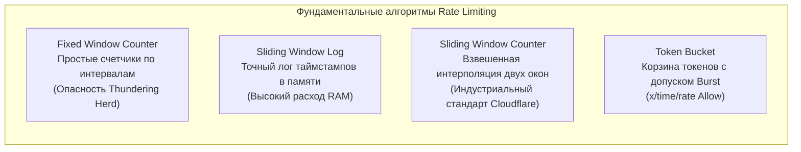
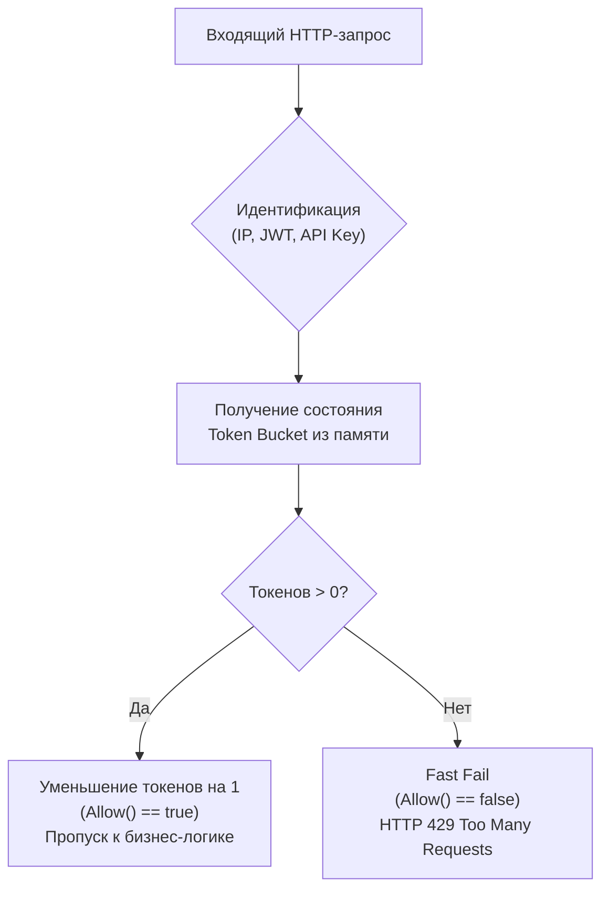
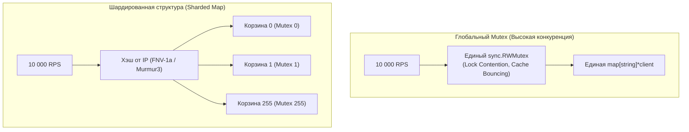

## Фейсконтроль для вашего API: Защита от абьюза и DDoS

В предыдущей статье [[5. Traffic shaping]] мы примерили на себя роль вежливого клиента: учились «причёсывать» исходящие вызовы, чтобы не создавать помех чужим серверам и беречь буферы сетевых коммутаторов. Теперь мы разворачиваемся на 180 градусов: мы — сервер, выставленный открытым лицом в агрессивный публичный интернет, и наша прямая обязанность — защитить внутренние ресурсы от захлёбывания.

Ранее мы познакомились с механизмом [[5. Load shedding]]. Он выступает в роли аварийного рубильника при глобальной перегрузке ноды. Но у механизма `Load Shedder` есть фундаментальный изъян: он слеп к источнику трафика. Если один недобросовестный клиент (или сломавшийся сторонний парсер) начнёт бомбардировать шлюз миллионами запросов, `Load Shedder` начнёт без разбора сбрасывать запросы всех подряд, и добропорядочные пользователи увидят холодный ответ `503 Service Unavailable`.

Паттерн **Rate Limiting (Ограничение скорости / Квотирование)** восстанавливает справедливость. Он выясняет, *кто именно* стучится в дверь, сопоставляет интенсивность его запросов с выделенной квотой, и при превышении лимита хладнокровно возвращает код ответа `429 Too Many Requests`.

В этой лекции мы препарируем математику классических алгоритмов лимитирования, спроектируем потокобезопасное middleware на Go с защитой от утечек памяти и разберём, почему Redis и язык Lua стали стандартом де-факто для распределённого квотирования.

---

## Алгоритмы Rate Limiting

Проектирование надёжного лимитера начинается с выбора математической модели. На архитектурных собеседованиях недостаточно просто назвать алгоритм — важно ясно понимать его краевые эффекты (Edge Cases) и цену по памяти.



### 1. Fixed Window Counter (Счётчик фиксированного окна)
Самый примитивный подход: ось времени разбивается на равные дискретные интервалы (например, ровно с 12:00 до 12:01). Для каждого уникального идентификатора клиента в памяти или хранилище поддерживается целочисленный счётчик. При поступлении запроса счётчик инкрементируется. Если он превысил квоту (например, 100 запросов), входящие вызовы блокируются вплоть до наступления следующей календарной минуты.

* **Преимущества:** Предельная простота реализации. В Redis сводится к паре команд `INCR` и `EXPIRE`.
* **Недостатки (Проблема Thundering Herd на стыке окон):** Всплеск нагрузки на границе интервалов. Если хитрый клиент отправит 100 запросов в 12:00:59, а следующие 100 запросов — в 12:01:01, ваш сервер за две секунды получит двойной удар в 200 запросов, хотя формально лимит «100 запросов в минуту» формально не был нарушен ни в одном из окон.

### 2. Sliding Window Log (Журнал скользящего окна)
Чтобы избавиться от проблемы стыка окон, мы отказываемся от единого счётчика и начинаем протоколировать точный *timestamp* (метку времени) каждого поступившего запроса (например, с помощью структуры Sorted Set в Redis). При поступлении очередного запроса система удаляет все метки старше расчётного окна (например, старше 60 секунд) и проверяет размер оставшегося множества.

* **Преимущества:** Абсолютная математическая точность. Никаких артефактов на границах окон.
* **Недостатки:** Колоссальный аппетит к оперативной памяти. Если лимит клиента составляет 10 000 RPS, вам придётся непрерывно аллоцировать и хранить тысячи 64-битных чисел для каждого активного пользователя.

### 3. Sliding Window Counter (Счётчик скользящего окна)
Элегантный компромисс, снискавший статус промышленного стандарта (в частности, лежит в основе алгоритмов Cloudflare). Вместо хранения лога запросов мы храним всего два целочисленных счётчика: для *текущего* и *предыдущего* фиксированного окна.

При проверке запроса интенсивность трафика интерполируется по времени:
$$\text{Оценка запросов} = (\text{Счётчик предыдущего окна} \times \% \text{оставшегося времени}) + \text{Счётчик текущего окна}$$

Алгоритм требует мизерного объёма памяти (всего два числа на пользователя), полностью сглаживает скачки на стыках окон и даёт погрешность не более 0.05% на реальном трафике.

### 4. Token Bucket (Маркерная корзина)
Алгоритм, с которым мы работали в пакете `x/time/rate`. Корзина непрерывно пополняется токенами с заданной скоростью до предела ёмкости. Приходящий запрос списывает токен. Если токенов нет — запрос отсекается.

Для фильтрации входящего трафика мы используем неблокирующий метод `Allow()` (вместо усыпляющего `Wait()`). Если `Allow()` вернул `false` — сервер мгновенно рапортует об отказе.



---

## Реализация In-Memory (Локальный Rate Limiter)

Классическая практическая задача на проектирование Go-сервисов — создание HTTP-middleware для защиты эндпоинтов по IP-адресу без привлечения внешних баз данных.

> [!warning] Ловушка / Gotcha: Смертоносная утечка памяти (Memory Leak)
> Неопытные разработчики часто создают структуру на базе `sync.Map` или обычной мапы под мьютексом:
> ```go
> var ipLimiters sync.Map // map[string]*rate.Limiter
> ```
> Где ключом выступает строка IP-адреса, а значением — локальный экземпляр `rate.Limiter`.  
> 
> **Это гарантированная бомба замедленного действия.**  
> В реальном интернете ваш публичный шлюз ежесуточно сканируют миллионы уникальных ботнетов, краулеров и заражённых хостов. Каждый новый IP-адрес добавит запись в `sync.Map`. Но поскольку записи никогда не удаляются, размер хэш-таблицы будет неуклонно разрастаться до гигабайтов, пока операционная система Linux не пристрелит ваш Go-процесс через OOM Killer.  
> 
> Любая рабочая реализация **обязана иметь механизм фоновой очистки (Eviction / GC)** неактивных ключей.

Ниже приведена образцовая реализация локального in-memory лимитера с контролем устаревания записей:

```go
package ratelimit

import (
	"net/http"
	"sync"
	"time"

	"golang.org/x/time/rate"
)

// client содержит лимитер и время последней активности (для очистки)
type client struct {
	limiter  *rate.Limiter
	lastSeen time.Time
}

type IPMiddleware struct {
	mu      sync.RWMutex
	clients map[string]*client
	r       rate.Limit
	b       int
}

// NewIPMiddleware создает лимитер: r - кол-во запросов в секунду, b - всплеск
func NewIPMiddleware(r rate.Limit, b int) *IPMiddleware {
	m := &IPMiddleware{
		clients: make(map[string]*client),
		r:       r,
		b:       b,
	}

	// Запускаем фоновый сборщик мусора для старых IP
	go m.cleanupStaleClients()
	return m
}

// Limit - стандартный HTTP middleware
func (m *IPMiddleware) Limit(next http.Handler) http.Handler {
	return http.HandlerFunc(func(w http.ResponseWriter, r *http.Request) {
		ip := r.RemoteAddr // Упрощенно. В реальности нужно парсить X-Forwarded-For

		m.mu.Lock() // Глобальный лок - узкое место! (См. Mechanical Sympathy)
		c, exists := m.clients[ip]
		if !exists {
			c = &client{limiter: rate.NewLimiter(m.r, m.b)}
			m.clients[ip] = c
		}
		c.lastSeen = time.Now()
		m.mu.Unlock()

		if !c.limiter.Allow() { // Allow() работает атомарно под капотом, без сна
			http.Error(w, "Too Many Requests", http.StatusTooManyRequests)
			return
		}

		next.ServeHTTP(w, r)
	})
}

// cleanupStaleClients удаляет IP, которые не делали запросов более 3 минут
func (m *IPMiddleware) cleanupStaleClients() {
	for {
		time.Sleep(time.Minute)
		m.mu.Lock()
		for ip, client := range m.clients {
			if time.Since(client.lastSeen) > 3*time.Minute {
				delete(m.clients, ip)
			}
		}
		m.mu.Unlock()
	}
}
```

---

### Mechanical Sympathy: Проблема глобального мьютекса

Взгляните на наш middleware глазами аппаратуры многоядерного процессора. В коде используется единая блокировка `sync.RWMutex` (а точнее, `m.mu.Lock()`), которая захватывается в эксклюзивном режиме на **каждый входящий HTTP-запрос** для обновления метки `lastSeen`.

Если через сервис проходит скромный трафик в 100 RPS, накладные расходы незаметны. Но когда нагрузка достигает 10 000–50 000 RPS на 32-ядерном сервере, этот единственный мьютекс превращается в чудовищное узкое место — точку жесточайшей **конкуренции за блокировку (Lock Contention)**:
1. Десятки ядер процессора одновременно пытаются выполнить атомарную инструкцию `LOCK CMPXCHG` над одной строкой кэша L3 (Cache Line 64 байта).
2. Происходит бесконечный шторм инвалидации кэшей межъядерной шины (Cache Bouncing).
3. Планировщик Go вынужден вытеснять горутины в очередь ожидания семафора рантайма (`semacquire`), сжигая драгоценные миллисекунды в системных паузах.



**Как устранить бутылочное горлышко?**  
Вместо единой гигантской мапы используется паттерн **Sharded Map** (принцип, популяризированный пакетами `concurrent-map` и внутренним дизайном `sync.Map`). Мы создаём массив из 256 независимых корзин (шардов). Каждая корзина защищена своим персональным мьютексом. Быстрый хэш от IP-адреса направляет запрос в соответствующий шард:
$$\text{Шард} = \text{hash}(IP) \pmod{256}$$
Это распределяет нагрузку на межъядерную шину и снижает уровень конкуренции за блокировку ровно в 256 раз!

---

## Распределенный Rate Limiter (Redis)

Локальный лимитер в оперативной памяти превосходно справляется с защитой от грубых атак типа DoS/DDoS. Однако он принципиально непригоден для управления бизнес-квотами (например, «Пользователь тарифного плана Free имеет право на 1000 запросов к API в час»).

В продакшене ваше Go-приложение масштабировано на 10 независимых подов в Kubernetes за балансировщиком нагрузки. Если пользователь будет отправлять запросы в цикле, они будут равномерно распределяться между подами. В результате клиент сможет безнаказанно совершить $10 \times 1000 = 10\,000$ обращений в час!

Для поддержания глобальной согласованности необходимо централизованное хранилище состояния с минимальной задержкой. Общепризнанным стандартом индустрии здесь выступает **Redis**.

Но наивная реализация в связке с Redis опасна. Если Go-сервер сначала делает `GET key`, затем инкрементирует число в коде и делает `SET key`, в условиях высокой конкуренции возникает классическое состояние гонки (Race Condition). Чтобы гарантировать строгость подсчёта, проверки оформляют в виде атомарных **Lua-скриптов**:

> [!info] Под капотом: Почему Lua в Redis гарантирует атомарность?
> Архитектура движка Redis по умолчанию однопоточна (Single-Threaded Execution Loop). Когда Redis приступает к выполнению переданного Lua-скрипта, он гарантирует, что ни одна другая сетевая команда от других клиентов не вклинится в обработку вплоть до полного завершения скрипта.  
> Это даёт нам транзакционную изоляцию уровня Serializable без необходимости явных блокировок.

Канонический Lua-скрипт для алгоритма фиксированного окна с автоматической установкой времени жизни (TTL):

```lua
local key = KEYS[1]
local limit = tonumber(ARGV[1])
local current = redis.call("GET", key)

if current and tonumber(current) >= limit then
    return 0 -- Лимит исчерпан: возвращаем отказ (HTTP 429)
end

redis.call("INCR", key)
if not current then
    -- Если счетчик создан впервые, устанавливаем TTL 60 секунд
    redis.call("EXPIRE", key, 60)
end
return 1 -- Запрос одобрен (HTTP 200)
```

На стороне Go для взаимодействия с Redis используется библиотека `go-redis`. Для максимальной производительности скрипт загружается в память Redis единожды при старте приложения, после чего вызывается через команду `EvalSha`, передающую лишь SHA-1 хэш скрипта, массив ключей `KEYS` (IP-адрес или идентификатор клиента) и аргументы `ARGV` (максимально допустимый лимит):

```go
// Вызов предкомпилированного Lua-скрипта через EvalSha в go-redis
res, err := redisClient.EvalSha(ctx, scriptSHA, []string{clientKey}, limit).Int()
```

---

## Архитектурные ловушки (Gotchas)

### 1. Подмена X-Forwarded-For (IP Spoofing)
В нашем примере локального лимитера мы обратились к полю `r.RemoteAddr`. Однако в реальной инфраструктуре контейнеры Go всегда изолированы за сетевыми балансировщиками (AWS ALB, Cloudflare, Ingress-контроллеры Nginx или Envoy). Значение `r.RemoteAddr` будет неизменно содержать внутренний IP-адрес самого балансировщика! Если вы начнёте блокировать по этому адресу, то при первом же нарушении положите весь входящий трафик кластера.

Инженеры вынуждены извлекать реальный IP клиента из HTTP-заголовков `X-Forwarded-For` или `X-Real-IP`.

> [!warning] Ловушка / Gotcha: Фальсификация заголовков клиентом
> Любой злоумышленник может отправить произвольный сырой HTTP-заголовок, например:  
> `X-Forwarded-For: 1.2.3.4`  
> Если ваш пограничный прокси настроен некорректно и просто дописывает новые IP-адреса через запятую, злоумышленник сможет искусственно заблокировать любого честного пользователя или корпоративную подсеть.  
> 
> **Решение:** Edge-прокси обязан быть доверенным (Trusted Proxy). Он должен либо полностью **перезаписывать** заголовок `X-Forwarded-For` фактическим IP-адресом входящего TCP-соединения, либо брать строго крайний справа адрес из цепочки доверенных прокси.

### 2. Цена распределенного лимитирования и стратегия Fail Open
Каждый сетевой раундтрип к Redis добавляет от 1 до 3 миллисекунд к задержке ответа. Если Redis испытывает перегрузку или его сетевой сегмент моргнул, распределённый лимитер способен утянуть на дно всю цепочку микросервисов.

Как реагировать Go-приложению на сбой центрального хранилища?

```mermaid
flowchart TD
    Start["Запрос к Redis EvalSha"] --> State{"Доступен ли Redis?"}
    State -->|OK| Check{"Лимит превышен?"}
    Check -->|Нет| Allow["HTTP 200 OK"]
    Check -->|Да| Deny["HTTP 429 Too Many Requests"]
    
    State -->|TIMEOUT / ERROR| Strategy{"Выбор стратегии"}
    Strategy -->|Fail Closed| Kill["HTTP 500 Error<br>(Падение бизнеса)"]
    Strategy -->|Fail Open (Рекомендовано)| Pass["Логирование инцидента<br>Пропуск запроса (HTTP 200)"]
```

> [!tip] Собеседование
> **Вопрос:** База данных Redis, хранящая счётчики Rate Limits, временно перестала отвечать по таймауту. Должен ли наш Go-сервис возвращать клиентам ошибку `500 Internal Server Error`?  
> 
> **Ответ:** За исключением критических систем безопасности, общепринятым стандартом в распределённых архитектурах является принцип **Fail Open (Отказ с открытием шлюза)**.  
> Ограничение частоты запросов — это вспомогательный защитный механизм, а не ключевая бизнес-логика. Если счётчик недоступен, мы обязаны залогировать ошибку в Sentry/Prometheus, но **пропустить запрос клиента к обработчику**.  
> Бизнес-ущерб от того, что клиент сделает на 10 запросов больше бесплатной нормы, несоизмеримо меньше катастрофы, при которой миллионы легитимных пользователей потеряют доступ к платформе из-за сбоя кэша.

---

## Итог раздела "Сеть"

1. **Эшелонированное квотирование:** Мы защищаем бэкенд многослойно: сначала быстрый L4/L7 Rate Limiting отсекает недобросовестных потребителей, а при экстремальном системном стрессе аварийный Load Shedding спасает процесс от падения.
2. **Опасность наивных структур:** Локальный лимитер в Go обязан иметь цикл сборки устаревших ключей (TTL), иначе сервис неминуемо погибнет от утечки памяти при атаке ботов.
3. **Механическое сочувствие к памяти:** На высоких нагрузках глобальный `sync.RWMutex` парализует производительность из-за Lock Contention. Шардирование таблицы клиентов на 256 корзин кратно увеличивает пропускную способность.
4. **Атомарность распределённых лимитов:** Для согласованного контроля квот между множеством реплик в Kubernetes используется связка Redis + Lua-скрипты, вызываемые через `EvalSha`.
5. **Отказоустойчивость:** При деградации распределённого хранилища лимитов используйте стратегию Fail Open: стабильность клиентского сервиса всегда в приоритете.

Мы завершили фундаментальный и насыщенный раздел, охватывающий сетевой стек, сервис-меши, mTLS, сетевые политики, шейпинг и квотирование трафика в распределённых системах. Теперь наш Go-код надёжен, защищён и готов к любым штормам. Но как упаковать этот сложный ансамбль сервисов так, чтобы он развёртывался предсказуемо и одинаково безупречно на ноутбуке инженера и на кластерах из тысяч физических серверов? 

Мы открываем новую большую главу, посвящённую контейнеризации и оркестрации. Вперёд, к следующему разделу: [[1. Контейнеризация и Docker]]!