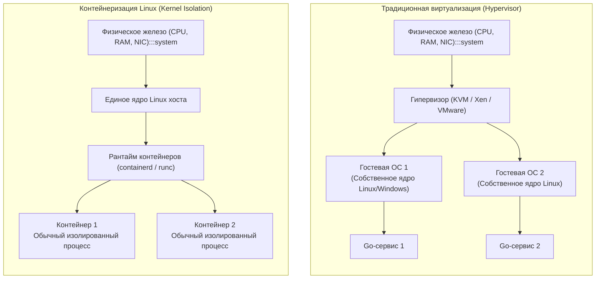
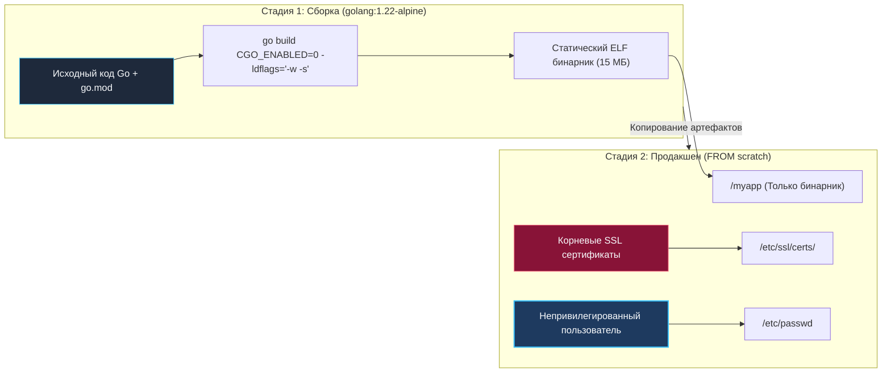
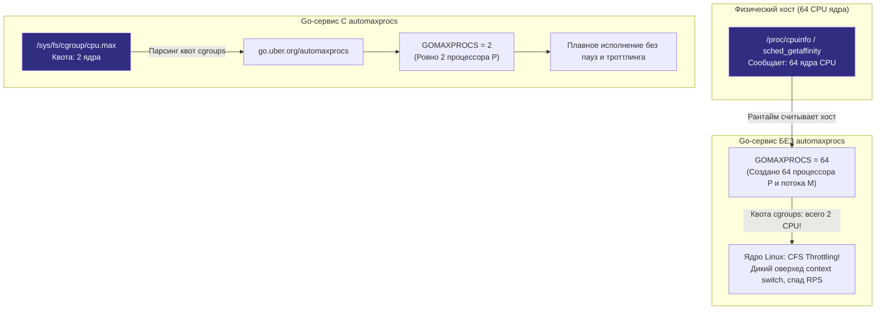

## Иллюзия одиночества: Как работают контейнеры

В предыдущих разделах мы проектировали распределённую архитектуру, выстраивали сетевую изоляцию и оптимизировали межсервисные протоколы. Но даже самый образцовый, кристально чистый код абсолютно бесполезен, если инженер не способен быстро, воспроизводимо и безопасно доставить его на серверы продакшена.

Исторически развёртывание бэкенда напоминало минное поле: системный администратор вручную устанавливал нужную версию компилятора или интерпретатора на каждый физический сервер, настраивал переменные окружения, раскладывал конфигурационные файлы и настраивал запуск демона через `systemd`. Любое расхождение в версиях системных динамических библиотек порождало классическое проклятие индустрии: *«На моём ноутбуке всё работало, а на проде упало при старте»*.

Революция **контейнеризации** решила эту проблему радикально: она позволила упаковать приложение вместе со всеми его зависимостями и окружением в единый, неизменяемый и переносимый артефакт — контейнерный образ.

Для языка Go контейнеризация оказалась не просто удобным инструментом, а идеальным природным симбиозом. В этой лекции мы заглянем под капот Docker и рантаймов OCI, выясним, почему контейнер — это вовсе не виртуальная машина, научимся собирать безупречные продакшен-образы размером в десяток мегабайт и разберём, почему рантайм Go может впасть в панику внутри контейнера из-за архитектурной слепоты к лимитам ядра.

---

## Mechanical Sympathy: Ложь во спасение

Главное и самое живучее заблуждение начинающих разработчиков: *«Контейнер — это такая лёгкая и быстрая виртуальная машина»*. С точки зрения архитектуры операционных систем это принципиально неверно.

> **Фундаментальная истина Linux:**  
> В операционной системе Linux **не существует такой сущности, как «контейнер»**.  
> Контейнер — это самый обычный процесс операционной системы хоста, которому ядро изощрённо и согласованно врёт.

Внутри контейнера нет гостевой операционной системы, нет виртуализированной материнской платы, процессора или сетевого адаптера, и главное — **нет отдельного ядра**. Все контейнеры на сервере выполняются напрямую на физических ядрах процессора и делят одно-единственное разделяемое ядро Linux хостовой машины (как мы подробно изучали в курсе [[2. Устройство и работа ОС]]).



Иллюзия полной изоляции создаётся синергией двух фундаментальных механизмов ядра Linux:

### 1. Namespaces (Пространства имён)
Пространства имён определяют то, что процесс **видит**:
- **PID Namespace:** Процесс внутри изолированного пространства считает себя родоначальником вселенной — он получает идентификатор `PID 1`. При этом он не видит ни процессов хостовой системы, ни процессов соседних контейнеров (хотя с точки зрения хостового ядра это рядовой процесс с PID, например, 48215).
- **MNT Namespace:** Процесс получает собственную изолированную иерархию точек монтирования. С помощью системных вызовов `chroot` и более современного `pivot_root` ядро подменяет корневой каталог процесса на файловую систему образа.
- **NET Namespace:** Процесс изолируется в собственном сетевом стеке. У него появляется персональная виртуальная сетевая пара (`veth`), собственный локальный интерфейс `lo`, независимая таблица маршрутизации и персональный IP-адрес.
- **IPC, UTS, USER Namespaces:** Изолируют очереди сообщений, имя хоста (`hostname`) и отображение идентификаторов пользователей (`UID`/`GID`).

### 2. Control Groups (Cgroups)
Если namespaces отвечают за зрение процесса, то контрольные группы (Cgroups) определяют то, что процесс **имеет право потреблять**.

Cgroups сообщают планировщику ядра: *«Этому процессу и всем его потомкам запрещено утилизировать более 512 МБ физической оперативной памяти и более 50% процессорного квантования одного ядра CPU»*. Если процесс попытается превысить лимит выделенной памяти, ядро активирует механизм OOM Killer и немедленно уничтожит нарушителя сигналом `SIGKILL`.

---

## Идеальный симбиоз: Почему Go создан для Docker

Языки с динамической типизацией или управляемой средой исполнения (Python, Ruby, Node.js или Java) требуют для своего функционирования массивный рантайм: полноценный интерпретатор, набор разделяемых библиотек C (`libc`) или тяжеловесную виртуальную машину JVM, занимающую сотни мегабайт. В результате базовый образ для таких приложений неизбежно превращается в целую гостевую мини-ОС (Debian, Ubuntu) с сотнями системных утилит.

Язык Go устроен принципиально иначе. Компилятор Go по умолчанию создаёт **статически слинкованный бинарный файл (Statically Linked Binary)**. 
- Весь рантайм языка (планировщик горутин, сборщик мусора, сетевой поллер) компилируется прямо в машинный код вашего целевого исполняемого файла формата `ELF` (под Linux) или `.exe` (под Windows).
- Если отключена зависимость от C (`CGO_ENABLED=0`), бинарнику не требуются даже разделяемые библиотеки операционной системы!

Для старта Go-приложению не нужны утилиты оболочки, менеджеры пакетов или интерпретаторы — ему требуется исключительно живое ядро Linux, способное принимать системные вызовы через регистры процессора.

Это даёт нам возможность применять двухстадийную сборку (**Multistage Build**) и разворачивать финальный сервис внутри абсолютно пустого образа `scratch`.



---

## Idiomatic Go Dockerfile (Production-Ready)

Ниже представлен эталонный, оптимизированный для продакшена многостадийный `Dockerfile`, соответствующий всем канонам безопасности и производительности:

```dockerfile
# === СТАДИЯ 1: Сборка (Builder) ===
# Используем легковесный официальный образ Go на базе Alpine Linux
FROM golang:1.22-alpine AS builder

# Устанавливаем часовые пояса и корневые сертификаты (критично для HTTPS вызовов)
RUN apk add --no-cache tzdata ca-certificates

# Создаем непривилегированного пользователя для безопасного запуска
RUN adduser -D -g '' appuser

WORKDIR /app

# Эффективно кэшируем зависимости:
# Пока go.mod и go.sum не изменились, Docker берет этот слой из кэша
COPY go.mod go.sum ./
RUN go mod download

# Копируем исходный код проекта
COPY . .

# Собираем статический бинарник:
# CGO_ENABLED=0 отключает привязку к системным библиотекам C (glibc / musl)
# -ldflags="-w -s" удаляет таблицу отладочных символов DWARF, экономя до 30% размера
RUN CGO_ENABLED=0 GOOS=linux GOARCH=amd64 go build \
    -ldflags="-w -s" \
    -o /go/bin/myapp ./cmd/main.go

# === СТАДИЯ 2: Финальный минимальный образ (Release) ===
# scratch - это специальный псевдо-образ Docker с нулевым размером (0 байт)
FROM scratch

# Копируем системные таблицы пользователей, часовые пояса и сертификаты
COPY --from=builder /etc/passwd /etc/passwd
COPY --from=builder /etc/group /etc/group
COPY --from=builder /usr/share/zoneinfo /usr/share/zoneinfo
COPY --from=builder /etc/ssl/certs/ca-certificates.crt /etc/ssl/certs/

# Копируем скомпилированный исполняемый файл
COPY --from=builder /go/bin/myapp /myapp

# Переключаемся на непривилегированного пользователя (AppSec Best Practice)
USER appuser:appuser

# Документируем сетевой порт приложения
EXPOSE 8080

# Запускаем бинарник напрямую без участия шелла
ENTRYPOINT ["/myapp"]
```

> [!info] Под капотом: Минимальный Attack Surface
> Размер получившегося контейнера равен размеру скомпилированного бинарника (обычно от 10 до 25 Мегабайт).  
> 
> В таком контейнере физически отсутствуют командный интерпретатор `sh` или `bash`, а также стандартные утилиты администратора `ls`, `cat`, `curl` или `wget`.  
> Если злоумышленник найдёт уязвимость удалённого исполнения кода (RCE) в логике вашего приложения, он не сможет выполнить ни одну системную команду, скачать вредоносный скрипт или запустить шелл — в образе попросту нет ничего, кроме вашего собственного скомпилированного Go-кода. Поверхность атаки (Attack Surface) сведена к теоретическому минимуму.

---

## Архитектурные ловушки (Gotchas)

Изоляция контейнера скрывает от процесса реальное физическое железо хоста. Если не понимать механику этой изоляции, рантайм Go может вести себя контринтуитивно и спровоцировать тяжелейшие сбои.

### 1. Слепота рантайма (Cgroups Blindness)

> [!tip] Собеседование
> **Вопрос:** Вы развернули микросервис на Go в кластере Kubernetes, выделив контейнеру лимит `resources.limits.cpu = 2`. Нода кластера представляет собой мощный физический сервер с 64 ядрами CPU. При умеренной нагрузке ваш сервис начинает испытывать колоссальные задержки и троттлинг (CPU Throttling). В чём кроется глубинная причина деградации?  
> 
> **Ответ:** При старте рантайм Go определяет количество потоков планировщика GMP (см. [[7. Глубокий Go (Внутреннее устройство)]]). Он вызывает системный вызов ядра `sched_getaffinity` или считывает псевдофайл `/proc/cpuinfo`. Однако эти интерфейсы ядра сообщают параметры **хостовой ноды**, игнорируя лимиты Cgroups!  
> В результате Go видит 64 ядра хоста и создаёт $GOMAXPROCS = 64$, поднимая 64 логических процессора `P` и привязывая к ним системные потоки `M`. Но планировщик CFS в ядре Linux выделил контейнеру квоту всего на 2 ядра.  
> 
> Ядро начинает непрерывно «ставить на паузу» потоки контейнера (CFS Throttling), а колоссальные накладные расходы на переключение контекста между 64 потоками операционной системы на 2 физических ядрах начисто парализуют производительность.



**Решение:** Рантайм Go обязан быть синхронизирован с ограничениями контрольных групп. Индустриальным стандартом является подключение библиотеки `automaxprocs` от Uber в файле `main.go`:

```go
package main

import (
	_ "go.uber.org/automaxprocs" // Автоматически считывает квоты из /sys/fs/cgroup и выставляет GOMAXPROCS
)

func main() {
	// Приложение стартует с корректным числом процессоров P
}
```

Библиотека при старте в функции `init()` инспектирует псевдофайловую систему cgroups и вызывает `runtime.GOMAXPROCS()`, приводя аппетиты рантайма в полное соответствие с квотами контейнера.

---

### 2. OOM Killer и сборщик мусора

Аналогичная коллизия возникает с оперативной памятью.

Допустим, ваш контейнер ограничен лимитом в 512 МБ, в то время как на сервере установлено 128 ГБ оперативной памяти. Сборщик мусора Go (GC) исторически рассчитывал темп запуска циклов разметки и очистки исходя из динамики роста кучи (heap), не зная о жестком потолке контейнера. В результате куча разрасталась, GC не спешил освобождать память, и процесс внезапно уничтожался ядром по сигналу OOM Killer (код завершения 137).

**Решение:** Начиная с версии Go 1.19, рантайм получил поддержку механизма мягкого ограничения памяти — **`GOMEMLIMIT`** (мы детально рассматриваем его математику в статье [[16. Профилирование, отладка и производительность]]).

Вы должны задать переменную окружения в манифесте запуска контейнера, выделив запас около 10–15% на стеки горутин и системные буферы:
```dockerfile
ENV GOMEMLIMIT=450MiB
```
При приближении объёма выделенной памяти к отметке 450 МБ сборщик мусора Go начинает упреждающе и агрессивно утилизировать неиспользуемые объекты, гарантируя, что потребление памяти не достигнет жесткого потолка cgroups и процесс не будет пристрелен ядром.

---

### 3. CGO и Alpine (Musl vs Glibc)

Если ваш проект использует библиотеки на C через механизм `CGO` (например, встроенный движок SQLite `go-sqlite3` или графические кодеки), вы теряете возможность собрать чистый статический бинарник командой `CGO_ENABLED=0`. Вам неизбежно потребуется динамический компоновщик и разделяемая библиотека языка C.

Здесь кроется классическая ловушка:
- Дистрибутивы семейства `debian/ubuntu` используют реализацию `glibc`.
- Дистрибутив `alpine` опирается на ультралегкую библиотеку `musl libc`.

Если вы скомпилируете бинарник в среде `debian/ubuntu`, а затем попытаетесь запустить его внутри легковесного контейнера `alpine`, исполняемый файл упадёт при первой же попытке запуска с загадочной ошибкой:
```bash
sh: ./myapp: not found
```
Хотя файл физически присутствует на диске и права на исполнение (`chmod +x`) выставлены! Причина проста: ядро Linux не может найти указанный в ELF-заголовке путь к динамическому компоновщику `/lib64/ld-linux-x86-64.so.2` (в Alpine используется `/lib/ld-musl-x86_64.so.1`).

> **Железное правило:** Среда компиляции (Builder) и среда выполнения (Runner) обязаны использовать одну и ту же реализацию стандартной библиотеки языка C. Если вам нужен `musl` — собирайте в Alpine; если нужен `glibc` — собирайте в Debian или используйте дистрибутив `Google Distroless`.

---

## Итог

1. **Суть контейнера:** Контейнер — это иллюзия полной изоляции обычного процесса хоста, достигаемая с помощью пространств имён (`namespaces`) и контрольных групп (`cgroups`).
2. **Преимущество Go:** Статическая линковка машинного кода (`CGO_ENABLED=0`) позволяет создавать суперкомпактные образы на базе `scratch` размером от 10 МБ с нулевым числом посторонних утилит.
3. **Многостадийная сборка:** Паттерн Multistage Build разделяет тяжеловесную среду разработки от чистого и безопасного продакшен-рантайма.
4. **Укрощение рантайма:** Go-приложение в контейнере требует обязательной настройки лимитов: библиотеки `automaxprocs` против троттлинга ядер и переменной `GOMEMLIMIT` для защиты от OOM Killer.

Мы научились собирать надёжный, защищённый и предсказуемый контейнер. Но когда микросервисов становятся сотни, встаёт задача оркестрации: кто будет следить за состоянием контейнеров, перезапускать их при сбоях, балансировать между узлами и масштабировать по нагрузке? За решение этих задач отвечает Kubernetes. В следующей лекции мы погрузимся в архитектуру кластера: [[2. Kubernetes. Основы]].