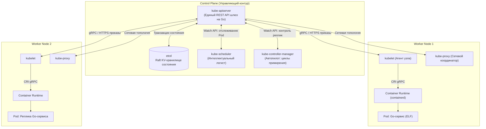
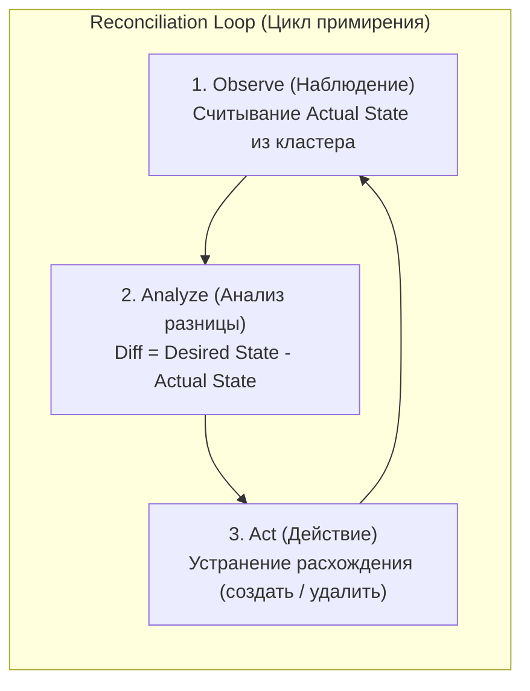
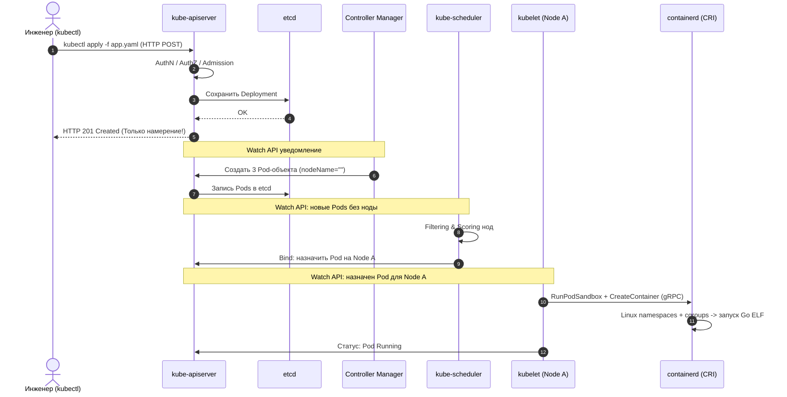

## Оркестрация хаоса: Как управлять армией контейнеров

В предыдущей статье [[1. Контейнеризация и Docker]] мы научились упаковывать наш Go-бэкенд в герметичный, легковесный и самодостаточный артефакт. На локальном компьютере разработчика этой магии вполне достаточно: вы вводите команду `docker run`, ядро изолирует процесс через namespaces, и сервер готов принимать локальный трафик.

Но что происходит, когда проект выходит в открытое море продакшена?
Представьте инфраструктуру современного финтеха или маркетплейса: сотня физических серверов (нод) в нескольких дата-центрах и более тысячи запущенных микросервисов. 
- На какой конкретно сервер поместить свежесобранный экземпляр сервиса платежей?
- Что предпринять в три часа ночи, если на физическом сервере сгорел блок питания или лопнула планка оперативной памяти?
- Как плавно доставить пользовательский трафик к новому контейнеру, если при каждом перезапуске виртуальный интерфейс получает совершенно случайный IP-адрес?
- Как обновить бинарник без потери соединений и без единой секунды простоя (Zero Downtime)?

Инструмент `docker run` бессилен перед этими вызовами. Чтобы управлять армией разрозненных контейнеров, распределённой системе требуется главнокомандующий — **Оркестратор**.

Безоговорочным стандартом современной индустрии стал **Kubernetes (K8s)**. По своей сути это распределённая операционная система дата-центра, превращающая парк разнородного серверного железа в единый вычислительный пул.

Для Go-разработчика Kubernetes имеет сакральное значение: **вся экосистема Kubernetes от первой до последней строчки написана на Go**. Изучая его архитектуру, мы не просто учимся грамотно развёртывать сервисы, но и перенимаем лучшие инженерные паттерны распределённых систем у архитекторов Google.

В этой лекции мы препарируем анатомию кластера, разберём циклы примирения (Reconciliation) и выясним, как один неосторожный вызов из Go-кода способен обрушить управляющий контур всей компании.

---

## Архитектура: Мозг и Мышцы

Любой кластер Kubernetes физически и логически разделяется на два взаимодействующих слоя: **Control Plane** (Управляющий слой, мозг кластера) и **Worker Nodes** (Рабочие узлы, его исполнительные мышцы).



### Control Plane (Управляющий слой)

Control Plane принимает глобальные архитектурные решения: следит за сбоями, балансирует емкость и непрерывно согласует конфигурацию. Он состоит из четырёх ключевых служб:

1. **`kube-apiserver` (Сердце и шлюз системы):**  
   Высокопроизводительный сервер REST API, написанный на Go. **В Kubernetes действует фундаментальный закон: ни один компонент кластера не имеет права общаться с другим компонентом напрямую.** Все запросы — от утилиты администратора до системных демонов — проходят строго через `kube-apiserver`. Он проводит аутентификацию, проверяет ролевую модель доступа (RBAC), мутирует и валидирует входящие документы.
2. **`etcd` (Память и источник правды):**  
   Распределённое, строго согласованное хранилище формата «ключ-значение». Это **единственный компонент с состоянием (Stateful)** во всем Control Plane. Все остальные сервисы абсолютно stateless. `etcd` использует алгоритм консенсуса (который мы подробно препарировали в лекции [[2. Raft. Основы]]). Если кластер `etcd` необратимо повреждён — весь кластер Kubernetes мгновенно теряет память и погибает.
3. **`kube-scheduler` (Логист):**  
   Когда вы создаёте новый контейнер, `kube-apiserver` лишь валидирует манифест и сохраняет JSON-запись в `etcd`. Сам по себе сервер API ничего не запускает! В этот момент в игру вступает `kube-scheduler`. Он обнаруживает новый объект, у которого ещё не назначен целевой сервер, проводит двухфазный анализ доступных нод (фильтрация по ресурсам CPU/RAM, учёт Taints, Tolerations и правил Affinity) и назначает контейнеру оптимальный узел.
4. **`kube-controller-manager` (Нервная система и автопилот):**  
   Оркестр фоновых процессов (бесконечных циклов `for`), которые непрерывно следят за состоянием кластера: контроллер узлов, контроллер репликации, контроллер эндпоинтов.

### Worker Nodes (Рабочие узлы)

Это пул серверов (виртуальных машин или bare-metal серверов), на которых непосредственно исполняется ваша полезная нагрузка — контейнеры с микросервисами Go.

1. **`kubelet` (Капитан узла):**  
   Системный демон, функционирующий на каждой ноде. Он держит постоянный канал связи с `kube-apiserver`. Когда `scheduler` назначает контейнер на данный узел, `kubelet` принимает спецификацию и транслирует её рантайму контейнеров (containerd, CRI-O) через интерфейс Container Runtime Interface (CRI): *«Скачай образ и запусти изолированный процесс»*. Затем `kubelet` непрерывно проверяет здоровье процесса и отправляет телеметрию обратно в API.
2. **`kube-proxy` (Сетевой менеджер):**  
   Компонент, отвечающий за сетевую магию. Он следит за объектами `Service` и манипулирует пакетным фильтром ядра Linux (`iptables` или `IPVS`), обеспечивая маршрутизацию трафика к подам вне зависимости от того, на каком узле они запущены.

---

## Парадигма Декларативности и Reconciliation Loop

Фундаментальное отличие Kubernetes от традиционных bash-скриптов и устаревших систем автоматизации заключается в смене парадигмы управления:

* **Императивный подход (Как сделать):**  
  Инженер отдаёт набор последовательных инструкций: *«Создай виртуальную машину. Установи туда Go. Запусти бинарник. Проверь порт 8080. Если упал — выполни перезапуск»*. Если скрипт сломался на середине, состояние системы становится непредсказуемым.
* **Декларативный подход (Что должно быть):**  
  Инженер формулирует **желаемое целевое состояние (Desired State)**: *«В кластере обязано стабильно работать ровно 3 работоспособные реплики сервиса биллинга версии v1.4»*.



Как именно система гарантирует достижение цели — забота самого оркестратора. Ядром архитектуры Kubernetes выступает **Reconciliation Loop (Цикл примирения)**. В псевдокоде на Go логика любого контроллера выглядит до гениального просто:

```go
for {
    desired := getDesiredState() // Что хочет пользователь из YAML
    actual := getActualState()   // Что реально крутится на нодах
    
    if diff := compare(desired, actual); diff != nil {
        reconcile(diff) // Создать недостающий под или прибить лишний
    }
    
    waitForChangeOrTimeout()
}
```

> [!info] Под капотом: Mechanical Sympathy и Watch API
> Если бы сотни контроллеров и тысячи агентов `kubelet` каждую секунду отправляли стандартный запрос HTTP GET (`Polling`), чтобы узнать текущее состояние объектов, `kube-apiserver` моментально захлебнулся бы под лавиной запросов.
> 
> Разработчики Kubernetes в официальной библиотеке `client-go` реализовали высокоэффективный механизм **Watch API**.  
> Контроллеры открывают к `kube-apiserver` единственное постоянное HTTP-соединение (используя HTTP/2 или Chunked Transfer Encoding). Сервер API превращается в реактивный брокер сообщений: как только в хранилище `etcd` изменяется состояние ресурса, сервер немедленно проталкивает (push) дельту изменения прямо в открытый сокет клиентам. Благодаря этому реакция на падение контейнера происходит за считанные миллисекунды без холостой нагрузки на сеть и процессор.

---

## Анатомия создания: Что происходит, когда вы деплоите приложение?

На технических интервью уровня Senior классический вопрос звучит обманчиво просто, обнажая подлинное понимание асинхронного устройства K8s.

> [!tip] Собеседование
> **Вопрос:** Детально опишите пошаговую цепочку событий в кластере после того, как инженер нажал Enter, выполнив команду:  
> `kubectl apply -f app.yaml`
> 
> **Ответ:**
> 1. **Валидация клиента:** Консольная утилита `kubectl` локально валидирует структуру YAML-манифеста и отправляет HTTP POST/PUT запрос к эндпоинту `kube-apiserver`.
> 2. **Конвейер API Server:** Сервер API принимает запрос, проверяет сертификат клиента (Authentication), валидирует права через RBAC (Authorization) и передаёт документ через цепочку плагинов Admission Controllers (мутирующие и валидирующие вебхуки).
> 3. **Транзакция etcd:** Сервер сериализует объект в JSON/Protobuf и атомарно записывает его в базу `etcd`. На этом синхронная фаза завершается: API сервер возвращает клиенту статус `201 Created`. **Приложения ещё физически не существует — создана лишь запись о намерении!**
> 4. **Реакция контроллера:** Демон `kube-controller-manager` (а именно Deployment Controller) через постоянный стрим Watch API улавливает появление объекта Deployment. Он вычисляет, что текущее число реплик равно нулю при желаемых трёх, и отправляет в API Server запросы на создание трёх дочерних объектов типа Pod.
> 5. **Работа логиста (Scheduler):** Компонент `kube-scheduler` видит три новых Pod-объекта, у которых атрибут `nodeName` пуст. Планировщик выполняет двухфазный алгоритм (Filtering нод по ресурсам, затем Scoring по приоритетам), выбирает сервер (например, Node A) и отправляет в API Server приказ на привязку (Binding): `nodeName: "node-a"`.
> 6. **Исполнение агентом (kubelet):** Демон `kubelet` на ноде Node A через свой Watch-поток видит, что ему поручен запуск пода. Он обращается через локальный Unix-сокет по протоколу gRPC к рантайму контейнеров (CRI, например, containerd).
> 7. **Запуск ядра Linux:** Демон `containerd` обращается к OCI-рантайму `runc`, который настраивает Linux Namespaces и Cgroups (как мы разбирали в лекции [[1. Контейнеризация и Docker]]), распаковывает слои файловой системы и порождает изолированный процесс Go-сервиса.
> 8. **Репортинг и Health Checks:** `kubelet` фиксирует запуск процесса, переводит фазу пода в `Running` и начинает непрерывно опрашивать Health Checks (Readiness / Liveness пробы).



---

## Архитектурные ловушки (Gotchas)

### 1. Перегрузка API Сервера
В Kubernetes управляющий шлюз `kube-apiserver` — главная критическая точка отказа.

Если команда разрабатывает собственный оператор на Go (Custom Controller / CRD) и неопытный разработчик в цикле выполняет прямые вызовы `LIST` всех подов в кластере вместо использования кэширующей прослойки `Informer` / `Lister` из пакета `client-go`, API-сервер будет вынужден сериализовать мегабайты JSON на каждый запрос. В крупных кластерах это моментально вызывает взрывное потребление памяти, OOM на мастер-нодах и паралич Control Plane.

### 2. Split Brain в etcd
Хранилище `etcd` строго подчиняется законам консенсуса Raft: для выполнения любых операций записи требуется строгое математическое большинство узлов — **кворум**:
$$\text{Кворум} = \left\lfloor \frac{N}{2} \right\rfloor + 1$$

Если в кластере развёрнуто 2 мастер-узла (грубейший антипаттерн), и сеть между ними моргнула:
- На каждом изолированном узле остаётся $1$ нода из $2$.
- Кворум ($2$) не достигнут ни на одной стороне!
- Кластер Control Plane намертво блокирует любые изменения и переходит в режим Read-Only.

Существующие поды на рабочих узлах продолжат обслуживать сетевые пакеты, но вы не сможете задеплоить ни один фикс, а упавшие поды никогда не будут перезапущены.

> **Стандарт надежности:** Control Plane всегда комплектуется **нечётным** количеством мастер-узлов: минимум 3 ноды (допускает падение 1 узла) или 5 нод (допускает падение 2 узлов).

### 3. Эфемерность всего сущего
Ключевой ментальный сдвиг при переходе от классических серверов к парадигме Kubernetes: **ни один под не является постоянным**.

В любой момент времени планировщик или контроллер узла может без предупреждения вытеснить ваш под (Eviction): при нехватке памяти на ноде, при накатывании обновлений на операционную систему сервера или при срабатывании автоскейлера.

Ваш Go-сервер обязан соблюдать архитектурный контракт:
- Не хранить постоянное состояние на локальной файловой системе пода;
- Быть абсолютно stateless-компонентом;
- Мгновенно перехватывать системный сигнал `SIGTERM` от ядра Linux и корректно освобождать сетевые соединения (Graceful Shutdown), не дожидаясь контрольного выстрела `SIGKILL`.

---

## Итог

1. **Суть оркестратора:** Kubernetes — это не монолитная система, а событийно-ориентированный ансамбль независимых микросервисов, координирующих свои действия через единую базу состояния `etcd`.
2. **Асинхронная природа:** Команда развёртывания фиксирует лишь декларативное намерение в API; создание физических процессов на нодах происходит асинхронно через цепочку контроллеров.
3. **Реактивный Watch API:** Благодаря механизму стриминга событий в библиотеке `client-go`, кластер реагирует на любые инциденты за миллисекунды без накладных расходов на периодический опрос.
4. **Контракт эфемерности:** Поды смертны и заменимы. Go-бэкенд должен проектироваться с расчётом на внезапные рестарты и корректную обработку сигнала `SIGTERM`.

Мы разобрались с фундаментом и устройством управляющего контура Kubernetes. Но какими именно строительными блоками мы, как разработчики, должны оперировать, чтобы описать топологию, запустить реплики и открыть наш сервис внешнему миру? В следующей лекции мы детально изучим базовую триаду объектов: [[3. Pod, Deployment, Service]].