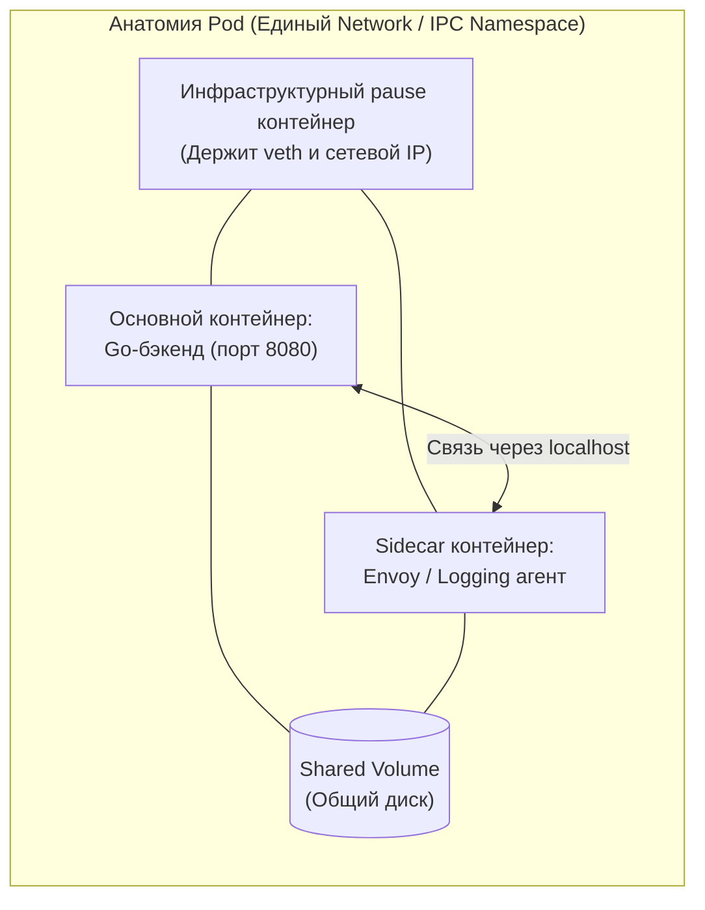
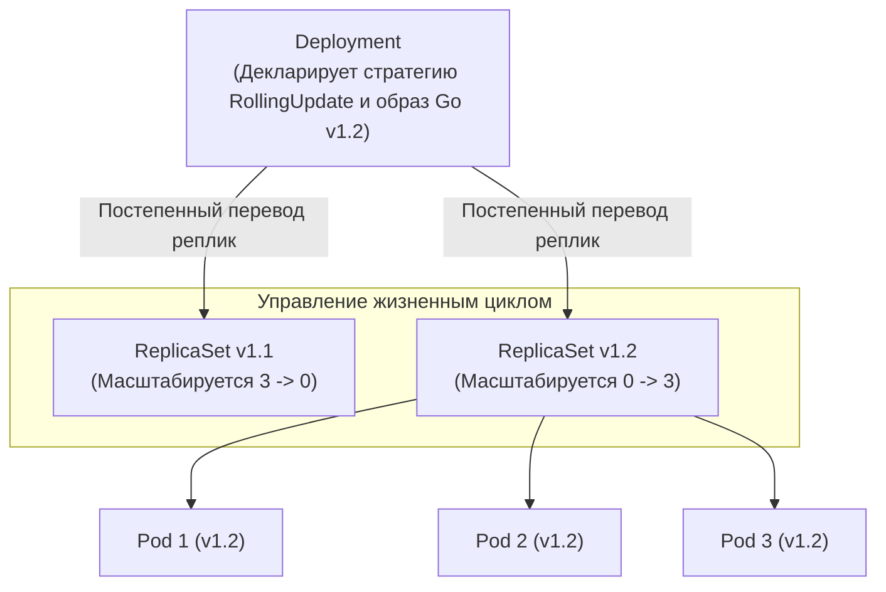
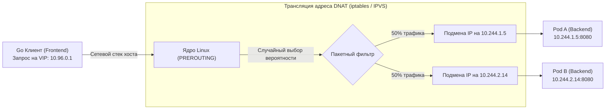
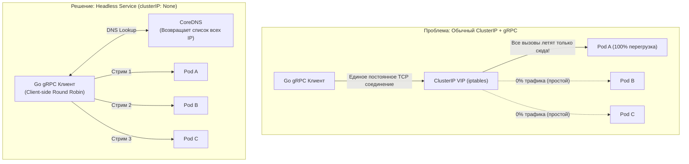

## Святая троица Кубернетеса: Как код превращается в сервис

В предыдущей статье [[2. Kubernetes. Основы]] мы познакомились с генеральным штабом кластера: мозгом (Control Plane), отдающим приказы, и исполнительными мышцами (Worker Nodes), претворяющими их в жизнь на уровне ядра Linux. Мы выяснили, что Kubernetes управляется по декларативной модели — мы описываем желаемое состояние системы, а оркестратор крутит циклы примирения, непрерывно подгоняя реальность под наше описание.

Но какими именно строительными кирпичиками мы описываем это желаемое будущее? Как объяснить оркестратору, что нам требуется запустить наш скомпилированный бинарный файл на Go, обеспечить ему отказоустойчивость при физической гибели серверов и предоставить другим сервисам стабильную сетевую точку входа для отправки HTTP и gRPC запросов?

В архитектуре Kubernetes за это отвечает фундаментальная триада абстракций: **Pod**, **Deployment** и **Service**. В этой лекции мы заглянем под капот каждого из этих компонентов с точки зрения системного инженера, разберём низкоуровневую магию виртуальных IP-адресов в ядре Linux и выясним, почему «голые» поды в продакшене — это признак архитектурной незрелости.

---

## 1. Pod: Атом кластера (и ложь о контейнерах)

Первая фундаментальная истина, которую обязан осознать разработчик: **Kubernetes принципиально не оперирует контейнерами напрямую.** Он не управляет отдельными сущностями Docker (см. [[1. Контейнеризация и Docker]]).

Минимальной неделимой единицей развёртывания, квантом вычислительной мощности в кластере выступает **Pod (Под)**.

Метафора стручка гороха (pod) предельно точна: под — это изолированная капсула, внутри которой может мирно сосуществовать один или несколько тесно связанных процессов-контейнеров. Все контейнеры, входящие в состав одного пода, гарантированно запускаются на одном и том же физическом сервере и делят общие пространства имён ядра:
1. **Сетевое пространство (Network Namespace):** Все контейнеры пода обладают единым IP-адресом и общим диапазоном портов. Они общаются между собой на космической скорости через локальную петлю `localhost`.
2. **Межпроцессное взаимодействие (IPC Namespace):** Контейнеры могут использовать общие семафоры и разделяемую память (Shared Memory POSIX).
3. **Дисковые тома (Volumes):** Контейнеры могут монтировать общие каталоги файловой системы для мгновенного обмена файлами.

Именно благодаря тому, что контейнеры пода объединены общим сетевым интерфейсом, архитектурный паттерн Sidecar из статьи [[2. Envoy и sidecar]] работает столь элегантно: ваш основной Go-сервис слушает порт 8080, а прокси-контейнер Envoy перехватывает входящие запросы и передаёт их приложению по адресу `127.0.0.1:8080` с околонулевыми накладными расходами.



> [!info] Под капотом: Pause Container
> Если вы подключитесь к рабочему узлу (Worker Node) по SSH и выполните команду низкоуровневой инспекции `docker ps` или `crictl ps`, вы обнаружите любопытную деталь: на каждый работающий Go-сервис на узле запущен ещё один крошечный служебный контейнер с именем `pause` (или `infra`).
> 
> **В чём заключается его предназначение?**  
> Когда демон `kubelet` получает приказ поднять новый Под, он первым делом запускает именно контейнер `pause`. Это минималистичная программа на C или Ассемблере, которая делает системный вызов `pause()` и засыпает навечно в ожидании сигналов.  
> 
> Задача `pause`-контейнера — **инициализировать и удерживать открытыми пространства имён Linux Namespaces (сеть, IPC, UTS)**. Затем `kubelet` запускает ваш целевой контейнер Go и принудительно монтирует его в уже существующие дескрипторы неймспейсов контейнера `pause`.  
> 
> Если ваше Go-приложение внезапно аварийно завершится по панике (Panic) или будет пристрелено OOM Killer-ом, `kubelet` перезапустит только контейнер приложения. Сетевые сокеты, маршруты и IP-адрес пода не изменятся ни на долю секунды — их надёжно удерживает бессмертный `pause`-контейнер.

---

## 2. Deployment: Армия клонов и менеджмент состояния

Вы можете задеплоить приложение, создав манифест `kind: Pod`. Однако в промышленной эксплуатации запускать «голые» поды строго запрещено.

Поды по своей природе глубоко эфемерны. В парадигме Cloud Native действует доктрина: **«Скот, а не домашние питомцы» (Cattle vs Pets)**. Если у физического сервера отключится питание, голый под погибнет вместе с ним навсегда. Kubernetes даже не попытается воскресить его на соседнем исправном сервере, потому что у него нет указаний, кто должен его перезапустить.

Чтобы гарантировать отказоустойчивость и автоматическое восстановление, нам необходим высокоуровневый управляющий контроллер — **Deployment (Развёртывание)**.

### Цепочка делегирования

Deployment реализует иерархический принцип разделения обязанностей: сам он не порождает поды напрямую, а делегирует эту рутину промежуточной сущности — **ReplicaSet**.



1. **Deployment** описывает мета-стратегию: *какую* версию образа мы эксплуатируем и *как* происходит процесс обновления (например, канареечный релиз или плавное замещение — Rolling Update).
2. **ReplicaSet** — это строгий специализированный контроллер из состава демона `kube-controller-manager`. В его основе заложен примитивный цикл:  
   $$\text{Текущее число живых подов} \stackrel{?}{=} \text{Желаемое число подов}$$  
   Если сервер внезапно сгорает, ReplicaSet фиксирует, что вместо 3 подов в живых осталось 2, и мгновенно регистрирует в etcd спецификацию нового пода, который планировщик немедленно отправляет на уцелевший узел.

> [!warning] Ловушка / Gotcha: Graceful Shutdown и сигналы ядра
> Когда ReplicaSet принимает решение об уничтожении пода (в ходе деплоя новой версии или при масштабировании вниз), сетевой агент ядра отправляет процессу Go системный сигнал **`SIGTERM`**.  
> 
> Если разработчик проигнорировал обработку сигналов ОС в коде, рантайм продолжит обслуживать запросы вплоть до истечения льготного периода (по умолчанию 30 секунд), после чего ядро Linux безжалостно пристрелит процесс сигналом **`SIGKILL`**. Результат — мгновенный обрыв сотен активных HTTP-клиентов и повреждённые недописанные транзакции в базе данных.  
> 
> Идиоматичный Go-сервер **обязан** перехватывать системные уведомления и вызывать стандартный метод `server.Shutdown(ctx)` (как мы разбирали в статье [[6. Health checks]]), аккуратно дожидаясь завершения фоновых горутин перед выходом из функции `main`.

---

## 3. Service: Стабильный якорь в море хаоса

Поскольку поды смертны, они непрерывно мигрируют по кластеру. При каждом новом рождении под получает совершенно новый динамический IP-адрес. 

Возникает критическая проблема сетевой адресации: как клиентскому компоненту `Frontend` гарантированно отправлять запросы в микросервис `Backend`, если физические адреса бэкенда меняются ежеминутно?

Для решения этой задачи создана ключевая сетевая абстракция — **Service (Сервис)**. Это стабильная, несгораемая точка входа, обладающая постоянным виртуальным IP-адресом (ClusterIP) и статическим доменным именем в пространстве CoreDNS.

Каждый созданный сервис автоматически регистрируется во внутреннем DNS-сервере кластера. Теперь Go-бэкенд может надежно обращаться к соседу по человекочитаемому адресу:
```go
resp, err := http.Get("http://backend-svc.my-namespace.svc.cluster.local:8080/api/v1/health")
```

### Иллюзия ClusterIP (Mechanical Sympathy)

Для любого сетевого инженера механика ClusterIP поначалу выглядит необъяснимой мистикой.

> [!tip] Собеседование
> **Вопрос:** Если вы подключитесь к любой ноде кластера или зайдёте внутрь контейнера и выполните утилиту проверки сетевых интерфейсов `ifconfig` или современную `ip addr`, вы не обнаружите сетевого адаптера с IP-адресом вашего Service (ClusterIP). Где этот IP-адрес существует физически?  
> 
> **Ответ:** Физически ClusterIP **не существует нигде в мире**. ClusterIP — это виртуальный IP-адрес (Virtual IP / VIP). Это **архитектурная фикция, запрограммированная в таблицах сетевого фильтра ядра Linux**.

Всю магию маршрутизации реализует системный демон **`kube-proxy`**, работающий на каждом рабочем узле (Worker Node):

1. При появлении объекта `Service` демон `kube-proxy` через механизм Watch API получает событие от API-сервера вместе со списком живых IP-адресов подов (объект `Endpoints` / `EndpointSlice`).
2. `kube-proxy` обращается к подсистеме ядра Linux и генерирует правила в таблицах **`iptables`** (или хэш-таблицах `IPVS`).
3. Когда Go-клиент отправляет пакет `TCP SYN` на виртуальный адрес `10.96.0.1:8080`, пакет попадает в сетевой стек ядра хоста.
4. В цепочке проверок **`PREROUTING`** ядро перехватывает пакет, сверяет его с правилами `iptables` и производит трансляцию адреса назначения — **DNAT (Destination Network Address Translation)**.
5. Сетевой стек ядра на лету переписывает IP-адрес назначения в заголовке IP-пакета с виртуального `10.96.0.1` на реальный адрес одного из доступных подов (например, `10.244.2.14`).



Балансировка трафика между подами в стандартном режиме iptables осуществляется за счёт модуля вероятностного распределения `statistic` ядра Linux.

---

### Headless Service (Безголовый сервис) и gRPC

В микросервисной экосистеме Go протокол gRPC занимает доминирующее положение. И именно здесь неопытные инженеры наступают на классические грабли архитектуры Kubernetes.

gRPC функционирует поверх протокола **HTTP/2**. Фундаментальная особенность HTTP/2 — использование единственного мультиплексированного долгоживущего TCP-соединения (Persistent Connection).

Что произойдёт, если вы попытаетесь балансировать gRPC-трафик через стандартный Kubernetes Service (ClusterIP)?
1. Ваш Go-клиент при старте разрезолвит адрес сервиса, получит ClusterIP и отправит единственный `TCP SYN`.
2. Ядро Linux через `iptables` транслирует этот коннект на `Pod A`. TCP-рукопожатие успешно завершается.
3. Соединение остаётся открытым часами. **Все последующие сотни тысяч gRPC-вызовов (RPC) будут передаваться внутри этого единственного TCP-соединения строго в `Pod A`!**
4. В результате `Pod A` падает от перегрузки, в то время как соседние 9 реплик бэкенда абсолютно простаивают. Механизм `iptables` слеп к протоколу HTTP/2 — он умеет балансировать только новые TCP-соединения, но не отдельные HTTP/2 стримы!



**Инженерное решение для Go/gRPC:** Использование специального типа сервиса — **Headless Service (Безголовый сервис)**.

Для создания такого сервиса в спецификации манифеста явно указывается флаг:
```yaml
spec:
  clusterIP: None
```

При такой конфигурации `kube-proxy` не выделяет виртуальный IP и не создаёт правил трансляции в ядре. Вместо этого кластерный DNS-сервер (CoreDNS) при запросе возвращает клиенту **полный список IP-адресов всех активных подов** (набор A-записей).

Go-клиент gRPC использует эту информацию для клиентской балансировки (Client-Side Load Balancing). Передавая специальную опцию конфигурации:
```go
conn, err := grpc.Dial(
    "dns:///backend-svc.my-namespace.svc.cluster.local:8080",
    grpc.WithDefaultServiceConfig(`{"loadBalancingPolicy":"round_robin"}`),
    grpc.WithInsecure(),
)
```
Клиентская библиотека Go самостоятельно открывает параллельные TCP-сокеты ко всем подам за сервисом и равномерно распределяет каждый отдельный RPC-запрос по круговому алгоритму (Round Robin).

---

## Итог

1. **Pod — неделимый атом:** Kubernetes оперирует не контейнерами, а подами. Контейнеры внутри пода разделяют общую сеть `localhost` благодаря невидимому инфраструктурному контейнеру `pause`.
2. **Deployment и ReplicaSet:** Контроллеры декларативного состояния преобразуют эфемерные, смертные поды в самоисцеляющуюся систему, способную выполнять бесшовные обновления без простоя.
3. **ClusterIP — иллюзия ядра:** Виртуальный IP-адрес сервиса не существует на физических сетевых интерфейсах, а эмулируется пакетным фильтром ядра Linux (`iptables` / `IPVS`) через операцию DNAT.
4. **Коварство L7 и gRPC:** Долгоживущие соединения HTTP/2 ломают балансировку через обычный ClusterIP. Для эффективного распределения gRPC-трафика используйте Headless Service (`clusterIP: None`) в связке с клиентской балансировкой Go (`grpc.WithDefaultServiceConfig`) либо внедряйте Service Mesh ([[1. Service mesh]]).

Мы научились собирать контейнеры, запускать реплики и обеспечивать надёжную маршрутизацию сетевого трафика. Однако любое продакшен-приложение требует гибкой конфигурации: паролей от баз данных, приватных ключей шифрования и настроек таймаутов, зависящих от конкретного окружения. Вшивать секреты в бинарник или Docker-образ недопустимо. Как безопасно внедрять и обновлять настройки в работающих подах? Об этом — в следующей лекции: [[4. ConfigMap и Secret]].