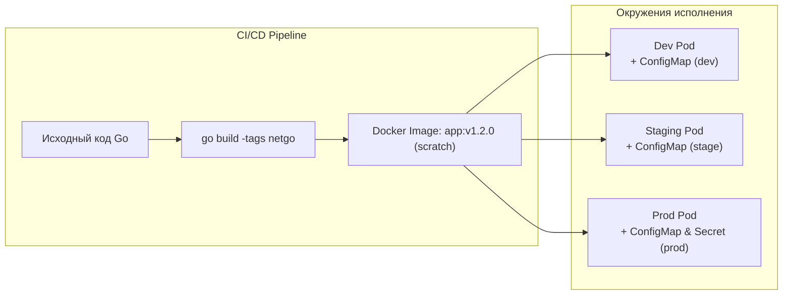
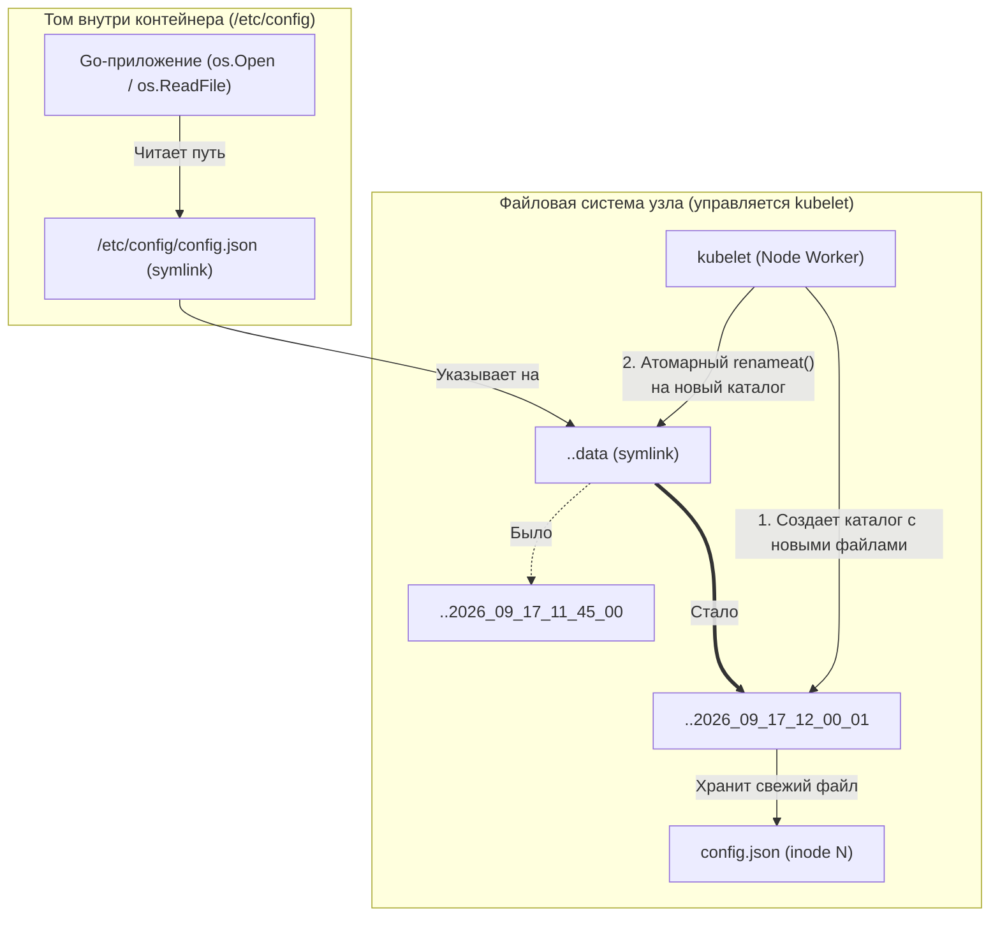

## Отделяя код от конфигурации: Жизнь вне бинарника

> *«Сделайте конфигурацию явной, отделенной от алгоритмов и доступной без повторной сборки программы».*  
> — Перефразируя классический принцип Unix-философии

Третий принцип методологии **The Twelve-Factor App** гласит предельно четко: **«Сохраняйте конфигурацию в среде выполнения»**. 

В лекции [[1. Контейнеризация и Docker]] мы собрали чистый, минималистичный статический бинарник Go и упаковали его в образ `scratch`. Этот образ абсолютно иммутабелен (неизменяем) и воспроизводим. Если для переключения уровня логирования с `INFO` на `DEBUG`, изменения адреса реплики PostgreSQL или таймаута HTTP-клиента с 2s на 5s вам приходится менять код в репозитории, заново компилировать бинарник, пересобирать образ и прогонять CI/CD пайплайн — ваша архитектура сломана у самого основания.

Один и тот же скомпилированный артефакт обязан работать во всех контурах: локально на ноутбуке разработчика (Dev), на интеграционном стенде (Staging) и под многотысячным RPS в боевом кластере (Prod). Различаться должна только конфигурация, которая инжектируется в контейнер при запуске.



В платформе Kubernetes за доставку конфигураций отвечают две фундаментальные абстракции:
1. **ConfigMap** — для открытых, неконфиденциальных параметров (эндпоинты, таймауты, флаги функционала, форматы логов).
2. **Secret** — для конфиденциальных данных (пароли к БД, API-токены, приватные ключи TLS, HMAC-секреты).

В этой лекции мы разберем оба механизма с позиции системного инженера: как доставить конфиги в процесс Go, как на уровне ядра Linux и VFS устроена «горячая» перезагрузка файлов через атомарную смену симлинков, как организовать конкурентобезопасный `hot-reload` в памяти Go без накладных расходов `sync.RWMutex`, и почему стандартные Kubernetes Secrets без шифрования — это лишь иллюзия безопасности.

---

## ConfigMap: Словарь для вашего приложения

**ConfigMap** — это первоклассный API-ресурс Kubernetes, хранящий данные конфигурации в виде пар «ключ-значение» (key-value) или текстовых файлов произвольного формата (JSON, YAML, TOML, .env).

Существуют два канонических способа передать данные из ConfigMap в контейнеры вашего Pod:
1. **Переменные окружения (Environment Variables, `ENV`).**
2. **Смонтированные тома (Volume Mounts).**

### 1. Переменные окружения (ENV)

Это классический и наиболее распространенный подход в микросервисной архитектуре Go. Kubernetes считывает значения из ConfigMap и прописывает их в окружение процесса при создании контейнера:

```yaml
apiVersion: v1
kind: ConfigMap
metadata:
  name: myapp-config
  namespace: default
data:
  DB_HOST: "postgres-svc.database.svc.cluster.local"
  DB_PORT: "5432"
  TIMEOUT: "5s"
  LOG_LEVEL: "INFO"
---
apiVersion: apps/v1
kind: Deployment
metadata:
  name: myapp-deployment
spec:
  replicas: 3
  selector:
    matchLabels:
      app: myapp
  template:
    metadata:
      labels:
        app: myapp
    spec:
      containers:
      - name: go-app
        image: myapp:v1.0.0
        envFrom:
        - configMapRef:
            name: myapp-config # Загрузит все ключи словаря как ENV переменные контейнера
```

В Go-приложении мы считываем эти параметры стандартным пакетом `os`:

```go
package main

import (
	"log/slog"
	"os"
	"time"
)

func main() {
	dbHost := os.Getenv("DB_HOST")
	if dbHost == "" {
		dbHost = "localhost" // Разумный fallback по умолчанию
	}

	timeoutStr := os.Getenv("TIMEOUT")
	timeout, err := time.ParseDuration(timeoutStr)
	if err != nil {
		timeout = 3 * time.Second
	}

	slog.Info("Service configured", "host", dbHost, "timeout", timeout)
}
```

Для больших структурных конфигов вручную вызывать `os.Getenv` для сотни полей непрактично. В production-коде применяют специализированные библиотеки, такие как `envconfig`, `cleanenv` или `viper`, которые маппят переменные окружения на Go-структуры через структурные теги:

```go
type Config struct {
	DBHost   string        `envconfig:"DB_HOST" default:"localhost"`
	DBPort   int           `envconfig:"DB_PORT" default:"5432"`
	Timeout  time.Duration `envconfig:"TIMEOUT" default:"5s"`
	LogLevel string        `envconfig:"LOG_LEVEL" default:"INFO"`
}
```

> [!warning] Ловушка / Gotcha: ENV не обновляются в рантайме
> Переменные окружения процесса в Linux инициализируются ядром в момент системного вызова `execve()` и размещаются в специальной области памяти над стеком пользовательского пространства. 
> Если вы измените ConfigMap через `kubectl edit cm myapp-config` или примените новый манифест, изменения запишутся в хранилище `etcd`, но **работающий процесс Go их никогда не увидит**. 
> Чтобы приложение подхватило новые переменные `ENV`, необходимо перезапустить Pod. Для этого применяют команду `kubectl rollout restart deployment myapp-deployment` или автоматизированные контроллеры вроде `Reloader`, которые отслеживают изменения ConfigMap/Secret и вызывают плавающий перезапуск (rolling update).

---

### 2. Смонтированные тома (Volumes) и Горячая перезагрузка

Если ваша конфигурация представляет собой развесистый структурированный файл (например, `config.yaml` с матрицей роутинга или политиками безопасности), намного чище смонтировать весь ConfigMap как виртуальный том на диск контейнера:

```yaml
apiVersion: apps/v1
kind: Deployment
metadata:
  name: myapp-deployment
spec:
  template:
    spec:
      containers:
      - name: go-app
        image: myapp:v1.0.0
        volumeMounts:
        - name: config-volume
          mountPath: /etc/config
          readOnly: true
      volumes:
      - name: config-volume
        configMap:
          name: myapp-config-file # Внутри лежит ключ config.json
```

Здесь начинается фундаментальное архитектурное отличие. В отличие от статических переменных окружения, **файлы, смонтированные из ConfigMap, обновляются динамически прямо в работающем контейнере** без перезапуска Pod.

#### Mechanical Sympathy: Атомарные симлинки kubelet

Когда вы редактируете ConfigMap в кластере, контроллер `kubelet` на каждой воркер-ноде (см. [[2. Kubernetes. Основы]]) в цикле синхронизации замечает изменение версии ресурса. `kubelet` обязан актуализировать файл `/etc/config/config.json` внутри файловой системы контейнера.

Но что произойдет, если `kubelet` просто откроет файл на перезапись с флагом `O_TRUNC`?  
Если именно в эту микросекунду высоконагруженное Go-приложение обратится к диску для чтения конфигурации, оно прочитает наполовину стертый или частично обновленный файл — и завершится с фатальной паникой `unexpected EOF` или `invalid JSON syntax`.

Чтобы гарантировать **абсолютную транзакционность и согласованность чтения**, инженеры Kubernetes применили классический трюк Unix с каскадными символическими ссылками (symlinks) и системным вызовом ядра `rename()`:



Под капотом смонтированной директории разворачивается следующая структура:
1. `kubelet` создает на узле скрытую директорию с таймстемпом: `..2026_09_17_12_00_01`.
2. Внутри нее создаются актуальные файлы данных.
3. Символическая ссылка `..data` атомарно переключается на новую директорию через системный вызов `renameat()`. В ядре Linux эта операция неделима: никакой промежуточный процесс не может застать ссылку в «битом» состоянии.
4. Файл `/etc/config/config.json` на самом деле является постоянным симлинком на `..data/config.json`.
5. Те дескрипторы файлов (`struct file`), которые уже были открыты приложением в момент ротации, продолжают ссылаться на старый `inode` до закрытия дескриптора. Любой новый вызов `os.Open` сразу же направляется к новому `inode`.

---

#### Чтение «на горячую» в Go: Hot-Reload без блокировок

Чтобы Go-сервис своевременно отреагировал на изменение файла на диске, мы подписываемся на события подсистемы ядра Linux `inotify` через популярную библиотеку `fsnotify` (или механизм `viper.WatchConfig()`).

Однако здесь кроется критическая ловушка многопоточности. В микросервисе сотни горутин одновременно обрабатывают входящие запросы и читают параметры конфигурации. Если горутина-наблюдатель начнет мутировать глобальную структуру конфига в момент, когда HTTP-хендлер считывает из нее поля, произойдет `data race`, повреждение памяти и аварийный сброс процесса.

Использовать `sync.RWMutex` для защиты чтения — не самое быстрое решение. Под высокой нагрузкой (десятки тысяч горутин) постоянные вызовы `RLock()` вызывают конкуренцию за кэш-линию счетчика читателей (Cache Line Bouncing), замедляя процессорные ядра.

Идиоматичный подход современного Go — использование **`atomic.Pointer[T]`** (появился в Go 1.19+). Он обеспечивает мгновенное lock-free чтение за пару тактов CPU (`LOAD` указателя) и атомарную подмену всей структуры в памяти:

```go
package config

import (
	"encoding/json"
	"log/slog"
	"os"
	"sync/atomic"

	"github.com/fsnotify/fsnotify"
)

// AppConfig представляет иммутабельную структуру параметров приложения
type AppConfig struct {
	TimeoutMs int    `json:"timeout_ms"`
	MaxRetries int   `json:"max_retries"`
	LogLevel   string `json:"log_level"`
}

// GlobalConfig хранит атомарный указатель на текущую активную конфигурацию.
// Чтение выполняется без мьютексов и блокировок!
var GlobalConfig atomic.Pointer[AppConfig]

// InitAndWatch загружает начальный конфиг и запускает горутину отслеживания inotify
func InitAndWatch(filepath string) error {
	// Первичная синхронная загрузка при старте
	if err := loadConfig(filepath); err != nil {
		return err
	}

	watcher, err := fsnotify.NewWatcher()
	if err != nil {
		return err
	}

	// Подписываемся на родительскую директорию или сам файл
	if err := watcher.Add(filepath); err != nil {
		_ = watcher.Close()
		return err
	}

	go func() {
		defer watcher.Close()
		for {
			select {
			case event, ok := <-watcher.Events:
				if !ok {
					return
				}
				// Внимание: поскольку kubelet обновляет симлинки (..data),
				// inotify генерирует события Remove или Chmod/Rename для старого симлинка!
				if event.Has(fsnotify.Remove) || event.Has(fsnotify.Chmod) || event.Has(fsnotify.Write) {
					slog.Info("Config modification detected via inotify, reloading...", "event", event.Op.String())
					if err := loadConfig(filepath); err != nil {
						slog.Error("Failed to reload configuration", "err", err)
						continue
					}
					// Переподписываемся на обновленный симлинк
					_ = watcher.Add(filepath)
				}
			case err, ok := <-watcher.Errors:
				if !ok {
					return
				}
				slog.Error("Config watcher error", "err", err)
			}
		}
	}()

	return nil
}

func loadConfig(filepath string) error {
	data, err := os.ReadFile(filepath)
	if err != nil {
		return err
	}

	var newCfg AppConfig
	if err := json.Unmarshal(data, &newCfg); err != nil {
		return err
	}

	// Атомарно заменяем указатель. Все будущие запросы увидят новый конфиг.
	// Существующие горутины, уже захватившие старый указатель, безопасно доработают с ним.
	GlobalConfig.Store(&newCfg)
	slog.Info("Configuration successfully loaded into memory", "timeout_ms", newCfg.TimeoutMs)
	return nil
}

// Пример использования в хендлере HTTP/gRPC:
// func HandleRequest() {
//     cfg := config.GlobalConfig.Load() // 1 такт CPU, zero lock contention!
//     timeout := time.Duration(cfg.TimeoutMs) * time.Millisecond
//     ...
// }
```

> [!note] Примечание о времени синхронизации (Sync Period)
> Динамическое обновление смонтированных файлов в Kubernetes не происходит со скоростью света. `kubelet` периодически опрашивает локальный кэш пода (параметр `syncFrequency`, по умолчанию раз в 1 минуту) плюс время кэширования в локальном прокси API-сервера. Полный цикл обновления файла на диске занимает от 10 до 60 секунд.

---

## Secret: Иллюзия безопасности

Абстракция **Secret** в Kubernetes спроектирована специально для хранения конфиденциальной информации: ключей доступа, паролей к БД, SSH-ключей и приватных сертификатов TLS.

Способы передачи Secret в контейнер полностью повторяют интерфейс ConfigMap: через переменные окружения (`secretKeyRef`) или смонтированные тома (`secret`). Однако при монтировании тома Kubernetes помещает секреты в специальную виртуальную файловую систему в оперативной памяти — **`tmpfs`**. Это гарантирует, что конфиденциальные байты никогда не осядут на постоянных магнитных или SSD-накопителях воркер-ноды.

```yaml
apiVersion: v1
kind: Secret
metadata:
  name: db-credentials
type: Opaque
data:
  # Значения ОБЯЗАНЫ быть закодированы в Base64
  username: bXlfdXNlcg==     # my_user
  password: c3VwZXJfc2VjcmV0 # super_secret
```

> [!warning] Ловушка / Gotcha: Base64 — это не шифрование
> Один из самых позорных провалов на собеседованиях уровня Senior — утверждение:  
> *«В Kubernetes секреты безопасны, потому что они зашифрованы в Base64»*.
> 
> **Base64 — это алгоритм кодирования данных (RFC 4648), а не криптографическое шифрование!** В нем нет ни ключей, ни векторов инициализации. Любой школьник или бот раскодирует значение за долю миллисекунды командой `echo "c3VwZXJfc2VjcmV0" | base64 -d`.
> 
> Более того: по умолчанию база данных кластера `etcd` сохраняет объекты Secret на диск мастер-ноды в **открытом виде** (Plain text). Если злоумышленник получит доступ к резервной копии (снапшоту) `etcd` или диску мастер-ноды, он мгновенно завладеет всеми секретами и ключами вашей организации.


---

### Как построить взрослую безопасность (Production Grade)?

Чтобы сделать хранение конфиденциальных данных в Kubernetes по-настоящему надежным, применяются три эшелона защиты:

#### 1. Шифрование в покое (Encryption at Rest)
Администраторы кластера обязаны включить в конфигурации `kube-apiserver` параметр `--encryption-provider-config`, указывающий на конфигурационный файл `EncryptionConfiguration`.  
В этом сценарии API-сервер перед отправкой объекта в `etcd` шифрует полезную нагрузку симметричным алгоритмом (например, `aescbc` или `aesgcm`), используя ключи, полученные через внешний KMS (Key Management Service от AWS, Google Cloud, Azure или HashiCorp Vault). В самом `etcd` хранится нечитаемый шифротекст.

#### 2. Строгий RBAC (Role-Based Access Control)
Инженерные команды и сервисные аккаунты CI/CD не должны иметь прав на команду `kubectl get secrets -o yaml` в производственных пространствах имен (`namespace`). Доступ к расшифровке секретов должен предоставляться по принципу наименьших привилегий (Principle of Least Privilege).

#### 3. Внешние менеджеры секретов (Vault & ESO)
В современной enterprise-индустрии от прямого создания Secret-манифестов вручную или через GitOps отказываются на корню (хранить секреты в git-репозитории, пусть даже зашифрованными `git-crypt`, чревато утечками).

Вместо этого используют специализированные системы:
- **HashiCorp Vault** — промышленный сейф с поддержкой динамических короткоживущих секретов (динамическая генерация пользователей Postgres со сроком жизни 1 час).
- **External Secrets Operator (ESO)** — контроллер Kubernetes, который автоматически забирает секреты из облачных хранилищ (AWS Secrets Manager, GCP Secret Manager, Vault) и синхронизирует их в нативные Secrets кластера.

Подробно эту архитектуру и сценарии безопасной инъекции секретов в рантайме мы исследуем в статье [[10. Secrets management]] (модуль «Микросервисы»).

---

## Архитектурные ловушки кластера

### 1. Лимит размера в etcd (1 MB)
Каждый объект Kubernetes (включая ConfigMap и Secret) жестко ограничен максимальным объемом в **1 Мегабайт** (дефолтный лимит запроса `max-request-bytes` в `kube-apiserver` и лимит записи ключа в `etcd`).

Почему выбрано такое ограничение? Потому что `etcd` — это распределенное консенсусное хранилище на базе алгоритма Raft, оптимизированное для хранения небольших транзакционных метаданных в оперативной памяти. Если разработчик попытается запихнуть в ConfigMap дамп SQLite-базы, GeoIP-базу MaxMind на 80 МБ или тяжелую ML-модель, он перегрузит репликацию Raft и рискует вызвать отказ всего control plane кластера.

*Инженерное решение:* Большие бинарные файлы и базы данных должны храниться в объектных хранилищах (S3, MinIO) и скачиваться init-контейнерами, либо монтироваться через постоянные сетевые тома (Persistent Volumes), либо заранее упаковываться («запекаться») прямо в слои контейнера.

### Недостающие ConfigMaps блокируют запуск
Если в спецификации Deployment вы указали ссылку на ConfigMap в `envFrom` или секции `volumes`, а соответствующий ConfigMap не был предварительно создан в кластере (или опечатались в имени), `kubelet` откажется запускать контейнер.  
Pod зависнет в бесконечном статусе ожидания `ContainerCreating` (с детальной ошибкой `CreateContainerConfigError`):
```text
State:          Waiting
  Reason:       CreateContainerConfigError
Message:        configmap "myapp-config" not found
```

С одной стороны, это правильный принцип **Fail Fast**: лучше не запускать сервис вовсе, чем запустить его с неопределенной конфигурацией.  
С другой стороны, при динамических миграциях иногда требуется опциональность. Для этого Kubernetes поддерживает директиву `optional: true`:

```yaml
envFrom:
- configMapRef:
    name: myapp-config
    optional: true
```

Если конфиг отсутствует, контейнер благополучно запустится, а Go-код получит пустые строки от `os.Getenv` и будет обязан инициализировать дефолтные безопасные настройки.

---

## Сравнение подходов: ENV vs Volumes

| Критерий | Переменные окружения (`ENV`) | Смонтированные тома (`Volumes`) |
|---|---|---|
| **Формат данных** | Простые скаляры (строки, числа, URL) | Сложные файлы (JSON, YAML, XML, сертификаты) |
| **Обновление на горячую** | ❌ Невозможно (требуется рестарт Pod) | ✅ Автоматически (симлинки ядра Linux) |
| **Сложность в Go-коде** | Минимальная (`os.Getenv` / `envconfig`) | Требуется фоновый watcher (`fsnotify`, `atomic.Pointer`) |
| **Утечки в логи / дамп** | ⚠️ Легко утекают при `printenv` и дампе крешей | Безопаснее (хранятся изолированно в файловой системе) |
| **Хранилище секретов** | Обычная память процесса | Специальная память `tmpfs` (без записи на диск) |

---

## Вопросы для собеседования

> [!interview] Вопросы сеньорного собеседования по ConfigMap и Secret
> 1. **В чем разница между обновлением ConfigMap через `ENV` и через `Volume`?**  
>    *Ответ:* Переменные `ENV` прописываются ядром в адресное пространство процесса в момент системного вызова `execve()` и не меняются во время жизни процесса. Обновление ConfigMap в etcd не обновит переменные без перезапуска пода (нужен `rollout restart` или контроллер `Reloader`). Смонтированные тома обновляются `kubelet` «на горячую» путем атомарной смены симлинка на новую скрытую директорию с файлами.
> 2. **Безопасны ли стандартные Kubernetes Secrets?**  
>    *Ответ:* Нет, по умолчанию данные лишь кодируются в `Base64` и сохраняются в `etcd` в открытом виде (Plain text). Для обеспечения безопасности требуется включить `EncryptionConfiguration` (KMS envelope encryption) на уровне API-сервера, жестко настроить RBAC и предпочесть интеграцию с внешними хранилищами (HashiCorp Vault, External Secrets Operator).
> 3. **Как безопасно организовать горячую перезагрузку конфигурации в многопоточном Go-приложении?**  
>    *Ответ:* Отслеживать события файловой системы через библиотеку `fsnotify` (обрабатывая события `Remove`/`Chmod` из-за симлинков kubelet). Хранить распарсенный конфиг в `atomic.Pointer[Config]`. При чтении горутины вызывают `cfg := GlobalConfig.Load()`, что исключает contention и гонки данных, характерные для `sync.RWMutex`.
> 4. **Каков максимальный размер ConfigMap и Secret в Kubernetes и почему?**  
>    *Ответ:* 1 Мегабайт. Ограничение обусловлено архитектурой `etcd` как консенсусного raft-хранилища, где большие объекты перегружают сеть и оперативную память кластера при репликации логов.

---

## Резюме

1. **12-Factor App:** Конфигурация всегда живет снаружи бинарника и инжектируется рантаймом (Kubernetes). Docker-образ должен быть единым для всех окружений.
2. **ENV vs Volumes:** Переменные окружения проще, но статичны. Тома позволяют обновлять файлы конфигурации на лету без остановки сервиса.
3. **Атомарность симлинков:** `kubelet` обновляет тома не прямой записью, а переключением симлинков (`renameat`), защищая Go-сервис от чтения поврежденных файлов.
4. **Безопасная память Go:** Применяйте `atomic.Pointer` для хранения текущего конфига в рантайме, гарантируя потокобезопасность с нулевым overhead на блокировки.
5. **Base64 != Защита:** Никогда не полагайтесь на стандартный формат манифестов Secret для защиты от компрометации данных. Используйте Encryption at Rest и внешние хранилища вроде Vault.

Мы научились конфигурировать одиночное приложение. Но что если наступила «Черная пятница», и входящая нагрузка скачкообразно выросла в 10 раз? Один Pod, даже с идеальной конфигурацией, захлебнется в запросах. Нам необходимо научить кластер автоматически масштабировать пул реплик нашего сервиса, реагируя на метрики железа и кастомные бизнес-показатели. В следующей лекции мы детально изучим: [[5. Horizontal scaling]].