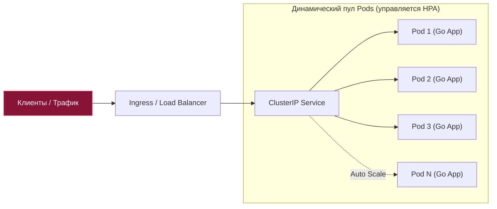
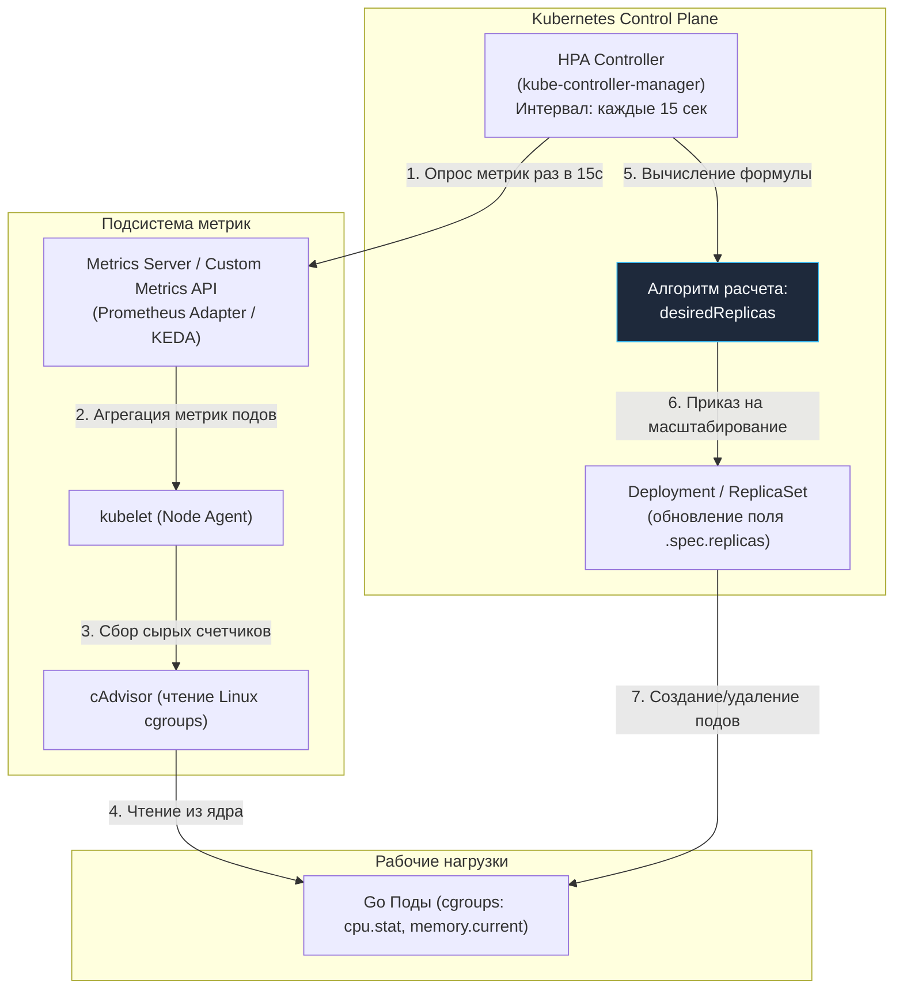
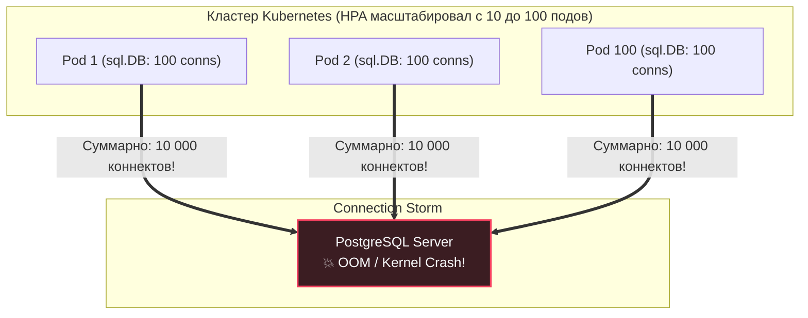

## Масштабирование без боли: Как Kubernetes клонирует ваш код

> *«В распределенных системах единственный надежный способ справиться с лавиной работы — разделить ее между множеством независимых тружеников, каждый из которых делает простую вещь».*  
> — Принцип горизонтального масштабирования

Когда микросервис на Go завоевывает признание пользователей, одиночный Pod (см. [[3. Pod, Deployment, Service]]) неизбежно упирается в физический потолок ресурсов конкретной машины. В этот момент перед системным архитектором встает развилка:

1. **Vertical Scaling (VPA — Vertical Pod Autoscaler):** Наращивать мощность существующего пода — выделять ему больше ядер CPU и гигабайт RAM. У этого пути есть непреодолимый физический тупик: размер самого дорогого сервера в стойке дата-центра, деградация производительности из-за переходов через шины NUMA-узлов, а главное — необходимость перезапуска процесса для изменения ресурсов (в классическом Linux cgroups).
2. **Horizontal Scaling (Горизонтальное масштабирование):** Запускать множество независимых идентичных копий приложения (реплик) и балансировать входящий трафик между ними.

В экосистеме Kubernetes стандартом де-факто является горизонтальное масштабирование. За автоматизацию этого процесса отвечает встроенный контроллер — **Horizontal Pod Autoscaler (HPA)**.



Для Go-разработчика горизонтальное масштабирование — это не просто абстрактная команда `kubectl scale deployment myapp --replicas=10`. Это тонкая инженерная работа на стыке рантайма Go (планировщика G-M-P, сборщика мусора GC), пулов соединений к реляционным базам данных и подсистемы Linux CFS (Completely Fair Scheduler).

В этой лекции мы разберем математику алгоритма HPA, устройство сборщиков метрик, физику троттлинга CPU в cgroups и архитектурные ловушки, подстерегающие Go-сервисы при резких всплесках нагрузки.

---

## Механика HPA: Бесконечный цикл примирения

HPA реализован как автономный управляющий контур внутри процесса `kube-controller-manager` (см. [[2. Kubernetes. Основы]]). Подобно термостату в умном доме, он непрерывно выполняет классический цикл примирения (Reconciliation Loop):



### Периодичность опроса
По умолчанию параметр `--horizontal-pod-autoscaler-sync-period` составляет **15 секунд**. Каждые 15 секунд контроллер опрашивает агрегатор метрик (`Metrics Server` для базовых CPU/RAM или внешний адаптер Prometheus/KEDA для бизнес-показателей).

### Требование к Resources Requests
> [!important] Важнейшее требование
> HPA не сможет рассчитать процентную загрузку контейнера, если в манифесте пода явно не задана секция `resources.requests.cpu`!  
> Если реквест CPU равен `500m` (половина физического ядра), а процесс утилизирует `250m`, HPA фиксирует загрузку ровно **50%**. Без заданного `requests` HPA перейдет в состояние ошибки `unknown` и не выполнит масштабирование.

---

### Математическая формула масштабирования

Алгоритм HPA детерминирован и опирается на формулу целочисленного округления вверх (ceiling):

$$desiredReplicas = \lceil currentReplicas \times \frac{currentMetricValue}{desiredMetricValue} \rceil$$

Где:
- $currentReplicas$ — текущее число реплик в статусе Ready;
- $currentMetricValue$ — среднее значение метрики по всем работающим репликам;
- $desiredMetricValue$ — целевое пороговое значение, заданное инженером в манифесте HPA.

#### Практический пример:
1. Текущее количество реплик: $currentReplicas = 2$.
2. Средняя загрузка CPU подов в текущий момент: $currentMetricValue = 90\%$.
3. Целевой порог (Target): $desiredMetricValue = 50\%$.
4. Вычисление:
   $$\lceil 2 \times \frac{90}{50} \rceil = \lceil 2 \times 1.8 \rceil = \lceil 3.6 \rceil = 4$$
5. Решение контроллера: немедленно увеличить число реплик с 2 до 4.

#### Зона допустимого отклонения (Tolerance Threshold)
Чтобы кластер не реагировал на секундный миллисекундный шум (например, кратковременный скачок CPU с 50% до 52%), в алгоритм заложен порог толерантности по умолчанию **10% (0.1)**.  
Если коэффициент $\frac{currentMetricValue}{desiredMetricValue}$ попадает в интервал $[0.9; 1.1]$, масштабирование не инициируется.

> [!info] Под капотом
> При расчете среднего значения HPA учитывает только те поды, которые находятся в состоянии `Ready`. Если под только запускается (фаза `ContainerCreating`, выполняется `InitContainer` или еще не прошла `Readiness Probe`), либо под находится в процессе терминации (`Terminating`), его метрики принудительно исключаются из выборки. Это предотвращает внесение шума в математическую модель.

---

## Mechanical Sympathy: CPU Throttling vs Scaling

Типичная ошибка начинающих инженеров — выставлять целевой порог HPA на уровне **85–90% CPU** с аргументацией: *«Мы хотим выжимать из железа максимум, зачем платить за простаивающие ядра?»*.

Для сервисов на Go эта стратегия оборачивается катастрофой. Причина кроется в устройстве подсистемы планирования Linux — **CFS (Completely Fair Scheduler)** и лимитах `cgroups` (см. [[1. Контейнеризация и Docker]]).

### Как работает квотирование CFS
Когда вы указываете лимит `resources.limits.cpu: "1"`, ядро Linux не выделяет вашему контейнеру персональное физическое ядро. Оно выделяет **квоту времени** в рамках фиксированного окна:
- `cpu.cfs_period_us` = 100 000 мкс (100 миллисекунд — стандартный период кванта);
- `cpu.cfs_quota_us` = 100 000 мкс (100 миллисекунд процессорного времени за один квант).

А теперь вспомним рантайм Go. Если на ноде доступно 8 физических ядер, Go автоматически выставит `GOMAXPROCS=8` (без специальных утилит вроде `automaxprocs`). Восемь системных потоков ОС одновременно исполняют горутины.  
Если все 8 потоков будут загружены вычислениями, они израсходуют суммарную квоту в 100 мс всего за:
$$\frac{100 \text{ мс}}{8 \text{ ядер}} = 12.5 \text{ миллисекунд}!$$

Оставшиеся **87.5 миллисекунд** текущего периода ядро Linux принудительно замораживает (throttles) процесс контейнера!

```mermaid
gantt
    title Поведение Go-процесса в окне CFS (100ms) при нехватке CPU
    dateFormat  X
    axisFormat %s ms
    section Ядра CPU (GOMAXPROCS=8)
    Активная работа всех потоков (выжигание квоты) :active, 0, 13
    CPU Throttling (Ядро Linux блокирует все потоки) :crit, 13, 100
```



### Последствия троттлинга для рантайма Go:
1. **Катастрофический рост Stop-the-World пауз GC:** Фаза завершения маркировки памяти затягивается на десятки миллисекунд, так как горутины рантайма спят в ожидании квоты.
2. **Отказ кооперативной многозадачности:** Фоновый системный монитор рантайма (`sysmon`) не может вытеснить зависшие горутины.
3. **Обвал хвостовой задержки (Tail Latency):** Запросы, которые в норме выполнялись за 2 мс, внезапно застревают на 100–200 мс. Очередь сокетов переполняется, и балансировщик начинает отдавать клиентам HTTP 504.

> [!tip] Золотое правило конфигурации HPA для Go
> Всегда настраивайте целевую загрузку HPA на уровне **50–70% CPU**.  
> Этот 30–50% зазор («headroom») жизненно необходим Go-сервису: он позволяет безболезненно абсорбировать внезапный пик трафика в те 30–60 секунд, пока Kubernetes запрашивает у облака новые виртуальные машины, выкачивает слои образов и инициализирует новые поды.

---

## Проблема «Болтанки» (Thrashing) и стабилизация

В реальных распределенных системах нагрузка редко нарастает плавной синусоидой. Чаще она приходит импульсными пачками: мигающий всплеск трафика, пакетный импорт данных или ретраи мобильных клиентов.

Без тонкой настройки HPA попадает в ловушку **болтанки (Thrashing / Flapping)**:
1. Всплеск нагрузки: HPA мгновенно раздувает количество подов с 5 до 50.
2. Всплеск ушел: HPA через 15 секунд видит 5% CPU и уничтожает 45 подов.
3. Приходит следующий микро-пик: HPA снова судорожно создает 50 подов.

Постоянное создание и уничтожение десятков подов создает колоссальную нагрузку на `kube-apiserver`, забивает дисковые контроллеры нод и разрушает пулы соединений внешних СУБД.

Для предотвращения болтанки в спецификации HPA (`v2`) предусмотрен блок `behavior` с окнами стабилизации (**Cool-down periods**):

```yaml
apiVersion: autoscaling/v2
kind: HorizontalPodAutoscaler
metadata:
  name: go-orders-hpa
spec:
  scaleTargetRef:
    apiVersion: apps/v1
    kind: Deployment
    name: go-orders-service
  minReplicas: 3
  maxReplicas: 50
  metrics:
  - type: Resource
    resource:
      name: cpu
      target:
        type: Utilization
        averageUtilization: 65
  behavior:
    scaleUp:
      stabilizationWindowSeconds: 0 # Мгновенная реакция при перегрузке (спасаем прод!)
      policies:
      - type: Percent
        value: 100 # Не более чем удвоение количества подов за один шаг
        periodSeconds: 15
    scaleDown:
      stabilizationWindowSeconds: 300 # Ждать 5 минут стабильно низкой нагрузки перед удалением
      policies:
      - type: Percent
        value: 10 # Снижать не более чем на 10% подов за раз
        periodSeconds: 60
```

### Механика scaleDown окна
Параметр `stabilizationWindowSeconds: 300` заставляет контроллер просматривать все рассчитанные значения желаемых реплик за последние 5 минут и выбирать **максимальное из них**. Под не будет удален до тех пор, пока нагрузка гарантированно не останется низкой на протяжении полного пятиминутного окна.

---

## Архитектурные вызовы масштабирования в Go

Применение HPA влечет за собой серьезные последствия для смежных слоев инфраструктуры, которые каждый Go-инженер обязан просчитывать на этапе проектирования.

### 1. Взрыв соединений (Database Connection Storm)
Каждый новый Pod — это независимый процесс ОС со своим локальным пулом подключений к базе данных (`sql.DB`, `pgxpool`, драйверы Redis).

Если разработчик сконфигурировал пул так:
```go
db, err := sql.Open("postgres", dsn)
db.SetMaxOpenConns(100) // MaxOpenConns = 100 соединений на каждый инстанс
```
То при спокойной жизни на 10 репликах сервис держит суммарно до $10 \times 100 = 1\,000$ коннектов к PostgreSQL.  
Но когда HPA в пиковый час отмасштабирует Deployment до 100 подов, база данных внезапно получит атаку в виде $100 \times 100 = 10\,000$ одновременных TCP-соединений!

Поскольку PostgreSQL создает отдельный системный процесс на каждое входящее соединение (`fork`), 10 000 процессов моментально исчерпают оперативную память сервера БД, вызовут OOM Killer и положат всю информационную систему компании.



#### Инженерные решения:
1. **Формула расчета пула:** Всегда рассчитывайте размер пула исходя из максимального потолка реплик:
   $$\text{MaxConnectionsPerPod} = \frac{\text{MaxAllowedDBConnections}}{\text{MaxExpectedPods}}$$
2. **Проксирование соединений (Connection Pooling):** Выносите пул соединений за пределы приложения на специализированные легковесные прокси — **PgBouncer** или **Odyssey**, способные удерживать десятки тысяч клиентских коннектов, мультиплексируя их в сотню реальных серверных транзакций (см. [[12. Базы данных]]).

---

### 2. Холодный старт и прогрев

Скомпилированный бинарник Go запускается молниеносно — за 5–20 миллисекунд. Однако сам сервис после старта находится в «холодном» состоянии:
- Внутренние кэши в оперативной памяти пусты.
- Пул HTTP-клиентов `http.Transport` еще не установил постоянные TCP/TLS Keep-Alive соединения с внешними сервисами.
- Справочники и метаданные еще не подгружены из удаленных хранилищ.

Если свежесозданный Pod сразу получит рабочий трафик, первые тысячи пользователей столкнутся с драматической деградацией времени ответа (Warm-up Latency).

#### Инженерное решение:
Грамотно настроенные **`Readiness Probes`** (подробно разобранные в лекции [[6. Health checks]]). Проба готовности должна возвращать статус `HTTP 200 OK` только после того, как сервис завершил фоновый прогрев кэшей и проверил связность с ключевыми зависимостями:

```yaml
readinessProbe:
  httpGet:
    path: /readyz
    port: 8080
  initialDelaySeconds: 5
  periodSeconds: 2
  failureThreshold: 3
```
До тех пор, пока эндпоинт `/readyz` не ответит успехом, kube-proxy не включит IP-адрес пода в таблицу маршрутизации Service, и трафик на холодный под поступать не будет.

---

### 3. Custom Metrics: Масштабирование по бизнесу

CPU и память — это косвенные, запаздывающие метрики.  
Представьте consumer-сервис, вычитывающий события из топика Apache Kafka или очереди RabbitMQ. Если входящий поток сообщений вырастет в 10 раз, Go-воркер может не показать роста CPU выше 30% (он просто последовательно обрабатывает задачи по мере поступления). Однако в очереди образуется критическое отставание (Consumer Lag) в миллионы сообщений.

Для решения этой задачи используют **Prometheus Adapter** или специализированный фреймворк **KEDA (Kubernetes Event-driven Autoscaling)**:

```mermaid
flowchart LR
    classDef process  fill:#1e293b,stroke:#38bdf8,stroke-width:1px,color:#f8fafc
    classDef success  fill:#064e3b,stroke:#34d399,stroke-width:1px,color:#f8fafc
    classDef error    fill:#7f1d1d,stroke:#f87171,stroke-width:1px,color:#f8fafc
    classDef warning  fill:#78350f,stroke:#fbbf24,stroke-width:1px,color:#f8fafc
    classDef entry    fill:#1e3a5f,stroke:#38bdf8,stroke-width:2px,color:#f8fafc
    classDef aux      fill:#334155,stroke:#64748b,stroke-width:1px,color:#f8fafc
    classDef system   fill:#312e81,stroke:#a78bfa,stroke-width:1px,color:#f8fafc
    classDef data     fill:#132d29,stroke:#2dd4bf,stroke-width:1px,color:#f8fafc
    classDef network  fill:#881337,stroke:#fb7185,stroke-width:1px,color:#f8fafc
    classDef accent   fill:#1e1b4b,stroke:#818cf8,stroke-width:1px,color:#f8fafc
    Kafka["Apache Kafka / RabbitMQ\n(Consumer Lag: 50 000 сообщений):::process"] --> KEDA["KEDA Operator\n(External Metrics Provider)"]
    KEDA --> HPA["HPA Controller"]
    HPA -->|"Масштабирует воркеры с 2 до 25"| Deployment["Go Consumer Pods"]
```



KEDA позволяет описывать кастомные триггеры (`ScaledObject`), масштабируя поды по внешним метрикам: длине очереди, числу активных WebSocket-сессий или количеству HTTP-запросов в секунду (RPS) на балансировщике Ingress. Более того, KEDA умеет масштабировать нагрузку в **ноль реплик** (`minReplicaCount: 0`) при отсутствии задач в очереди, экономя ресурсы облака.

---

## Вопросы для собеседования

> [!tip] Собеседование
> **Вопрос 1: Почему крайне не рекомендуется настраивать HPA по потреблению оперативной памяти (RAM) в Go?**  
> **Ответ:** Go использует собственный аллокатор памяти (TCMalloc-подобный дизайн) и неблокирующий сборщик мусора (GC). Когда Go освобождает объекты из кучи, рантайм не отдает освобожденные страницы виртуальной памяти мгновенно назад ядру Linux через системный вызов `madvise` — он сохраняет их в пуле для повторного использования (поведение регулируется флагами вроде `GODEBUG=madvdontneed=1` или мягким лимитом памяти `GOMEMLIMIT`). 
> Память в Go растет ступенчато, и ее резидентный размер (RSS) долгое время не снижается. Если настроить HPA на порог 70% RAM, кластер начнет непрерывно порождать новые поды даже при полном отсутствии реальной нагрузки, просто потому что GC еще не запускался или страницы удерживаются рантаймом. Метрики CPU, RPS или лаг очередей являются несоизмеримо более надежными.
>
> **Вопрос 2: В чем разница между `resources.requests` и `resources.limits` с точки зрения CFS и HPA?**  
> **Ответ:** `requests` определяет минимально гарантированный квант процессорного времени (`cpu.shares` в cgroups v1 или `cpu.weight` в cgroups v2) и используется HPA как знаменатель при расчете процентной загрузки. `limits` задает жесткий потолок времени (`cpu.cfs_quota_us`), при превышении которого в рамках 100-миллисекундного окна процесс подвергается троттлингу (заморозке потоков).

---

## Итог

1. **HPA — это чистая математика:** Контроллер опирается на детерминированную формулу целочисленного деления и цикл примирения (каждые 15 секунд). Без явно заданного `resources.requests` HPA работать не может.
2. **CPU Headroom против троттлинга:** Держите целевой порог загрузки в диапазоне 50–70% CPU. Это предотвратит жесткий троттлинг потоков планировщика Go (CFS Throttling) и даст запас времени на раскрутку новых подов.
3. **Стабилизация `scaleDown`:** Настраивайте параметры `behavior` с окном стабилизации от 300 секунд, чтобы исключить деструктивную «болтанку» (thrashing) при волнообразной нагрузке.
4. **Контроль внешних ресурсов:** Горизонтальное масштабирование бессерверных подов переносит всю нагрузку на единые разделяемые ресурсы. Защищайте базу данных пулерами соединений (`PgBouncer`, `Odyssey`) и формулой `MaxConnections / MaxExpectedPods`.
5. **Метрики бизнеса важнее железа:** Для очередей и событийно-ориентированных архитектур используйте KEDA и Prometheus Adapter, ориентируясь на Consumer Lag и RPS, а не на память.

Мы научились автоматически масштабировать пул реплик сервиса. Но как теперь обновить исполняемый код и конфигурацию на десятках и сотнях этих работающих инстансов без единой миллисекунды даунтайма (Zero Downtime Deployment) и без потери запросов пользователей? В следующей лекции мы детально разберем механизм: [[6. Rolling updates]].