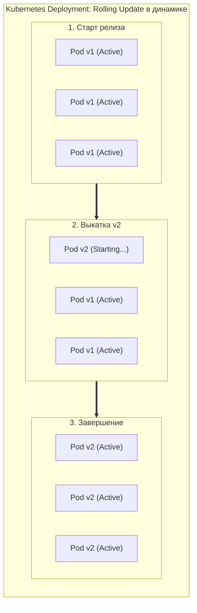
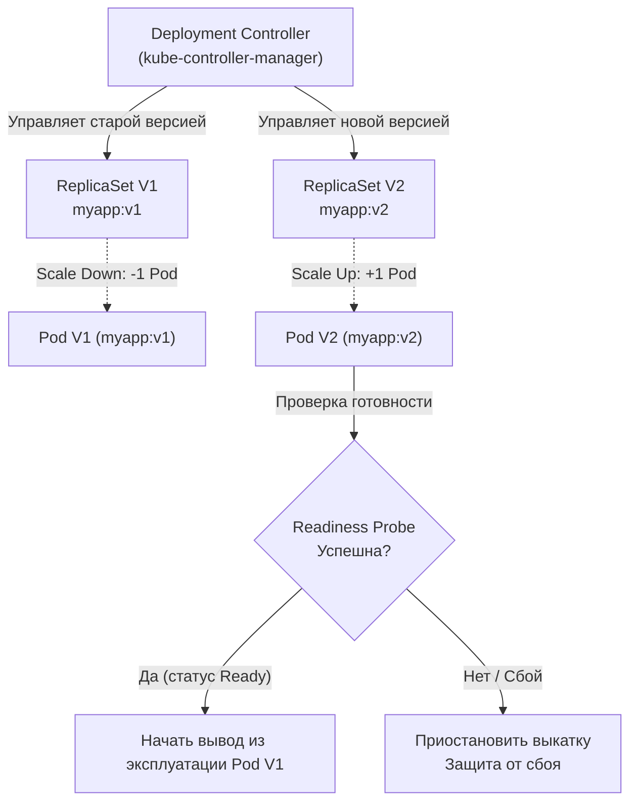
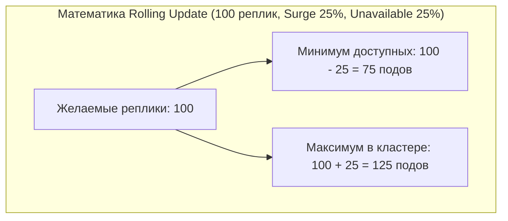
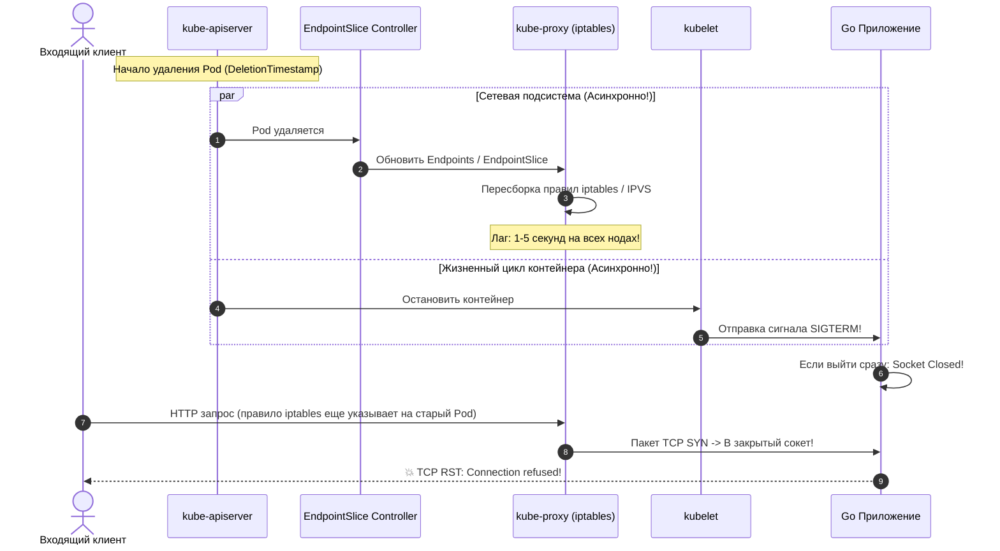

## Пересборка двигателя в полете: Релиз без права на ошибку

> *«Если вы не можете обновить систему без остановки обслуживания пользователей, значит, в вашей архитектуре заложена скрытая зависимость от времени простоя».*  
> — Принцип непрерывной доступности

В эпоху монолитных систем релиз новой версии программного обеспечения был драматическим событием, к которому инженерные отделы готовились неделями. Назначались ночные «технические окна» по выходным, серверы вручную выводились из балансировки, демоны останавливались, администраторы копировали новые бинарники по SSH, накатывали скрипты миграций и с замиранием сердца перезапускали сервисы. Даунтайм (Downtime) считался неизбежным злом.

В мире микросервисов, высокой конкуренции и непрерывной доставки (CI/CD) распределенные системы развертывают новые версии кода десятки раз в сутки прямо посреди рабочего дня. Делать это с прерыванием обслуживания — непозволительная роскошь: даже секундная пауза под нагрузкой в 20 000 RPS обернется десятками тысяч оборванных клиентских корзин, финансовыми потерями и падением репутации сервиса.

В платформе Kubernetes стандартным механизмом обновления без простоя является **Rolling Update (Постепенное обновление)** — стратегия по умолчанию для контроллера Deployment.



В этой лекции мы разберем математику безопасного релиза, исследуем скрытое состояние гонки между ядром Linux (`iptables`), сетевым стеком и планировщиком при удалении подов, а также научимся реализовывать образцовый **Graceful Shutdown** на Go, гарантирующий, что ни один пользовательский запрос не будет сброшен по таймауту или `Connection refused`.

---

## Анатомия Rolling Update

Когда вы обновляете тег Docker-образа в манифесте Deployment (например, переходите с `myapp:v1` на `myapp:v2`), Kubernetes не уничтожает старые инстансы разом. Контроллер разворачивает изящный алгоритмический танец между двумя объектами **ReplicaSet**:



Процесс находится под непрерывным надзором контроллера Deployment в составе `kube-controller-manager`. Он синхронно увеличивает число желаемых реплик в `ReplicaSet V2` и уменьшает их в `ReplicaSet V1`, контролируя, чтобы суммарное число доступных инстансов всегда оставалось в безопасных границах.

---

### Математика безопасности: maxSurge и maxUnavailable

Скорость, агрессивность и ресурсоемкость процесса обновления регулируются двумя взаимосвязанными параметрами в спецификации Deployment:

```yaml
apiVersion: apps/v1
kind: Deployment
metadata:
  name: myapp-deployment
spec:
  replicas: 100
  strategy:
    type: RollingUpdate
    rollingUpdate:
      maxSurge: 25%
      maxUnavailable: 25%
```

Оба параметра могут задаваться как в абсолютных целых числах (подах), так и в процентах от желаемого числа `replicas`:

* **`maxUnavailable` (Максимальная недоступность):** Какое количество подов от целевого значения может быть недоступно во время обновления.  
  При `replicas: 100` и `maxUnavailable: 25%` контроллер имеет право немедленно остановить до 25 старых подов, оставив **75 подов** для обслуживания входящего трафика. Это снижает вычислительную мощность пула на 25%, но экономит ресурсы нод.
* **`maxSurge` (Максимальное превышение):** На сколько подов общее количество запущенных контейнеров может временно превысить базовое значение `replicas`.  
  При `replicas: 100` и `maxSurge: 25%` кластер может создать до 25 новых подов сверх нормы, доводя общее число активных инстансов в пике до **125 подов**.



> [!tip] Собеседование
> **Вопрос:** Что произойдет, если сконфигурировать Deployment со значениями `maxUnavailable: 0%` и `maxSurge: 100%` для сервиса из 10 подов?
> 
> **Ответ:** Вы получите чистую семантику **Blue-Green Deployment** в рамках одного контроллера Deployment:
> 1. Поскольку `maxUnavailable: 0%`, Kubernetes не имеет права трогать ни один из 10 старых подов `myapp:v1`.
> 2. Контроллер создает сразу 10 новых подов `myapp:v2` (`maxSurge: 100%`).
> 3. Старые поды продолжают обрабатывать 100% трафика до тех пор, пока все 10 новых подов не перейдут в статус `Ready`.
> 4. В моменте сервис потребляет **200% ресурсов (х2 CPU/RAM)**.
> 5. Это обеспечивает абсолютную безопасность для входящего трафика без деградации пропускной способности, но требует двойного запаса свободных мощностей в кластере.

---

## Mechanical Sympathy: Смерть пода и сетевой лаг

Самая коварная ловушка Rolling Update кроется в асинхронной распределенной природе Kubernetes. 

Когда `kube-controller-manager` принимает решение вывести старый Pod из эксплуатации, в системе стартуют **два параллельных и совершенно независимых процесса**:



Разберем эту анатомию детально:
1. **Сетевой путь:** Контроллер `EndpointSlice` исключает IP-адрес пода из списка активных эндпоинтов сервиса. Демон `kube-proxy` на каждой ноде кластера считывает это изменение и перестраивает цепочки `iptables` (или таблицы хэшей IPVS). В крупных кластерах с сотнями нод распространение этой информации по сети занимает **от 1 до 5 секунд**.
2. **Путь исполнения (kubelet):** Локальный агент `kubelet` получает команду на уничтожение пода и немедленно посылает корневому процессу контейнера сигнал ядра **`SIGTERM`**.

> [!warning] Ловушка / Gotcha: Состояние гонки при удалении
> Сетевой путь и путь остановки контейнера не синхронизированы!  
> Если ваше Go-приложение при получении `SIGTERM` мгновенно закроет сетевой сокет и завершит выполнение (что часто делают неопытные разработчики вызовом `os.Exit(0)`), клиенты получат всплеск ошибок **`Connection refused`** и **`503 Service Unavailable`**. Причина проста: правила `iptables` на пограничных нодах еще не успели обновиться, и балансировщик продолжает слать новые пакеты на уже мертвого адресата!

---

### Решение 1: preStop Hook — исцеляющая задержка

Для компенсации сетевого лага в спецификацию контейнера добавляют хук жизненного цикла **`preStop`**:

```yaml
spec:
  containers:
  - name: go-app
    image: myapp:v2
    lifecycle:
      preStop:
        exec:
          command: ["/bin/sh", "-c", "sleep 5"]
```

> [!info] Под капотом: preStop Hook
> Хук `preStop` вызывается `kubelet` **синхронно перед** отправкой сигнала `SIGTERM`.  
> Пока контейнер спит эти 5 секунд, он продолжает полноценно работать и отвечать на запросы. За это время `kube-proxy` на всех серверах кластера успевает гарантированно вычистить старый IP-адрес из правил `iptables`. Когда 5 секунд истекают, в Pod больше не прилетает ни один новый сетевой пакет, и `kubelet` наконец отправляет процессу Go сигнал `SIGTERM`.

*(Для минималистичных Docker-образов на базе `scratch`, где отсутствует утилита `/bin/sh`, задержку можно организовать непосредственно в коде Go: перехватить `SIGTERM`, подождать 5 секунд и лишь затем закрывать сетевой listener).*

---

### Решение 2: Идиоматичный Graceful Shutdown на Go

После того как сетевой трафик отведен, приложение должно корректно завершить работу:
1. Прекратить прием новых TCP-соединений (закрыть сокет `net.Listener`).
2. Дождаться завершения всех уже выполняющихся HTTP/gRPC запросов.
3. Корректно закрыть соединения с брокерами очередей (Kafka, RabbitMQ) и базой данных.
4. Уложиться в жесткий лимит времени, выделенный Kubernetes (`terminationGracePeriodSeconds`).

Для этого в стандартной библиотеке Go используется метод `server.Shutdown()`:

```go
package main

import (
	"context"
	"errors"
	"log/slog"
	"net/http"
	"os"
	"os/signal"
	"syscall"
	"time"
)

func main() {
	mux := http.NewServeMux()
	mux.HandleFunc("/api/v1/checkout", func(w http.ResponseWriter, r *http.Request) {
		// Имитация длительной бизнес-транзакции
		time.Sleep(2 * time.Second)
		w.WriteHeader(http.StatusOK)
		_, _ = w.Write([]byte(`{"status":"order_processed"}`))
	})

	srv := &http.Server{
		Addr:         ":8080",
		Handler:      mux,
		ReadTimeout:  5 * time.Second,
		WriteTimeout: 10 * time.Second,
		IdleTimeout:  120 * time.Second,
	}

	// 1. Канал для перехвата сигналов операционной системы
	quit := make(chan os.Signal, 1)
	// Подписываемся на SIGINT (Ctrl+C локально) и SIGTERM (от Kubelet в кластере)
	signal.Notify(quit, syscall.SIGINT, syscall.SIGTERM)

	// 2. Запуск сервера в отдельной неблокирующей горутине
	go func() {
		slog.Info("Server is listening for requests", "addr", srv.Addr)
		if err := srv.ListenAndServe(); err != nil && !errors.Is(err, http.ErrServerClosed) {
			slog.Error("ListenAndServe encountered a fatal error", "err", err)
			os.Exit(1)
		}
	}()

	// 3. Блокируемся и ждем сигнала завершения от ОС
	sig := <-quit
	slog.Info("Signal received, initiating graceful shutdown", "signal", sig.String())

	// 4. Опционально (если образ scratch и нет preStop):
	// time.Sleep(5 * time.Second) // Даем kube-proxy время обновить iptables

	// 5. Создаем контекст с жестким таймаутом на доработку текущих соединений.
	// Этот таймаут должен быть меньше, чем terminationGracePeriodSeconds в K8s!
	ctx, cancel := context.WithTimeout(context.Background(), 25*time.Second)
	defer cancel()

	// 6. Вызов server.Shutdown():
	// - Немедленно закрывает все открытые net.Listener (отклоняет новые TCP SYN)
	// - Закрывает все простаивающие (idle) Keep-Alive соединения
	// - Блокирует поток исполнения, ожидая, пока активные горутины запросов завершатся
	if err := srv.Shutdown(ctx); err != nil {
		slog.Error("Server forced to shutdown by timeout", "err", err)
		os.Exit(1)
	}

	slog.Info("All active HTTP requests processed. Server successfully stopped.")
}
```

---

## Архитектурные ловушки

### 1. Отсутствие Readiness Probes
Контроллер Rolling Update полностью опирается на статусы подов. Если в манифесте отсутствует **Readiness Probe** (см. [[6. Health checks]]), Kubernetes посчитает Pod готовым (`Ready`) ровно в ту миллисекунду, когда процесс запустится в контейнере.  
Если вашему Go-приложению требуется 5–10 секунд на прогрев кэша, подключение к базам данных и подгрузку конфигурации, кластер не будет ждать. Он посчитает новый Pod работоспособным, мгновенно убьет старые рабочие поды и направит весь пользовательский поток на неподготовленные инстансы. Результат — массовый обвал в **`503 Service Unavailable`**.

### 2. Слом контрактов БД (Backward Incompatibility)
Вы провели идеальный релиз без потери сетевых пакетов. Но ваш сервис работает с общей базой данных.  
Представьте сценарий:
- Версия 1 (`myapp:v1`) ожидает, что данные пользователя лежат в одной колонке `full_name`.
- Версия 2 (`myapp:v2`) разбивает имя на две колонки `first_name` и `last_name`.

В процессе Rolling Update (который под нагрузкой может длиться от нескольких минут до часа) **`myapp:v1` и `myapp:v2` работают бок о бок одновременно**!  
Если `myapp:v2` выполнит деструктивную миграцию (`DROP COLUMN full_name`), работающие инстансы `myapp:v1` моментально упадут с ошибками выполнения SQL-запросов.

*Инженерное правило:* Всегда строго соблюдайте обратную совместимость (см. [[7. Backward compatibility]]). Применяйте паттерн **Expand-Contract (Расширение — Сжатие)**: сначала добавляйте новые колонки (`first_name`, `last_name`), поддерживая запись в обе структуры, и лишь через несколько релизов удаляйте устаревшую колонку `full_name`.

### 3. Слишком короткий terminationGracePeriodSeconds
По умолчанию Kubernetes выделяет контейнеру ровно **30 секунд** на всю процедуру остановки (включая работу хука `preStop` и вызов `http.Server.Shutdown(ctx)`).

Если у вас запущен фоновый воркер, выполняющий тяжелую транзакцию обработки видео или генерации отчета длительностью 2 минуты, то ровно через 30 секунд `kubelet` потеряет терпение и пошлет процесс-убийцу **`SIGKILL`**. Сигнал `SIGKILL` обрабатывается исключительно ядром Linux: его невозможно перехватить в коде или проигнорировать — процесс будет мгновенно стерт из памяти с риском повреждения данных.

*Решение:* Если вашим горутинам требуется больше времени на завершение, обязательно увеличьте лимит в манифесте:
```yaml
spec:
  terminationGracePeriodSeconds: 120
```

---

## Вопросы для собеседования

> [!tip] Вопросы сеньорного собеседования по Rolling Updates
> 1. **Что происходит под капотом Linux и Kubernetes при удалении Pod?**  
>    *Ответ:* Происходят два асинхронных процесса. Контроллер EndpointSlice исключает IP-адрес пода из сетевых списков, и `kube-proxy` начинает переписывать правила `iptables`/IPVS на всех нодах. Одновременно с этим `kubelet` запускает `preStop` хук и затем отправляет `SIGTERM` процессу контейнера. Если процесс не завершится за время `terminationGracePeriodSeconds`, ядро Linux принудительно уничтожит его сигналом `SIGKILL`.
> 2. **Зачем нужен хук `preStop: sleep 5`, если в Go уже реализован `srv.Shutdown()`?**  
>    *Ответ:* Метод `srv.Shutdown()` закрывает сетевой listener сразу после получения `SIGTERM`. Однако сетевые правила `iptables` в кластере распространяются с задержкой (до нескольких секунд). Если listener закроется раньше, чем обновятся таблицы маршрутизации на всех нодах, новые клиентские пакеты попадут в закрытый порт и завершатся ошибкой `Connection refused`. Пауза в `preStop` дает сети время синхронизироваться.
> 3. **В чем разница между `maxUnavailable` и `maxSurge`?**  
>    *Ответ:* `maxUnavailable` задает допустимый предел временного снижения производительности сервиса (сколько подов можно погасить от базового количества). `maxSurge` определяет допустимый перерасход мощностей кластера (сколько подов сверх целевого количества можно временно запустить). Комбинация `maxUnavailable: 0%` и `maxSurge: 100%` реализует стратегию Blue-Green без проседания пропускной способности.

---

## Резюме

1. **Математика релиза:** Параметры `maxSurge` и `maxUnavailable` задают баланс между скоростью обновления и запасом отказоустойчивости кластера.
2. **Параллельная асинхронность:** Маршрутизация трафика отключается независимо от жизненного цикла контейнера. Используйте `preStop` hook (или таймер в коде) для компенсации сетевого лага `iptables`.
3. **Graceful Shutdown на Go:** Использование `http.Server.Shutdown(ctx)` в связке с перехватом сигналов `SIGTERM` и `SIGINT` — закон для production-сервисов.
4. **Readiness Probes критичны:** Без настроенной проверки готовности плавное обновление превращается в лотерею с гарантированным выпадением `503 Service Unavailable`.
5. **Expand-Contract для БД:** Помните, что во время Rolling Update старый и новый код работают одновременно. Миграции базы данных обязаны сохранять обратную совместимость.

Мы научились разворачивать, масштабировать и бесшовно обновлять наш микросервис. Но теперь кластер превратился в сложнейший распределенный механизм: десятки взаимосвязанных сервисов, тысячи подов, динамические IP-адреса и непредсказуемая виртуальная сеть. Если где-то начнет деградировать база данных, расти задержка ответов или течь память в одном из 100 подов — как мы узнаем об этом до того, как упадет вся система? В следующей лекции мы откроем глаза нашей инфраструктуре: [[7. Observability в Kubernetes]].