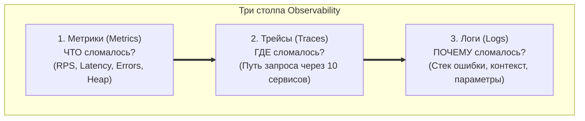
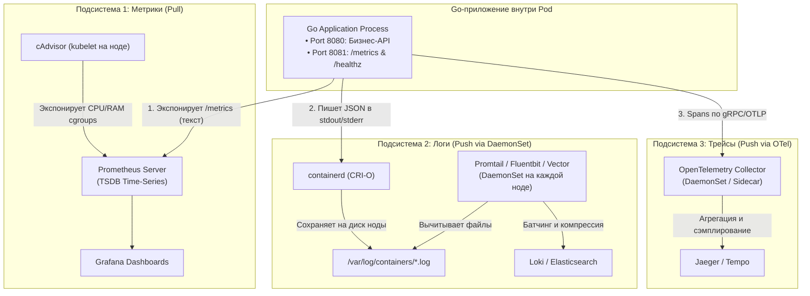
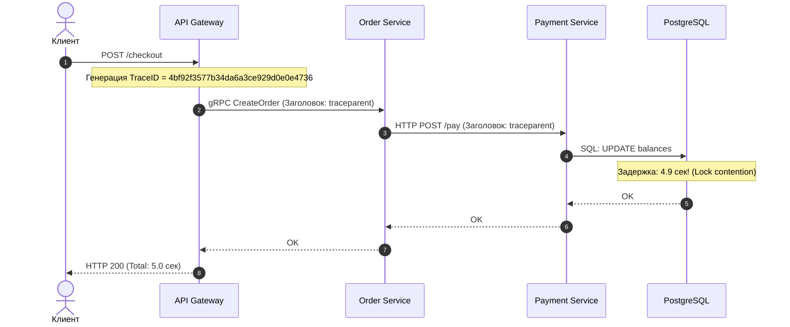

## Прозрение в темноте: Как понять, почему всё сломалось

> *«Нельзя управлять тем, что вы не можете измерить. Но еще опаснее — пытаться чинить распределенную систему, в которой вы ослепли».*  
> — Принцип наблюдаемости распределенных систем

В предыдущих лекциях мы упаковали наш Go-сервис в компактный контейнер, настроили автоматическое масштабирование через HPA (см. [[5. Horizontal scaling]]) и научились бесшовно обновлять версии без единой секунды простоя (см. [[6. Rolling updates]]). 

А теперь представьте типичный рабочий день инженера: в боевом кластере работает 50 реплик микросервиса. Из службы поддержки приходит тревожное сообщение: у части пользователей мобильного приложения оплата падает с таймаутом или ошибкой `HTTP 500`, а у других пользователей оформление заказа занимает 10 секунд вместо привычных 80 миллисекунд. Вы открываете терминал, вводите `kubectl get pods`, видите 50 зеленых строчек со статусом `Running` — и понимаете страшную вещь: **ваша распределенная система превратилась в непроницаемый черный ящик**.

В классическую эпоху монолитов инженер мог подключиться к физическому серверу по SSH, открыть интерактивную утилиту `top` или заглянуть в локальный файл `/var/log/syslog`. В Kubernetes этот подход мертв:
1. **Эфемерность подов:** Контейнеры живут часы, минуты, а иногда секунды. Если Pod был уничтожен ядром по нехватке памяти (OOM — Out Of Memory), он просто исчезает вместе со всей локальной файловой системой.
2. **Динамическая топология:** Трафик одного пользователя размазывается между сотнями подов и десятками микросервисов. Искать проблему локально на одной ноде бессмысленно.

**Observability (Наблюдаемость)** — это инженерный подход, позволяющий математически точно реконструировать внутреннее состояние любой части распределенной системы исключительно на основе анализа ее внешних артефактов. В современной индустрии наблюдаемость опирается на «три столпа» (Three Pillars): **Метрики (Metrics)**, **Логи (Logs)** и **Распределенные трейсы (Traces)**.



В этой лекции мы разберем, как спроектировать сквозную наблюдаемость Go-приложения в Kubernetes, почему наивный `fmt.Println` может заблокировать все потоки рантайма Go, как защитить мониторинг от ловушки High Cardinality и как расследовать загадочные «тихие смерти» подов.

---

## Три столпа Observability в кластере

Чтобы видеть систему насквозь, нам нужны три фундаментально разных типа телеметрии, каждый из которых собирается специализированным агентом и передается в оптимизированное хранилище данных:



---

## 1. Метрики: Пульс системы и Prometheus

Метрики — это числовые временные ряды (Time Series), отражающие динамику поведения сервиса:
- *Сколько* HTTP-запросов обработано в секунду (Throughput / RPS);
- *Каков* 99-й перцентиль задержки ответа (P99 Latency);
- *Сколько* активных горутин и мегабайт кучи (Heap Alloc) сейчас удерживает рантайм Go.

В мире Kubernetes непререкаемым стандартом де-факто является **Prometheus**. В отличие от устаревших систем (таких как StatsD или Graphite, куда приложение само вынуждено отправлять данные по UDP — модель Push), Prometheus реализует **Pull-модель** (Scraping):

1. Ваше Go-приложение на служебном порту (например, `:8081`) открывает стандартный эндпоинт **`/metrics`**.
2. Prometheus раз в 15 секунд отправляет легковесный HTTP GET запрос на `/metrics` каждого пода и забирает текстовый поток счетчиков.

```go
package main

import (
	"net/http"
	"github.com/prometheus/client_golang/prometheus"
	"github.com/prometheus/client_golang/prometheus/promhttp"
)

var (
	httpRequestsTotal = prometheus.NewCounterVec(
		prometheus.CounterOpts{
			Name: "http_requests_total",
			Help: "Суммарное количество обработанных HTTP-запросов",
		},
		[]string{"method", "status", "path"},
	)
)

func init() {
	prometheus.MustRegister(httpRequestsTotal)
}

func startMetricsServer() {
	mux := http.NewServeMux()
	mux.Handle("/metrics", promhttp.Handler())
	_ = http.ListenAndServe(":8081", mux)
}
```

> [!info] Под капотом: Service Discovery
> Как сервер Prometheus узнает IP-адреса всех 50 подов сервиса, если они постоянно создаются и умирают?  
> Prometheus напрямую подключен к `kube-apiserver` через механизм Watch API. Он непрерывно слушает события жизненного цикла подов. Существуют два подхода к обнаружению:
> 1. **Аннотации в манифесте:** Prometheus ищет поды с метаданными `prometheus.io/scrape: "true"` и `prometheus.io/port: "8081"`.
> 2. **Prometheus Operator:** Использование Custom Resource Definition (CRD) **`ServiceMonitor`**, который декларативно связывает мониторинг с метками Kubernetes Service.  
> Prometheus обращается напрямую к локальному IP-адресу каждого Pod, минуя балансировщики и kube-proxy.

---

### Mechanical Sympathy: Ловушка High Cardinality

Самая коварная ловушка для новичков при внедрении Prometheus в Go — это **High Cardinality (Взрывная кардинальность меток)**.

База данных Prometheus (TSDB) устроена так: **каждая уникальная комбинация имени метрики и значений ее меток (Labels) создает в оперативной памяти абсолютно новый временной ряд (Time Series)** со своими чанками кэша и индексами.

Представьте, что вы логируете длительность HTTP-запросов и добавили метку `path`:
```go
// ❌ КАТАСТРОФИЧЕСКАЯ ОШИБКА: сырой путь в лейбле
httpRequestsTotal.WithLabelValues(r.Method, "200", r.URL.Path).Inc()
```
Если клиент обращается по путям с динамическими идентификаторами:
- `path="/api/users/123"`
- `path="/api/users/456"`
- `path="/api/users/789"`

То при наличии миллиона пользователей вы создадите в памяти Prometheus **миллион независимых временных рядов**! TSDB Prometheus моментально исчерпает всю оперативную память сервера, свалится в бесконечный Garbage Collection и упадет по OOM Killer.

```mermaid
flowchart TD
    subgraph Bad["Опасный путь: High Cardinality"]
        RawURL["r.URL.Path = /api/users/12345"] --> MetricBad["path=\"/api/users/12345\"\nНовая Time Series!"]
        MetricBad --> OOM["💥 Миллион серий = OOM в Prometheus TSDB"]
    end

    subgraph Good["Правильный путь: Low Cardinality"]
        CleanPattern["Роутер: pattern = /api/users/:id"] --> MetricGood["path=\"/api/users/:id\"\nВсего 1 Time Series!"]
        MetricGood --> Healthy["✅ Стабильная память (микросекундный сбор)"]
    end
```

> [!important] Золотое правило кардинальности
> В метках Prometheus разрешено использовать **только конечные перечисления с низкой мощностью (Low Cardinality)**: HTTP-метод (`GET`, `POST`), статус-код (`200`, `404`, `500`) и параметризованный шаблон маршрута (`/api/users/:id`).  
> Категорически запрещено помещать в метки пользовательские идентификаторы (`user_id`), токены, UUID заказов, IP-адреса и сырые URL!

---

### Метрики железа: cAdvisor

Вам не требуется писать специальный код на Go, чтобы собирать физические метрики контейнера (нагрузку на ядра процессора, RSS оперативной памяти, сетевой трафик сетевого интерфейса `eth0`).

Демон `kubelet` (см. [[2. Kubernetes. Основы]]), работающий на каждой ноде, содержит встроенный модуль **`cAdvisor`** (Container Advisor). Он напрямую подключается к файловой системе ядра Linux `cgroups` (контрольные группы `cpu.stat`, `memory.current`) и автоматически экспонирует для Prometheus стандартные системные метрики: `container_cpu_usage_seconds_total`, `container_memory_working_set_bytes` и другие.

---

## 2. Логирование: Иллюзия `stdout`

В архитектуре Kubernetes логирование подчинено принципу: **максимальная простота для приложения, вся сложность — на инфраструктуре**.

Приложению на Go категорически запрещено писать логи в файлы внутри контейнера. Оно должно отправлять события исключительно в стандартные потоки вывода операционной системы — **`stdout`** (информационные сообщения) и **`stderr`** (ошибки и паники).

Дальше в дело вступает инфраструктурный конвейер:
1. Container Runtime (например, `containerd`) перехватывает потоки вывода процесса и записывает их в локальные файлы на диске ноды по пути `/var/log/containers/`.
2. Специализированный сборщик логов (`Promtail`, `Fluentbit`, `Vector`), развернутый как `DaemonSet` (по одному экземпляру на каждую ноду), вычитывает эти файлы в режиме tailing, парсит строки, обогащает их метаданными пода (`namespace`, `pod_name`, `container_name`) и батчами отправляет в централизованное хранилище — **Grafana Loki** или **Elasticsearch**.

---

### Идиоматичный Go: log/slog и JSON

> [!tip] Собеседование
> **Вопрос:** Почему в распределенных облачных системах строго запрещено использовать неструктурированное текстовое логирование вроде `log.Printf("user %s created", user)`?
> 
> **Ответ:** Текстовые логи невозможно эффективно фильтровать, индексировать и агрегировать на масштабе терабайтов данных. Если в системе из 100 микросервисов нужно найти все сбои списания средств для конкретного `user_id`, линейный перебор регулярными выражениями (`grep`) подведет хранилище логов под предельный I/O и займет часы. 
> 
> Логи обязаны быть **структурированными машиночитаемыми документами в формате JSON**.

Начиная с версии Go 1.21 в стандартную библиотеку языка встроен высокопроизводительный пакет структурированного логирования — **`log/slog`**:

```go
package main

import (
	"log/slog"
	"os"
	"time"
)

func initLogger() {
	// Создаем JSON-обработчик, пишущий напрямую в stdout
	handler := slog.NewJSONHandler(os.Stdout, &slog.HandlerOptions{
		Level: slog.LevelInfo,
	})
	logger := slog.New(handler)
	slog.SetDefault(logger)
}

func ProcessPayment(userID string, amount int) {
	start := time.Now()
	// ... бизнес-логика транзакции ...

	slog.Info("payment processed",
		slog.String("user_id", userID),
		slog.Int("amount", amount),
		slog.Duration("latency", time.Since(start)),
	)
}
```

Такая запись выводится в одну JSON-строку:
```json
{"time":"2026-09-17T14:30:00.000Z","level":"INFO","msg":"payment processed","user_id":"12345","amount":500,"latency":45000000}
```

Хранилище Grafana Loki парсит такой лог мгновенно, позволяя аналитикам и инженерам выполнять фильтрацию любой сложности через язык LogQL:
```text
{app="payment"} | json | amount > 100
```

---

### Mechanical Sympathy: Блокирующий stdout

Многие Go-разработчики считают, что вызов `fmt.Println` или `slog.Info` выполняется мгновенно и не несет архитектурных рисков. Это опасная иллюзия.

> [!warning] Ловушка / Gotcha: Блокировка ядра на системном вызове write
> На уровне ядра Linux стандартный вывод `stdout` контейнера — это не магическая бездонная бочка. Это системный однонаправленный канал передачи данных (**Unix Pipe** или **UNIX domain socket**), связывающий дескриптор 1 вашего процесса с фоновым демоном `containerd`.
> 
> У этого системного пайпа в ядре Linux есть фиксированный буфер (по умолчанию **64 Килобайта**). 
> 
> Если ваше Go-приложение начинает неистово логировать каждый входящий запрос с полным дампом JSON-тела под нагрузкой 5 000 RPS, а диск ноды или процесс `containerd` не успевают считывать данные из пайпа (например, из-за I/O iowait задержек SSD), **буфер ядра в 64 КБ моментально заполняется**.
> 
> В этот момент системный вызов `write` в Go **блокируется ядром**!  
> Горутина, вызвавшая `slog.Info`, зависает. Следом за ней зависают горутины в HTTP-пуле, рантайм Go упирается в потолок системных потоков ОС (`M`), и весь сервис полностью перестает отвечать на внешние запросы.
> 
> **Инженерный вывод:** Никогда не используйте логирование для отладки под нагрузкой. Логируйте только ключевые этапы бизнес-процесса и ошибки.

---

## 3. Трассировка (Tracing): Поиск виновного в толпе

Метрики показывают, *что* общая задержка системы выросла. Логи показывают, *какие* ошибки возникли. Но когда запрос пользователя проходит через цепочку из 10 микросервисов:

$$\text{Client} \to \text{API Gateway} \to \text{Order Service} \to \text{Payment Service} \to \text{PostgreSQL}$$

И общий ответ занял 5.2 секунды вместо 50 мс — **кто именно из участников виноват в задержке?**

Ответить на этот вопрос может только **распределенная трассировка (Distributed Tracing)** (см. [[6. Distributed tracing]]). В экосистеме Cloud Native единым стандартом стал проект **OpenTelemetry (OTel)**.

### Механика контекста и TraceID
При входе запроса на пограничный прокси (`API Gateway`) генерируется глобально уникальный идентификатор сквозного следа — **`TraceID`**. При каждом межсервисном вызове по HTTP или gRPC клиентская библиотека обязана внедрять (inject) этот идентификатор в сетевые заголовки согласно стандарту W3C Trace Context (заголовок `traceparent`).



---

### Трассировка в Go через context

В языке Go передача трассировочной информации органически опирается на стандартный интерфейс `context.Context`.  
Поскольку каждый входящий запрос обрабатывается в изолированной горутине, хранить `TraceID` в глобальных переменных категорически невозможно. Передача контекста через `ctx` во все функции сервиса — абсолютный стандарт:

```go
package main

import (
	"context"
	"database/sql"
	"net/http"

	"go.opentelemetry.io/otel"
	"go.opentelemetry.io/otel/trace"
)

var tracer = otel.Tracer("order-service")

func HandleOrder(w http.ResponseWriter, r *http.Request) {
	// 1. Извлекаем контекст запроса (содержащий TraceID от вышестоящего API Gateway)
	ctx := r.Context()

	// 2. Создаем локальный Span (отрезок времени исполнения бизнес-функции)
	ctx, span := tracer.Start(ctx, "process_order_db_transaction")
	defer span.End()

	// 3. Передаем обогащенный контекст в вызов базы данных!
	if err := executeDatabaseQuery(ctx); err != nil {
		span.RecordError(err)
		http.Error(w, err.Error(), http.StatusInternalServerError)
		return
	}

	w.WriteHeader(http.StatusOK)
}

func executeDatabaseQuery(ctx context.Context) error {
	// Под капотом драйвер базы данных зафиксирует Span "UPDATE" и свяжет его с TraceID
	var db *sql.DB
	_, err := db.ExecContext(ctx, "UPDATE balances SET balance = balance - 100 WHERE id = 1")
	return err
}
```

Библиотека OpenTelemetry в Go в фоновом неблокирующем режиме упаковывает завершенные спаны и по протоколу gRPC транслирует их в **OpenTelemetry Collector**, который собирает, фильтрует и передает трассы в хранилища визуализации — **Jaeger** или **Grafana Tempo**. В веб-интерфейсе Jaeger инженер видит наглядную водопадную диаграмму (Waterfall), из которой мгновенно ясно: из 5 секунд общего времени 4.9 секунды ушло на блокировку строки в операции `UPDATE` в базе данных.

---

## Расследование инцидентов: Когда поды умирают молча

Один из самых болезненных сценариев в эксплуатации Kubernetes — это **«тихая смерть» (Silent Death)** пода.

Представьте: в вашем Go-сервисе возникла утечка памяти (например, горутины складывают указатели в глобальный срез и никогда не очищают его). Потребление RAM контейнера растет, пока не упирается в лимит `resources.limits.memory: 512Mi`.

В этот момент вмешивается подсистема ядра Linux — **OOM Killer** (Out Of Memory Killer). Ядро мгновенно стирает процесс контейнера системным вызовом **`SIGKILL`**.

### В чем трагедия для инженера?
Сигнал `SIGKILL` обрабатывается исключительно ядром операционной системы на аппаратном уровне. Процесс Go **не может перехватить `SIGKILL`**. Приложение не успеет выполнить `defer`, не запишет предсмертное сообщение `slog.Error("dying from OOM")` и не сбросит стек вызовов. В логах Loki вы увидите лишь внезапный обрыв строк.

```mermaid
flowchart LR
    GoApp["Go-процесс (Утечка памяти)"] -->|"Превышен cgroup limit 512Mi"| Kernel["Ядро Linux (OOM Killer)"]
    Kernel -->|"Мгновенный аппаратный SIGKILL (Exit Code 137)"| Kill["Процесс уничтожен! Никаких логов!"]
    
    style Kernel fill:#3b1d22,stroke:#f43f5e,stroke-width:2px
```



### Как расследовать причину гибели:

1. **События кластера (Cluster Events):**  
   Агент `kubelet` фиксирует факт уничтожения контейнера ядром и генерирует событие в API Server. Инженер может увидеть причину через консоль:
   ```bash
   kubectl describe pod <name>
   kubectl get events --sort-by='.metadata.creationTimestamp'
   ```
   В выводе вы увидите характерную метку:
   ```text
   Last State:     Terminated
     Reason:       OOMKilled
     Exit Code:    137
   ```
   *(Код возврата 137 расшифровывается как $128 + 9$, где 9 — номер сигнала `SIGKILL`).*

2. **Kube-state-metrics и автоматический алертинг:**  
   Специализированный сервис `kube-state-metrics` непрерывно транслирует статусы жизненного цикла подов в метрики Prometheus.  
   Настроив алерт в Alertmanager на условие:
   ```promql
   kube_pod_container_status_terminated_reason{reason="OOMKilled"} > 0
   ```
   дежурная команда инженеров получает мгновенное уведомление в корпоративный мессенджер в ту же секунду, когда контейнер пал жертвой OOM Killer.

---

## Вопросы для собеседования

> [!tip] Вопросы сеньорного собеседования по Observability в Kubernetes
> 1. **В чем разница между Pull-моделью (Prometheus) и Push-моделью (StatsD/Graphite)? Каковы плюсы и минусы в K8s?**  
>    *Ответ:* В Push-модели каждое приложение само отправляет метрики на центральный сервер. При падении сети или перегрузке центрального коллектора тысячи приложений могут положить сеть повторными попытками отправки. Кроме того, Push-сервер не знает, умерло приложение или просто молчит.  
>    В Pull-модели Prometheus сам забирает данные по HTTP с известной периодичностью (Rate Limiting на стороне сборщика). Если под не отвечает на скрейпинг, Prometheus мгновенно фиксирует метрику `up == 0`, детектируя отказ.
> 2. **Что такое High Cardinality и как она способна обрушить систему мониторинга?**  
>    *Ответ:* Кардинальность — это количество уникальных комбинаций меток метрики. Каждая комбинация порождает отдельный непрерывный временной ряд в памяти TSDB. Использование динамических параметров (ID пользователей, UUID, IP-адресов) приводит к созданию миллионов серий, исчерпанию оперативной памяти Prometheus и краху мониторинга по OOM.
> 3. **Почему системный вызов `write` в stdout может заблокировать Go-приложение?**  
>    *Ответ:* Стандартный вывод контейнера передается демону `containerd` через Unix Pipe с ограниченным буфером ядра (64 КБ). При интенсивной записи и медленном чтении сборщиком логов буфер переполняется, и ядро переводит поток исполнения Go в блокирующее ожидание освобождения места в буфере.

---

## Резюме

1. **Три столпа:** Метрики показывают наличие и масштаб проблемы, трейсы локализуют виновный компонент в графе вызовов, а логи вскрывают детальную причину сбоя (например, детальный текст ошибки `sql: connection refused`).
2. **Pull-модель Prometheus:** Приложение открывает эндпоинт `/metrics`, а сервер мониторинга сам опрашивает поды благодаря Service Discovery в Kubernetes.
3. **Защита от High Cardinality:** Никогда не используйте динамические идентификаторы в лейблах метрик. Лейблы должны быть строго ограниченным набором фиксированных значений.
4. **Структурированный JSON в stdout:** Применяйте пакет `log/slog` для вывода структурированных логов. Помните об опасности переполнения буфера Unix Pipe при чрезмерном логировании.
5. **OpenTelemetry и Context:** Передавайте `context.Context` через все слои Go-архитектуры для сквозного проброса `TraceID`.
6. **OOMKilled расследуется снаружи:** Контейнер, убитый по `SIGKILL`, не оставляет записей в логах. Причину аварии выявляют через `kubectl describe pod` и метрику `kube_pod_container_status_terminated_reason`.

Мы оснастили наши сервисы полноценным мониторингом, научились контролировать использование ресурсов и мгновенно расследовать любые аномалии. Но как сетевой пакет клиента, летящий из браузера через глобальный интернет, физически находит нужный Pod среди сотен других внутри закрытого кластера? Как взаимодействуют Ingress-контроллеры, CoreDNS, ClusterIP и оверлейные сети CNI? В заключительной лекции подраздела мы разберем главный фундамент распределенной инфраструктуры: [[8. Kubernetes networking]].