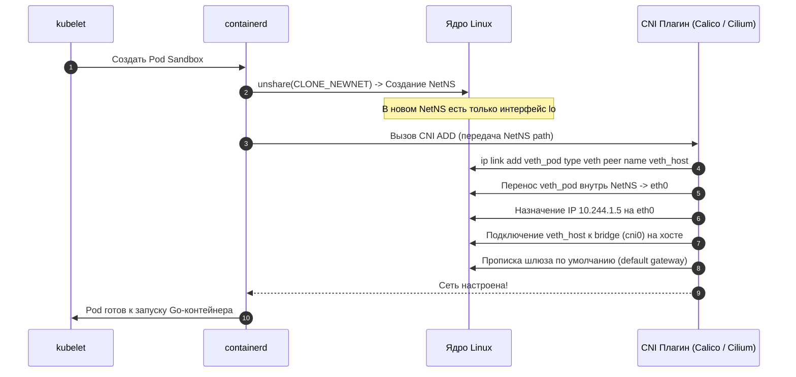
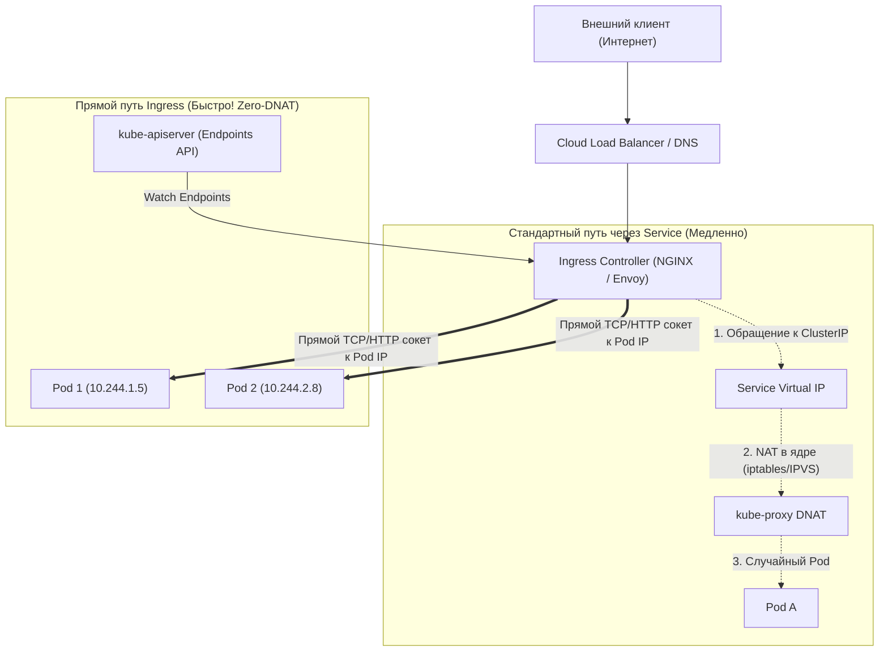
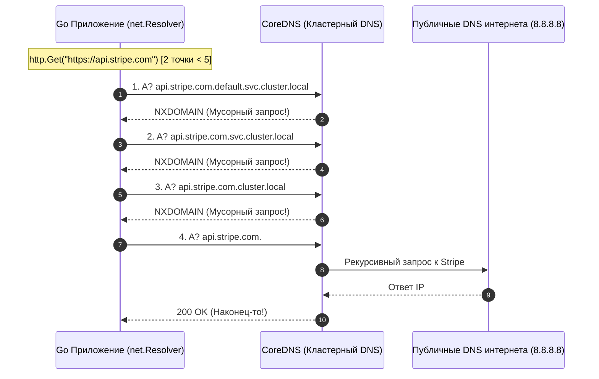
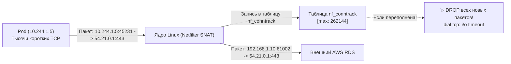

## Анатомия сети: От горутины до дата-центра

> *«Вся магия распределенных систем исчезает, как только вы понимаете, как ядро операционной системы перекладывает байты из одного сетевого сокета в другой».*  
> — Принцип демистификации инфраструктуры

В предыдущей лекции [[7. Observability в Kubernetes]] мы сделали наш кластер прозрачным для телеметрии: научились собирать метрики, структурированные логи и сквозные трейсы. Но под всем этим слоем абстракций скрывается фундаментальная основа любой распределенной системы — **компьютерная сеть**.

Для подавляющего большинства разработчиков сеть в Kubernetes кажется непостижимой магией. Мы применяем декларативные YAML-манифесты, и внезапно поды, физически разнесенные по разным серверам и стойкам дата-центра, начинают прозрачно общаться друг с другом по прямым IP-адресам, а клиентский трафик из глобального интернета безошибочно находит нужную горутину в конкретном поде.

Однако в компьютерных системах чудес не бывает. Вся «магия» Kubernetes — это строгая и виртуозная оркестрация низкоуровневых механизмов ядра Linux:
- **Сетевых пространств имен (Network Namespaces);**
- **Виртуальных Ethernet-пар (`veth`);**
- **Программных мостов (Linux Bridges);**
- **Оверлейных туннелей (VXLAN, Geneve) и протокола маршрутизации BGP;**
- **Подсистем фильтрации пакетов (`iptables`, IPVS) и eBPF.**

В этой финальной лекции раздела «Kubernetes и деплой» мы разберем внутреннее устройство Container Network Interface (CNI), вскроем печально известную проблему резолвинга DNS в Go (`ndots:5`), разберем физику переполнения таблицы `nf_conntrack` ядра Linux и сконфигурируем образцовый сетевой транспорт Go для работы в высоконагруженном кластере.

---

## 1. Плоская сеть и CNI (Container Network Interface)

Архитектура сети Kubernetes построена на концепции **«плоской сети» (Flat Network)**, которая формулируется четырьмя фундаментальными инвариантами:

1. **Каждый Pod получает собственный уникальный IP-адрес** в рамках всего кластера.
2. **Любой Pod может обращаться к любому другому Pod без применения NAT (Network Address Translation).**
3. **Системные демоны на ноде (`kubelet`, рантайм контейнеров) могут связываться со всеми подами на этой же ноде.**
4. **IP-адрес, который Pod видит у себя локально, совпадает с IP-адресом, который видят все остальные участники сети.**

Это фундаментальное упрощение: разработчику Go-сервиса не нужно думать о динамическом сопоставлении портов (Port Mapping) на хосте, как это было в раннем Docker. Для приложения каждый Pod выглядит как независимый физический сервер.

За реализацию этих правил на уровне ядра Linux отвечает **CNI-плагин** (Container Network Interface) — такие сетевые драйверы, как **Calico**, **Cilium**, **Flannel** или облачные AWS-VPC CNI.

---

### Mechanical Sympathy: Как под получает сеть?

Когда агент `kubelet` дает команду рантайму контейнеров (`containerd`) развернуть новый Pod с Go-приложением, разворачивается следующая цепочка системных вызовов:



Разберем эту анатомию по шагам:
1. **Изоляция:** Ядро Linux создает изолированное сетевое пространство имен (`Network Namespace`). Изначально внутри него поднят лишь пустой псевдоинтерфейс петли обратной связи **`lo`** (localhost).
2. **Создание виртуального патч-корда:** Драйвер CNI создает виртуальную пару интерфейсов — **`veth pair`** (Virtual Ethernet Pair). Это прямой программный аналог сетевого кабеля, соединяющего два порта.
3. **Разделение концов:** 
   - Один конец пары помещается внутрь сетевого пространства имен пода и переименовывается в **`eth0`**. Ему присваивается выделенный IP-адрес (например, `10.244.1.5`).
   - Второй конец (`vethX`) остается в корневом пространстве имен хоста (Worker Node).
4. **Коммутация на ноде:** На хосте второй конец подключается к виртуальному программному коммутатору — Linux Bridge (обычно именуемому **`cni0`** или `bridge`).
5. **Маршрутизация:** В таблице маршрутизации пода прописывается шлюз по умолчанию (`0.0.0.0/0`), направляющий все исходящие пакеты через `eth0` в мост `cni0`.

```mermaid
flowchart TD
    subgraph PodNetNS["Сетевой Namespace Пода (10.244.1.5)"]
        GoProcess["Go-приложение (net.Listen :8080)"]
        Eth0["Интерфейс eth0 (10.244.1.5)"]
        GoProcess --> Eth0
    end

    subgraph HostNetNS["Сетевой Namespace Хоста (Worker Node 1: 192.168.1.10)"]
        VethHost["vethX (Виртуальный патч-корд)"]
        Bridge["Мост cni0 (10.244.1.1)"]
        HostPhys["Физическая сетевая карта eth0 (192.168.1.10)"]
        
        Eth0 ==="veth-pair"=== VethHost
        VethHost --> Bridge
        Bridge --> HostPhys
    end

    subgraph Fabric["Сетевая фабрика дата-центра (L2 / L3)"]
        HostPhys --> Wire["Туннель VXLAN (UDP 4789) / Маршрутизация BGP"]
    end

    subgraph RemoteHost["Удаленный Worker Node 2 (192.168.1.20)"]
        Wire --> RemotePhys["Физическая сетевая карта eth0"]
        RemotePhys --> RemotePod["Удаленный Pod (10.244.2.8)"]
    end
```

#### Межхостовое взаимодействие: VXLAN vs BGP
Когда пакет летит между подами на разных физических серверах:
- **VXLAN (Оверлейная сеть, Flannel / Calico):** Ядро берет оригинальный Ethernet-кадр пода, запаковывает его в стандартный UDP-пакет (порт 4789) хоста и отправляет через обычную сеть дата-центра. На принимающей ноде ядро распаковывает UDP и передает внутренний пакет в целевой под. Это универсально, но создает небольшой оверхед на инкапсуляцию (снижая MTU на 50 байт).
- **BGP / Прямая маршрутизация (Calico / Cilium):** Ноды кластера сами выступают BGP-маршрутизаторами и объявляют сетевым коммутаторам стойки маршруты к своим подсетям подов. Пакеты летят без дополнительной инкапсуляции с максимальной скоростью сетевой карты.
- **eBPF (Cilium):** Сетевые пакеты перехватываются на уровне сокетов с помощью программ ядра eBPF, полностью обходя традиционные тяжелые стеки `iptables` и подсистемы Linux TC (Traffic Control).

---

## 2. Внешний трафик: Ingress и обход kube-proxy

В лекции [[3. Pod, Deployment, Service]] мы подробно разобрали, как виртуальный IP-адрес `Service` (ClusterIP) преобразуется демоном `kube-proxy` через цепочки `iptables` или таблицы IPVS. Но как входящий интернет-трафик попадает внутрь кластера?

Для этого используется **Ingress Controller** (наиболее распространенные решения: Ingress-NGINX, Envoy, Traefik).

Ingress Controller — это специализированный Pod (или группа подов), развернутый на пограничных нодах кластера и смотрящий наружу через облачный балансировщик (Cloud Load Balancer). Но у Ingress Controller есть колоссальное преимущество перед стандартным Service: **он полностью обходит `kube-proxy`**!



### Как работает Ingress в рантайме:
1. Ingress Controller непрерывно слушает API-сервер Kubernetes (`Endpoints` и `EndpointSlice`).
2. Он хранит в своей оперативной памяти актуальный список **реальных IP-адресов всех работающих подов**.
3. Когда приходит входящий HTTP-запрос от клиента, NGINX/Envoy разбирает HTTP-заголовки (`Host`, `Path`) и открывает TCP-соединение **напрямую с IP-адресом конкретного пода** (`10.244.1.5:8080`).
4. Пакет не проходит через цепочки `iptables` ClusterIP, избавляя ядро от лишней операции DNAT и сокращая сетевую задержку до абсолютного минимума.

---

## 3. Проклятие DNS: Проблема `ndots:5` в Go

Среди архитекторов высоконагруженных систем на Go проблема **`ndots:5`** стала легендарной. Этот скрытый нюанс работы сетевого стека породил сотни сбоев и падений боевых кластеров под пиковыми нагрузками.

### Механика `/etc/resolv.conf`
В кластере за разрешение доменных имен отвечает распределенный DNS-сервер **CoreDNS**. При создании любого контейнера агент `kubelet` монтирует в него файл конфигурации DNS-клиента `/etc/resolv.conf`:

```text
nameserver 10.96.0.10
search default.svc.cluster.local svc.cluster.local cluster.local
options ndots:5
```

Директива **`ndots:5`** означает следующее:  
*«Если в доменном имени, которое пытается разрезолвить приложение, содержится **меньше 5 точек**, резолвер обязан сначала последовательно подставить к нему все суффиксы из списка `search`, и лишь в самом конце запросить имя как есть»*.

А теперь проанализируем, что происходит в коде Go. Предположим, ваш микросервис отправляет платеж через внешний шлюз:
```go
resp, err := http.Get("https://api.stripe.com")
```

В доменном имени `api.stripe.com` всего **две точки** ($2 < 5$).

> [!info] Под капотом: Рантайм Go
> В отличие от программ на C, которые используют `glibc` (функцию `getaddrinfo`), в рантайме Go по умолчанию работает собственный высокопроизводительный, асинхронный DNS-резолвер на чистом Go (Pure-Go Resolver в пакете `net`). 
> 
> Он добросовестно считывает директивы из `/etc/resolv.conf` и, встретив домен `api.stripe.com`, начинает методично бомбардировать CoreDNS серией последовательных сетевых UDP-запросов:
> 1. `api.stripe.com.default.svc.cluster.local.` $\to$ Ответ CoreDNS: `NXDOMAIN` (домен не существует);
> 2. `api.stripe.com.svc.cluster.local.` $\to$ Ответ CoreDNS: `NXDOMAIN`;
> 3. `api.stripe.com.cluster.local.` $\to$ Ответ CoreDNS: `NXDOMAIN`;
> 4. `api.stripe.com.` $\to$ И лишь на 4-й раз: `NOERROR` (Успех!).



### Масштаб бедствия:
На **один** безобидный исходящий HTTP-запрос генерируется **четыре** сетевых UDP-пакета!  
Если ваш микросервис держит нагрузку 10 000 RPS, вы обрушиваете на CoreDNS цунами из **40 000 мусорных DNS-запросов каждую секунду**. 

Под такой нагрузкой происходят два катастрофических события:
1. CoreDNS утилизирует 100% CPU, переполняет очереди сетевых сокетов и начинает терять UDP-пакеты.
2. Go-резолвер сталкивается с сетевыми таймаутами (дефолтный таймаут UDP-ответа — 5 секунд!). Вся latency бизнес-транзакций взлетает с миллисекунд до десятков секунд, сервис парализуется.

---

### Как победить проблему `ndots:5`:

#### 1. Использование FQDN с замыкающей точкой в Go-коде
В коде на Go при обращении к внешним интернет-ресурсам всегда используйте полностью определенные доменные имена (Fully Qualified Domain Name, FQDN) с **замыкающей точкой на конце**:

```go
// ✅ ПРАВИЛЬНО: Замыкающая точка указывает резолверу, что имя абсолютное!
resp, err := http.Get("https://api.stripe.com.")
```
Встретив точку на конце (`api.stripe.com.`), резолвер Go мгновенно понимает, что домен уже является абсолютным корнем, и отправляет ровно **один** DNS-запрос сразу во внешний мир, полностью минуя мусорные суффиксы `svc.cluster.local`.

#### 2. Тюнинг манифеста Pod Spec (`dnsConfig`)
В спецификации Deployment можно переопределить параметр `ndots` для конкретного приложения:

```yaml
spec:
  template:
    spec:
      dnsConfig:
        options:
          - name: ndots
            value: "1" # Искать в локальных доменах только имена БЕЗ точек (например, 'postgres')
```
При значении `ndots: "1"` любое составное имя (`api.stripe.com`) сразу будет резолвиться без подстановки суффиксов кластера.

#### 3. Внедрение NodeLocal DNSCache
В зрелых кластерах Kubernetes на каждом узле разворачивают легковесный кэширующий DNS-демон (`NodeLocal DNSCache` как `DaemonSet`). Он перехватывает все UDP-запросы на локальном loopback-интерфейсе ноды, исключая сетевые задержки при обращениях к центральному CoreDNS.

---

## 4. Egress и переполнение таблицы Conntrack

Когда ваше Go-приложение обращается к внешним сервисам за пределами кластера (например, к базе данных AWS RDS, брокеру Kafka или сторонним API), сетевой пакет покидает Worker Node.

В этот момент ядро Linux выполняет операцию **SNAT (Source NAT)**: оно подменяет частный IP-адрес пода (`10.244.x.x`) на публичный или маршрутизируемый IP-адрес самого физического сервера ноды. Иначе внешний сервер ответит на адрес пода, о котором глобальная сеть дата-центра ничего не знает.

Чтобы вернуть ответный пакет из внешней сети ровно в тот сокет пода, который его запросил, подсистема `Netfilter` ядра Linux ведет специальную хэш-таблицу учета всех активных сетевых соединений — **`nf_conntrack` (Connection Tracking)**.



> [!warning] Ловушка / Gotcha: Переполнение conntrack
> Размер таблицы `nf_conntrack` жестко ограничен системным лимитом памяти ядра Linux (параметр `sysctl net.netfilter.nf_conntrack_max`, по умолчанию часто составляющий 131 072 или 262 144 записи на всю ноду).
> 
> Если ваше Go-приложение на каждый HTTP-запрос открывает новое короткоживущее TCP-соединение (short-lived connection), не используя Keep-Alive, то после закрытия сокета соединение переходит в состояние `TIME_WAIT`. В ядре Linux запись в таблице `conntrack` удерживается еще до **120 секунд**!
> 
> Под нагрузкой таблица моментально исчерпывается. Ядро Linux начинает молча уничтожать (`DROP`) все новые сетевые пакеты. В выводе ядра `dmesg` появляется сообщение:
> ```text
> nf_conntrack: table full, dropping packet
> ```
> А в логах вашего Go-приложения массово возникают непонятные ошибки: **`dial tcp: i/o timeout`** или **`connection reset by peer`**, при том что внешняя база данных абсолютно свободна и здорова!

---

## 5. Идиоматичный HTTP Transport для K8s

С учетом всех тонкостей сетевого взаимодействия в кластере, таймаутов (см. [[3. Timeout]]), защиты таблицы `conntrack` и предотвращения утечек горутин, вот как выглядит эталонная конфигурация сетевого клиента Go для работы в Kubernetes:

```go
package network

import (
	"net"
	"net/http"
	"time"
)

// NewK8sHTTPClient конструирует оптимизированный HTTP-клиент для распределенной среды Kubernetes
func NewK8sHTTPClient() *http.Client {
	dialer := &net.Dialer{
		// Быстрый отказ при проблемах на уровне CNI / veth маршрутизации
		Timeout:   3 * time.Second,
		
		// TCP Keep-Alive зонды защищают соединения от разрыва файрволами и экономят nf_conntrack
		KeepAlive: 30 * time.Second,
	}

	transport := &http.Transport{
		Proxy:                 http.ProxyFromEnvironment,
		DialContext:           dialer.DialContext,
		
		// Мультиплексирование сотен запросов в один TCP-сокет по HTTP/2
		ForceAttemptHTTP2:     true,
		
		// Размер пула простаивающих Keep-Alive соединений:
		// Предотвращает постоянное открытие новых TCP-сокетов (защита conntrack)
		MaxIdleConns:          1000, 
		// Ограничение свободных коннектов к конкретному микросервису
		MaxIdleConnsPerHost:   100,  
		
		// Время жизни простаивающего соединения в пуле
		IdleConnTimeout:       90 * time.Second,
		
		// Таймаут согласования TLS шифрования
		TLSHandshakeTimeout:   5 * time.Second,
		
		// Защита от зависания при отправке больших тел запросов (HTTP 100 Continue)
		ExpectContinueTimeout: 1 * time.Second,
		
		// Буферы сокетов на уровне ядра Linux (опциональный тюнинг)
		WriteBufferSize:       32 * 1024, // 32 KB
		ReadBufferSize:        32 * 1024, // 32 KB
	}

	return &http.Client{
		// Глобальный жесткий таймаут на всю транзакцию (включая редиректы и чтение body).
		// Защищает приложение от бесконечного раздувания числа горутин.
		Timeout:   10 * time.Second,
		Transport: transport,
	}
}
```

---

## Вопросы для собеседования

> [!tip] Вопросы сеньорного собеседования по сетям в Kubernetes
> 1. **Что означает параметр `ndots:5` в `/etc/resolv.conf` и как он влияет на производительность Go-приложений?**  
>    *Ответ:* Параметр заставляет DNS-резолвер подставлять внутренние суффиксы кластера (`default.svc.cluster.local`, `svc.cluster.local`, `cluster.local`) к любому доменному имени, содержащему менее 5 точек. В Go это порождает до 3 мусорных DNS-запросов к CoreDNS на каждый внешний вызов. Для решения используют точку на конце имени (`api.stripe.com.`), снижают `ndots` в манифесте пода через `dnsConfig` или ставят NodeLocal DNSCache.
> 2. **Как пакет физически проходит от одного Pod к другому на разных нодах при использовании оверлея (VXLAN)?**  
>    *Ответ:* Пакет выходит из неймспейса пода через `eth0`, попадает в пару `veth` на хосте и в мост `cni0`. Драйвер CNI на хосте перехватывает пакет, инкапсулирует оригинальный Ethernet-кадр в стандартный сетевой UDP-пакет (порт 4789) и отправляет по физической сети на удаленный узел. На удаленном узле драйвер распаковывает UDP-пакет и направляет внутренний IP-пакет через локальный `veth` в целевой под.
> 3. **Почему Ingress Controller эффективнее обычного ClusterIP Service с точки зрения задержки (Latency)?**  
>    *Ответ:* Ingress Controller минует проксирование через `kube-proxy`. Он обращается к API-серверу Kubernetes, получает прямой список IP-адресов целевых подов из объекта `EndpointSlice` и проксирует TCP/HTTP запросы напрямую на Pod IP без промежуточных правил DNAT в таблицах `iptables` ядра Linux.

---

## Итог раздела "Kubernetes и деплой"

1. **Изоляция и Namespaces:** Сеть пода изолирована сетевым пространством имен ядра Linux. CNI-плагин соединяет его с физической сетью хоста через пару виртуальных интерфейсов `veth pair`.
2. **Ingress Controller:** Интеллектуальный L7-маршрутизатор, оптимизирующий путь пакета и обходящий накладные расходы `kube-proxy` и `iptables` за счет прямого соединения с подами.
3. **Осторожно с DNS (`ndots:5`):** По умолчанию резолвер Go генерирует волны паразитных DNS-запросов к CoreDNS. Применяйте абсолютные имена с замыкающей точкой (`.`) или оптимизируйте параметры `dnsConfig`.
4. **Тюнинг HTTP клиента:** Пул соединений (Keep-Alive) в `http.Client` и `sql.DB` — это инструмент выживания сетевого стека ОС, защищающий таблицу `nf_conntrack` от исчерпания и потери пакетов.

---

Мы завершили фундаментальное исследование оркестрации, контейнеризации и деплоя: от устройства кремниевого процессора и системных вызовов ядра ОС до тонкостей распределенного планирования в Kubernetes.

Теперь мы обладаем полным арсеналом знаний для перехода к следующему разделу. Мы объединим все изученные принципы и спроектируем архитектуру зрелого, надежного микросервиса на Go, готового к высоким нагрузкам: [[1. Структура микросервисного проекта на Go]].