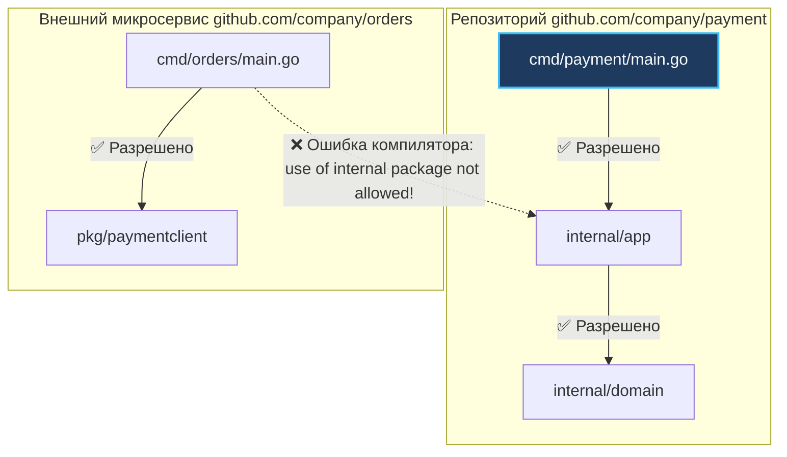
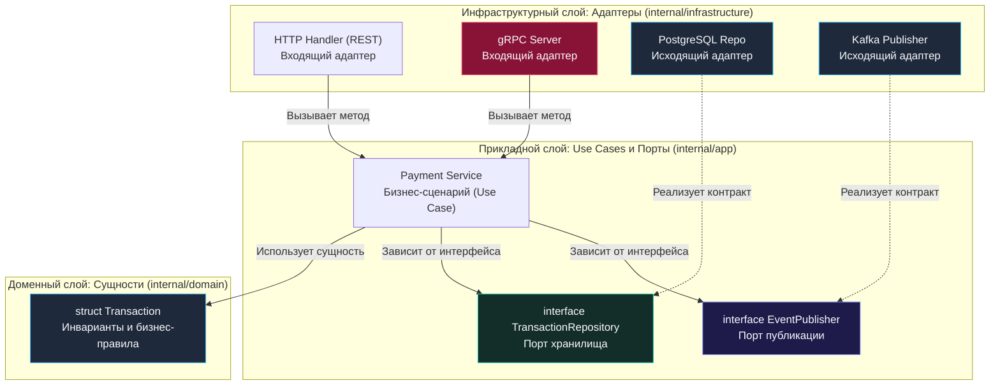
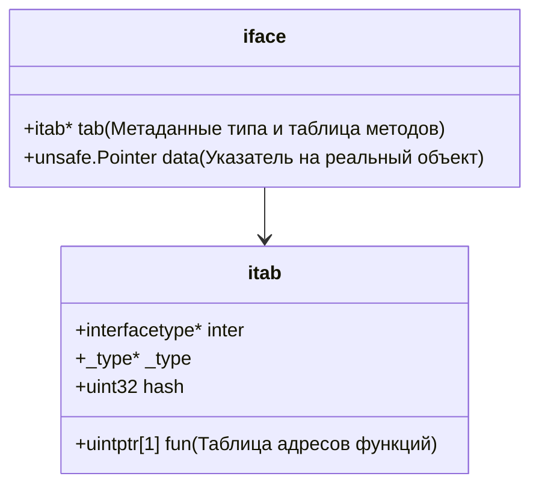

## От хаоса к порядку: Каркас надежного микросервиса

> *«Простота — это не отправная точка, это награда за понимание сущности вещей».*  
> — Брайан Керниган

Поздравляю, коллега! Мы преодолели колоссальный путь через фундаментальную теорию распределенных систем: изучили консенсус Raft, сетевой стек Linux, оркестрацию в Kubernetes и паттерны отказоустойчивости. Теперь начинается самый долгожданный раздел — **«Практика»**. Отныне мы будем проектировать и писать живой, промышленный код на Go.

Один из самых сильных психологических шоков для инженеров, приходящих в Go из экосистем Java (Spring Boot), C# (.NET Core) или PHP (Symfony/Laravel) — это **полное отсутствие навязанной структуры каталогов и фреймворков**. Go намеренно не говорит вам, в какие папки раскладывать файлы. В языке нет аннотаций, нет встроенного DI-контейнера на тяжелой рефлексии и нет обязательного «магического» ORM, диктующего структуру таблиц.

С одной стороны, такой минимализм дарит пьянящую свободу. С другой — открывает ящик Пандоры: без архитектурной дисциплины каждый разработчик начинает изобретать собственный велосипед, превращая проект через полгода активной разработки в пресловутый «большой комок грязи» (Big Ball of Mud) с циклическими зависимостями (`import cycle not allowed`) и нетестируемым кодом.

В этой вводной практической лекции мы спроектируем надежную, легко поддерживаемую структуру микросервиса на Go, основанную на принципах **Гексагональной архитектуры (Ports and Adapters)**, исследуем низкоуровневую семантику директории `internal` в компиляторе Go и разберем, как абстракции влияют на побег переменных в кучу (Escape Analysis).

---

## Standard Go Project Layout: Базовый скелет

Хотя команда создателей языка Go сознательно отказывается утверждать жесткий стандарт структуры каталогов, в глобальном Open Source сообществе сложился признанный индустриальный консенсус — [golang-standards/project-layout](https://github.com/golang-standards/project-layout). 

Для распределенных микросервисов на Go эталонный скелет проекта выглядит следующим образом:

```bash
my-microservice/
├── cmd/                        # Точки входа в приложение (main-пакеты)
│   ├── payment/                # Имя основного демона/сервиса
│   │   └── main.go             # Composition Root: чтение ENV, сборка DI, запуск
│   └── worker/                 # Вспомогательный бинарник (consumer очереди)
│       └── main.go
├── internal/                   # Приватный код: бизнес-логика и реализация
│   ├── domain/                 # Доменные сущности и чистые бизнес-правила
│   ├── app/                    # Use Cases / Сценарии и порты (интерфейсы)
│   └── infrastructure/         # Адаптеры (БД, gRPC, HTTP клиенты, Kafka)
│       ├── postgres/
│       ├── kafka/
│       └── http/
├── pkg/                        # Публичный код, разрешенный к импорту извне
│   └── paymentclient/          # Официальный Go SDK клиент к нашему сервису
├── api/                        # Protobuf-файлы, gRPC-контракты, OpenAPI спецификации
├── deployments/                # Dockerfile, Helm-чарты, Kubernetes-манифесты
├── Makefile                    # Скрипты сборки, генерации кода и линтинга
├── go.mod
└── go.sum
```

---

### Зачем нужен `cmd/`?

В реальной практике один микросервис нередко компилируется в **несколько независимых бинарников**:
- `cmd/payment/main.go` — основной синхронный HTTP/gRPC API сервер;
- `cmd/worker/main.go` — асинхронный потребитель сообщений из Kafka или RabbitMQ;
- `cmd/migrator/main.go` — утилита для накатывания миграций базы данных перед деплоем.

Все эти исполняемые файлы переиспользуют одну и ту же предметную область и инфраструктурные адаптеры из директории `internal/`, но собираются независимыми командами `go build ./cmd/payment` и упаковываются в раздельные компактные Docker-образы.

---

### Магия директории `internal/`

Многие разработчики создают папку `internal/` просто по привычке, не осознавая, что за ней стоит фундаментальный механизм безопасности.

> [!info] Под капотом: Аппаратная изоляция компилятора
> Директория `internal/` — это не соглашение программистов, а **строгое правило компилятора Go**.
> 
> Согласно спецификации языка, любой пакет, находящийся внутри директории с именем `internal`, может быть импортирован **исключительно теми пакетами, которые расположены в дереве каталогов на том же уровне или выше родителя `internal`**.
> 
> Если внешний микросервис или сторонний репозиторий попытается выполнить импорт:
> ```go
> import "github.com/company/payment/internal/domain"
> ```
> компилятор Go (`go build`) на этапе синтаксического анализа выдаст фатальную ошибку:
> ```text
> use of internal package github.com/company/payment/internal/domain not allowed
> ```
> Это обеспечивает железобетонную защиту инкапсуляции. Вы физически не сможете случайно завязать один микросервис на внутренние структуры другого сервиса в обход публичных контрактов.



---

## Гексагональная архитектура (Ports and Adapters)

Классический паттерн MVC (Model-View-Controller), пришедший из монолитных веб-фреймворков нулевых годов, пасует перед сложностью современных микросервисов. Он провоцирует размазывание бизнес-логики по SQL-запросам (Active Record) или создание монструозных контроллеров, в которых смешаны парсинг HTTP, транзакции БД и отправка писем.

В Go безусловным лидером является **Гексагональная архитектура (Ports and Adapters)**, развивающая идеи Чистой Архитектуры Роберта Мартина.

Фундаментальный закон архитектуры: **Стрелки зависимостей всегда направлены внутрь — от деталей инфраструктуры к чистой бизнес-логике.**



---

### 1. Доменный слой (`internal/domain`)

Доменный слой — это абсолютное ядро вашей системы. Здесь располагаются чистые структуры данных Go (`struct`) и методы, реализующие фундаментальные бизнес-правила и инварианты.

**Священное правило домена:** Доменный слой **не знает абсолютно ничего** об окружающем мире! В нем нет тегов `json:"..."`, нет SQL-запросов, нет импортов сторонних драйверов, HTTP или gRPC. Единственный допустимый импорт — стандартная библиотека (`errors`, `time`, `math`).

```go
package domain

import (
	"errors"
	"time"
)

var (
	ErrInsufficientFunds = errors.New("insufficient funds for transaction")
	ErrInvalidAmount     = errors.New("transaction amount must be strictly positive")
	ErrTransactionClosed = errors.New("cannot cancel already processed transaction")
)

type TransactionStatus string

const (
	StatusPending   TransactionStatus = "PENDING"
	StatusProcessed TransactionStatus = "PROCESSED"
	StatusCancelled TransactionStatus = "CANCELLED"
)

// Transaction представляет неделимую сущность транзакции
type Transaction struct {
	ID        string
	AccountID string
	Amount    int64
	Status    TransactionStatus
	CreatedAt time.Time
}

// Process инкапсулирует бизнес-правило обработки
func (t *Transaction) Process() error {
	if t.Amount <= 0 {
		return ErrInvalidAmount
	}
	if t.Status == StatusCancelled {
		return ErrTransactionClosed
	}
	t.Status = StatusProcessed
	return nil
}
```

---

### 2. Прикладной слой (`internal/app`)

Прикладной слой (Application Layer / Use Cases) оркестрирует выполнение пользовательских сценариев. Он координирует работу: загружает сущность через репозиторий, вызывает доменные методы, сохраняет результат и публикует событие во внешнюю шину.

Именно здесь объявляются **Порты (Интерфейсы)**.

> [!tip] Собеседование
> **Вопрос:** В чем заключается золотое правило Go: *«Accept interfaces, return structs»*?
> 
> **Ответ:** Это фундаментальный идиоматичный принцип языка Go.  
> В языках с номинативной типизацией (Java, C#) разработчик вынужден объявлять интерфейс рядом с его реализацией (например, класс `UserRepository` реализует интерфейс `IUserRepository` в пакете данных).  
> В Go интерфейсы удовлетворяются **неявно (структурная типизация)**: если структура имеет методы с совпадающими сигнатурами, она автоматически реализует интерфейс.  
> Поэтому интерфейс должен объявляться **потребителем** (в слое `app`), описывая минимально необходимый контракт: *«Мне для работы нужен метод Save»*. А конкретная реализация в слое адаптеров просто возвращает готовую структуру (`*TransactionRepo`).

```go
package app

import (
	"context"
	"fmt"
	"myapp/internal/domain"
)

// TransactionRepository — это порт хранилища, определенный потребителем!
type TransactionRepository interface {
	GetByID(ctx context.Context, id string) (*domain.Transaction, error)
	Save(ctx context.Context, tx *domain.Transaction) error
}

// EventPublisher — порт для отправки доменных событий
type EventPublisher interface {
	PublishTransactionProcessed(ctx context.Context, tx *domain.Transaction) error
}

// PaymentService — сценарий использования (Use Case)
type PaymentService struct {
	repo      TransactionRepository
	publisher EventPublisher
}

// NewPaymentService принимает абстракции портов (DI)
func NewPaymentService(repo TransactionRepository, pub EventPublisher) *PaymentService {
	return &PaymentService{
		repo:      repo,
		publisher: pub,
	}
}

// ExecutePayment выполняет бизнес-сценарий оплаты
func (s *PaymentService) ExecutePayment(ctx context.Context, id string) error {
	tx, err := s.repo.GetByID(ctx, id)
	if err != nil {
		return fmt.Errorf("failed to fetch transaction: %w", err)
	}

	if err := tx.Process(); err != nil {
		return err // Доменная ошибка валидации
	}

	if err := s.repo.Save(ctx, tx); err != nil {
		return fmt.Errorf("failed to persist transaction: %w", err)
	}

	if err := s.publisher.PublishTransactionProcessed(ctx, tx); err != nil {
		// Логируем предупреждение, но не ломаем транзакцию (или используем Outbox)
	}

	return nil
}
```

---

### 3. Инфраструктурный слой (`internal/infrastructure` или `internal/adapter`)

Инфраструктурный слой соединяет абстрактные порты приложения с конкретным железом, сетями и библиотеками:
- `internal/adapter/postgres` — репозиторий, исполняющий сырые SQL-запросы к PostgreSQL;
- `internal/adapter/kafka` — продюсер событий в брокер Apache Kafka;
- `internal/adapter/http` — контроллер HTTP REST, принимающий запросы от пользователей.

```go
package postgres

import (
	"context"
	"database/sql"
	"fmt"
	"myapp/internal/domain"
)

// TransactionRepo — конкретный адаптер базы данных
type TransactionRepo struct {
	db *sql.DB
}

func NewTransactionRepo(db *sql.DB) *TransactionRepo {
	return &TransactionRepo{db: db}
}

// Save реализует метод интерфейса TransactionRepository без ключевых слов implements!
func (r *TransactionRepo) Save(ctx context.Context, tx *domain.Transaction) error {
	const query = `
		INSERT INTO transactions (id, account_id, amount, status, created_at)
		VALUES ($1, $2, $3, $4, $5)
		ON CONFLICT (id) DO UPDATE 
		SET status = EXCLUDED.status;
	`
	_, err := r.db.ExecContext(ctx, query, tx.ID, tx.AccountID, tx.Amount, string(tx.Status), tx.CreatedAt)
	if err != nil {
		return fmt.Errorf("postgres error on save: %w", err)
	}
	return nil
}

func (r *TransactionRepo) GetByID(ctx context.Context, id string) (*domain.Transaction, error) {
	// Выборка из БД и маппинг в доменную структуру...
	return nil, nil
}
```

---

## Mechanical Sympathy: Интерфейсы и Escape Analysis

Интерфейсы — мощнейший инструмент архитектурного разделения. Однако каждый Senior-разработчик обязан понимать, какую цену платит процессор и сборщик мусора Go за полиморфизм.

В рантайме Go переменная интерфейса представлена внутренней структурой `iface` (размером в 2 машинных слова — 16 байт на x86-64):
1. Указатель на **`itab`** (тип данных и таблица виртуальных методов `fun`);
2. Указатель на сами данные **`data`**.



> [!warning] Ловушка / Gotcha: Налог на абстракцию и побег в кучу (Heap Escape)
> 1. **Динамическая диспетчеризация (Dynamic Dispatch):** Вызов метода через интерфейс требует разыменования указателя `itab.fun`, что лишает компилятор возможности произвести инлайнинг (Inlining) функции и требует косвенного вызова (`CALL [RAX]`), снижая эффективность предсказателя ветвлений процессора (Branch Predictor).
> 2. **Удар по Escape Analysis:** Когда вы передаете локальную структуру по указателю в метод, принимающий интерфейс, статический анализатор компилятора Go в большинстве случаев **не может доказать**, что переданные данные не сохранятся внутри скрытой реализации.
> 
> В результате компилятор перестраховывается и аллоцирует структуру не на быстром процессорном **Стеке (Stack)**, а в общей **Куче (Heap)**:
> ```text
> ./app.go:42:15: tx escapes to heap
> ```
> В 95% бизнес-кода (работа с БД, сетью) эти наносекунды и аллокации незаметны на фоне миллисекундных сетевых I/O. Но в горячих критических путях (обработка 100 000 пакетов в секунду, парсинг бинарных протоколов) чрезмерное дробление на интерфейсы вызовет шквал аллокаций и задушит сервис паузами Garbage Collector.

---

## Сборка воедино: Dependency Injection в main.go

В отличие от экосистем Java или C#, где контейнеры внедрения зависимостей используют сканирование пакетов во время старта и аннотации (вроде `@Autowired`), в Go доминирует концепция **явного внедрения зависимостей (Explicit DI)**.

Точка сборки называется **Composition Root** и располагается непосредственно в файле `cmd/payment/main.go`. Весь граф зависимостей инициализируется снизу вверх:

```go
package main

import (
	"context"
	"database/sql"
	"log/slog"
	"net/http"
	"os"
	"os/signal"
	"syscall"
	"time"

	_ "github.com/lib/pq"

	httpAdapter "myapp/internal/adapter/http"
	"myapp/internal/adapter/kafka"
	"myapp/internal/adapter/postgres"
	"myapp/internal/app"
)

func main() {
	logger := slog.New(slog.NewJSONHandler(os.Stdout, nil))
	slog.SetDefault(logger)

	// 1. Инициализация инфраструктурных драйверов
	db, err := sql.Open("postgres", os.Getenv("DATABASE_URL"))
	if err != nil {
		slog.Error("Failed to open database", "err", err)
		os.Exit(1)
	}
	defer db.Close()

	// 2. Сборка графа зависимостей (DI снизу вверх)
	// Исходящие адаптеры
	repo := postgres.NewTransactionRepo(db)
	publisher := kafka.NewEventPublisher([]string{os.Getenv("KAFKA_BROKER")})

	// Прикладной уровень (Use Cases)
	paymentService := app.NewPaymentService(repo, publisher)

	// Входящие адаптеры (Транспорт)
	paymentHandler := httpAdapter.NewPaymentHandler(paymentService)

	// 3. Запуск HTTP-сервера с поддержкой Graceful Shutdown
	mux := http.NewServeMux()
	mux.HandleFunc("POST /api/v1/payments", paymentHandler.Handle)

	srv := &http.Server{
		Addr:         ":8080",
		Handler:      mux,
		ReadTimeout:  5 * time.Second,
		WriteTimeout: 10 * time.Second,
	}

	go func() {
		slog.Info("Starting HTTP server", "addr", srv.Addr)
		if err := srv.ListenAndServe(); err != nil && err != http.ErrServerClosed {
			slog.Error("Server error", "err", err)
		}
	}()

	// Ожидание сигнала завершения
	quit := make(chan os.Signal, 1)
	signal.Notify(quit, syscall.SIGINT, syscall.SIGTERM)
	<-quit

	slog.Info("Shutting down server gracefully...")
	ctx, cancel := context.WithTimeout(context.Background(), 10*time.Second)
	defer cancel()
	_ = srv.Shutdown(ctx)
}
```

> [!tip] Автоматизация сборки графа в крупных проектах
> Если проект разрастается до сотен сервисов и адаптеров, ручная инициализация в `main.go` может занять тысячи строк кода. В таких проектах применяют инструменты:
> 1. **`google/wire` (Рекомендуется):** Генератор кода времени компиляции (Compile-time DI). Он статически анализирует зависимости и сам пишет чистый Go-код инициализации. Никакой рефлексии в рантайме, сохраняется полная скорость старта и строгая проверка типов!
> 2. **`uber-go/fx`:** DI-фреймворк времени выполнения (Runtime DI), удобный для модульных приложений с развитым жизненным циклом (Lifecycle hooks).

---

## Вопросы для собеседования

> [!tip] Собеседование
> **1. Зачем нужна директория `internal/` в Go и как она контролируется?**  
> *Ответ:* Директория `internal/` защищает закрытый код пакетов от импорта сторонними модулями. Это не соглашение, а жесткое правило компилятора Go: если пакет лежит внутри `internal`, его могут импортировать только пакеты, расположенные в том же дереве каталогов выше или на уровне родительской папки `internal`. Попытка внешнего импорта приводит к ошибке компиляции `use of internal package not allowed`.
> 
> **2. Почему в Гексагональной архитектуре интерфейсы объявляются в слое потребителя (`app`), а не в адаптерах (`infrastructure`)?**  
> *Ответ:* В соответствии с принципом инверсии зависимостей (DIP), высокоуровневая бизнес-логика не должна зависеть от деталей реализации низкоуровневых адаптеров. Благодаря утиной (структурной) типизации Go, сервис сам формулирует минимальный контракт, необходимый ему для работы (`Accept interfaces`), а адаптеры баз данных и внешних API удовлетворяют его неявно, возвращая конкретные структуры (`Return structs`). Это делает код изолированным и элементарным для модульного тестирования с моками.

---

## Резюме

1. **Standard Project Layout:** Разделяйте точки входа (`cmd/`), приватную реализацию (`internal/`) и публичные SDK (`pkg/`).
2. **`internal/` — компиляторная броня:** Используйте директорию `internal/` для защиты домена и сценариев использования от несанкционированного импорта другими сервисами.
3. **Гексагональная архитектура:** Зависимости обязаны смотреть внутрь. Домен не зависит ни от чего. Прикладной слой зависит только от домена и объявляет порты (интерфейсы). Адаптеры реализуют эти порты.
4. **Идиоматичный DI:** Применяйте явное связывание зависимостей в `main.go` (Composition Root). При разрастании графа используйте compile-time кодогенератор `google/wire`.
5. **Помните об Escape Analysis:** Интерфейсы скрывают конкретный тип от компилятора и часто приводят к побегу структур в кучу. В горячих вычислительных циклах избегайте лишних абстракций.

Мы создали стройный и надежный архитектурный каркас для одиночного микросервиса. Но в реальной компании таких сервисов создаются десятки. Рано или поздно у команд возникает непреодолимое желание вынести «общий код» (клиенты к базам, утилиты логирования, валидаторы) в единую общую библиотеку. К каким скрытым катастрофам монорепозиториев и версионирования это приводит? В следующей лекции мы разберем главный холивар индустрии: [[2. Shared libraries vs copy paste]].