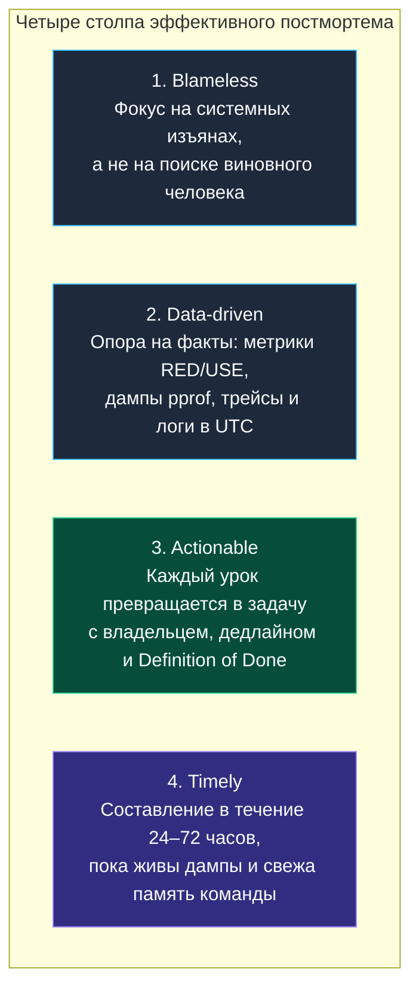
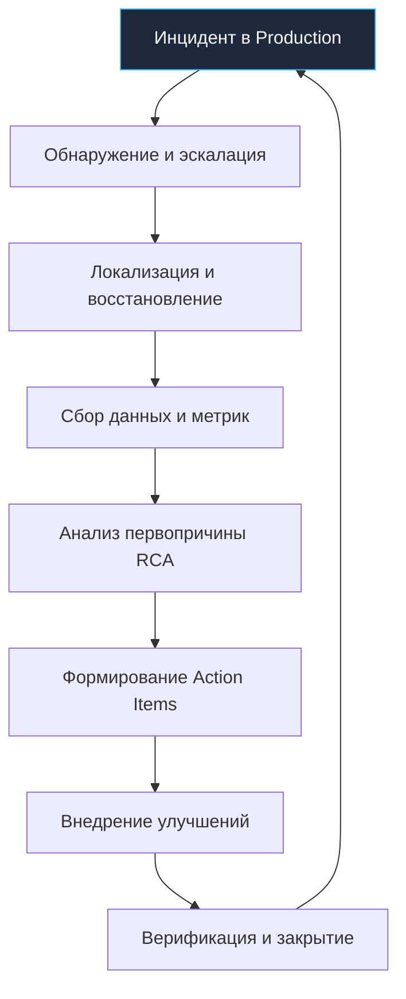

## Введение: Постмортем как инженерный артефакт

> *"Ошибки — это естественное свойство сложных систем. Единственный непростительный грех в инженерии — это совершить одну и ту же ошибку дважды, так ничему и не научившись."*  
> — Брайан Керниган

В распределенных системах абсолютная надежность недостижима по законам физики. Высокая архитектурная сложность, частичные отказы (`Partial failure`), стохастические сетевые задержки, деградация каналов и каскадные эффекты делают невозможность сбоев математической иллюзией. Зрелая инженерная культура никогда не ставит целью «написать систему, которая не упадет никогда» — это утопия. Настоящая цель профессионалов — свести к минимуму радиус поражения (blast radius), сократить время обнаружения (MTTD) и восстановления (MTTR) сервиса, а главное — **гарантировать, что ни один конкретный класс отказов не повторится в будущем**.

**Постмортем (Postmortem)**, или посмертный анализ инцидента — это структурированный, рецензируемый инженерный артефакт, фиксирующий анатомию произошедшего сбоя. Это категорически не протокол допроса и не бюрократический акт возложения вины. Постмортем — это строгий научный отчет, превращающий стресс и разрушительный хаос продакшен-аварии в фундаментальное укрепление архитектуры, рантайма и командных процессов.

В контексте распределенного бэкенда на Go постмортем неразрывно связан с глубокой наблюдаемостью (`Observability`), механикой рантайма языка (модель GMP, сборщик мусора, планировщик) и системными вызовами ядра Linux. Серьезные инциденты почти никогда не происходят из-за единственной синтаксической опечатки в коде; практически всегда авария — это коварный синергетический резонанс:
$$\text{Невинная аллокация в цикле} \longrightarrow \text{Всплеск GC} \longrightarrow \text{Mark Assist} \longrightarrow \text{Задержки gRPC} \longrightarrow \text{Таймауты} \longrightarrow \text{Шторм повторов (Retries)} \longrightarrow \text{Каскадный коллапс}$$

---

## Фундаментальные принципы и культура

Классический инженерный постмортем опирается на четыре незыблемых столпа. Нарушение хотя бы одного из них мгновенно превращает разбор полетов в токсичную охоту на ведьм или формальную бумажную отписку.



1. **Blameless (Без поиска виноватых):**  
   Внимание исследователей смещается с наивного вопроса «*Кто допустил ошибку?*» на системный вопрос «*Почему архитектура и процессы позволили единичному действию человека сломать продакшен?*».  
   Если инженер боится дисциплинарных взысканий, увольнения или публичного стыда, он инстинктивно попытается скрыть улики: подчистит логи, умолчит о подозрительных симптомах или свалит вину на смежные команды. В экосистеме Go это смерти подобно: утечки памяти, зависания планировщика (`goroutine leaks`, `deadlocks`, `GC stalls`) требуют честного, бесстрашного признания просчетов и совместного поиска истины.

2. **Data-driven (Опора на объективные данные):**  
   Любые догадки («*нам показалось, что база тормозила*») безжалостно отсекаются. Анализ оперирует точными метриками: временем обнаружения (MTTD), временем восстановления (MTTR), миллисекундными таймлайнами, распределенными спанами, дампами профилей памяти и стеками вызовов.

3. **Actionable (Практическая направленность):**  
   Каждый вывод и извлеченный урок обязан материализоваться в виде конкретного тикета в трекере задач с четкими критериями готовности (Definition of Done).  
   - *Плохая формулировка:* «Улучшить мониторинг платежей».  
   - *Инженерная формулировка:* «Добавить метрику `http_request_duration_bucket` для хэндлера `/charge`, настроить алерт в Prometheus на p99 > 200ms на 5-минутном интервале и внедрить fallback на резервный шлюз».

4. **Timely (Своевременность):**  
   Черновик постмортема создается горячим по следам — в течение 1–3 рабочих дней после ликвидации инцидента. В этот период память участников еще свежа, а подробные метрики и дампы не успели вымыться политиками ротации логов и retention-периодами Prometheus/Loki.

> [!warning] Ловушка / Gotcha
> **Культура vs Процесс:** Принцип Blameless ни в коем случае не означает безответственность или инфантилизм. Он означает, что ответственность возлагается на *систему и инженерные барьеры*, а не на стрелочника. Если одна и та же ошибка происходит в пятый раз подряд, виноват не программист, снова нажавший не ту кнопку, а архитектурный процесс, который не сделал неверное действие невозможным на программном уровне.

---

## Структура и методология анализа

Качественный постмортем оформляется по строгой структуре. Это защищает команду от когнитивных искажений — таких как «ошибка выжившего» или «предвзятость подтверждения» (confirmation bias).



### 1. Таймлайн инцидента (Timeline)

Точнейшая поминутная реконструкция хронологии событий в едином часовом поясе (строго UTC). Принципиально важно разделять критические контрольные точки:
- **First Trigger (Первичный триггер):** момент совершения деструктивного действия (например, вкат деплоя в 14:02:15 UTC или падение коммутатора в дата-центре).
- **Degradation Start (Начало деградации):** когда система впервые отклонилась от нормы (рост очереди в 14:04:00 UTC).
- **Detection (Момент обнаружения):** когда автоматика зафиксировала аномалию и пейджер разбудил дежурного инженера (алерт сработал в 14:06:30 UTC).
- **Response Start (Начало активного вмешательства):** когда инженер подтвердил получение инцидента (ACK в 14:08:00 UTC).
- **Recovery (Восстановление сервиса):** когда трафик стабилизировался и SLO вернулось в зеленую зону (откат завершен в 14:18:00 UTC).

### 2. Оценка воздействия (Impact)

Объективная математическая и бизнесовая оценка масштаба разрушений:
- Сколько процентов пользовательских запросов завершилось с ошибками (5xx)?
- Сколько транзакций было потеряно или зависло в неопределенном состоянии?
- Каков процент исчерпания месячного бюджета ошибок (Error Budget) в рамках соглашений SLA/SLO?
- Каковы прямые финансовые потери (в валюте) или репутационные издержки?

### 3. Анализ первопричины (Root Cause Analysis, RCA)

Поиск системного ядра сбоя с помощью признанных инженерных методологий:
- **Метод «5 почему» (5 Whys):** последовательное углубление в причинно-следственные связи до выявления фундаментальной бреши в архитектуре или защитных механизмах.
- **Дерево отказов (Fault Tree Analysis):** визуализация логических связей («И» / «ИЛИ») между независимыми компонентами, приведшими к аварии.
- **Диаграмма Исикавы («Рыбья кость»):** группировка предпосылок по категориям: Код, Конфигурация, Сеть, Внешние зависимости, Окружение (ОС/железо), Человеческий фактор.

### 4. Действия и улучшения (Action Items)

План инженерных работ строго разделяется на две категории:
- **Краткосрочные действия (Short-term / Mitigations):** быстрые хотфиксы, локальные заплатки, временное увеличение ресурсов контейнеров или расширение лимитов соединений, позволяющие системе безопасно жить прямо сейчас.
- **Долгосрочные действия (Long-term / Preventative):** глубокий архитектурный рефакторинг, внедрение Circuit Breaker, изменение политики квотирования ресурсов, добавление канареечных релизов и хаос-тестирования в CI/CD пайплайн.

---

## Под капотом: Сбор данных и Go-рантайм

В распределенных микросервисах на Go аварии нередко мимикрируют под «баги облачной сети» или «зависания операционной системы». Однако истинный виновник практически всегда кроется во внутреннем устройстве рантайма Go. Опытный бэкенд-инженер обязан уметь виртуозно собирать и анализировать артефакты рантайма.

### 1. Panic и Stack Traces

В языке Go неперехваченная паника (`panic`) завершает текущую горутину. Если паника произошла в незащищенной горутине, она сносит весь процесс целиком, провоцируя аварийный перезапуск контейнера и отдавая клиентам статус `502 Bad Gateway` от внешнего Ingress-прокси.

Для предотвращения падения процессов на уровне HTTP/gRPC middleware традиционно используют `recover()`:

```go
func SafeRecoveryMiddleware(next http.Handler) http.Handler {
    return http.HandlerFunc(func(w http.ResponseWriter, r *http.Request) {
        defer func() {
            if err := recover(); err != nil {
                // Извлекаем стек вызовов упавшей горутины
                stackBuf := make([]byte, 4096)
                n := runtime.Stack(stackBuf, false)
                
                slog.Error("CRITICAL: Panic caught in HTTP handler",
                    slog.Any("error", err),
                    slog.String("stack", string(stackBuf[:n])),
                    slog.String("path", r.URL.Path),
                )
                
                http.Error(w, http.StatusText(http.StatusInternalServerError), http.StatusInternalServerError)
            }
        }()
        next.ServeHTTP(w, r)
    })
}
```

Обратите внимание на вызов `runtime.Stack`: передача флага `all = false` собирает трассировку стека **только текущей горутины**.

```go
func main() {
    // Демонстрация наивного глобального recovery:
    defer func() {
        if r := recover(); r != nil {
            // runtime.Stack(true) собирает стек ВСЕХ существующих горутин процесса!
            stack := runtime.Stack(true)
            log.Printf("PANIC recovered: %v\nStack:\n%s", r, stack)
            // Важно: никогда не пытайтесь продолжать нормальное выполнение
            // процесса без валидации целостности глобального состояния!
        }
    }()
    // ... основная логика инициализации сервиса
}
```

> [!info] Под капотом
> Вызов `runtime.Stack(true)` (с флагом `all = true`) принудительно останавливает весь мир (`stopTheWorld("runtime.Stack")`). Планировщик переводит рантайм в режим STW, блокирует сборщик мусора и замораживает исполнение всех горутин на время полного обхода их стековых фреймов!  
> Если в высоконагруженном production-сервисе с 50 000 активных горутин обработчик паники вызовет `runtime.Stack(true)`, процесс намертво зависнет на сотни миллисекунд или даже секунд. Для боевой эксплуатации используйте `runtime.Stack(false)`, а общую картину анализируйте через профилировщик `pprof` и структурированные логи.

### 2. Goroutine Leaks и Scheduler Deadlocks

Утечки горутин — бич конкурентных сервисов на Go. Заблокированная на чтении из пустого канала или на вечном системном вызове горутина удерживает свой стек (от 2 КБ до гигабайтов при глубокой рекурсии) и ссылки на связанные структуры данных в куче.

Следствия лавинообразного роста горутин:
- Катастрофическое увеличение RSS-памяти процесса (деградация до OOM Killer);
- Непомерная нагрузка на логические процессоры `P` планировщика Go (модель GMP) и шедулер ОС;
- Деградация производительности при значении `GOMAXPROCS`, несоответствующем реальным квотам процессора.

Диагностика в реальном времени осуществляется через эндпоинт `pprof/goroutine`:

```bash
# Получение текстового дампа активных горутин с группировкой по точкам ожидания:
go tool pprof -top http://service:6060/debug/pprof/goroutine?debug=1
```

Вывод команды немедленно покажет, сколько тысяч горутин прямо сейчас скопились в конкретной функции ожидания канала `chan receive` или блокировки `sync.Mutex.Lock`.

### 3. GC Pauses и Memory Pressure

В распределенных Go-приложениях тайм-ауты в межсервисных взаимодействиях очень часто порождаются фазами `Stop-The-World` (STW) и содействием сборке мусора (`mark assist`). 

Если алгоритм непрерывно плодит временные объекты в горячем цикле обработки запросов:
- Механизм **Escape Analysis** (анализ побега) компилятора выталкивает переменные из стека в кучу (escape to heap);
- Куча мгновенно разрастается, достигая лимита, рассчитанного целевым коэффициентом `GOGC` (по умолчанию `GOGC=100`, что означает запуск GC при 100% росте кучи);
- При наличии переменной `GOMEMLIMIT` рантайм стремится не допустить выхода за пределы памяти, запуская GC непрерывно и отнимая такты у рабочих горутин (GC Thrashing);
- Корреляция графиков `go_gc_duration_seconds` и `go_memstats_alloc_bytes` с задержками ответов четко указывает на узкое место в аллокациях.

### 4. Correlation ID и Distributed Tracing

В современном микросервисном ландшафте одиночный клик пользователя порождает паутину из десятков вложенных вызовов через HTTP, gRPC и брокеры сообщений (Kafka, RabbitMQ). 

Пытаться составить постмортем без сквозного идентификатора трассировки — всё равно что расследовать крушение самолета без данных «черного ящика».

```go
// Идентификатор запроса передается через context.Context и HTTP-заголовки
type contextKey string

const correlationIDKey contextKey = "correlation_id"

// WithCorrelationID помещает Correlation ID в контекст запроса
func WithCorrelationID(ctx context.Context, id string) context.Context {
    return context.WithValue(ctx, correlationIDKey, id)
}

// GetCorrelationID безопасно извлекает Correlation ID из контекста
func GetCorrelationID(ctx context.Context) string {
    if v, ok := ctx.Value(correlationIDKey).(string); ok {
        return v
    }
    return ""
}
```

Во время постмортема дежурный инженер фильтрует распределенные логи по значению `correlation_id` (или сквозному `trace_id`), безошибочно реконструируя точный маршрут движения пакета сквозь очереди Kafka, реплики PostgreSQL и микросервисы.

---

## Инструментарий и автоматизация

Ручной сбор улик во время бушующей аварии обречен на провал. Инфраструктура сбора артефактов должна функционировать непрерывно и в автоматическом режиме:

1. **Структурированное логирование:**  
   Обязательное использование современного пакета `slog` (стандарт Go 1.21+) с едиными полями метаданных: `level`, `msg`, `correlation_id`, `service_name`, `trace_id`. Никаких неструктурированных текстовых строк через `fmt.Println`!
2. **OpenTelemetry и трассировка:**  
   Сквозная инструментация протоколов. Каждая входящая и исходящая операция автоматически оборачивается в трассировочный интервал (`span`), несущий статус и метаданные.
3. **Единый стек наблюдаемости:**  
   Связка Prometheus (сбор метрик), Grafana (дашборды), Grafana Loki / ELK (централизованные логи), Jaeger / Tempo (распределенные трейсы).
4. **Автоматический сбор посмертных дампов:**  
   Настройка скриптов, которые по срабатыванию критического алерта снимают дампы `pprof` (heap, goroutine, threadcreate, profile, block), дампы памяти ядра Linux (`core` dumps), а также экспортируют слепок конфигурации и распределенного консенсуса (`etcd` / `Consul`).

> [!tip] Собеседование
> **Вопрос:** На собеседовании вас спрашивают: «В продакшене у сервиса на Go процессор загружен на 100%, но пропускная способность (QPS) упала практически до нуля. Как вы локализуете проблему?»  
> **Ответ:**  
> Я действую по строгому диагностическому алгоритму:  
> 1. Немедленно сниму дамп профилирования CPU (`pprof/profile`) и снимок горутин (`pprof/goroutine`).  
> 2. Если в `pprof/profile` горит один участок кода без системных вызовов — мы столкнулись с **busy waiting** (активным ожиданием) или бесконечным циклом, в котором забыли вызвать `runtime.Gosched()` либо не учли условие выхода.  
> 3. Если время сжигается в функциях `runtime.gcDrain` или `runtime.markroot` — это **GC thrashing** (сборщик мусора пожирает все ядра в попытках удержать память). Проверяю метрики `go_gc_duration_seconds` и `go_memstats_alloc_bytes`.  
> 4. Если горутины массово висят в системных вызовах (`syscall contention`), таких как `epoll_wait` или `accept4` — использую профили `pprof/threadcreate` или `block` profile, чтобы оценить конкуренцию за системные дескрипторы.  
> 5. В критических ситуациях для быстрой диагностики в логах можно временно включить переменную рантайма `GODEBUG=gctrace=1` (с осторожностью, чтобы не залить диск логами) либо перехватить `pprof` дамп на живом поде до его перезапуска.

---

## Культура и процесс (Blameless)

Любые совершенные технические инструменты рассыплются в прах, если в инженерной команде отсутствует здоровая культура открытости и безопасности:

- **Инцидент-ретроспектива:** Встреча команды проводится в течение 24–48 часов после ликвидации аварии. В ней принимают участие дежурные инженеры, авторы измененного кода, SRE-специалисты и системные архитекторы. Разговор ведется исключительно на языке данных, таймлайнов и архитектурных концепций.
- **Трекинг задач (Action Items Tracking):** Каждый пункт постмортема оформляется как первоклассная задача в трекере (Jira, Linear, GitHub Issues). Назначается конкретный исполнитель и срок. Если Action Items оседают мертвым грузом в бэклоге — организация обречена на повторение инцидента.
- **Chaos Engineering как проверка гипотез:** Инциденты становятся отличным топливом для учений по отказоустойчивости. Если постмортем показал, что сервис сложился из-за задержек внешней платежной системы, инженерная группа разворачивает утилиты вроде `chaos-mesh` или `Toxiproxy` на нагрузочном стенде и моделирует аналогичную сетевую деградацию, чтобы убедиться: внедренный Circuit Breaker действительно защищает систему.
- **Постмортем как долговечная база знаний:** Каждая статья постмортема должна быть кристально ясной и автономной. Инженер, который придет в компанию через два года, прочитав постмортем, должен сразу понять архитектурный контекст сбоя, глубинные причины принятых решений и механизмы защиты.

---

## Итог и переход к следующей статье

- Постмортем — это не свидетельство поражения команды, а главный катализатор инженерной эволюции распределенной системы.
- Надежный анализ всегда базируется на четырех принципах: отсутствие поиска виноватых (Blameless), опора на проверяемые метрики (Data-driven), четкая ориентация на предотвращение (Actionable) и оперативность проведения (Timely).
- Расследование в Go требует глубокого понимания рантайма: влияния вызовов `runtime.Stack(true)` на STW-паузы, диагностики утечек горутин через `pprof/goroutine`, выявления марк-ассиста GC и сквозной передачи `correlation_id`.
- Только системное закрытие Action Items и подтверждение стабильности методами Chaos Engineering гарантируют, что пережитая авария сделала платформу по-настоящему несокрушимой.

На этом мы завершаем фундаментальный практический подраздел **«Практика распределенных систем»** ([[1. Graceful Shutdown]] — [[10. Постмортемы]]). Мы прошли путь от низкоуровневой механики завершения процессов и тонкостей CI/CD до распределенной трассировки и хладнокровного управления инцидентами. Впереди нас ждет завершающий подраздел модуля — **«Паттерны распределенных систем»**, где мы обобщим накопленный практический опыт в виде канонических архитектурных шаблонов проектирования.