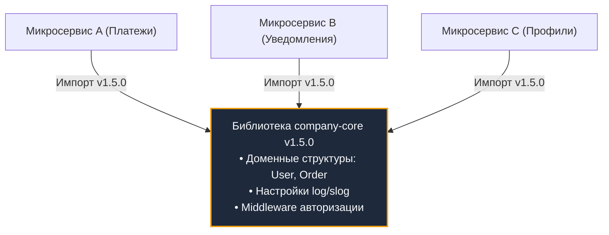
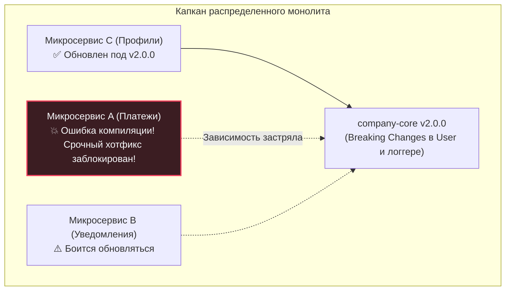
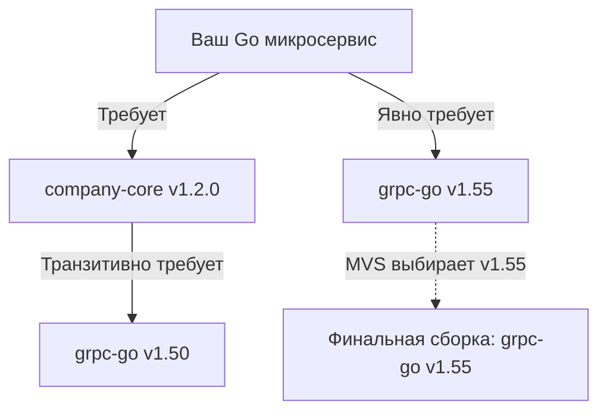
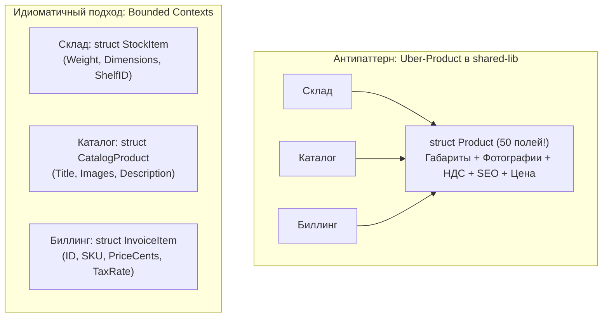

## Цена независимости: Меньше DRY, больше автономности

> *«Небольшое копирование лучше, чем небольшая зависимость».*  
> — Роб Пайк, Go Proverbs

Когда разработчики с солидным багажом классической enterprise-разработки (Java, C#, Ruby) приходят в архитектуру распределенных систем на Go, у них срабатывает глубоко укоренившийся рефлекс **DRY (Don't Repeat Yourself — «Не повторяйся»)**. 

Стоит инженеру заметить в трех разных микросервисах похожие структуры данных `User` или идентичные функции парсинга токена в заголовке `Authorization`, как в его голове загорается сигнал тревоги: *«Дублирование кода! Это неаккуратно! Нужно срочно навести порядок!»*. Немедленно создается общий git-репозиторий с гордым именем `company-core` (или `shared-lib`, `common`, `platform-go`). В него бережно складываются все общие структуры, обертки над базами данных, утилиты логирования и middleware. А затем эта общая библиотека директивой `require` в файле `go.mod` жестко привязывается ко всем микросервисам компании.

В эту самую секунду распределенная микросервисная архитектура тихо умирает. На свет появляется худший кошмар системного инженера — **Распределенный монолит (Distributed Monolith)**.

В этой лекции мы разберем, почему копирование небольших фрагментов кода в мире Go — это не грех, а осознанная архитектурная необходимость, как общие библиотеки взрывают граф зависимостей через механизм MVS, чем опасны функции `init()` и как концепция Bounded Context спасает автономию инженерных команд.

---

## Иллюзия переиспользования и Распределенный монолит

Главная и единственная причина, оправдывающая переход от простого монолита к микросервисам — это **независимость развертывания (Independent Deployability)** и организационная автономия команд. Команда сервиса `A` обязана иметь возможность выкатить релиз в боевой кластер в любой момент времени, не согласуя свои действия с командой сервиса `B` и не дожидаясь релиза сервиса `C`.

Что происходит на практике, когда в инфраструктуру внедряется тяжелая библиотека `company-core`?



Представьте жизненный сценарий:
1. Команде сервиса `C` (Профили пользователей) потребовалось добавить новое поле в модель `User` и изменить сигнатуру метода в общем логгере.
2. Они коммитят изменения в `company-core` и публикуют релиз **`company-core v2.0.0`** с ломающими обратную совместимость изменениями (Breaking Changes).
3. На следующий день в сервисе `A` (Платежи) обнаруживается критическая уязвимость безопасности. Чтобы применить патч из библиотеки `company-core`, разработчики сервиса `A` **вынуждены** подтянуть версию `v2.0.0`.
4. Но проект сервиса `A` не компилируется! Компилятор Go требует переписать половину кода сервиса под новые сигнатуры методов логгера и новую модель `User`, которые сервису платежей даром не нужны.



В этот момент автономия команд испаряется. Релизы становятся синхронными: чтобы обновить один компонент, инженеры вынуждены собирать совещания, тестировать весь зоопарк сервисов и координировать выкатки. 

Вы получили **все недостатки монолита** (жесткая связность, каскадные поломки при сборке) и одновременно **все недостатки распределенных систем** (сетевой оверхед, сериализация JSON/Protobuf, частичные отказы и сложные сетевые сбои).

---

## Mechanical Sympathy: Под капотом общих библиотек

Помимо организационного паралича, раздутые общие библиотеки создают серьезные технические аномалии на уровне компилятора и рантайма Go.

### 1. Угроза функций init()

В языке Go существует специальная функция **`init()`**, которая не принимает аргументов, не возвращает значений и исполняется рантаймом автоматически в момент загрузки пакета **строго до старта функции `main`**.

В крупных «универсальных» библиотеках `company-core` разработчики часто поддаются соблазну использовать `init()` для скрытой автоматической регистрации: подключение SQL-драйверов, регистрация метрик Prometheus или инициализация глобальных конфигураций.

```go
// Пакет внутри company-core/database/postgres:
package postgres

import (
	"database/sql"
	_ "github.com/lib/pq" // Функция init() регистрирует драйвер 'postgres'
)

func init() {
	// Скрытая магия: регистрация глобальных счетчиков
}
```

> [!warning] Ловушка / Gotcha: Невидимый балласт в бинарнике
> Предположим, вашему микросервису из библиотеки `company-core` нужен был всего один безобидный пакет — `company-core/logger`.
> Но если внутри репозитория `company-core` пакет `logger` прямо или косвенно импортирует соседний пакет `database` (например, чтобы логировать ошибки подключения к БД), компилятор Go подключит этот код в финальный исполняемый файл.
> 
> В результате ваш легковесный сервис, который вообще не работает с базами данных (например, чистый stateless роутер), при старте начнет выполнять функции `init()` драйвера `github.com/lib/pq`. Это увеличивает размер бинарного файла на десятки мегабайт, раздувает потребление RSS памяти и затягивает время холодного запуска контейнера при масштабировании в Kubernetes.

---

### 2. MVS (Minimal Version Selection)

Для разрешения графа зависимостей менеджер пакетов Go Modules использует детерминированный алгоритм Расса Кокса — **MVS (Minimal Version Selection — Выбор минимальной версии)**.

В отличие от пакетных менеджеров других языков (npm, pip, cargo), которые стремятся установить самую свежую совместимую версию (SemVer Max), Go выбирает **минимальную версию из всех, явно запрошенных в дереве зависимостей**.



Но если библиотека `company-core` тянет за собой десятки сторонних зависимостей (AWS SDK, Kafka Sarama, Redis client, gRPC), возникает классический **Dependency Hell (Ад зависимостей)**:
- Любое неаккуратное обновление транзитивной библиотеки внутри `company-core` способно сломать типы данных в вашем микросервисе.
- Попытка изолированно обновить безопасность уязвимого пакета превращается в войну с файлом `go.mod`.

> [!important] Железное правило создания Go-библиотек
> Настоящая reusable-библиотека на Go должна иметь **ноль сторонних внешних зависимостей**!  
> В ее файле `go.mod` не должно быть ничего, кроме стандартной библиотеки Go. Если библиотеке требуются сетевые клиенты или базы данных, они должны передаваться извне через интерфейсы.

---

## Bounded Context: Почему копипаст структур — это норма

Главный психологический барьер разработчиков формулируется вопросом: *«Неужели мне нужно объявлять структуру `User` или `Product` в каждом сервисе заново? Это же чистый копипаст!»*.

Ответ современной программной инженерии: **Да, именно так!**

> [!tip] Собеседование
> **Вопрос:** В интернет-магазине есть сущность `Product` (Товар). Следует ли вынести структуру `Product` в библиотеку `common`, чтобы все 15 микросервисов использовали единое описание модели?
> 
> **Ответ (уровень Staff / Principal):** Категорически нет. Это грубейшее нарушение принципа **Bounded Context (Ограниченный контекст)** методологии Domain-Driven Design (DDD).
> 
> В реальном бизнесе не существует абстрактного «Товара вообще»:
> 1. В сервисе **«Склад» (Warehouse)** товар — это габариты в миллиметрах, вес брутто в граммах, класс опасности и номер стеллажа.
> 2. В сервисе **«Каталог» (Catalog)** товар — это массив ссылок на фотографии, форматированное HTML-описание, рейтинг и дерево категорий.
> 3. В сервисе **«Биллинг» (Billing)** товар — это только `ID`, артикул (SKU), ставка НДС и цена в копейках.
> 
> Попытка создать одну глобальную структуру **`Uber-Product`** с 50 полями в общей библиотеке не решает проблему, а создает катастрофу связности. Изменение типа поля в каталоге приведет к пересборке биллинга и склада.



В соответствии с правилами чистой архитектуры (см. [[1. Структура микросервисного проекта на Go]]), каждый микросервис объявляет в своем пакете `internal/domain` собственную структуру. Да, в них совпадут базовые поля `ID` и `Name`. Но это совпадение случайно — у этих полей разные владельцы, разные жизненные циклы и разные темпы изменений (см. подробнее: [[2. Границы сервисов]]).

---

## Что МОЖНО и НУЖНО выносить в общие библиотеки?

Означает ли это, что общие библиотеки запрещены полностью? Разумеется, нет. Выносить в модули следует код, обладающий **высокой технической связностью и абсолютно нулевой бизнес-логикой**.

### 1. Сгенерированные SDK и контракты API
Когда сервис `A` предоставляет gRPC или REST API, он обязан предоставить потребителям готовый клиент.  
Идеальный подход — **автоматическая кодогенерация из формальных контрактов** (Protocol Buffers или OpenAPI спецификаций). Сгенерированный код складывается в отдельный легковесный репозиторий (например, `github.com/company/payment-api-go`).  
Потребители импортируют только тонкий SDK клиента. В нем нет бизнес-логики сервиса, только сетевой транспорт и структуры запросов/ответов.

### 2. Чистые функции и криптография (Pure Functions)
Функции, которые детерминированно преобразуют входные аргументы в результат и не имеют побочных эффектов:
- Кастомный алгоритм вычисления контрольной суммы или хеширования паролей;
- Специфичная для компании математика округления финансовых сумм;
- Валидаторы стандартизированных номеров (номера паспортов, налоговые идентификаторы).

### 3. Инфраструктурные обертки (с осторожностью)
Допускается создание корпоративного пакета `platform-go`, стандартизирующего интеграцию с OpenTelemetry или `log/slog`. Но эта библиотека обязана быть предельно тонкой и не скрывать нативные интерфейсы за самодельными сложными фасадами:

```go
// ✅ ПРАВИЛЬНО: Тонкая обертка возвращает стандартный интерфейс OTel
package telemetry

import "go.opentelemetry.io/otel/trace"

func InitTracer(serviceName string) (trace.TracerProvider, error) {
    // Единая настройка OTLP экспортера по стандартам компании
    return provider, nil
}
```

```go
// ❌ АНТИПАТТЕРН: Собственный велосипед, блокирующий экосистему
package companycore

// Скрыли стандартный OTel за самодельным типом, сломав совместимость
func StartSpan(name string) MyCustomSpan { ... }
```

---

## Копипаст (Deduplication via Copy-Paste)

Когда вы пишете новый микросервис на Go и вам требуется вспомогательная функция для извлечения Bearer-токена из заголовка `Authorization` или простая middleware для логирования задержки HTTP-хендлера:

1. **Не создавайте библиотеку немедленно.** 
2. **Скопируйте 25 строк проверенного кода** из соседнего репозитория. В Go эти функции лаконичны, понятны и не требуют поддержки.
3. Соблюдайте **«Правило трех» (Rule of Three)**:
   - *Первый раз:* пишите код по месту.
   - *Второй раз:* скопируйте код без зазрения совести.
   - *Третий раз:* только если абсолютно идентичный фрагмент кода потребовался в третий раз, и вы на 100% уверены, что исправление бага в этом алгоритме обязано происходить синхронно во всех местах — только тогда инвестируйте время в создание выделенного, тщательно протестированного утилитарного пакета.

---

## Вопросы для собеседования

> [!tip] Собеседование
> **1. В чем главная опасность концепции DRY при переходе к микросервисной архитектуре?**  
> *Ответ:* Догматичное следование DRY приводит к созданию общих библиотек (`common`/`core`), куда выносятся доменные сущности и инфраструктурный код. Это связывает независимые микросервисы общим графом зависимостей и версионированием, порождая Распределенный монолит: изменение одной сущности требует согласованного обновления и деплоя десятков сервисов, убивая их автономность.
> 
> **2. Как функции `init()` в разделяемых библиотеках могут навредить микросервису на Go?**  
> *Ответ:* Функции `init()` выполняются рантаймом Go автоматически до старта `main`. Если общая библиотека содержит пакеты с неявными `init()` (например, регистрация SQL-драйверов, парсинг конфигураций, аллокация глобальных структур), они будут принудительно включены компилятором в бинарник любого сервиса, импортирующего библиотеку. Это приводит к раздуванию размера файла, скрытым сайд-эффектам, утечкам памяти и замедлению холодного старта приложения.

---

## Резюме

1. **Меньше DRY, больше независимости:** Копирование 30 строк простого кода лучше, чем создание тяжелой разделяемой библиотеки, связывающей релизные циклы команд.
2. **Изоляция доменных моделей:** Никогда не выносите доменные сущности (`User`, `Order`) в общие модули. Модель должна принадлежать своему Bounded Context.
3. **MVS и чистые библиотеки:** Внешние библиотеки обязаны иметь минимальное количество сторонних зависимостей (в идеале — 0), чтобы исключить конфликты версий в Go Modules.
4. **Кодогенерация API:** Для взаимодействия между сервисами используйте генерацию клиентских SDK из формальных спецификаций (Protobuf / OpenAPI), а не рукописные общие пакеты.
5. **Правило трех:** Прежде чем абстрагировать и выносить код в библиотеку, позвольте ему проявиться как минимум в трех независимых местах.

Мы разобрались с границами переиспользования кода и модульной изоляцией. Но как теперь физически организовать хранение сотен микросервисов в системе контроля версий? Создавать ли отдельный Git-репозиторий под каждый сервис (Polyrepo), или сложить всю кодовую базу компании в единый гигантский монорепозиторий (Monorepo), как это делают Google и Uber? В следующей лекции мы детально исследуем эту инженерную дилемму: [[3. Monorepo vs polyrepo]].