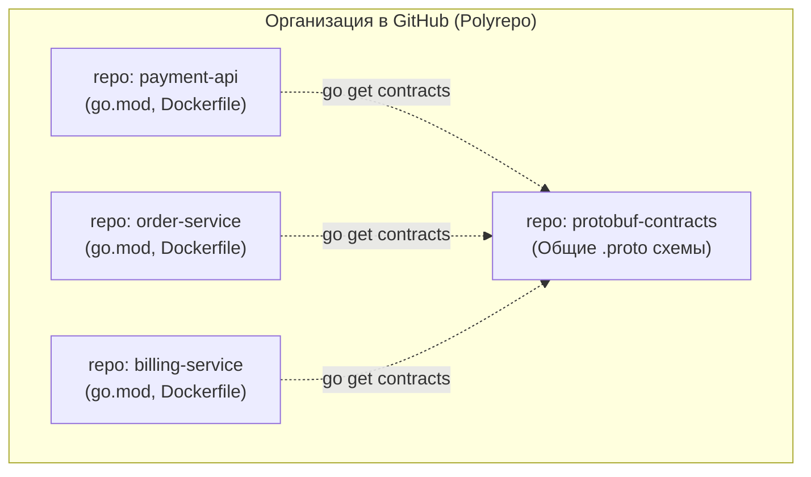
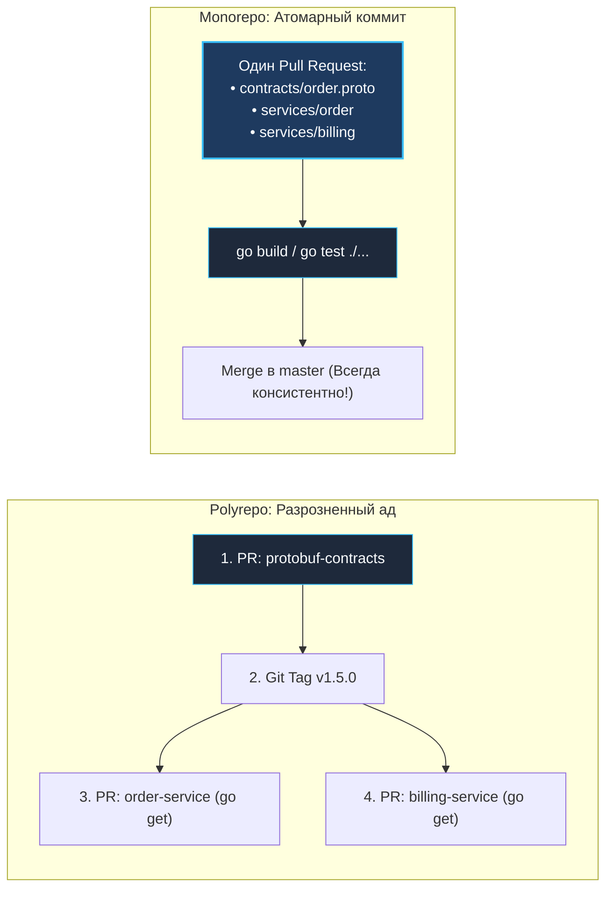

## Где живет ваш код: Эпическая битва репозиториев

> *«Архитектура программного обеспечения начинается не с диаграмм компонентов, а с того, как исходный код организован на диске и как инженеры взаимодействуют с системой контроля версий».*  
> — Принцип инфраструктурной ясности

В предыдущих лекциях мы спроектировали идеальный гексагональный каркас микросервиса ([[1. Структура микросервисного проекта на Go]]) и договорились избегать токсичных разделяемых библиотек, разрушающих независимость команд ([[2. Shared libraries vs copy paste]]). 

Но теперь перед нами встает фундаментальный организационно-инфраструктурный вопрос: **где физически будет жить исходный код нашей системы?**

Представьте, что в компании разрабатывается 50 микросервисов. Исторически индустрия разделилась на два непримиримых лагеря:
1. **Polyrepo (Multirepo):** «Много репозиториев» — один микросервис = один независимый Git-репозиторий.
2. **Monorepo:** «Единый репозиторий» — весь исходный код компании (все микросервисы, общие контракты, утилиты и инфраструктурные манифесты) хранится в одном общем Git-дереве.

Для инженера на Go этот выбор — не просто вопрос вкуса или привычки работы с `git push`. Он фундаментально влияет на то, как компилятор Go разрешает транзитивные зависимости, как работает языковой сервер `gopls` в вашей IDE, как устроены модули `go.mod` и насколько быстро система способна компилироваться при масштабировании.

В этой лекции мы беспристрастно взвесим плюсы и минусы обоих подходов, исследуем эволюцию мультимодульности в Go и разберем архитектурную киллер-фичу современных версий языка — **Go Workspaces (`go.work`)**.

---

## Polyrepo: Иллюзия полной независимости

Подход **Polyrepo (или Multirepo)** — это естественный выбор по умолчанию для большинства стартапов и молодых команд. Вы создаете новый микросервис `payment-api` — вы нажимаете кнопку «New Repository» на GitHub или GitLab.



### Плюсы подхода

1. **Жесткие границы команд (Закон Конвея):**  
   Каждая команда является полновластным хозяином своего репозитория. Разработчик из команды «Платежи» (команда `A`) физически не может случайно задеть или сломать код команды «Каталог» (команда `B`).
2. **Гранулярный контроль доступа (RBAC):**  
   Компания может тонко раздавать права: подрядчикам доступен только репозиторий внешнего шлюза, а доступ к финансовому ядру открыт лишь узкому кругу проверенных сотрудников.
3. **Предельно простой CI/CD:**  
   Пайплайны прямолинейны и изолированы: коммит в репозиторий `payment-api` запускает сборку и тесты ровно одного этого сервиса. Никакой магии с вычислением графа затронутых компонентов.

---

### Фатальный недостаток: Dependency Hell (Ад зависимостей)

Однако идиллия независимости заканчивается в ту же секунду, когда сервисам требуется взаимодействовать друг с другом по сети через формальные контракты (gRPC / Protocol Buffers).

Представьте стандартную бизнес-задачу: бизнесу потребовалось добавить промокоды. Для этого нужно ввести новое поле `discount_code` в контракт **`Order.proto`**.

**Круги ада в модели Polyrepo:**
1. **Шаг 1:** Разработчик открывает репозиторий контрактов `protobuf-contracts`. Добавляет строчку в `.proto` файл. Создает Pull Request (PR 1), ждет аппрувов от архитекторов, вливает в ветку `master`.
2. **Шаг 2:** Релизится новая версия контрактов в Git: вешается git tag `v1.5.0`.
3. **Шаг 3:** Разработчик переходит в репозиторий `order-service`. Выполняет команду `go get github.com/company/protobuf-contracts@v1.5.0`. Обновляет код сервиса заказов для сериализации нового поля. Создает PR 2, проходит CI/CD, вливает в `master`.
4. **Шаг 4:** Разработчик идет в репозиторий `billing-service` (который вычитывает эти заказы). Снова выполняет `go get`, обновляет зависимости, адаптирует код биллинга. Создает PR 3, проходит ревью, вливает в `master`.

Это классический **Diamond Dependency Problem (Проблема ромбовидных зависимостей)**. Чтобы выкатить одну крошечную фичу, затрагивающую смежные сервисы, инженер обязан открыть три разных Pull Request в три независимых репозитория в строгой хронологической последовательности!

А если на шаге 4 выяснится, что в контракте `Order.proto` была допущена концептуальная ошибка в типе поля? Весь этот бюрократический ритуал приходится повторять заново. Скорость инженерной разработки и поставки фич (Time-to-Market) падает до нуля.

---

## Monorepo: Все яйца в одной корзине (правильно сложенные)

**Monorepo** — это архитектурный подход, принятый на вооружение технологическими титанами мировой индустрии (Google, Meta, Uber, Yandex). Весь исходный код бэкенд-сервисов, разделяемых контрактов, утилит и конфигураций хранится в **едином Git-репозитории**.

> [!warning] Ловушка / Gotcha: Монорепо != Монолит
> Один из самых частых и досадных провалов на сеньорных собеседованиях — знак равенства между Monorepo и Монолитом.
> 
> Запомните фундаментальное различие:
> - **Monorepo** — это паттерн **хранения исходного кода** (Repository Layout).
> - **Монолит** — это паттерн **развертывания и топологии рантайма** (Deployment Topology).
> 
> В одном монорепозитории может благополучно сосуществовать 200 абсолютно автономных, слабосвязанных микросервисов. Каждый из них собирается в собственный компактный Docker-образ и деплоится в независимые неймспейсы Kubernetes по собственному расписанию!

---

### Главное преимущество: Атомарные коммиты

Вернемся к нашей задаче с добавлением поля `discount_code`.

В монорепозитории разработчик решает эту задачу в рамках **ОДНОГО атомарного Pull Request**:
1. Редактирует контракт `contracts/order.proto`.
2. Запускает генератор кода: файлы обновляются локально в том же дереве.
3. Добавляет поддержку промокодов в `services/order`.
4. Обновляет логику чтения в `services/billing`.
5. Отправляет единый PR на ревью.



**Mechanical Sympathy компилятора:**  
В монорепозитории вся мощь компилятора Go встает на защиту архитектуры. Стоит запустить команду `go test ./...` в корне, как компилятор мгновенно проанализирует граф связей и скажет:  
*«Ты обновил контракт заказа, но забыл инициализировать новое поле в `billing-service` в файле handler.go:42!»*.

Вы получаете обратную связь от компилятора за доли секунды прямо на своем ноутбуке. Ветка `master` всегда остается **100% консистентной**: ситуация, когда сервис и клиент используют несовместимые версии API, становится невозможной физически.

---

## Go под капотом: Как правильно готовить Monorepo

Долгое время экосистема Go Modules не была оптимизирована под монорепозитории. Разберем тернистый путь эволюции подходов к управлению зависимостями.

### Подход 1: Один глобальный `go.mod`
Файл `go.mod` размещается в корне репозитория, определяя единый список зависимостей для всех 50 микросервисов:
- *Плюсы:* Никаких конфликтов версий внутри компании, один `go.sum`.
- *Минусы:* Версионный тупик. Если сервису `payment-api` для интеграции с новым облачным SDK требуется обновить фреймворк `gin` или библиотеку `grpc`, это изменение принудительно обновит `gin` и `grpc` во всех остальных 49 сервисах компании! Релиз блокируется, так как апгрейд ломает старый код в других отделах.

---

### Подход 2: `go.mod` на каждый сервис (Мультимодульность)
Каждый микросервис живет в своей директории и имеет персональный файл `go.mod`:

```bash
monorepo/
├── contracts/
│   └── go.mod          # github.com/company/mono/contracts
├── services/
│   ├── order/
│   │   └── go.mod      # Зависит от contracts
│   └── billing/
│       └── go.mod      # Зависит от contracts
```

Но как сервису `order` локально ссылаться на изменения в модуле `contracts`, если эти изменения еще не закоммичены и не запушены на GitHub?

**Темные времена (до Go 1.18): Костыли с директивой `replace`**  
Разработчикам приходилось прописывать в `go.mod` сервиса локальный путь:
```text
replace github.com/company/mono/contracts => ../../contracts
```
Это была бесконечная головная боль: разработчики забывали удалить `replace` перед коммитом, локальные пути ноутбуков утекали в репозиторий, а удаленный сервер CI/CD падал с ошибкой разрешения путей.

---

### Светлое будущее: Go Workspaces (`go.work`)

Начиная с версии Go 1.18, появился официальный, элегантный механизм управления мультимодульными проектами — **Go Workspaces**.

В корень монорепозитория помещается файл **`go.work`**:

```go
go 1.22

use (
	./contracts
	./services/order
	./services/billing
)
```

Директива **`use`** сообщает тулингу Go, какие локальные модули объединены в единое рабочее пространство.

> [!info] Под капотом: Механика gopls и go.work
> Файл `go.work` обычно добавляется в локальный `.gitignore` разработчика (либо коммитится как базовый шаблон рабочего пространства).
> 
> Когда компилятор Go (`go build`, `go test`) или языковой сервер (`gopls` в вашей IDE — VS Code, GoLand, Neovim) обнаруживают файл `go.work`, происходит следующее:
> 1. Они **полностью игнорируют сеть** и не пытаются скачивать модули, перечисленные в блоке `use`.
> 2. В оперативной памяти строится **единое сквозное дерево абстрактного синтаксиса (AST)**, связывающее все модули воедино.
> 
> Это означает, что вы можете изменить сигнатуру метода в `./contracts`, и автодополнение кода в `./services/order` подхватит изменение в ту же миллисекунду! При этом сами файлы `go.mod` остаются абсолютно чистыми: никаких токсичных директив `replace`.

---

## Архитектурные ловушки Monorepo

Если монорепозиторий столь удобен, почему не все компании используют его? Потому что за монорепо приходится платить ощутимый «инфраструктурный налог».

### 1. Долгий CI/CD и вычисление изменений (Affected Targets)
В Polyrepo вы пушите коммит в один репозиторий, и CI собирает один бинарник за 30 секунд.  
Если в Monorepo вы настроите наивный CI, который при каждом пуше компилирует все 50 сервисов и прогоняет 15 000 тестов, каждый пайплайн будет длиться по 45 минут, блокируя всю команду.

*Решение:* Инфраструктурная команда обязана настроить **умный CI (Smart Change Detection)**. Скрипты пайплайна анализируют затронутые файлы через Git:
```bash
git diff --name-only origin/master...HEAD
```
Если изменения затронули только директорию `services/order`, CI запускает сборку и тестирование **исключительно** для сервиса `order`. Если же изменился контракт в `contracts/`, CI вычисляет граф зависимостей и запускает тесты всех зависимых потребителей.

### 2. Кэш сборки (Build Cache)
В сверхкрупных монорепозиториях (Google, Uber) для ускорения компиляции разворачивают специализированные распределенные системы сборки — **Bazel** или **Please**, которые кэшируют артефакты компиляции на удаленных серверах.

Однако для Go-разработчиков в проектах малого и среднего масштаба (до сотни сервисов) тяжелый Bazel избыточен. Стандартный компилятор Go оснащен превосходным встроенным кэшем **`GOCACHE`** (Content-Addressable Cache). При грамотном пробросе кэша компилятора в CI-раннеры сборка сервисов на Go занимает считанные секунды без сторонних монструозных фреймворков.

### 3. Отсутствие дисциплины (The Big Ball of Mud)
В монорепозитории у разработчиков возникает соблазн нарушить архитектурную изоляцию: если сервис `order` лежит на соседней ветке каталога, почему бы просто не импортировать приватную функцию из `billing`?

*Решение:* Строжайшее соблюдение границ Bounded Context и использование защитных механизмов компилятора Go:
- Приватный код каждого микросервиса обязан быть заперт внутри директории **`internal/`** (см. [[1. Структура микросервисного проекта на Go]]).
- На уровне CI настраиваются архитектурные линтеры (например, `go-cleanarch` или правила `golangci-lint`), запрещающие перекрестные импорты между независимыми сервисами.

---

## Вопросы для собеседования

> [!tip] Собеседование
> **1. В чем принципиальная разница между терминами Monorepo и Monolith?**  
> *Ответ:* Monorepo определяет стратегию хранения исходного кода в системе контроля версий (все сервисы лежат в одном Git-репозитории). Monolith описывает архитектуру развертывания системы (все компоненты скомпилированы в единый неделимый процесс, использующий единую базу данных). В монорепозитории можно успешно разрабатывать распределенную микросервисную систему, где каждый сервис деплоится в кластер совершенно автономно.
> 
> **2. Как работает механизм Go Workspaces (`go.work`) и какую проблему он решил?**  
> *Ответ:* До Go 1.18 для локальной разработки нескольких связанных модулей приходилось временно прописывать директивы `replace` в файлах `go.mod`, что нередко приводило к случайным коммитам локальных путей в Git. Файл `go.work` объединяет модули через директиву `use`, указывая компилятору и языковому серверу `gopls` строить единое синтаксическое дерево зависимостей в памяти без изменения файлов `go.mod` и без скачивания пакетов из внешней сети.

---

## Резюме

1. **Polyrepo:** Дает надежную изоляцию кода и простой CI, но парализует разработку при межсервисных изменениях контрактов (Diamond Dependency Hell).
2. **Monorepo:** Обеспечивает атомарные изменения: вы обновляете контракт и всех его потребителей в одном Pull Request, а компилятор Go гарантирует консистентность всей распределенной системы.
3. **Go Workspaces (`go.work`):** Стандарт де-факто для локальной разработки мультимодульных монорепозиториев на Go. Забудьте о директиве `replace` навсегда.
4. **Инфраструктурный налог Monorepo:** Монорепозиторий требует продуманного CI/CD с селективным запуском тестов (`git diff --name-only`) и контролем архитектурных границ с помощью директории `internal/`.

Мы выбрали структуру хранения кода и организовали удобное рабочее пространство с помощью `go.work`. Но теперь перед нами встает следующая практическая задача: как превратить этот исходный код в работающие production-контейнеры? Как настроить быстрый, надежный и безопасный конвейер непрерывной интеграции и доставки в Kubernetes? В следующей лекции мы детально разберем: [[4. CI_CD для микросервисов]].