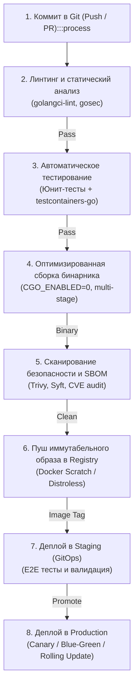

## Архитектура пайплайна и Go-специфика

> *«Если процесс сборки и развертывания нельзя запустить одной командой и воспроизвести на любой машине за секунды, значит, ваш процесс не автоматизирован — он просто замаскирован».*  
> — Брайан Керниган

В современной распределенной архитектуре CI/CD (Continuous Integration / Continuous Delivery — непрерывная интеграция и доставка) перестает быть просто утилитарным набором скриптов автоматизации. Это центральная нервная система всей инженерной организации. Каждый микросервис обязан собираться, всесторонне тестироваться, упаковываться в безопасный контейнер и развертываться изолированно от других, гарантируя строгую воспроизводимость, нулевой даунтайм и криптографическую целостность артефактов.

Здесь язык Go раскрывает свои фундаментальные преимущества перед динамическими языками (Python, PHP, Ruby) и тяжелыми средами исполнения JVM (.NET, Java):
- **Чистая статическая компиляция:** на выходе получается одиночный автономный исполняемый файл без внешних разделяемых библиотек (`.so`/`.dll`);
- **Абсолютная независимость от хоста:** контейнеру не нужны предустановленные тяжелые JRE, Node.js рантаймы или интерпретаторы;
- **Молниеносный компилятор и встроенный фреймворк тестирования:** `go test` исполняется на порядки быстрее аналогов;
- **Детерминированный менеджер зависимостей:** связка `go.mod` и `go.sum` исключает расхождения в версиях сторонних библиотек.

Однако эти колоссальные преимущества требуют от инженера глубокого понимания механики кеширования компилятора, нюансов Cgo, кросс-компиляции под разные процессорные архитектуры и защиты цепочки поставок (Supply Chain Security).

Типичный промышленный конвейер CI/CD для микросервиса на Go строится вокруг строгой последовательности детерминированных фаз:



---

### Управление модулями и кеширование зависимостей

Для обеспечения детерминированной и воспроизводимой сборки Go использует два ключевых файла: `go.mod` (декларация прямых и транзитивных зависимостей) и `go.sum` (криптографические контрольные суммы каждого загруженного пакета).

В распределенной CI-среде неграмотная настройка кеша приводит к катастрофическому замедлению пайплайнов: при каждом коммите раннер начинает заново выкачивать сотни мегабайт сторонних модулей с публичного прокси `proxy.golang.org` или внутреннего Artifactory/Nexus. Под пиковой нагрузкой это чревато сетевыми таймаутами и сбоями сборки.

В отличие от экосистем вроде `npm` или `pip`, где зависимости традиционно скачиваются в локальные папки внутри рабочей директории проекта (`node_modules`), инструмент `go` сохраняет скачанные модули в глобальном системном каталоге — **`$GOPATH/pkg/mod`**, а результаты компиляции пакетов — в **`~/.cache/go-build`**.

В современных контейнерных CI-раннерах (GitHub Actions, GitLab CI, Jenkins) оба этих каталога необходимо явно сохранять в кеш между запусками:

```yaml
# Пример эффективной конфигурации кеша в GitHub Actions
- name: Set up Go
  uses: actions/setup-go@v5
  with:
    go-version: '1.22'
    cache: false # Отключаем дефолтный кеш для тонкого ручного контроля

- name: Restore Go modules & Build Cache
  uses: actions/cache@v4
  with:
    path: |
      ~/go/pkg/mod
      ~/.cache/go-build
    key: ${{ runner.os }}-go-${{ hashFiles('**/go.sum') }}-${{ hashFiles('**/*.go') }}
    restore-keys: |
      ${{ runner.os }}-go-${{ hashFiles('**/go.sum') }}-
      ${{ runner.os }}-go-
```

> [!info] Под капотом
> Когда утилита `go mod download` извлекает сторонний пакет, она выполняет строгую криптографическую валидацию. 
> Рантайм Go рассчитывает хеш содержимого каждого файла архива, сверяет его со строкой в `go.sum`, а также проверяет подлинность через глобальную базу данных контрольных сумм `sum.golang.org`. 
> На диске в каталоге `go/pkg/mod` файлы защищаются атрибутом Read-Only (права доступа 0444), исключая случайную или намеренную модификацию чужого исходного кода в процессе локальной разработки или сборки. Если вы используете рабочие пространства `go work`, модули линкуются локально через жесткие ссылки (hardlinks) без сетевых накладных расходов.

---

### Линтинг и статический анализ

Стандартом де-факто для статического анализа в мире Go является **`golangci-lint`**. Это не просто отдельный линтер, а высокопроизводительный оркестратор, агрегирующий десятки специализированных анализаторов (`staticcheck`, `govet`, `govulncheck`, `misspell`, `errcheck`, `gosec`, `bodyclose`, `noctx`, `ineffassign`, `unconvert`, `unused`) и исполняющий их параллельно с эффективным переиспользованием общего дерева синтаксического анализа (AST).

```yaml
# .golangci.yml — каноническая конфигурация для микросервиса
run:
  concurrency: 4
  timeout: 5m
  issues-exit-code: 1

linters:
  disable-all: true
  enable:
    - staticcheck # Фундаментальные проверки багов и стиля от создателей Go
    - govet       # Официальный анализатор Go (тени переменных, несовпадение printf)
    - errcheck    # Контроль обязательной обработки возвращаемых ошибок
    - gosec       # Поиск уязвимостей безопасности (SQL инъекции, слабые ключи)
    - bodyclose   # Проверка закрытия resp.Body.Close() для предотвращения утечек TCP
    - noctx       # Запрет отправки HTTP-запросов без context.Context
    - unconvert   # Удаление избыточных приведений типов
    - unused      # Поиск мертвого кода, неиспользуемых полей и функций
    - ineffassign # Детекция бесполезных повторных присваиваний
    - misspell    # Исправление опечаток в комментариях и именах идентификаторов
```

> [!warning] Ловушка / Gotcha: Опасность отключения линтеров ради скорости
> Никогда не отключайте анализаторы `errcheck`, `noctx` и `govet` ради экономии пары секунд на CI!  
> В высоконагруженных распределенных системах потерянный `context.Context` или проигнорированная ошибка вызова сетевого клиента приводят к «тихим» катастрофам (Silent Failures): горутины зависают навсегда, соединения в пуле базы данных исчерпываются, а локальный микросбой вызывает каскадную перегрузку всего кластера.

---

## Оптимизация сборки и Docker-образы

Статическая компиляция Go в корне меняет правила создания контейнеров. В отличие от сред Java (где контейнер обязан содержать тяжелый JVM JDK/JRE) или Python/Node.js (где в образ упаковываются тысячи файлов зависимостей), Go-образ может содержать **ровно один скомпилированный бинарный файл**.

Это сокращает размер итогового Docker-образа с сотен мегабайт до 15–25 МБ, сокращает время скачивания слоев по сети (`docker pull`) до сотен миллисекунд и радикально сокращает поверхность атаки (Attack Surface).

---

### Multistage-сборка и выбор базового образа

Устаревший подход — использовать базовые образы вроде `ubuntu` или собирать проект на базе дистрибутива `golang:1.22-alpine` без глубокого понимания особенностей C-рантайма. Дистрибутив Alpine опирается на альтернативную библиотеку языка C — **`musl libc`**, в то время как стандартный инструментарий компилятора Go оптимизирован под **`glibc`**. 

Если попытаться скомпилировать бинарник с включенным Cgo (`CGO_ENABLED=1`) без явного указания кросс-компилятора `CC=musl-gcc`, то при попытке запуска контейнера в среде Alpine вы получите фатальный сбой ядра:
```text
standard_init_linux.go:228: exec user process caused: no such file or directory
(или аварийный segmentation fault из-за несовместимости динамических символов libc)
```

**Золотой стандарт современной Cloud Native индустрии:**  
Двухстадийная сборка (Multi-stage Build) с отключением Cgo (`CGO_ENABLED=0`) и развертыванием в минималистичный образ **`distroless`** (от Google) или абсолютно пустой образ **`scratch`**.

```dockerfile
# ------------------------------------------------------------------------------
# Стадия 1: Сборка и компиляция (Builder Stage)
# ------------------------------------------------------------------------------
FROM golang:1.22-alpine AS builder

WORKDIR /app

# Эффективное кеширование слоев Docker:
# Сначала копируем только манифесты зависимостей!
COPY go.mod go.sum ./
RUN go mod download

# Копируем остальной исходный код только после успешного скачивания библиотек
COPY . .

# Сборка статического бинарника:
# CGO_ENABLED=0 отключает зависимость от glibc/musl (чистая статическая линковка).
# -ldflags="-s -w" вырезает отладочные символы DWARF и таблицу символов (минус 30-40% размера).
RUN CGO_ENABLED=0 GOOS=linux GOARCH=amd64 \
    go build -ldflags="-s -w" -o /server ./cmd/payment

# ------------------------------------------------------------------------------
# Стадия 2: Финальный продакшен-образ (Minimal Runtime)
# ------------------------------------------------------------------------------
FROM gcr.io/distroless/static-debian12:nonroot

WORKDIR /

# Копируем единственный бинарник из стадии сборки
COPY --from=builder /server /server

# Запуск под непривилегированным пользователем (Non-root security)
USER nonroot:nonroot

EXPOSE 8080

ENTRYPOINT ["/server"]
```

> [!tip] Собеседование
> **Вопрос:** Почему контейнеры на базе `scratch` или `distroless` стартуют в Kubernetes быстрее, чем образы на базе `ubuntu` или `alpine`?
> 
> **Ответ:** Образ `scratch` физически пуст — в нем нет файлов операционной системы. При создании контейнера ядро Linux не инициализирует разделяемые библиотеки `glibc`, не запускает динамический компоновщик **`ld.so`**, не создает виртуальные структуры каталогов типа `/dev` или `/proc` (если они не примонтированы явно). 
> 
> Системный вызов **`execve`** мгновенно передает управление точке входа бинарника Go, минуя сотни скрытых системных вызовов настройки окружения ОС. Это сокращает холодный старт (Cold Start Latency) на 30–50%, что критично при автоскалировании HPA во время пиковых нагрузок.

---

### Кросс-компиляция и атомарность артефактов

В современных распределенных системах кластеры часто комплектуются гетерогенными процессорными архитектурами: стандартными узлами x86-64 (`amd64`) и энергоэффективными ARM-серверами (`arm64`, например, AWS Graviton или Apple Silicon).

Компилятор Go обладает непревзойденной встроенной поддержкой кросс-компиляции: ему не нужны тяжелые кросс-тулчейны. Достаточно передать переменные окружения `GOOS` и `GOARCH`.

Для автоматизации сборки и упаковки мультиплатформенных артефактов используют инструмент **`goreleaser`** или декларативные цели в `Makefile`:

```makefile
# Пример кросс-компиляции через make
.PHONY: build-all
build-all:
	@for os in linux darwin windows; do \
		for arch in amd64 arm64; do \
			echo "Building $$os/$$arch..."; \
			GOOS=$$os GOARCH=$$arch CGO_ENABLED=0 \
			go build -ldflags="-s -w" -o dist/server-$$os-$$arch ./cmd/payment; \
		done; \
	done
```

Инструмент `goreleaser` берет на себя формирование Docker-манифестов для мульти-архитектурных образов (Multi-arch Manifest Lists), автоматическую генерацию changelog и публикацию релизов в GitHub/GitLab.

---

## Стратегии деплоя и надежность

Процесс выкатки нового бинарника в боевой кластер должен происходить незаметно для пользователей, опираясь на встроенные примитивы оркестрации.

### Health Checks и Rolling Updates

Kubernetes управляет доступностью пода с помощью двух базовых зондов: **`liveness`** (жив ли процесс) и **`readiness`** (готов ли под обрабатывать реальный входящий трафик).

В стандартной библиотеке Go начиная с версии 1.21 связка метода **`http.Server.Shutdown()`** и таймаутов `context.Context` позволяет организовать безупречный Graceful Shutdown.

```go
package health

import (
	"context"
	"database/sql"
	"net/http"
	"time"
)

type Checker struct {
	db *sql.DB
}

func NewChecker(db *sql.DB) *Checker {
	return &Checker{db: db}
}

// RegisterRoutes настраивает маршруты healthcheck
func (c *Checker) RegisterRoutes(mux *http.NewServeMux) {
	// Liveness: проверяет только факт того, что сервер живет и не завис в deadlock
	mux.HandleFunc("GET /healthz", func(w http.ResponseWriter, r *http.Request) {
		w.WriteHeader(http.StatusOK)
		_, _ = w.Write([]byte("OK"))
	})

	// Readiness: глубокая проверка готовности обслуживать клиентов
	mux.HandleFunc("GET /readyz", func(w http.ResponseWriter, r *http.Request) {
		ctx, cancel := context.WithTimeout(r.Context(), 2*time.Second)
		defer cancel()

		// Проверяем жива ли база данных!
		if err := c.db.PingContext(ctx); err != nil {
			http.Error(w, "Database unavailable", http.StatusServiceUnavailable)
			return
		}

		w.WriteHeader(http.StatusOK)
		_, _ = w.Write([]byte("READY"))
	})
}
```

> [!warning] Ловушка / Gotcha: Примитивные проверки /healthz
> Распространенная ошибка — использовать один и тот же эндпоинт `/healthz` и для liveness, и для readiness, возвращая статический `200 OK`.  
> Если ваш Go-сервис жив, но потерял сетевое подключение к PostgreSQL, Kubernetes продолжит считать Pod готовым и будет перенаправлять в него реальный пользовательский трафик. Это создает черную дыру с ошибками `HTTP 500`.  
> **Правило:** Проверка `readiness` обязана валидировать работоспособность критических зависимостей (база данных, кэш, брокеры сообщений).

---

### Blue/Green и Canary деплои

В условиях многотысячного RPS даже классический **`Rolling Update`** может вызывать всплески ошибок из-за рассинхронизации версий контрактов и кэшей. Для минимизации радиуса поражения применяют продвинутые стратегии доставки:
- **Blue/Green (Синий/Зеленый деплой):** В кластере поднимается полностью независимое окружение новой версии (Green). После прохождения синтетических тестов балансировщик (Ingress/Service) мгновенно переключает 100% трафика на новую версию. В случае аномалий откат происходит за одну миллисекунду обратным переключением селектора.
- **Canary (Канареечный релиз):** На новую версию направляется лишь малая доля реального трафика (1–5%). Специализированные контроллеры (Flagger, Argo Rollouts) анализируют метрики Prometheus (процент ошибок, P99 Latency). Если метрики остаются в пределах SLA, трафик плавно наращивается: 10% $\to$ 25% $\to$ 50% $\to$ 100%.

---

## Безопасность и Supply Chain

В микросервисной архитектуре безопасность конвейера сборки (Supply Chain Security) становится критически важным рубежом защиты.

### SBOM и сканирование уязвимостей

Каждый собранный артефакт обязан сопровождаться спецификацией компонентов — **SBOM (Software Bill of Materials)**.
1. Утилита **`syft`** анализирует Docker-образ и формирует полный каталог включенных библиотек и пакетов в формате SPDX или CycloneDX.
2. Сканеры **`trivy`** или **`grype`** сопоставляют компоненты с глобальными базами данных известных уязвимостей (CVE).
3. Инструмент **`gosec`** сканирует исходный код Go на предмет небезопасных паттернов: использования устаревших алгоритмов хеширования (`md5` вместо `sha256`), форматирования строк через `fmt.Printf` с непроверенным пользовательским вводом (риск инъекций), или жестко захардкоженных токенов.

```bash
# Генерация SBOM и проверка уязвимостей перед публикацией образа
syft my-service:latest -o json > sbom.json
trivy image --severity HIGH,CRITICAL --exit-code 1 my-service:latest
```

> [!info] Под капотом
> При проверке образа сканер `trivy` распаковывает слои контейнера и находит встроенные манифесты `go.sum` и `go.mod`. 
> Поскольку Go использует криптографические контрольные суммы SHA-256, подменить бинарники модулей незаметно невозможно. 
> Однако особую опасность представляют уязвимости в базовых библиотеках расширения стандартного пакета (например, уязвимости HTTP/2 парсинга в `golang.org/x/net`). Сканирование SBOM в CI предотвращает выпуск образов с известными дырами безопасности в продакшен.

---

### Управление секретами

Критическое правило безопасности: **Никогда не храните пароли, приватные ключи или токены внутри Docker-образов, в файлах репозитория через директиву `go:embed` или в статических переменных окружения Dockerfile!**

В производственных кластерах секреты доставляются динамически:
- **Kubernetes Secrets:** хранятся в `etcd` в зашифрованном виде (Encryption at Rest);
- **HashiCorp Vault & External Secrets Operator:** секреты инжектируются в Pod в момент запуска через специализированные сайдкары (`vault-agent`) или синхронизируются из облачных хранилищ (AWS Secrets Manager, GCP Secret Manager).

В коде на Go чтение параметров конфигурации выполняется через `os.Getenv()` или пакеты управления конфигурацией с обязательной проверкой наличия ключа и немедленной остановкой сервиса (Fail Fast) при отсутствии обязательных параметров.

---

## Ловушки и вопросы на собеседованиях

> [!tip] Собеседование
> **Вопрос: Каковы ключевые методы оптимизации CI/CD пайплайна на Go, который начал замедляться при росте кодовой базы?**
> 
> **Ответ:**  
> 1. **Параллелизация тестирования:** Флаги `go test -p=4` (или `-p=8`) запускают тестирование независимых пакетов параллельно на всех ядрах раннера.
> 2. **Инкрементальная компиляция и кэш:** Обязательное кеширование папок `go/pkg/mod` и `~/.cache/go-build`. Никогда не используйте форсированную пересборку `go build -a=false` без крайней необходимости.
> 3. **Кеширование слоев Docker:** Разделение инструкций: сначала `COPY go.mod go.sum ./` и `go mod download`, и лишь затем `COPY . .`. Это предотвращает инвалидацию слоя зависимостей при редактировании `.go` файлов.
> 4. **Изоляция интеграционных тестов:** Использование библиотеки **`testcontainers-go`**, поднимающей реальные экземпляры баз данных и брокеров в изолированных эфемерных Docker-контейнерах со случайными свободными портами. Это полностью устраняет «мигающие» (flaky) тесты, зависящие от общего глобального состояния.
> 5. **Профилирование тестов:** Запуск `go test -count=1 -benchmem` и бенчмарков с профилированием `pprof` для обнаружения утечек памяти и скрытых деградаций производительности еще на этапе Pull Request.

> [!warning] Ловушка / Gotcha: Атака Dependency Confusion
> Если в вашей компании используются закрытые внутренние модули (например, репозиторий `gitlab.com/internal/pkg`), но в конфигурации окружения CI не настроена переменная **`GOPRIVATE`**, утилита `go get` попытается запросить контрольные суммы этого пакета на публичном сервере `proxy.golang.org`.
> 
> Злоумышленник может зарегистрировать в публичном реестре пакет с точно таким же именем, но более высокой версией, содержащий вредоносный код. Чтобы исключить подобные атаки:
> 1. Всегда экспортируйте переменную `GOPRIVATE="gitlab.com/internal/*"`.
> 2. Для критических сервисов применяйте режим вендоринга зависимостей через **`go mod vendor`**.
> 3. Подписывайте коммиты и релизы криптографическими сигнатурами с помощью **`gitsign`** и Cosign/Sigstore.

---

## Резюме

1. **Статическая компиляция — суперсила Go:** Микросервисы на Go идеально подходят для контейнеризации, упаковываясь в минималистичные и безопасные образы (`scratch` / `distroless`) без сторонних зависимостей.
2. **Двухуровневый кэш CI:** Для ускорения сборки кэшируйте каталог модулей `go/pkg/mod` и кэш сборщика `~/.cache/go-build`.
3. **Бескомпромиссный линтинг:** Оркестратор `golangci-lint` со строгими правилами `errcheck`, `noctx` и `gosec` защищает код от скрытых утечек памяти и зависаний горутин.
4. **Осознанные Health Checks:** Разделяйте проверки `/healthz` (liveness) и `/readyz` (readiness с глубокой валидацией доступности СУБД и брокеров).
5. **Supply Chain Security:** Сканируйте образы на уязвимости через `trivy`, генерируйте SBOM через `syft` и защищайте приватные модули переменной `GOPRIVATE`.

Конвейер CI/CD настроен, образы собраны, протестированы и безопасно развернуты в кластере. Но теперь сотни этих изолированных сервисов начинают обрабатывать миллионы пользовательских транзакций в секунду. Если в этой огромной распределенной паутине возникнет сбой, как найти его первопричину? Как связать терабайты разрозненных сообщений в единую картину? В следующей лекции мы детально исследуем: [[5. Логирование в распределенных системах]].