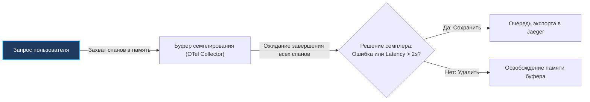

## Введение: От логов к трассировке

> *«Логи показывают, что произошло в одной точке. Метрики показывают, насколько часто это происходит. Но только трассировка связывает разрозненные точки в единую осмысленную линию времени».*  
> — Брайан Керниган

В эпоху классического монолита расследование инцидентов казалось прямолинейным: при возникновении паники или сбоя инженер получал единый стек вызовов (Stack Trace) внутри одного процесса операционной системы. 

В современной распределенной архитектуре пользовательский клик по кнопке «Оплатить заказ» инициирует сложнейшую цепочку вызовов, проходящую через десятки микросервисов, написанных на разных языках, развернутых в разных контейнерах и взаимодействующих по гетерогенным протоколам (HTTP REST, gRPC, очереди Kafka, кэши Redis).

Структурированные логи (`[[Логирование в распределенных системах]]`) дают изолированные срезы событий внутри одного процесса. Агрегированные метрики (`[[Метрики и мониторинг]]`) показывают усредненную статистику (RPS, P99 Latency). Но ни один из этих инструментов не способен ответить на главный практический вопрос: **как именно прошел конкретный запрос от мобильного приложения через 10 сервисов до коммита в базе данных и обратно, и на каком конкретно этапе мы потеряли 4.8 секунды?**

Решением этой фундаментальной проблемы стал **распределенный трейсинг (Distributed Tracing)**, зародившийся в стенах Google с исследовательской статьи о системе Dapper (2010 г.). В современной индустрии Cloud Native открытый стандарт **OpenTelemetry (OTel)** объединил и заменил исторические наработки `Zipkin` и `Jaeger` SDK, став универсальным стандартом сбора телеметрии.

> [!info] Под капотом
> Трейсинг не является встроенной или скрытой низкоуровневой функцией рантайма Go. Это программная пользовательская надстройка, которая:
> 1. Генерирует и транслирует уникальные сетевые идентификаторы (TraceID/SpanID) через дерево `context.Context`.
> 2. Аллоцирует легковесные структуры спанов в куче (Heap).
> 3. Собирает атрибуты и асинхронно отправляет батчи телеметрии на коллектор через сетевые `syscalls` (gRPC/HTTP).
> Понимание этих этапов критично для предотвращения утечек памяти и блокировок в высоконагруженных Go-сервисах.

---

## Фундаментальные концепции: Trace, Span, Context

Архитектурная модель распределенного трейсинга строится на представлении жизни сетевого запроса в виде ориентированного ациклического графа (DAG):

- **Trace (Трассировка):** Сквозная история обработки запроса в распределенной системе от начала и до конца. Трассировка объединяет все компоненты единым идентификатором `TraceID`.
- **Span (Спан):** Неделимая атомарная операция или интервал времени работы конкретного компонента (вызов функции, выполнение SQL-запроса `SELECT`, отправка RPC, запись в Redis). Спаны выстраиваются в дерево с отношениями родитель-потомок (Parent-Child).
- **Context (Контекст):** Структура данных, обеспечивающая неразрывную сквозную передачу метаданных трассировки как внутри процесса (между горутинами), так и через границы сетевых узлов (между микросервисами).

---

### Идентификация и формат заголовков

Для стандартизации передачи контекста через глобальные сети консорциум W3C утвердил промышленную спецификацию — **W3C Trace Context**.

Основным элементом спецификации является HTTP/gRPC заголовок **`traceparent`**:
```text
traceparent: 00-4bf92f3577b34da6a3ce929d0e0e4736-00f067aa0ba902b7-01
              ^^ -------------------------------- ---------------- ^^
          version             traceid                  spanid      traceflags
```

Структура формата `version-traceid-spanid-traceflags`:
- **version:** 2 hex-символа (по умолчанию `00`);
- **`traceid`:** 16-байтный (128-битный) уникальный идентификатор всей цепочки запроса, представленный в виде 32 hex-символов;
- **`spanid`:** 8-байтный (64-битный) идентификатор текущего спана (16 hex-символов);
- **traceflags:** 8-битная битовая маска (например, `01` указывает флаг `Sampled` — запрос выбран для записи).

В языке Go передача контекста выполняется нативно через стандартный пакет `context`. При приеме входящего сетевого вызова OTel SDK считывает заголовок `traceparent`, создает локальный спан и помещает его в `context.Context`. При выполнении исходящего вызова OTel внедряет актуальные заголовки в сетевой пакет:

```mermaid
flowchart LR
    classDef process  fill:#1e293b,stroke:#38bdf8,stroke-width:1px,color:#f8fafc
    classDef success  fill:#064e3b,stroke:#34d399,stroke-width:1px,color:#f8fafc
    classDef error    fill:#7f1d1d,stroke:#f87171,stroke-width:1px,color:#f8fafc
    classDef warning  fill:#78350f,stroke:#fbbf24,stroke-width:1px,color:#f8fafc
    classDef entry    fill:#1e3a5f,stroke:#38bdf8,stroke-width:2px,color:#f8fafc
    classDef aux      fill:#334155,stroke:#64748b,stroke-width:1px,color:#f8fafc
    classDef system   fill:#312e81,stroke:#a78bfa,stroke-width:1px,color:#f8fafc
    classDef data     fill:#132d29,stroke:#2dd4bf,stroke-width:1px,color:#f8fafc
    classDef network  fill:#881337,stroke:#fb7185,stroke-width:1px,color:#f8fafc
    classDef accent   fill:#1e1b4b,stroke:#818cf8,stroke-width:1px,color:#f8fafc
    Client["Клиент (Браузер):::entry"] -->|"1. HTTP заголовок traceparent"| Gateway["API Gateway"]
    Gateway -->|"2. Контекст context.Context"| GoroutineGW["Горутина обработки"]
    GoroutineGW -->|"3. gRPC метаданные traceparent"| ServiceB["Сервис заказов (Service B)"]
    ServiceB -->|"4. Контекст context.Context"| GoroutineDB["Горутина запроса к БД"]
    GoroutineDB -->|"5. OTLP экспорт (Protobuf)"| Jaeger["Трейсер (Jaeger / Tempo)"]
```



---

## OpenTelemetry в Go: Архитектура SDK

Официальный Go SDK OpenTelemetry (`go.opentelemetry.io/otel`) спроектирован по модульному принципу и разделен на четкие функциональные слои:

1. **`TracerProvider`:** Менеджер жизненного цикла и фабрика трейсеров. Регистрирует глобальные экспортеры, процессоры спанов и политики семплирования.
2. **`Tracer`:** Потокобезопасная сущность создания спанов (`tracer.Start`). Не содержит мутабельного состояния и может безопасно кэшироваться в переменных пакета.
3. **`Span`:** Конкретная операция. Предоставляет методы для обогащения метаданными: `AddEvent` (точечные события), `SetStatus` (успех/ошибка) и обязательный метод закрытия `End()`.

---

### Ручная и автоматическая инструментация

В реальной разработке на Go применяются два взаимодополняющих подхода:

- **Автоматическая инструментация (Middleware):** Пакеты `otelhttp` и `otelgrpc` перехватывают входящие и исходящие сетевые вызовы. Они автоматически извлекают W3C-заголовки, создают корневой спан, логируют код ответа (HTTP status или gRPC code) и закрывают спан при завершении хендлера.
- **Ручная инструментация (Manual Spans):** Применяется внутри доменного слоя для детализации бизнес-логики через явный вызов `tracer.Start(ctx, "operation")` и `span.End()`:
  ```go
  ctx, span := tracer.Start(ctx, "calculate_discounts")
  defer span.End()
  ```

> [!warning] Ловушка / Gotcha: Границы автоматической инструментации
> Автоматическая инструментация работает строго на сетевых границах (HTTP/gRPC/Kafka). Она не способна заглянуть внутрь вашего приложения.
> Если хендлер выполняет вызов `service.Do()` из `handler.Do()`, OTel не создаст для внутренней функции спан самостоятельно. Без явного создания ручных спанов вы получите «пустой» спан длительностью 3 секунды, внутри которого не видно, какая именно функция съела процессорное время.

---

## Под капотом: Производительность и аллокации

Каждый созданный спан — это структура данных `Span` в оперативной памяти. В высоконагруженном сервисе, обрабатывающем 100 000 RPS, неаккуратная работа со спанами способна вызвать серьезное давление на сборщик мусора Go.

### Механизмы оптимизации в OTel

1. **Пул объектов через `sync.Pool`:** OTel SDK активно переиспользует буферы атрибутов и событий через `sync.Pool`, минимизируя аллокации в куче при сериализации данных.
2. **Асинхронный неблокирующий экспорт (`BatchSpanProcessor`):** Экспортеры (`otlphttp`, `otlpgrpc`) никогда не блокируют вызывающие горутины бизнес-логики. Спаны складываются во внутреннюю очередь (канал `exporter.exportSpans`), а выделенная фоновая горутина (`exporter.Start()`) батчами отправляет их по сети.
3. **Контекст как дерево:** Иммутабельный `context.Context` представляет собой связанное дерево (в экспериментальных предложениях `context2` — компактный срез). Извлечение метаданных требует обхода связного списка за `O(log n)` или `O(1)` шагов, а каждый `WithValue` порождает новый узел.

```go
package service

import (
	"context"
	"database/sql"

	"go.opentelemetry.io/otel"
	"go.opentelemetry.io/otel/codes"
	semconv "go.opentelemetry.io/otel/semconv/v1.24.0"
	"go.opentelemetry.io/otel/trace"
)

// HandleRequest демонстрирует безопасное создание спана с отложенным завершением
func HandleRequest(ctx context.Context, db *sql.DB) error {
	// 1. Получаем зарегистрированный Tracer
	tracer := otel.Tracer("github.com/app/service")

	// 2. Создаем спан с явным указанием контекста
	ctx, span := tracer.Start(ctx, "process_order",
		trace.WithAttributes(semconv.DBSystemKey.String("postgres")),
	)
	defer span.End() // Критично! Забытый End() приведет к "вечному" висящему спану

	// 3. Передаем обогащенный контекст дальше в БД
	_, err := db.ExecContext(ctx, "SELECT * FROM orders")
	if err != nil {
		// Фиксируем ошибку в теле спана
		span.RecordError(err)
		span.SetStatus(codes.Error, "DB query failed")
		return err
	}

	span.AddEvent("order_processed", trace.WithAttributes(semconv.DBRowsKey.Int(1)))
	return nil
}
```

---

### Влияние на Garbage Collector

По умолчанию добавление произвольных динамических атрибутов через вызов `trace.WithAttributes(...)` приводит к созданию новых срезов и интерфейсных оберток. Для снижения нагрузки на память:
- Используйте стандартные предсозданные константы **`semconv`** (Semantic Conventions);
- Избегайте конкатенации строк и создания временных структур внутри атрибутов;
- В Go 1.21+ регистрируйте провайдер вызовом `otel.SetTracerProvider`, подключая кастомный `SpanExporter` с оптимизированными пулами буферов.

---

## Стратегии семплирования и экспорт

Если сохранять абсолютно 100% спанов под нагрузкой в 100 000 RPS, объем сетевого трафика и стоимость хранения трейсов (в ClickHouse/Loki/Tempo) превысит стоимость всей остальной инфраструктуры компании.

Применяются две фундаментальные стратегии семплирования (Sampling):

### Head-based vs Tail-based

1. **Head-based Sampling (Решение на входе):**  
   Решение о сохранении трейса принимается **в момент первого входящего запроса** на API Gateway.  
   OTel SDK поддерживает встроенные алгоритмы:
   - `trace.AlwaysOn()`: Сохранять абсолютно все (только для Dev-стендов);
   - `trace.AlwaysOff()`: Отключить трейсинг;
   - `trace.ParentBased()`: Наследовать решение родительского спана;
   - `trace.TraceIDRatioBased()`: Сохранять процент случайных трейсов на основе хеша `TraceID`.  
   *Минус:* Head-based сэмплирование легко пропускает редкие, но критические ошибки и единичные медленные запросы.

2. **Tail-based Sampling (Решение на выходе):**  
   Решение принимается **после завершения всей цепочки вызовов**.  
   Все спаны временно буферизуются в памяти специализированного прокси (например, OpenTelemetry Collector, `otlptail`, `siglens` или `jaeger-tail-sampler`). Если запрос завершился ошибкой (`status=ERROR`) или его суммарная длительность превысила порог (например, `duration > 2s`), коллектор сохраняет трейс целиком. Если запрос был успешным и быстрым — он удаляется из памяти.  
   Это позволяет сохранять **100% аномалий и сбоев**, отбрасывая рутинный шум!



---

### Экспорт в бэкенд

OpenTelemetry стандартизирует единый протокол передачи данных — **OTLP (OpenTelemetry Protocol)** на базе Protobuf через gRPC или HTTP.

В Go клиент `otlpgrpc` поддерживает пул мультиплексированных HTTP/2 соединений. При сетевых сбоях экспортер автоматически выполняет повторные попытки с экспоненциальной задержкой через `backoff.NewExponentialBackOff()`.

---

## Интеграция и лучшие практики

### Контекст и отмена

В Go `context.Context` передается по ссылке. Если родительская горутина отменяет контекст (например, по таймауту HTTP-клиента), спан должен корректно отразить эту причину:
- Зафиксировать ошибку `Canceled` (клиент оборвал TCP-соединение);
- Зафиксировать статус `DeadlineExceeded` (сработал таймаут).  
OTel SDK автоматически проставляет статус ошибки при завершении спана через `span.End()`, если переданный контекст отменен.

---

### Graceful Shutdown

При остановке сервиса критически важно не потерять накопленные в буфере спаны:
1. Останавливаем прием входящих соединений (`http.Server.Shutdown()`).
2. Дожидаемся завершения работы активных горутин.
3. Вызываем метод остановки провайдера: `tracerProvider.Shutdown(ctx)` (или `Shutdown()` экспортера). Он блокирует завершение процесса до тех пор, пока фоновый воркер не сбросит все оставшиеся в очереди спаны в сеть.

---

### Корреляция с логами и метриками

Распределенная трассировка никогда не должна существовать изолированно. В рамках общей парадигмы надежности (`[[Observability (Мониторинг и наблюдаемость)]]`):
- Обязательно выводите `traceID` и `spanID` в каждую строчку структурированных логов (`[[Логирование в распределенных системах]]`);
- Используйте пакет `otelmetric` для автоматического сбора метрик (длительность спанов, количество ошибок);
- Интегрируйте трейсинг с механизмами `[[Service discovery]]` и защитными автоматами `[[Circuit breaker]]`, чтобы видеть в графе вызовов момент размыкания защитных цепей.

---

## Ловушки и вопросы на собеседованиях

> [!tip] Собеседование
> **Вопрос: Почему создание спанов в Go требует явного кода, в то время как в Java Spring это часто происходит автоматически?**  
> **Ответ:** В Java инструментация опирается на агенты байткода (ByteBuddy), которые модифицируют скомпилированные классы в рантайме на лету, перехватывая вызовы методов. В Go исходный код компилируется в статический машинный код: модифицировать чужие функции в рантайме невозможно архитектурно. Поэтому в Go применяется явная инструментация через функции middleware и обогащение `context.Context`. Это требует чуть больше кода, но дает абсолютный детерминизм, контроль над аллокациями и памятью.

> [!warning] Ловушка / Gotcha: Блокировка при переполнении буфера экспортера
> Если OTLP-коллектор испытывает перегрузку или сеть между нодами кластера флапает, внутренний буфер очереди спанов переполняется.  
> По умолчанию при заполнении очереди фоновый процессор OTel SDK может начать блокировать вызывающие горутины бизнес-логики!  
> **Защита:** Всегда конфигурируйте `BatchSpanProcessor` с явными ограничениями размера очереди (`otlptrace.WithMaxQueueSize`), лимитами батчей (`otlptrace.WithMaxExportBatchSize()`) и настраивайте повторные попытки через `otlpgrpc.WithRetry()`.

> [!tip] Собеседование
> **Вопрос: Как отличить `traceID` от `spanID` на уровне байтового представления?**  
> **Ответ:** `traceID` имеет размер 16 байт (128 бит) и в заголовке W3C представляется как строка из 32 hex-символов. `spanID` имеет размер ровно 8 байт (64 бит) и представляется строкой из 16 hex-символов. При ручной десериализации в Go используют функции `encoding/hex` (`hex.DecodeString`). Ошибка в размере приведет к поломке структуры контекста.

> [!tip] Собеседование
> **Вопрос: Как обнаружить и расследовать «разрыв» контекста трассировки в распределенной цепочке?**  
> **Ответ:** Разрыв возникает в трех классических сценариях:
> 1. Разработчик забыл пробросить заголовок `traceparent` в исходящий сетевой запрос;
> 2. При порождении фоновой горутины контекст был утерян (вызван `context.Background()` вместо явной передачи контекста в `go func(ctx context.Context)`);
> 3. Экспортер упал по таймауту и спан потерялся.  
> Для выявления проверяйте валидность спана в коде: `trace.SpanFromContext(ctx).SpanContext().IsValid()`, и сопоставляйте `traceID` по централизованным логам.

---

## Итог

1. **Трейсинг связывает все воедино:** В распределенных системах метрики и логи недостаточны без распределенной трассировки OpenTelemetry.
2. **W3C Trace Context:** Заголовок `traceparent` объединяет 16-байтный `traceid` и 8-байтный `spanid`, передаваясь через метаданные сети.
3. **Механическое сочувствие:** Применяйте `sync.Pool`, предсозданные константы `semconv` и асинхронный экспорт OTLP, чтобы не создавать паразитной нагрузки на сборщик мусора.
4. **Tail-based семплирование:** Используйте хвостовое семплирование в OTel Collector для гарантированного сохранения 100% медленных и ошибочных запросов при минимальных расходах на хранение.
5. **Обязательный Shutdown:** Всегда корректно завершайте работу провайдера через `tracerProvider.Shutdown(ctx)`, чтобы предотвратить потерю данных.

Мы освоили распределенную трассировку и научились собирать сквозные спаны. Но как на практике связать воедино логи, трейсы и аудит в едином идентификаторе запроса, не раздувая кодовую базу сложными абстракциями? В следующей лекции мы детально изучим реализацию: [[7. Correlation ID]].