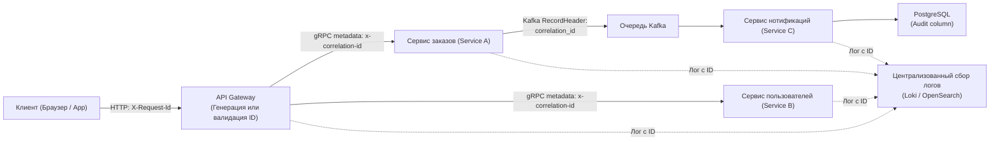

## Что такое Correlation ID и зачем он нужен

> *«В распределенной системе каждый запрос — это странник, проходящий через десятки чужих земель. Если вы не выдадите ему паспорт на границе, вы никогда не узнаете, в какой деревне он пропал».*  
> — Метафора распределенной трассировки

В монолитной системе расследование инцидентов редко вызывало экзистенциальный кризис: один физический процесс, один локальный лог-файл, а причинно-следственная связь между событиями восстанавливалась по таймстемпам и единому стеку вызовов.

В микросервисной архитектуре элементарная операция пользователя (например, клик по кнопке «Подтвердить заказ») порождает лавину сетевых взаимодействий: запрос летит через API Gateway в сервис заказов, тот обращается к сервису скидок, проверяет остатки на складе, отправляет событие в Kafka, инициирует транзакцию в биллинге и сохраняет данные в PostgreSQL.

Без сквозного склеивающего маркера разбор сбоев превращается в катастрофу:
- Логи разных сервисов физически перемешаны в централизованном хранилище;
- Ошибки в одном сервисе происходят одновременно с десятками других транзакций;
- Внезапный всплеск задержки P99 невозможно сопоставить с конкретным пользователем или параметрами вызова;
- Время восстановления после аварии (MTTR — Mean Time To Recovery) исчисляется часами бесполезных попыток сопоставить миллисекунды на разных серверах.

**Correlation ID** (в индустрии также часто называемый Request ID, Trace ID, `X-Request-Id`) — это глобально уникальный идентификатор, присваиваемый запросу в точке первого входа в систему (на периметре API Gateway или Load Balancer) и непрерывно транслируемый через все внутренние вызовы, фоновые горутины, брокеры сообщений и базы данных.

Для Go-инженера Correlation ID — это не просто строчка текста в HTTP-заголовке. Это фундаментальная архитектурная нить, связывающая воедино [[3. context и его использование]], [[1. Logging и observability]] и [[2. OpenTelemetry tracing]].



---

## Генерация Correlation ID

Главное требование к идентификатору корреляции — **абсолютная глобальная уникальность** во времени и пространстве. В распределенной системе с десятками тысяч RPS коллизия двух ID приведет к смешиванию логов разных пользователей и ложным выводам при аудите инцидентов.

В современной индустрии применяются два стандарта:
1. **UUID v4 (RFC 4122):** Псевдослучайный 128-битный идентификатор (вероятность коллизии пренебрежимо мала).
2. **UUID v7 / ULID:** Идентификаторы с сортировкой по времени (Time-ordered). Первые 48 бит содержат Unix-таймстемп в миллисекундах, что делает их идеальными первичными ключами в БД (снижая фрагментацию B-Tree индексов).

В языке Go канонический генератор опирается на библиотеку `google/uuid`:

```go
package correlation

import (
	"crypto/rand"
	"encoding/hex"
	"github.com/google/uuid"
)

// NewCorrelationID генерирует стандартный UUID v4
func NewCorrelationID() string {
	return uuid.New().String()
}

// FastCorrelationID генерирует 16-байтный hex-идентификатор напрямую через crypto/rand
// без лишних промежуточных аллокаций
func FastCorrelationID() string {
	var b [16]byte
	_, _ = rand.Read(b[:])
	return hex.EncodeToString(b[:])
}
```

### Безопасность и границы доверия на API Gateway
На пограничном прокси (API Gateway) Correlation ID может прийти из входящего запроса клиента.
> [!important] Правило доверия периметру
> Никогда слепо не доверяйте входящему заголовку от публичного клиента! Злоумышленник может специально прислать заголовок длиной 10 мегабайт, SQL-инъекцию или повторяющийся ID, чтобы отравить систему аналитики.  
> **Инженерный стандарт:** Входящий клиентский `X-Request-Id` валидируется по регулярному выражению (только hex/UUID до 64 символов) и логируется как внешний маркер, а для внутреннего движения по кластеру шлюз всегда генерирует доверенный внутренний Correlation ID.

---

## Передача Correlation ID между сервисами

### HTTP

В REST API общепринятыми заголовками являются **`X-Request-Id`** или **`X-Correlation-Id`**.

На стороне сервера заголовок считывается из структуры `http.Request.Header`:

```go
func extractOrCreateCorrelationID(r *http.Request) string {
	if id := r.Header.Get("X-Request-Id"); id != "" {
		return id
	}
	if id := r.Header.Get("X-Correlation-Id"); id != "" {
		return id
	}
	return uuid.New().String()
}
```

При обращении к downstream-сервисам через HTTP-клиент идентификатор обязательно внедряется в заголовки:

```go
req, err := http.NewRequestWithContext(ctx, http.MethodGet, targetURL, nil)
if err != nil {
	return nil, err
}
req.Header.Set("X-Request-Id", correlationID)
```

---

### gRPC

В протоколе gRPC аналогом HTTP-заголовков выступает подсистема **метаданных (`metadata`)**, передаваемая во фреймах HTTP/2:

```go
package grpcutil

import (
	"context"
	"github.com/google/uuid"
	"google.golang.org/grpc/metadata"
)

// InjectCorrelationID внедряет ID в исходящий контекст gRPC
func InjectCorrelationID(ctx context.Context, correlationID string) context.Context {
	md := metadata.Pairs("x-correlation-id", correlationID)
	return metadata.NewOutgoingContext(ctx, md)
}

// ExtractCorrelationID извлекает ID из входящего RPC-вызова
func ExtractCorrelationID(ctx context.Context) string {
	md, ok := metadata.FromIncomingContext(ctx)
	if !ok {
		return uuid.New().String()
	}
	values := md.Get("x-correlation-id")
	if len(values) == 0 || values[0] == "" {
		return uuid.New().String()
	}
	return values[0]
}
```

---

### Очереди сообщений (Kafka, RabbitMQ, NATS)

В асинхронных событийно-ориентированных архитектурах запрос разрывается во времени: продюсер кладет событие в топик, а консьюмер может вычитать его через несколько минут. Чтобы сквозной след не потерялся, Correlation ID помещается в системные метаданные сообщения:
- **Apache Kafka:** Заголовок записи **`RecordHeader`**;
- **RabbitMQ:** Системное свойство AMQP-пакета **`AMQP.BasicProperties.CorrelationId`**;
- **NATS JetStream:** Метаданные сообщения **`Header`**.

```go
// Пример для продюсера Apache Kafka
func PublishOrderEvent(ctx context.Context, producer *kafka.Producer, correlationID string, payload []byte) error {
	msg := &kafka.Message{
		TopicPartition: kafka.TopicPartition{Topic: &topic, Partition: kafka.PartitionAny},
		Value:          payload,
		Headers: []kafka.Header{
			{Key: "correlation_id", Value: []byte(correlationID)},
		},
	}
	return producer.Produce(msg, nil)
}
```

Консьюмер при получении сообщения распаковывает `Header`, извлекает ID и создает свежий `context.Context`, прошитый оригинальным идентификатором транзакции.

---

## Хранение в context.Context

Внутри одного Go-процесса Correlation ID обязан быть доступен в любой точке исполнения: в контроллерах, бизнес-сервисах, репозиториях баз данных и фоновых воркерах. Единственным законным контейнером для этого в Go является **`context.Context`** (см. [[3. context и его использование]]).

```go
package middleware

import (
	"context"
	"net/http"
)

// Неэкспортируемый тип предотвращает коллизии ключей между пакетами
type contextKey string

const correlationIDKey contextKey = "correlationID"

// CorrelationIDMiddleware перехватывает HTTP-запросы
func CorrelationIDMiddleware(next http.Handler) http.Handler {
	return http.HandlerFunc(func(w http.ResponseWriter, r *http.Request) {
		id := extractOrCreateCorrelationID(r)

		// Помещаем ID в контекст
		ctx := context.WithValue(r.Context(), correlationIDKey, id)

		// Пробрасываем заголовок клиенту в ответ (для удобства тикетов в саппорт)
		w.Header().Set("X-Request-Id", id)

		next.ServeHTTP(w, r.WithContext(ctx))
	})
}

// GetCorrelationID извлекает ID из контекста
func GetCorrelationID(ctx context.Context) string {
	if ctx == nil {
		return "unknown"
	}
	if id, ok := ctx.Value(correlationIDKey).(string); ok {
		return id
	}
	return "unknown"
}
```

### Под капотом `context.WithValue`
При каждом вызове `context.WithValue` в куче создается структура **`context.valueCtx`** (размером ~48 байт на 64-битных системах), оборачивающая родительский контекст.  
Поиск значения `ctx.Value()` — это линейный проход по цепочке ссылок от дочернего контекста к корневому `context.Background()` с временной сложностью $O(N)$. Поскольку глубина контекстов в типичном веб-сервисе составляет от 2 до 5 узлов, поиск сводится к 2–3 сравнениям указателей в кэше L1 процессора и практически бесплатен.

---

## Логирование с Correlation ID

В распределенной системе разработчик не должен вручную писать `slog.Info("msg", "correlation_id", id)` в каждом месте вызова. Идентификатор должен прикрепляться к строкам логов автоматически.

В стандартном пакете **`slog`** (Go 1.21+) это решается двумя путями:

### Способ 1: Обогащение логгера через `With`
```go
func LoggerWithCorrelationID(ctx context.Context, base *slog.Logger) *slog.Logger {
	return base.With("correlation_id", GetCorrelationID(ctx))
}

// В HTTP-хендлере:
func HandleCheckout(w http.ResponseWriter, r *http.Request) {
	ctx := r.Context()
	logger := LoggerWithCorrelationID(ctx, slog.Default())
	logger.Info("processing order payment", "user_id", 12345)
}
```

### Способ 2: Кастомный `Handler` для slog (Рекомендуется для High-Load)
Создание нового экземпляра `*slog.Logger` на каждый входящий запрос через вызов `With` создает паразитные аллокации в памяти.  
В высоконагруженных системах кастомный **`Handler`** самостоятельно вычитывает `correlationIDKey` из переданного в `r.Record` контекста непосредственно в момент форматирования JSON-строки, обеспечивая **zero-allocation** обогащение (см. [[1. Logging и observability]]).

---

## Связь с распределённой трассировкой (OpenTelemetry)

Важно понимать соотношение понятий:
- **`trace-id` (OpenTelemetry):** 16-байтный криптографически стойкий шестнадцатеричный идентификатор, регламентированный стандартом W3C Trace Context и предназначенный для построения графов времени (Spans) в Jaeger/Tempo.
- **`span-id`:** 8-байтный идентификатор конкретного шага внутри цепочки.
- **Correlation ID:** Бизнес-идентификатор запроса, понятный человеку и пригодный для тикетов службы поддержки.

Если в вашей инфраструктуре полноценно развернут OpenTelemetry ([[2. OpenTelemetry tracing]]), библиотека OTel автоматически берет на себя роль распространения `trace-id`. Однако в промышленной практике часто сосуществуют оба идентификатора: `trace-id` служит для глубокой технической телеметрии инженеров, а короткий Correlation ID возвращается клиенту в мобильное приложение для обращения в саппорт.

---

## Ловушки и частые ошибки

> [!warning] Ловушка / Gotcha: Потеря ID при асинхронных вызовах
> В Go порождение новой горутины через конструкцию **`go func()`** не наследует контекст автоматически!  
> Если разработчик напишет:
> ```go
> // ❌ ОШИБКА: контекст потерян!
> go sendEmailNotification(orderData)
> ```
> то внутри функции контекст будет пустым, а записи в логах останутся «анонимными».  
> **Всегда передавайте контекст явно:**
> ```go
> // ✅ ПРАВИЛЬНО: сквозная передача
> go sendEmailNotification(ctx, orderData)
> ```

> [!warning] Ловушка / Gotcha: Перезапись ID на границах сервисов
> Если каждый микросервис в цепочке при получении запроса будет генерировать новый собственный ID вместо извлечения существующего из входящего заголовка, сквозная трассировка разрушится. Correlation ID создается **строго один раз** на границе кластера.

> [!warning] Ловушка / Gotcha: Утечка внутренних ID во внешние ответы
> Никогда не раскрывайте во внешних ответах клиентам внутренние технические идентификаторы инфраструктуры. Отдавайте клиенту только публичный `X-Request-Id`.

> [!warning] Ловушка / Gotcha: Использование базового типа `string` как ключа контекста
> Если в качестве ключа контекста использовать примитивную строку:
> ```go
> ctx := context.WithValue(r.Context(), "correlation_id", id) // ❌ ОПАСНО
> ```
> то сторонний пакет или внешняя библиотека, случайно использующая такой же строковый литерал `"correlation_id"`, перезапишет ваше значение.  
> **Закон Go:** Всегда используйте пользовательский неэкспортируемый тип: **`type contextKey string`**.

---

## Mechanical Sympathy: оверхед Correlation ID

Оценим накладные расходы Correlation ID с точки зрения аппаратных ресурсов:

1. **Аллокации при генерации UUID:**  
   Вызов `uuid.New().String()` аллоцирует строку (~36 байт) плюс внутренний буфер. При нагрузке 100 000 RPS это генерирует ~3.6 МБ/с мусора в куче, создавая заметную работу для Garbage Collector. В критических Hot Path используют предварительно выделенные пулы буферов через `sync.Pool` или компактные бинарные генераторы на базе `crypto/rand`.
2. **Вставка в контекст:**  
   Единичная аллокация структуры `context.valueCtx` (~48–80 байт). На фоне сетевых накладных расходов пренебрежимо мала.
3. **Извлечение из контекста:**  
   Поиск по короткой цепочке указателей контекста занимает менее 10 наносекунд и полностью попадает в процессорный кэш L1.
4. **Логирование:**  
   Если логгер пересоздается через метод `With` на каждый входящий запрос, это увеличивает нагрузку на аллокатор. Внедрение атрибута на уровне `Handler` в `slog` или context-aware логгеры (как в `zerolog`) сводят этот оверхед к нулю.

---

## Собеседование

> [!tip] Собеседование
> **Вопрос: Как вы спроектируете и реализуете сквозное логирование запросов в микросервисной архитектуре на Go?**  
> **Ответ:**  
> 1. На внешнем периметре (API Gateway) присваиваю каждому запросу глобально уникальный Correlation ID (UUID v4/v7) и инжектирую его в `context.Context` через middleware.
> 2. При исходящих сетевых взаимодействиях передаю ID через стандартные HTTP-заголовки (`X-Request-Id`) или метаданные gRPC (`metadata.Pairs`).
> 3. В асинхронных шинах (Kafka, RabbitMQ, NATS) помещаю ID в заголовки сообщений (`RecordHeader`).
> 4. Настраиваю кастомный `slog.Handler`, который автоматически извлекает ID из контекста и добавляет поле `correlation_id` во все JSON-логи без ручной вставки в коде бизнес-логики.
> 5. При порождении фоновых горутин контролирую явную передачу контекста `go worker(ctx)`.

> [!tip] Собеседование
> **Вопрос: В чём принципиальная разница между Correlation ID и Trace ID в экосистеме OpenTelemetry?**  
> **Ответ:** Trace ID является частью международного стандарта W3C Trace Context, имеет строго фиксированный бинарный размер (16 байт / 32 hex-символа) и используется специализированными бэкендами трассировки (Jaeger, Tempo) для выстраивания деревьев задержек (Spans). Correlation ID — это концептуальный идентификатор бизнес-транзакции, который может быть произвольной строкой, UUID или числом. Correlation ID часто возвращается клиенту в ответе API и используется операторами поддержки, в то время как Trace ID остается внутренней технической метрикой инженеров.

---

## Итог

1. **Correlation ID — паспорт запроса:** Обеспечивает причинно-следственную связь между логами, метриками и спанами во всей распределенной системе.
2. **Единая точка входа:** Генерируется один раз на внешнем шлюзе (API Gateway) и распространяется по всей цепочке downstream-вызовов.
3. **Межсервисные протоколы:** Передается через заголовки `X-Request-Id` (HTTP), gRPC metadata и заголовки очередей сообщений (`RecordHeader` в Kafka).
4. **Хранение в `context.Context`:** Изолируется с помощью собственного типа `type contextKey string` для предотвращения коллизий пакетов.
5. **Автоматизация логирования:** Подхватывается кастомным обработчиком `slog.Handler`, избавляя разработчиков от ручного копирования идентификаторов.

Мы связали воедино распределенные логи и трейсы. Но что делать, когда сложная распределенная транзакция внезапно зависает, деградирует по задержкам или возвращает противоречивые данные на стыке нескольких сервисов? Как отлаживать распределенные системы без остановки мира и перезапусков? В следующей лекции мы детально изучим: [[8. Debugging distributed systems]].