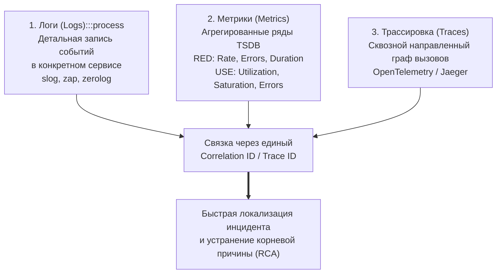

## Почему отладка распределённых систем — это навык уровня Senior

> *«Каждый может написать программу, которая работает, когда всё идет по плану. Но истинное инженерное мастерство проявляется в том, как вы расследуете поведение системы, когда всё рушится, а компоненты врут вам в лицо».*  
> — Брайан Керниган

Микросервисы, распределенные очереди, асинхронные шины событий, шардированные базы данных, многоуровневые кэши — современная распределенная система на Go представляет собой сложнейший оркестр из десятков или сотен независимых процессов, взаимодействующих через ненадежную компьютерную сеть. 

Когда в такой системе запрос пользователя внезапно падает с ошибкой `HTTP 500`, транзакция зависает на 15 секунд вместо штатных 80 миллисекунд или баланс счета уходит в минус из-за состояния гонки, локализация первопричины превращается в захватывающее детективное расследование, не имеющее ничего общего с отладкой монолита.

В монолите инженер располагает единым стеком вызовов (Stack Trace) и одним локальным лог-файлом. В микросервисах сетевой запрос пересекает границы памяти процессов, сериализуется в бинарные фреймы Protobuf, откладывается в очереди сообщений, скрывается за автоматическими ретраями и маскируется таймаутами. Без выстроенной архитектурной культуры и специальных инструментов отладка распределенного приложения вырождается в безнадежное гадание по разрозненным логам.

Эта лекция — системное руководство по отладке, телеметрии и ментальным моделям расследования сбоев в распределенных системах на Go. Мы свяжем воедино все инженерные приемы, изученные в предыдущих главах: [[7. Correlation ID]], [[1. Graceful Shutdown]], [[2. Rate Limiting]], [[3. Circuit Breaker]], [[4. Retries]], [[5. Idempotency]], [[6. Backpressure]]. И поднимемся на высший уровень зрелости, объединив сквозную наблюдаемость ([[1. Logging и observability]], [[2. OpenTelemetry tracing]]) с глубокими низкоуровневыми инструментами профилирования рантайма Go ([[1. pprof. Введение]], [[2. CPU profiling в Go]], [[5. pprof memory profile]]) и пониманием поведения планировщика ([[1. Scheduler Go. G M P модель]]).

---

## Фундаментальная сложность распределённой отладки

Почему поиск ошибок в распределенной системе качественно сложнее локальной отладки? Причина кроется в фундаментальных физических ограничениях распределенных сред:

1. **Отсутствие единого стека вызовов:**  
   Запрос последовательно проходит через HTTP Ingress, gRPC-прокси, очередь Kafka и фоновый воркер. Вы не можете просто запустить локальный отладчик и нажать «Step Over» — брейкпойнт в сервисе `A` не скажет вам, что в эту микросекунду происходит в ядре операционной системы сервиса `B`.
2. **Физический недетерминизм сети:**  
   Компьютерная сеть вносит случайные задержки пакетов, ретрансмиты TCP и аномалии маршрутизации. Очереди могут менять порядок доставки сообщений. Баг, проявившийся 1 раз на 500 000 транзакций из-за гонки в кэше, невозможно воспроизвести на машине разработчика.
3. **Частичные отказы (Partial Failures) и каскадные эффекты:**  
   В распределенной системе отказ одного вспомогательного узла не убивает систему целиком, но порождает цепную реакцию: всплеск задержек, лавину повторных запросов (Retry Storms), размыкание автоматов Circuit Breaker и деградацию соседних сервисов. Симптом (падение платежей) и истинная причина (деградация сервиса геопозиции) могут быть разделены тремя промежуточными звеньями и десятком минут времени.
4. **Невозможность «остановить мир» (Stop-the-World):**  
   Вы не имеете права поставить боевой production-кластер на паузу, чтобы изучить переменные в памяти: остановка одного пода немедленно вызовет отказ по таймаутам на всех клиентах и запустит аварийное переключение балансировщиков. Все расследования обязаны проводиться **на живой, непрерывно работающей системе с околонулевым воздействием (Zero Overhead)**.
5. **Эфемерность инфраструктуры:**  
   Контейнеры Kubernetes уничтожаются при сбоях (OOMKilled), ноды ротируются облачными провайдерами, а кэши инвалидируются. Состояние среды в момент инцидента невозможно заморозить.

---

## Три столпа наблюдаемости: логи, метрики, трассировка

Современная методология расследования распределенных аварий базируется на объединении трех независимых измерений телеметрии («треугольник наблюдаемости» — Observability Triad):



- **Метрики (Metrics):** Агрегированные числовые ряды во времени. Они отвечают на вопрос: **«Есть ли проблема прямо сейчас и каков ее масштаб?»** (всплеск 500-х ошибок, просадка RPS, рост P99 задержки). Экспортируются в Prometheus и отображаются на дашбордах Grafana по методологиям **RED** (Rate, Errors, Duration) для сервисов и **USE** (Utilization, Saturation, Errors) для железа.
- **Трассировка (Tracing):** Сквозной путь конкретной транзакции через все звенья цепи. Отвечает на вопрос: **«Где именно возникла задержка или произошел обрыв?»** В экосистеме Go реализуется через OpenTelemetry ([[2. OpenTelemetry tracing]]) и визуализируется водопадными диаграммами в Jaeger или Tempo.
- **Логи (Logs):** Детальные контекстные записи событий от конкретных горутин. Отвечают на вопрос: **«Что именно пошло не так?»** (стек ошибки, значения аргументов, внутренние инварианты). Формируются через `slog`, `zerolog` или `zap` и обязательно маркируются `correlation_id` ([[7. Correlation ID]]).

Связующим клеем треугольника выступает **Correlation ID (Trace ID)**: увидев на дашборде всплеск задержки, инженер в один клик переходит к трейсу проблемного запроса, а из трейса — к изолированным логам всех затронутых сервисов.

---

## Correlation ID и трассировка: как собрать путь запроса

В лекции [[7. Correlation ID]] мы изучили способы генерации и проброса сквозного маркера через сетевые заголовки и очереди. Рассмотрим, как эта механика работает на практике при разборе реального инцидента.

**Сценарий:** Пользователь обращается в службу поддержки: операция оформления заказа длилась **20 секунд** вместо штатных 200 миллисекунд.

**Алгоритм расследования инженера:**
1. По идентификатору пользователя или временному интервалу в логах пограничного API Gateway находим `Correlation ID` транзакции: `abc123-def456`.
2. Вбиваем этот ID в поисковую строку системы централизованных логов (Loki или Elasticsearch). Система возвращает 15 записей от 4 разных микросервисов.
3. Открываем интерфейс Jaeger и вставляем тот же ID. Перед нами разворачивается сквозной граф спанов:
   - Общее время запроса: 20.1 с;
   - Запрос на сервис заказов (Order Service): 20.0 с;
   - Сервис заказов ожидал ответа от сервиса биллинга (Billing Service): ровно **19.2 секунды**!
4. Открываем спан биллинга: внутри него видно, что 19.1 секунды занял внутренний SQL-запрос `SELECT ... FOR UPDATE` к базе данных PostgreSQL.
5. Заглядываем в логи биллинга с этим ID: обнаруживаем запись о взаимной блокировке строк (Lock Contention) из-за отсутствия составного индекса.
6. Параллельно замечаем, что защитный автомат [[3. Circuit Breaker]] на сервисе заказов своевременно разомкнулся после этой просадки, защитив сервис от каскадного коллапса.

Без единого Correlation ID инженеры потратили бы полдня на попытки сопоставить несинхронизированные часы серверов и логи в поисках виновника.

> [!info] Под капотом
> В рантайме Go передача Correlation ID через `context.Context` опирается на связный список структур `valueCtx`. Извлечение значения через `context.Value` имеет алгоритмическую сложность $O(N)$, где $N$ — глубина вложенности контекста (обычно не более 3–4). Накладные расходы составляют единицы наносекунд. Тем не менее, извлекать ID рекомендуется один раз на входе в обработчик, передавая его далее в переменной, чтобы исключить лишние обходы цепочки в высоконагруженных циклах.

---

## Логи: как не утонуть в потоке данных

При нагрузке в 20 000 RPS кластер генерирует сотни миллионов записей в сутки. Чтобы логи оставались острым скальпелем отладки, а не грудой мусора, соблюдайте 5 золотых правил:

1. **Строгая структура (Structured Logging):** Используйте `slog`, `zerolog` или `zap`. Каждая запись обязана содержать обязательные поля: `correlation_id`, `user_id`, `service`, `error`. Это позволяет выполнять фильтрацию любой сложности:
   ```text
   correlation_id="abc123" AND level=ERROR
   ```
2. **Контекстная автоматизация:** Логируйте через контекст (`[[7. Correlation ID#Логирование с Correlation ID]]`). ID транзакции должен подставляться middleware автоматически.
3. **Дисциплина уровней:**
   - `DEBUG` — технические подробности для локальной разработки;
   - `INFO` — ключевые события жизненного цикла (запрос принят, транзакция зафиксирована);
   - `WARN` — компенсированные сбои (сработал повтор, ответил кэш);
   - `ERROR` — инциденты, требующие вмешательства человека.
4. **Семплирование (Sampling):** В production детальные логи пишутся только для 1–5% успешных запросов и для **100% запросов с ошибками**.
5. **Централизация с политикой хранения (Retention Policy):** Логи собираются демонами Vector/FluentBit в централизованное хранилище (Loki, Elasticsearch) с индексацией по `correlation_id` и `timestamp`, а также автоматической очисткой старых индексов. Без этого отладка сводится к хаотичному ручному поиску.

---

## Распределённая трассировка: OpenTelemetry в Go

Трассировка визуализирует топологию запроса во времени. В Go индустриальным стандартом стал пакет **`go.opentelemetry.io/otel`**.

Канонический паттерн ручной инструментации и распространения контекста:

```go
package service

import (
	"context"
	"net/http"

	"go.opentelemetry.io/otel"
	"go.opentelemetry.io/otel/propagation"
	"go.opentelemetry.io/otel/trace"
)

func HandleOrderRequest(w http.ResponseWriter, r *http.Request) {
	tracer := otel.Tracer("order-service")

	// 1. Создаем корневой спан, извлекая входящий W3C контекст из HTTP-заголовков
	ctx, span := tracer.Start(r.Context(), "HandleOrderRequest")
	defer span.End()

	// 2. Выполняем межсервисный вызов downstream
	if err := callInventoryService(ctx); err != nil {
		span.RecordError(err)
		http.Error(w, err.Error(), http.StatusInternalServerError)
		return
	}

	w.WriteHeader(http.StatusOK)
}

func callInventoryService(ctx context.Context) error {
	// Создаем дочерний спан
	ctx, span := otel.Tracer("order-service").Start(ctx, "callInventoryService")
	defer span.End()

	req, err := http.NewRequestWithContext(ctx, http.MethodGet, "http://inventory/api/v1/stock", nil)
	if err != nil {
		return err
	}

	// Внедряем W3C Traceparent в заголовки исходящего сетевого вызова
	otel.GetTextMapPropagator().Inject(ctx, propagation.HeaderCarrier(req.Header))

	resp, err := http.DefaultClient.Do(req)
	if err != nil {
		span.RecordError(err)
		return err
	}
	defer resp.Body.Close()

	return nil
}
```

> [!info] Под капотом
> Библиотека OpenTelemetry SDK использует структуру `trace.SpanContext`, содержащую 16-байтный TraceID и 8-байтный SpanID. Создание спана аллоцирует в куче порядка 200–400 байт. Для предотвращения деградации производительности сетевой экспорт в OTLP-коллектор выполняется полностью асинхронно через фоновый пакетный процессор (`BatchSpanProcessor`), накапливающий спаны в памяти и отправляющий их по HTTP/2 или gRPC крупными блоками.

---

## Инструменты Go для отладки в распределённом контексте

Когда телеметрия указывает, что сбой вызван аномалией внутри конкретного микросервиса, в бой вступает мощный арсенал низкоуровневых инструментов Go.

### pprof в production

Встроенный профилировщик Go ([[1. pprof. Введение]], [[2. CPU profiling в Go]], [[5. pprof memory profile]]) спроектирован специально для безопасного запуска на боевых серверах под реальной нагрузкой.

Подключение стандартного пакета `net/http/pprof` открывает системные эндпоинты `/debug/pprof/`.  
**Сценарий:** На одном из инстансов микросервиса загрузка CPU скачкообразно выросла до 100%. Инженер подключается к проблемному поду и снимает 30-секундный профиль:
```bash
go tool pprof http://localhost:8081/debug/pprof/profile?seconds=30
```
Инструмент выводит интерактивный отчет (или Flame Graph), наглядно показывающий, какая функция сжигает процессорные циклы.

> [!warning] Безопасность эндпоинтов pprof
> Никогда не выставляйте порт с эндпоинтами `net/http/pprof` в открытый интернет! Доступ к профилированию должен быть закрыт сетевыми политиками Kubernetes (NetworkPolicies) и доступен только внутри служебного контура через `kubectl port-forward`.

---

### Execution tracer

Утилита **`execution tracer`** ([[3. execution tracer]]) позволяет взглянуть на работу сервиса с точностью до микросекунд:
- Переключение контекста планировщика (G-M-P);
- Поведение фонового монитора `sysmon`;
- Длительность фаз Stop-the-World сборщика мусора (GC STW);
- Блокировки горутин на сетевом поллере (Netpoller) и системных каналах.

Снятие трассировки длительностью 5 секунд (`curl -o trace.out http://localhost:8081/debug/pprof/trace?seconds=5`) позволяет мгновенно выяснить, почему горутины простаивают при наличии свободных ядер CPU.

---

### Race detector

Детектор состояния гонок (**Race detector**, см. [[3. Race detector в проде]]) компилирует бинарник с инструментацией ThreadSanitizer (`go build -race`, `go test -race`).  
Поскольку флаг `-race` увеличивает потребление памяти в 5–10 раз и замедляет выполнение в 3–5 раз, его категорически нельзя включать на всем production-кластере. Однако запуск **одиночного canary-инстанса с `-race`** в тестовом стенде под зеркалированным реальным трафиком — непревзойденный способ отловить трудновоспроизводимые гейзенбаги.

---

### Delve

Интерактивный отладчик **Delve** (`dlv`) редко используется на живых серверах (остановка процесса точкой останова нарушит сетевые таймауты зависимых сервисов). Однако Delve незаменим для расследования аварийных дампов ядра (**Core Dumps**): если сервис падает в `panic` с повреждением стека или сбоем в Cgo, Delve позволяет детально исследовать посмертное состояние регистров и памяти.

---

## Анализ конкретных проблем

Разберем три классических сценария распределенных аварий и последовательность их локализации:

### 1. Рост p99 latency без явных причин
- **Симптом:** Метрики Prometheus фиксируют скачок P99 Latency с 40 мс до 600 мс.
- **Расследование:** Открываем Jaeger и фильтруем трейсы по перцентилю задержки. В водопадной диаграмме видим, что 90% времени уходит на обращение к распределенному кэшу Redis.
- **Диагностика:** Ошибок в логах Go нет. Открываем дашборд Redis и изучаем журнал медленных запросов `slowlog`.
- **Корневая причина:** На стороне сервиса выставили одинаковый жесткий TTL (например, 1 час) на миллион ключей. В момент одновременного истечения TTL миллион горутин ринулись в PostgreSQL за свежими данными, вызвав лавинообразную перегрузку (**Thundering Herd / Cache Stampede**).

---

### 2. Утечка горутин
- **Симптом:** Метрика `go_goroutines` непрерывно растет линейной лесенкой, потребление оперативной памяти плавно увеличивается вплоть до срабатывания OOM Killer.
- **Расследование:** Запрашиваем стек горутин через pprof:
  ```bash
  curl http://localhost:8081/debug/pprof/goroutine?debug=2
  ```
- **Диагностика:** Обнаруживаем 50 000 горутин, заблокированных в функции **`runtime.chanrecv`** на чтении из небуферизованного канала.
- **Корневая причина:** Разработчик порождал фоновую горутину для отправки вебхука, но забыл предусмотреть отмену по таймауту. Конструкция `select` без чтения из `ctx.Done()` привела к тому, что при таймауте клиента горутина оставалась висеть в памяти навсегда.

---

### 3. Каскадный сбой
- **Симптом:** Сервис платежей испытывает легкое замедление (рост задержки с 50 мс до 1.5 с). Через 2 минуты весь кластер перестает отвечать, падают даже независимые сервисы каталога.
- **Расследование:** Вызывающие сервисы были сконфигурированы с агрессивными повторными попытками ([[4. Retries]]) без экспоненциальной задержки. Сервисы-клиенты начали утроенными темпами бомбардировать уставший биллинг.
- **Диагностика:** Анализируем метрики Circuit Breaker ([[3. Circuit Breaker]]) — переходы состояний `Closed` $\to$ `Open` $\to$ `Half-Open`.
- **Корневая причина:** Автомат защиты был сконфигурирован с завышенным порогом ошибок (80% вместо 20%), в результате чего каскадная лавина запросов успела положить сетевые интерфейсы нод.

---

## Хаос-инжиниринг: упреждающая отладка

Зрелая инженерная культура не ждет, пока система упадет ночью под нагрузкой. Надежность проверяется **проактивным внесением сбоев — Chaos Engineering**:

- **Случайное уничтожение узлов:** Периодическое принудительное удаление случайных подов в Kubernetes (`kubectl delete pod`);
- **Сетевой хаос (Toxiproxy, Chaos Mesh, `tc netem`):** Искусственное внесение сетевых задержек в 500 мс, эмуляция потери 5% сетевых пакетов, разрыв TCP-соединений посреди передачи данных;
- **Ресурсное голодание:** Динамическое усечение лимитов CPU и памяти контейнеров для проверки поведения рантайма под троттлингом CFS.

Если распределенная система способна выдержать отказ любого сервиса в рамках заданного SLO (Service Level Objective), вы можете быть уверены в ее архитектуре.

---

## Распределённый трейсинг и логирование — сборка пазла

Эталонный цикл расследования инцидента занимает считанные минуты:

```mermaid
flowchart TD
    classDef process  fill:#1e293b,stroke:#38bdf8,stroke-width:1px,color:#f8fafc
    classDef success  fill:#064e3b,stroke:#34d399,stroke-width:1px,color:#f8fafc
    classDef error    fill:#7f1d1d,stroke:#f87171,stroke-width:1px,color:#f8fafc
    classDef warning  fill:#78350f,stroke:#fbbf24,stroke-width:1px,color:#f8fafc
    classDef entry    fill:#1e3a5f,stroke:#38bdf8,stroke-width:2px,color:#f8fafc
    classDef aux      fill:#334155,stroke:#64748b,stroke-width:1px,color:#f8fafc
    classDef system   fill:#312e81,stroke:#a78bfa,stroke-width:1px,color:#f8fafc
    classDef data     fill:#132d29,stroke:#2dd4bf,stroke-width:1px,color:#f8fafc
    classDef network  fill:#881337,stroke:#fb7185,stroke-width:1px,color:#f8fafc
    classDef accent   fill:#1e1b4b,stroke:#818cf8,stroke-width:1px,color:#f8fafc
    A["1. Алерт в Alertmanager / Prometheus:\nРост ошибок HTTP 500 > 1%"]:::network --> B["2. Метрики в Grafana:\nОшибки локализованы в сервисе заказов (service: B)"]
    B --> C["3. Трейсы в Jaeger:\nФильтр по service: B, status: Error.\nСбой на спане INSERT INTO orders"]
    C --> D["4. Логи в Kibana / Loki:\nЗапрос: service:\"B\" AND error:\"duplicate key\"\nНаходим конкретный Correlation ID"]
    D --> E["5. Анализ кода:\nСбой идемпотентности (Idempotency)!\nПовтор из очереди создал дубликат"]
    E --> F["6. Быстрое устранение:\nВнедрение идемпотентного ключа в транзакцию"]
```

Разберем этот классический рабочий процесс по шагам:
1. **Алерт:** Prometheus фиксирует всплеск 500-х ошибок.
2. **Метрики:** Панель Grafana сужает область поиска до `service` заказов (сервис B).
3. **Трейсы:** В Jaeger фильтруем спаны ошибок: цепочка обрывается на SQL-запросе `INSERT INTO orders`.
4. **Логи:** Выполняем точный поисковый запрос в логах: `service:"B" AND error:"duplicate key"`. Находим точный `correlation_id`.
5. **Код:** Ошибка duplicate key вызвана нарушением идемпотентности ([[5. Idempotency]]) при повторной доставке из очереди.
6. **Устранение:** Внедряем идемпотентный ключ и стабилизируем систему.

Такая скорость возможна только тогда, когда все три компонента наблюдаемости провязаны единым сквозным идентификатором.

---

## Mechanical Sympathy: как наблюдаемость влияет на систему

Инструменты наблюдения за распределенной системой не бесплатны. Они потребляют вычислительные ресурсы процессора, память и сетевую пропускную способность:

1. **Логирование:** Сериализация сложных структур в JSON создает нагрузку на сборщик мусора. При нагрузке 10 000 RPS и 10 логах на запрос логгер генерирует 100 000 аллокаций в секунду, приводя к ситуации, [[9. Когда GC становится bottleneck]]. Избегайте конкатенации строк через `fmt.Sprintf` на горячих путях и настраивайте сэмплирование.
2. **Трассировка:** Каждый спан удерживает 200–400 байт памяти. Настраивайте стратегию семплирования переменной окружения **`OTEL_SPAN_SAMPLER=parentbased_traceidratio`** с адекватным процентом (например, 10%).
3. **Профилирование:** Снятие CPU-профиля с частотой семплирования 100 Гц создает минимальный оверхед (1–3% CPU). Однако блокировочное профилирование мьютексов с rate=1 может вызвать серьезные задержки. Включайте их только точечно.
4. **Защитные автоматы:** Для сохранения устойчивости сервисов под нагрузкой наблюдения обязательно применяйте Graceful Shutdown ([[1. Graceful Shutdown]]), ограничение частоты запросов ([[2. Rate Limiting]]) и механизмы обратного давления ([[6. Backpressure]]).

---

## Инфраструктура для отладки

Современный стек распределенной наблюдаемости включает:
- **Service Mesh (Istio, Linkerd, Cilium Service Mesh):** Автоматически обогащает трафик трейсингом, собирает метрики RED и управляет повторами на уровне сетевого прокси без вмешательства в код;
- **Централизованные хранилища логов:** Grafana Loki (индексация по лейблам) или OpenSearch/Elasticsearch (полнотекстовый поиск);
- **Хранилища трейсов:** Grafana Tempo, Jaeger;
- **Подсистема метрик:** Prometheus / VictoriaMetrics + Grafana;
- **Маршрутизация алертов:** Alertmanager с интеграцией в корпоративные каналы дежурных инженеров.

---

## Итог

1. **Отладка как системная дисциплина:** В распределенных средах невозможно полагаться на интуицию. Отладка опирается на три столпа: метрики, трейсы и структурированные логи.
2. **Сквозная связность:** Correlation ID ([[7. Correlation ID]]) связывает воедино разрозненные события на всех узлах кластера.
3. **OpenTelemetry визуализирует время:** Трассировка показывает точную задержку каждого сетевого вызова и выявляет скрытые блокировки.
4. **Профайлеры Go в бою:** Используйте `pprof`, `execution tracer` и точечный запуск с `-race` для анализа аномалий рантайма без остановки сервисов.
5. **Цена наблюдаемости:** Семплируйте логи и спаны, переиспользуйте буферы и избегайте аллокаций на горячих путях, чтобы телеметрия не стала причиной отказа системы.

Мы научились отлаживать сложнейшие распределенные сценарии. Но что происходит, когда в кластере разворачивается полномасштабная боевая авария, затрагивающая сотни тысяч пользователей прямо сейчас? Как реагировать, организовывать инцидент-менеджмент и не поддаваться панике? В следующей лекции мы разберем: [[9. Production incidents]].