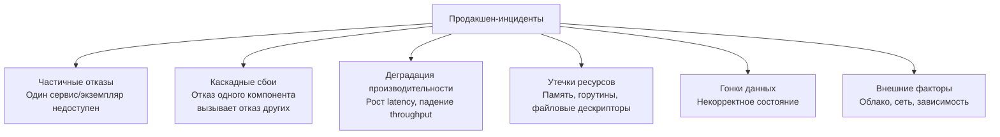
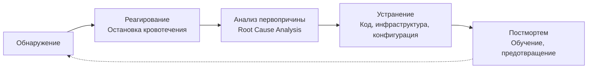

## Production Incidents: жизнь в мире частичных отказов

> *"Если что-то может пойти не так, оно пойдет не так. А в распределенной системе всё, что может пойти не так, уже ломается прямо сейчас — просто метрика ещё не долетела до дашборда."*  
> — Следствие из закона Мёрфи для бэкенд-инженеров

В [[8. Debugging distributed systems]] мы детально систематизировали реактивные подходы к локализации сбоев: структурированные логи, распределенные метрики, сквозную трассировку и канонический [[7. Correlation ID]]. Однако отладка сама по себе — это инструмент хирурга, когда пациент уже лежит на операционном столе. 

В реальной эксплуатации мы сталкиваемся с куда более масштабным явлением — **продакшен-инцидентами** (production incidents), их полным жизненным циклом и культурой совладания с энтропией: от первого шевеления алертов мониторинга до хладнокровного постмортема без поиска виновных.

Инцидент — это не тривиальный баг в коде, который можно не спеша поправить к следующему спринту. Это острое событие, которое прямо сейчас нарушает или угрожает сокрушить заданный уровень сервиса ([[9. SLO и SLA]]), наносит прямой финансовый или репутационный ущерб пользователям и требует немедленного, слаженного вмешательства. 

В распределенных системах на Go инциденты неизбежны в силу законов физики: пакеты теряются в оптоволокне коммутаторов, диски баз данных упираются в потолок IOPS, сборщик мусора Go может уйти в mark assist, а забытая блокировка в горутине порождает лавинообразную утечку памяти. Невозможно построить абсолютно безотказную распределенную систему, но можно и должно спроектировать её так, чтобы она быстро сигнализировала об аномалиях, изящно деградировала при частичных отказах, а инженерная команда превращала каждый сбой в системный кирпич надежности.

Эта глава объединяет весь защитный инструментарий, рассмотренный в практическом модуле (от [[1. Graceful Shutdown]] до [[8. Debugging distributed systems]]), с низкоуровневой механикой рантайма Go ([[1. GC в Go. Обзор]], [[6. GC pause и latency]], [[9. Когда GC становится bottleneck]], [[1. Scheduler Go. G M P модель]], [[7. Contention и lock profiling]]) и формирует ментальную модель Senior-инженера: как встречать, купировать и препарировать инциденты на стыке рантайма Go и ядра Linux.

---

## Классификация инцидентов в Go-системах

Чтобы победить врага, его необходимо классифицировать. В реальных Go-сервисах симптомы часто маскируют истинную первопричину. Например, сервис падает с HTTP 504 Gateway Timeout, но виновен вовсе не сетевой шлюз, а фоновый contention на внутреннем мьютексе или остановка мира в Garbage Collector.



### 1. Частичные отказы

Один pod микросервиса был уничтожен ядром Linux из-за превышения cgroup memory limit (OOM Killer). Или транзиентный сплит в SDN изолировал один экземпляр кэша. Или пул соединений к PostgreSQL исчерпал дескрипторы.

Здоровая распределенная архитектура обязана трактовать частичные отказы как штатный режим работы. Оставшиеся узлы подхватывают трафик через динамический Service Discovery, вызовы защищаются повторными попытками ([[4. Retries]]) с джиттером и размыкателями цепи ([[3. Circuit Breaker]]).

### 2. Каскадные сбои

Самый опасный сценарий — так называемый *эффект домино* или *snowball effect*. Сервис A начинает отвечать чуть медленнее обычного (например, 250 мс вместо 10 мс). Вызывающий сервис B исчерпывает свои локальные тайм-ауты и начинает яростно слать неконтролируемые Retries. Нагрузка на сервис A мгновенно утраивается, он окончательно захлебывается, и пул горутин сервиса B забивается зависшими сетевыми ожиданиями. Следом складываются сервисы C и D.

Оружие против каскадного коллапса: строгое лимитирование частоты вызовов ([[2. Rate Limiting]]), механизм противодавления ([[6. Backpressure]]), адаптивные тайм-ауты и размыкание цепей на границах сервисов.

### 3. Деградация производительности

Ошибок 5xx в логах нет, все проверки liveness отдают HTTP 200, но 99-й перцентиль (p99 latency) медленно и неумолимо ползет в стратосферу — от 15 мс до 4 секунд. 

В мире Go корни такой деградации почти всегда скрыты под капотом рантайма:
- GC-паузы и принудительное переключение рабочих горутин в режим содействия сборщику мусора (`mark assist`) при взрывном темпе аллокаций ([[6. GC pause и latency]], [[9. Когда GC становится bottleneck]]);
- Ожесточенная конкуренция за блокировки на общих мьютексах ([[7. Contention и lock profiling]]);
- Межъядерная инвалидация кэш-линий процессора из-за ложного разделения памяти ([[8. False sharing]]);
- Частые миграции горутин между потоками планировщика OS при несбалансированном воровстве работы ([[3. Work stealing]]).

### 4. Утечки ресурсов

Коварство утечек в том, что система может выглядеть абсолютно здоровой часами или неделями. Медленно текущая память ([[6. Утечки памяти]]), незакрытые тела HTTP-ответов (`resp.Body`), зависшие горутины ([[2. Goroutines под капотом]]) или утекающие файловые сокеты (`TIME_WAIT` / `CLOSE_WAIT`). Ресурс плавно исчерпывается до физического предела, после чего происходит внезапный и катастрофический отказ всего узла.

### 5. Гонки данных

Самая изощренная и сложная в воспроизведении категория сбоев. Несинхронизированное чтение и запись в расшаренную память без применения мьютексов или атомиков не обязательно вызывают немедленную панику. Чаще они тихо повреждают внутреннее состояние структур, проявляясь спустя часы искажением бизнес-логики или паникой в совершенно невинном участке кода.

### 6. Внешние факторы

Проблемы за пределами вашего кода: гипервизор облачного провайдера выполняет «живую миграцию» (live migration) вашей виртуальной машины, сетевой коммутатор дропает 8% пакетов из-за переполнения очередей, протух промежуточный SSL/TLS сертификат, либо переполнился диск для логов на узле Kubernetes.

---

## Жизненный цикл инцидента

Зрелая инженерная культура рассматривает инцидент как непрерывный пятифазный цикл. Задача инженера на каждом этапе фундаментально меняется: от пожарного, тушащего огонь, до хладнокровного судебного криминалиста.



### 1. Обнаружение

Если об инциденте вам сообщил пользователь в техподдержку или клиент в соцсетях — ваша система мониторинга провалилась. Настоящий инцидент обязан регистрироваться автоматикой за секунды до того, как его масштабы ощутит большинство клиентов.

Фундамент раннего обнаружения строится на трёх китах:
- **Метрики RED** (Rate, Errors, Duration) на уровне API каждого сервиса. Рост доли 5xx-ответов выше 1% или всплеск p99 latency выше допустимого SLA — немедленный триггер алерта.
- **Метрики USE** (Utilization, Saturation, Errors) на уровне инфраструктуры и ОС: троттлинг ядер процессора (CFS throttling), насыщение памяти узла, исчерпание пулов соединений.
- **Бюджет ошибок (Error Budget)** на базе [[9. SLO и SLA]]. Сгорание 20% месячного бюджета ошибок за 1 час сигнализирует об опасном тренде (Warning), сгорание 50% за 15 минут — немедленный экстренный вызов дежурных (Critical/Page).
- **Синтетические проверки (Blackbox Probing)** — легковесные независимые зонды из внешних сетей, эмулирующие ключевой путь пользователя (авторизация, добавление в корзину, оформление заказа).

Специфические метрики рантайма Go, на которые дежурный инженер смотрит в первую очередь:
- `go_goroutines` — резкий рост графика вверх указывает на дедлок, зависание сетевых I/O вызовов или утечку горутин;
- `go_memstats_gc_cpu_fraction` — если рантайм тратит больше 15% процессорного времени на сборку мусора (`go_memstats_gc_cpu_fraction > 0.15`), сервис захлебывается в аллокациях;
- `go_gc_duration_seconds` (p99) — превышение порога в 10–15 мс свидетельствует о тяжелых STW-паузах или огромном количестве сканируемых указателей;
- `go_memstats_heap_inuse_bytes` — объем активной кучи Go;
- Контеншн на мьютексах через mutex profile ([[6. mutex profile]]) — собирается автоматически при деградации задержек.

### 2. Реагирование — остановка кровотечения

Главное правило дежурного инженера: **во время аварии ваша цель — не понять досконально причину и не написать красивый патч, а остановить кровотечение и вернуть сервис пользователям**.

Иерархия спасательных действий (по степени убывания приоритета):
1. **Откатить недавний релиз.** 80% инцидентов вызваны свежими деплоями или сменой конфигураций. Если 10 минут назад выкатили версию v2.4.1 — немедленно откатывайтесь на стабильную v2.4.0.
2. **Переключить трафик (Failover).** Увести DNS/балансировщик на резервный кластер или в соседний дата-центр.
3. **Горизонтальное или вертикальное масштабирование.** Экстренно накинуть реплик pod'ов или поднять лимиты памяти, чтобы выиграть драгоценное время у OOM Killer.
4. **Включить деградацию (Graceful Degradation).** Отключить ресурсоемкие второстепенные фичи (блок персонализированных рекомендаций, расчет бонусных баллов, выгрузку тяжелых отчетов), отдавать закешированные ответы.

Архитектурные паттерны, заложенные заранее, спасают систему от катастрофы:
- **Graceful Shutdown** ([[1. Graceful Shutdown]]) — позволяет аккуратно дообслужить текущие inflight-запросы при перезапуске контейнеров;
- **Circuit Breaker** ([[3. Circuit Breaker]]) — изолирует упавшую зависимость и не дает ей парализовать весь бэкенд;
- **Rate Limiting** ([[2. Rate Limiting]]) — срезает пиковые верхушки цунами трафика;
- **Backpressure** ([[6. Backpressure]]) — быстро сбрасывает избыточные запросы с кодом 503/429, защищая внутренние очереди от переполнения;
- **Idempotency** ([[5. Idempotency]]) — гарантирует безопасность повторных клиентских запросов после ликвидации сбоя.

> [!tip] Собеседование
> **Вопрос:** Ваш высоконагруженный Go-сервис в Kubernetes начинает падать по OOM каждые 20 минут. Ваши действия в первые 5 минут после срабатывания критического алерта?  
> **Ответ:**  
> 1. Немедленно подниму memory limit для подов в Deployment (если ноды позволяют) либо увеличу число реплик вдвое, чтобы размазать аллокации и отдалить момент краша, выиграв время.  
> 2. Если сервис деплоился в последние часы — инициирую быстрый откат (rollout undo).  
> 3. На одном из живых экземпляров сниму дамп профиля кучи через `curl -s http://localhost:6060/debug/pprof/heap > heap.pprof` для последующего расследования.  
> 4. Оповещу команду и бизнес в инцидент-канале о статусе инцидента и принимаемых мерах.

### 3. Анализ первопричины (Root Cause Analysis, RCA)

Когда сервис спасен, графики вернулись в зеленую зону и клиенты спокойны, начинается этап расследования. Ключевой принцип взрослой инженерии: **мы ищем не «виновного стрелочника», а системные изъяны архитектуры и процессов, позволившие сбою случиться**.

Арсенал Go для проведения RCA:
- **pprof** ([[1. pprof. Введение]]) — посмертный анализ CPU, heap и goroutine дампов;
- **Execution tracer** ([[3. execution tracer]]) — незаменим, когда latency росла из-за задержек планировщика, миграций между ядрами или длительных пауз GC;
- **Mutex/Block профили** ([[6. mutex profile]], [[5. block profile]]) — для выявления узких мест синхронизации и contention;
- **Логи с Correlation ID** ([[7. Correlation ID]]) — восстановление сквозной причинно-следственной цепочки событий между десятками микросервисов;
- **Распределенная трассировка** ([[2. OpenTelemetry tracing]]) — визуализация спанов и точная локализация сервиса-виновника.

Методология **«Пять почему»** (Five Whys) помогает докопаться до фундаментальных причин:
1. *Почему упал сервис?* — Ядро Linux прислало сигнал SIGKILL из-за OOMKill.
2. *Почему случился OOM?* — Потребление кучи Go превысило 2 ГБ при установленном лимите контейнера 512 МБ.
3. *Почему куча разрослась до 2 ГБ?* — Новый in-memory кэш сессий не имел eviction policy и максимального лимита записей.
4. *Почему проблему не перехватили до падения сервиса?* — В Prometheus отсутствовал предупреждающий алерт на рост утилизации памяти контейнером.
5. *Почему не было алерта?* — Метрика `go_memstats_heap_inuse_bytes` не была включена в базовый мониторинг сервиса, а деплой не проходил нагрузочное тестирование на утечки памяти.

Обратите внимание: на пятом шаге мы вышли вовсе не на «программист Петя забыл про LRU», а на системные дефекты — отсутствие лимитов, дыры в мониторинге и пробелы в нагрузочном пайплайне CI/CD.

### 4. Устранение

Истинное устранение инцидента делится на две принципиальные фазы:
- **Hotfix (Оперативное исправление):** минимальный, максимально безопасный патч, устраняющий непосредственный триггер сбоя (например, добавление ограничения размера карты или буфера в канал).
- **Долгосрочное системное устранение:** предотвращение целого класса подобных проблем в будущем:
  - Кодовые правки (рефакторинг конкурентных структур, отмена контекстов `context.Context`);
  - Инфраструктурные доработки (настройка автомасштабирования HPA, резервирование мощностей);
  - Конфигурация рантайма (настройка [[8. GOMEMLIMIT]], тюнинг [[7. GOGC и tuning]]);
  - Процессные улучшения (добавление стресс-тестов в CI/CD, внедрение linters).

### 5. Постмортем

**Постмортем** (postmortem, post-incident review) — это письменный, строго структурированный документ, превращающий болезненный сбой в бесценный актив компании.

Главная заповедь — **Blameless Culture** (культура отсутствия порицания). Если инженеры знают, что за признание ошибки последует выговор или штраф, инциденты будут замалчиваться, скрываться, а системные уязвимости останутся гнить внутри платформы до грандиозной катастрофы. Люди ошибаются всегда; надежная инженерная система должна быть спроектирована так, чтобы отдельная ошибка человека не могла обрушить весь бизнес.

Структура канонического постмортема:
- **Заголовок и статус:** дата, severity, затронутые сервисы, имена инцидент-командира (Incident Commander) и автора документа.
- **Влияние на бизнес (Impact):** сколько пользователей пострадало, сколько транзакций завершилось ошибкой, процент нарушенного SLO.
- **Подробная хронология (Timeline):** точное поминутное восстановление событий в UTC (когда возникло, когда сработал алерт, когда начали откат, когда сервис ожил).
- **Корневая причина (Root Cause):** техническое объяснение физики отказа на уровне кода, рантайма и инфраструктуры.
- **Что сработало хорошо / Что сработало плохо:** аудит действий команды во время пожара.
- **Список задач на исправление (Action Items):** конкретные, проверяемые задачи с назначенными ответственными лицами и жесткими дедлайнами.

Пример готового постмортема:

```markdown
# Инцидент #42: Рост p99 latency до 5s на payment-service

**Дата:** 2026-04-27
**Длительность:** 23 минуты (14:02 - 14:25 UTC)
**Влияние:** 3% транзакций завершились с ошибкой тайм-аута (>2s), сгорело 14% месячного Error Budget

**Хронология:**
- 14:02: Алерт Prometheus: p99 latency payment-service > 1s.
- 14:05: Дежурный инженер подтвердил проблему, объявил инцидент.
- 14:10: Обнаружено, что рост коррелирует с деплоем #a3f2b8.
- 14:12: Инициирован откат деплоя.
- 14:20: Откат завершён, метрики восстанавливаются.
- 14:25: Инцидент закрыт.

**Корневая причина:**
Деплой увеличил размер кэша в памяти с 10k до 1M записей без настройки GOGC. Живая память выросла с 200 MB до 800 MB, что вызвало учащение GC-циклов и рост mark assist до 40% CPU, замедляя обработку запросов.

**Уроки:**
1. Изменения кэша должны сопровождаться нагрузочным тестированием.
2. GOMEMLIMIT не был установлен — куча могла выйти за лимит.
3. Алерт на `go_gc_cpu_fraction` отсутствовал.

**Действия:**
- [ ] Установить GOMEMLIMIT=1GiB для payment-service (owner: @ivan, срок: +2d).
- [ ] Добавить алерт на `go_gc_cpu_fraction > 10%` (owner: @alena, срок: +3d).
- [ ] Провести нагрузочное тестирование с новым размером кэша (owner: @ivan, срок: +5d).
```

---

## Типичные инциденты в Go и их разбор

Давайте разберем четыре классических инцидента, с которыми сталкивается почти каждый бэкенд-разработчик на Go при росте нагрузок.

### Инцидент 1: Утечка горутин

**Симптомы:** Метрика `go_goroutines` демонстрирует непрерывный линейный рост («пила» отсутствует). Постепенно сервис начинает деградировать: растут задержки планировщика, расходуется оперативная память под стеки горутин, пока процесс не падает по OOM.

```
Горутины
   ^
   |                 / (Linear Leak!)
   |               /
   |             /
   |           /
   |_________/_________________
   +-----------------------------> Время
```

**Причина в коде:**
Типичный паттерн запроса с тайм-аутом через небуферизованный канал:

```go
func handler(w http.ResponseWriter, r *http.Request) {
    ch := make(chan string)
    go func() {
        // дорогой сетевой или дисковый вызов
        ch <- fetchData(r)
    }()

    select {
    case data := <-ch:
        fmt.Fprint(w, data)
    case <-time.After(100 * time.Millisecond):
        http.Error(w, "timeout", 504)
    }
    // Горутина с fetchData осталась висеть навсегда,
    // потому что канал небуферизован, а из канала никто не читает!
}
```

Если `fetchData` выполняется дольше 100 мс, срабатывает ветка `time.After`. Хэндлер завершает работу и уходит, а анонимная горутина пытается выполнить отправку `ch <-` в пустой канал. Поскольку читателя больше нет и никогда не появится, горутина навечно блокируется в состоянии `chan send`. Каждая такая горутина держит минимум 2 КБ стека плюс ссылки на захваченный `r *http.Request` в куче.

**Быстрое исправление:**
Сделать канал буферизованным ровно на один элемент: `ch := make(chan string, 1)`. Фоновая горутина сможет положить результат в буфер и спокойно завершиться, даже если основной поток уже вышел.

**Долгосрочное системное исправление:**
Всегда пробрасывать и уважать `context.Context`. Фоновая операция обязана прерываться, когда вызывающий контекст отменен:

```go
func handlerWithCtx(w http.ResponseWriter, r *http.Request) {
    ctx, cancel := context.WithTimeout(r.Context(), 100*time.Millisecond)
    defer cancel()

    ch := make(chan string, 1)
    go func() {
        data, err := fetchDataWithContext(ctx)
        if err == nil {
            ch <- data
        }
    }()

    select {
    case data := <-ch:
        fmt.Fprint(w, data)
    case <-ctx.Done():
        http.Error(w, "timeout", http.StatusGatewayTimeout)
    }
}
```

### Инцидент 2: GC-шторм

**Симптомы:** График p99 задержек сервиса превращается в забор с пиками до 300–800 мс. Процессорная утилизация подскакивает до 100%, при этом сетевой трафик остается стабильным. Метрика `go_gc_duration_seconds` взлетает.

**Причина:**
Высокий темп аллокаций короткоживущих объектов (например, активная десериализация огромных JSON-пейлоадов через стандартный `encoding/json` на каждый чих) в сочетании со стандартным значением `GOGC=100`. Куча стремительно удваивается, сборщик мусора запускается каждые 500 миллисекунд. Когда темп выделения памяти превышает возможности фонового GC, рантайм Go принудительно переводит горутины, выделяющие память, в режим содействия сборщику (`mark assist`). Пользовательские запросы буквально замирают, ожидая, пока их поток разметит объекты в памяти.

**Быстрое исправление:**
Временно поднять переменную окружения `GOGC` до `200` или `300` (если на сервере есть запас оперативной памяти), либо выставить `GOMEMLIMIT`, чтобы рантайм перестал паниковать и оптимизировал межцикловые интервалы.

**Долгосрочное системное исправление:**
1. Внедрить пул объектов `sync.Pool` ([[2. sync Pool]]) для повторного использования буферов сериализации и парсинга, сведя аллокации в горячем пути к нулю.
2. Заменить стандартный рефлексивный пакет `encoding/json` на высокопроизводительные кодогенерированные или SIMD-ускоренные библиотеки (например, `sonic` или `easyjson`).

Подробный разбор механики марк-ассиста приведен в [[9. Когда GC становится bottleneck]].

### Инцидент 3: False sharing в счётчике

**Симптомы:** Вы переносите сервис с 4-ядерного сервера на мощный 64-ядерный узел, ожидая 16-кратного прироста пропускной способности, но throughput падает! Профайлер CPU показывает, что ядра процессора сжигают 80% времени на элементарных атомарных инструкциях (`LOCK CMPXCHG` / `atomic.AddUint64`).

**Причина:**
Структура глобальной статистики объявлена наивно:

```go
type Stats struct {
    Success uint64
    Errors  uint64
}
```

Поля `Success` и `Errors` занимают по 8 байт и лежат в памяти вплотную друг к другу:

```
64-байтная строка процессорного кэша (Cache Line)
+----------------+----------------+-------------------------------------+
| Success (8B)   | Errors (8B)    | Незанятое пространство (48B)         |
+----------------+----------------+-------------------------------------+
   Ядро #1 (Write)   Ядро #2 (Write)  --> Cache Line Bouncing (MESI / MOESI)
```

Оба поля гарантированно попадают в одну физическую 64-байтную кэш-линию процессора. Когда ядро №1 инкрементирует `Success`, протокол когерентности кэшей (MESI) принудительно инвалидирует всю кэш-линию в L1/L2 кэшах всех остальных ядер. Когда ядро №2 пытается обновить `Errors`, оно ловит Cache Miss и вынуждено ждать пересылки строки по шине interconnect. Возникает непрерывный межъядерный пинг-понг кэш-линией (cache line bouncing).

**Исправление:**
Разнести горячие поля по разным кэш-линиям с помощью явного выравнивания или паддинга:

```go
type Stats struct {
    Success uint64
    _       [56]byte // Паддинг для добивки до ровных 64 байт кэш-линии
    Errors  uint64
}
```

Благодаря паддингу `[56]byte` поле `Errors` смещается ровно на 64 байта и гарантированно размещается в отдельной строке кэша. Проблема false sharing полностью исчезает. 

Детали механики выравнивания описаны в [[8. False sharing]] и [[9. Cache line и выравнивание]].

### Инцидент 4: Каскадный сбой из-за отсутствия Backpressure

**Симптомы:** В часы пик сервис авторизации A задерживает ответы на 300 мс. Вызывающий сервис заказов B начинает забрасывать его повторными запросами (Retries). Входящая очередь запросов сервиса A переполняется, потребление памяти взлетает, сервис A падает. Следом от нехватки авторизации ложатся сервисы B, C и шлюз API.

**Причина:**
Сервис принимал входящие сетевые соединения неограниченно, запуская по горутине на каждый входящий запрос без проверки лимитов одновременной обработки. В результате тысячи горутин дрались за процессорные кванты времени, раздувая хвостовую задержку всех запросов без исключения.

**Быстрое исправление:**
Внедрить локальный семафор (буферизованный канал на $N$ токенов) на входе в хэндлер. Если все токены заняты — немедленно отвечать клиенту статусом `503 Service Unavailable`, не доводя процесс до коллапса.

**Долгосрочное системное исправление:**
- Настроить распределенный [[2. Rate Limiting]] на уровне API Gateway;
- Ограничить агрессивность повторных попыток ([[4. Retries]]) с помощью экспоненциальной задержки (Exponential Backoff) и обязательного джиттера (Jitter);
- Развернуть защитные экраны [[3. Circuit Breaker]], мгновенно отсекающие поток запросов к деградирующему сервису.

---

## Mechanical Sympathy: как ОС и железо создают инциденты

Далеко не каждый инцидент можно диагностировать, глядя исключительно в код на Go. Фундаментальный принцип «механического сочувствия» гласит: высоконагруженный софт не висит в воздухе, он работает поверх ядра операционной системы и кремниевых транзисторов.

### 1. CPU Throttling в контейнерах

В Kubernetes лимиты процессора (`resources.limits.cpu`) реализуются ядром Linux через механизм квот Completely Fair Scheduler (CFS). Квота задается парой параметров: периодом (`cpu.cfs_period_us`, обычно 100 мс) и разрешенным временем (`cpu.cfs_quota_us`).

Если контейнеру выделен лимит `2.0 CPU`, это означает, что за каждые 100 мс все его потоки суммарно могут использовать не более 200 мс процессорного времени:

```
CFS Период = 100 мс
+-------------------------------------------------------+
| 8 потоков Go исчерпали 200 мс квоты за первые 25 мс!  |
+-------------------------------------------------------+
                                              |
                   [CPU Throttling: 75 мс полной заморозки]
                                              v
+ - - - - - - - - - - - - - - - - - - - - - - - - - - - +
| Все потоки усыплены ядром Linux до начала след. цикла |
+ - - - - - - - - - - - - - - - - - - - - - - - - - - - +
```

Если у вас в Go переменная `GOMAXPROCS` выставлена равной физическому числу ядер хоста (например, 32), рантайм запускает 32 потока OS. Под нагрузкой эти 32 потока могут сжечь 200-миллисекундную квоту за 10–15 миллисекунд реального времени! Оставшиеся 85 миллисекунд контейнер будет принудительно заморожен ядром ОС (CPU Throttling).

В Go-профилях вы увидите загадочные задержки без нагрузки на CPU. В мониторинге симптом ловится метрикой `container_cpu_cfs_throttled_seconds_total`.

**Решение:**
- Использовать библиотеку `uber-go/automaxprocs`, которая автоматически выставляет значение `GOMAXPROCS` в соответствии с cgroups квотой контейнера;
- Избегать заниженных CPU limits, отдавая предпочтение только CPU requests.

### 2. OOM Killer и Memory Cgroups

Исторически рантайм Go не имел встроенного понимания ограничений памяти cgroups. Он ориентировался только на `GOGC`, рассчитывая следующий порог сборки как удвоение живой кучи. Если живая куча составляла 300 МБ, Go планировал следующий GC на 600 МБ. Но если лимит контейнера в Kubernetes составлял 512 МБ, процесс гарантированно уничтожался ядром ОС через Out-Of-Memory Killer (`SIGKILL`) задолго до того, как Go собирался запустить сборщик мусора.

**Решение:**
Всегда явно задавать переменную окружения `GOMEMLIMIT` ([[8. GOMEMLIMIT]]) с запасом 15–20% от жесткого лимита cgroup (оставляя буфер под стек горутин, бинарник и структуры самого рантайма).

### 3. Transparent Hugepages (THP)

Ядро Linux умеет прозрачно объединять стандартные 4-килобайтные страницы виртуальной памяти в огромные страницы (Hugepages) размером 2 МБ. Теоретически это сокращает количество промахов в буфере ассоциативной трансляции процессора (TLB). 

Однако на практике фоновый поток ядра `khugepaged`, занимающийся дефрагментацией и компактизацией памяти, может на десятки миллисекунд блокировать аллокации страниц. Если в логах и p99 задержках вы видите внезапные периодические зависания на системных вызовах `mmap` / `futex`, виновником может быть включенный режим `THP enabled`.

**Решение:**
Проверить статус THP в `/sys/kernel/mm/transparent_hugepage/enabled` и перевести его в безопасный режим `madvise` или `never` (`echo never > /sys/kernel/mm/transparent_hugepage/enabled`).

### 4. NUMA-перекос

На многосокетных серверах оперативная память физически разделена на NUMA-узлы (Non-Uniform Memory Access). Доступ процессора к локальной планке памяти занимает условные 60 наносекунд, а к планке памяти соседнего процессорного сокета — более 100 наносекунд через межсокетную шину UPI/QPI.

Если планировщик ОС перебрасывает поток Go с ядра сокета #0 на сокет #1, а горутина продолжает активно читать данные, аллоцированные в памяти узла #0, задержки операций с памятью возрастают на 40–60%.

**Решение:**
Привязка критических инстансов к конкретным NUMA-нодам с помощью утилит `numactl` / `taskset` либо изоляция топологии на уровне CPU Manager в Kubernetes.

---

## Культура инцидентов

Технические инструменты бесполезны, если в команде царит токсичная атмосфера страха. Настоящий Senior-инженер тратит не меньше усилий на развитие инженерной культуры, чем на оптимизацию кода:

- **Blameless Postmortems:** инциденты — это бесплатные уроки от продакшена. Мы благодарим тех, кто нашел и открыто поднял проблему, а не ищем «виновных».
- **Runbooks (Инструкции дежурного):** четкие пошаговые алгоритмы для типовых аварийных ситуаций (что делать при OOM, как сбросить зависший консьюмер Kafka, как безопасно перезапустить шардированную БД).
- **Chaos Engineering & Game Days:** регулярные плановые учения, во время которых в тестовый (или даже боевой) контур искусственно впрыскиваются сбои (убийство pod'ов, искусственный джиттер сети, отстрел мастер-ноды). Если вы тренируетесь тушить пожары еженедельно, реальная авария не вызовет паники.
- **Postmortem-driven Development:** задачи из раздела Action Items обладают тем же или более высоким приоритетом в бэклоге спринта, что и продуктовые фичи. Система улучшается непрерывно.

---

## Итог

- Продакшен-инциденты в распределенных системах неизбежны; зрелость инженерной команды оценивается не по отсутствию сбоев, а по скорости обнаружения, минимизации времени восстановления (MTTR) и способности извлекать уроки.
- Инциденты делятся на частичные отказы, каскадные сбои, деградацию производительности, утечки ресурсов, гонки данных и внешние факторы.
- Жизненный цикл аварии состоит из пяти фаз: обнаружение (метрики RED/USE, бюджет ошибок SLO) → реагирование (приоритет отката и стабилизации над поиском причин) → анализ первопричин RCA (pprof, trace, «5 почему») → системное устранение → честный blameless постмортем.
- Специфические для Go причины сбоев: утечки горутин на каналах, GC-штормы с уходом в mark assist, ложное разделение кэша (false sharing) на счетчиках и деградация из-за отсутствия backpressure.
- Механическое сочувствие связывает симптомы в Go с физикой железа и ядра ОС: CFS throttling контейнеров, сигналы OOM Killer, компактизация Transparent Hugepages (THP) и межъядерные задержки NUMA.
- Культура открытости, живые runbooks и регулярные учения превращают аварии из источника стресса в катализатор инженерного совершенствования.