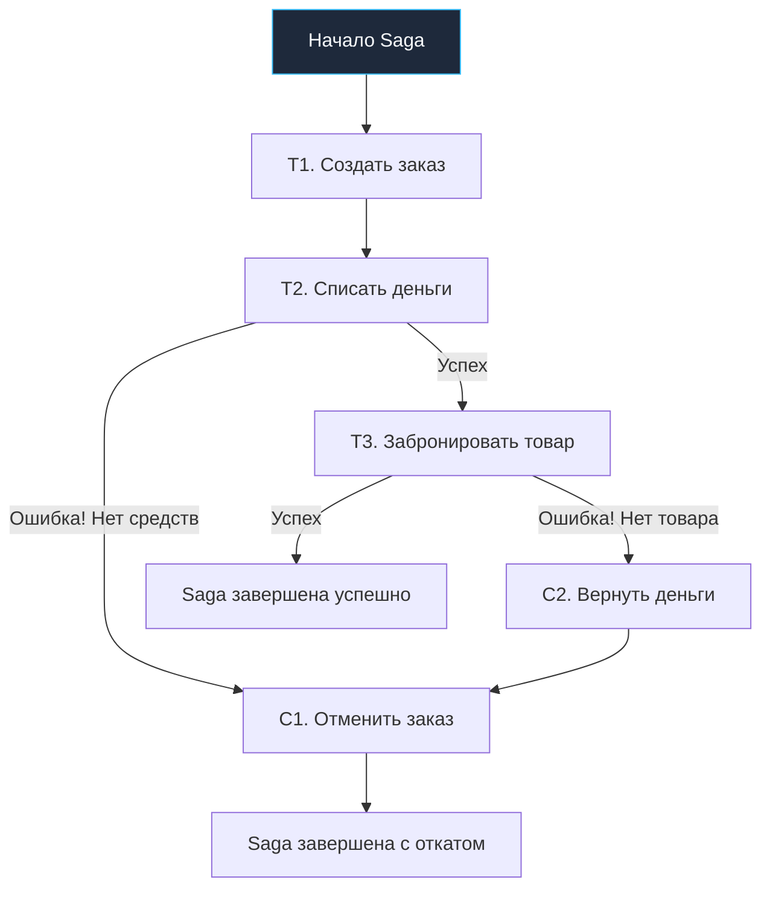
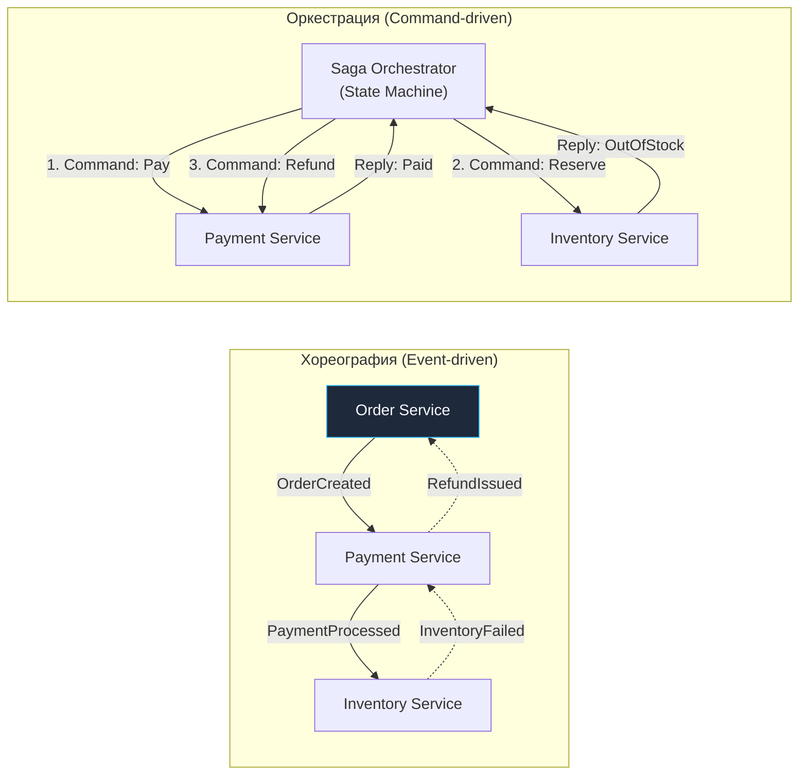

## Транзакции в микросервисах: Проблема распределенного состояния

> *"В распределенных системах нет магии. Если вы попытаетесь притвориться, что сеть мгновенна, а чужая база данных — это часть вашей локальной памяти, расплата наступит в виде зависших блокировок и мертвого продакшена."*  
> — Брайан Керниган

В классической монолитной архитектуре с реляционной базой данных (будь то PostgreSQL или MySQL) разработчики привыкли к комфорту и математической строгости **ACID-транзакций**. Мы открываем транзакцию через `BEGIN`, вносим изменения в три разные таблицы, и если на четвертом шаге что-то пошло не так — база данных мгновенно выполняет спасительный `ROLLBACK`. За эту атомарность и изоляцию отвечают низкоуровневые механизмы СУБД: журнал упреждающей записи (Write-Ahead Log, WAL), блокировки строк (row-level locks) и многоверсионное управление конкурентным доступом (MVCC).

Однако в микросервисной архитектуре этот уютный монолитный рай исчезает. Золотой стандарт изоляции гласит: **Database per Service** (у каждого сервиса — собственная независимая база данных). Сервис заказов не имеет прямого доступа к таблицам сервиса платежей или склада.

Представьте хрестоматийный сценарий оформления покупки в интернет-магазине:
1. Сервис **Orders** создает запись о заказе в статусе ожидания.
2. Сервис **Payments** списывает денежные средства с банковской карты покупателя.
3. Сервис **Inventory** резервирует запрашиваемые товары на складе.

Что произойдет, если на третьем шаге сервис Inventory падает с фатальной ошибкой: *«Товар только что закончился на складе»*?
Деньги у пользователя уже списаны! В монолите один системный вызов СУБД выполнил бы `ROLLBACK`, откатив списание и создание заказа. Но в распределенной системе у нас нет единого WAL, нет общих блокировок и нет единого координатора транзакций. Вызывающий сервис не может просто послать `ROLLBACK` в чужую базу данных.

Если мы ничего не предпримем, система окажется в рассогласованном состоянии: деньги у клиента украдены, а товар не выдан. Нам необходим инженерный паттерн, гарантирующий согласованность данных **в конечном итоге** (Eventual Consistency) без использования тяжелых и блокирующих сетевых протоколов.

Этот паттерн носит имя **Saga**.

---

## Что такое Saga?

**Saga** — это архитектурный паттерн проектирования распределенных систем, при котором длинная распределенная бизнес-транзакция (Long Lived Transaction, LLT) разбивается на упорядоченную цепочку независимых **локальных транзакций**.

Каждая локальная транзакция обновляет состояние строго в рамках одной изолированной базы данных своего сервиса и публикует во внешнюю шину (Kafka, RabbitMQ, NATS) сообщение или событие, которое инициирует выполнение следующей локальной транзакции в соседнем сервисе.

> [!info] Под капотом
> Изначально концепция Saga была сформулирована Гектором Гарсиа-Молиной (Hector Garcia-Molina) и Кеннетом Салемом в 1987 году в Принстонском университете как способ управления долгоживущими транзакциями в мейнфреймах СУБД. В современной распределенной микросервисной среде Saga трансформировалась в фундаментальный стандарт координации состояния без использования распределенных блокировок (Distributed Locks) и протокола двухфазного коммита (2PC), которые в условиях реальной сети становятся главным источником хвостовых задержек (tail latency) и едиными точками отказа.

Фундаментальный постулат Saga: если какой-либо промежуточный шаг распределенной цепочки завершается бизнес-ошибкой или фатальным сбоем, система обязана запустить строго определенную цепочку **компенсирующих транзакций** (Compensating Transactions), которые семантически нейтрализуют все изменения, внесенные предыдущими успешными шагами.

### Принцип работы

Формально Saga $T$ представляется в виде последовательности дискретных шагов:
$$T = \{T_1, T_2, T_3, \dots, T_n\}$$

Для каждого прямого шага $T_i$ (за исключением финального, подтверждающего) проектируется парное компенсирующее действие $C_i$:
- $T_i$ — локальная транзакция, двигающая процесс вперед (например, списание баланса);
- $C_i$ — компенсирующая транзакция, откатывающая последствия $T_i$ (например, возврат списанных средств).

Алгоритм выполнения:
1. Выполняется шаг $T_1$. Если успешно — инициируется шаг $T_2$.
2. Если $T_2$ завершился успешно — запускается $T_3$.
3. Если на шаге $k$ ($T_k$) происходит сбой (нехватка товара, отказ валидации):
   - Прямой ход прерывается;
   - Координатор запускает обратную волну компенсаций: $C_{k-1}, C_{k-2}, \dots, C_1$.



Важно понимать: компенсация — это **не физический откат** памяти или строк БД к исходному состоянию (как в WAL). Это **новое прямое действие**, компенсирующее бизнес-эффект. Например, если $T_2$ списал 1000 рублей, то $C_2$ зачисляет 1000 рублей обратно, оставляя в истории аудита две явные бухгалтерские проводки.

---

## Два способа координации: Хореография vs Оркестрация

Выбор способа координации участников саги — это классический инженерный компромисс между автономностью компонентов и когнитивной сложностью системы.



### 1. Хореография (Choreography)

Хореография — это полностью децентрализованный подход. В системе нет начальника или центрального дирижера. Сервисы общаются исключительно языком фактов — бизнес-событий (Events) через общую шину сообщений:

- **Шаг 1:** Сервис Order Service создает запись в БД и публикует событие `OrderCreated`.
- **Шаг 2:** Сервис Payment Service подписан на события заказов. Услышав `OrderCreated`, он списывает деньги и публикует событие `PaymentProcessed`.
- **Шаг 3:** Сервис Inventory Service слушает событие `PaymentProcessed`, пытается зарезервировать складские остатки, обнаруживает пустую полку и публикует событие `InventoryFailed`.
- **Откат:** Payment Service подписан на событие `InventoryFailed`. Получив его, он немедленно выполняет возврат средств и публикует `RefundIssued`, по которому Order Service переводит заказ в статус `Cancelled`.

**Преимущества хореографии:**
- Предельная простота на ранних этапах (для цепочек из 2–3 сервисов);
- Слабая связность (сервисы ничего не знают об адресах и интерфейсах друг друга, они знают только контракты событий);
- Отсутствие дополнительной инфраструктуры в виде сервиса-координатора.

**Недостатки хореографии:**
- **Spaghetti Logic:** Бизнес-логика транзакции размазана по кодовым базам разных команд. Чтобы понять, как работает жизненный цикл заказа, инженеру приходится собирать мозаику из десятка репозиториев;
- **Риск циклических зависимостей:** Сервис A слушает события от B, а сервис B подписан на побочные события A;
- **Сложность мониторинга и отладки:** Без сквозного Distributed Tracing невозможно восстановить текущую стадию выполнения саги.

> [!warning] Ловушка / Gotcha
> При хореографии легко столкнуться с проблемой "Lost Update" или неопределенности состояния. Если Payment Service успешно списал деньги, но упал перед публикацией события `PaymentProcessed`, система зависнет в неопределенном состоянии. Обязательно используй паттерн **Outbox** для гарантии доставки событий.

### 2. Оркестрация (Orchestration)

Оркестрация — это централизованный подход. За координацию процесса отвечает специализированный компонент — **Saga Orchestrator** (дирижер). Оркестратор отправляет участникам асинхронные команды («сделай действие X») и ожидает от них ответов о статусе выполнения:

1. Оркестратор отправляет команду сервису платежей: *«Списать $100 за заказ #42»*.
2. Получает статус-ответ: *«Успешно списано»*.
3. Отправляет команду сервису склада: *«Забронировать 1 шт. товара #99»*.
4. Получает статус-ответ: *«Ошибка: товара нет на складе»*.
5. Принимает управленческое решение о запуске компенсации: отправляет сервису платежей команду *«Вернуть $100 за заказ #42»*.

**Преимущества оркестрации:**
- Единый центр управления: весь сценарий транзакции и логика ветвлений зафиксированы в одном месте (в коде конечного автомата оркестратора);
- Легкость модификации: добавление нового шага (например, отправка SMS-уведомления) требует изменения только кода оркестратора, а не всех сервисов цепочки;
- Простота мониторинга: статус любой транзакции можно мгновенно узнать по ID саги из базы оркестратора.

**Недостатки оркестрации:**
- Появление выделенного сервиса-оркестратора, требующего поддержки отказоустойчивости и репликации;
- Опасность превращения оркестратора в «умного бога» (God Object), отбирающего бизнес-логику у доменных сервисов (сервисы рискуют выродиться в анемичные CRUD-хранилища).

> [!tip] Собеседование
> **Вопрос:** Какой подход выбрать на практике — хореографию или оркестрацию?  
> **Ответ:**  
> Если распределенный процесс короткий и линейный (2–3 сервиса, отсутствие сложных ветвлений) — выбирайте **Хореографию**, чтобы не усложнять инфраструктуру.  
> Если бизнес-процесс насчитывает 4 и более шагов, имеет сложные правила ветвления, условные переходы или требует строгого SLA и контроля тайм-аутов — выбирайте **Оркестрацию** (самописный конечный автомат на Go или готовые движки вроде Temporal / Cadence). Оркестрация радикально снижает когнитивную нагрузку и стоимость поддержки системы.

---

## Реализация Оркестратора на Go

В языке Go надежный оркестратор проектируется как персистентный конечный автомат (State Machine). Состояние каждого экземпляра саги обязано сохраняться в транзакционном хранилище оркестратора (PostgreSQL / SQLite) перед отправкой каждой сетевой команды. Это гарантирует, что при внезапном падении pod'а оркестратор после перезапуска прочитает журнал и продолжит сагу с прерванного шага.

### Структуры данных состояния саги

```go
package saga

import (
	"time"

	"github.com/google/uuid"
)

type SagaStatus string

const (
	StatusRunning      SagaStatus = "RUNNING"
	StatusCompleted    SagaStatus = "COMPLETED"
	StatusCompensating SagaStatus = "COMPENSATING" // Идет откат предыдущих шагов
	StatusFailed       SagaStatus = "FAILED"       // Сага завершилась с бизнес-ошибкой
)

// SagaStep описывает состояние конкретного этапа
type SagaStep struct {
	Name       string     `json:"name"`
	Status     SagaStatus `json:"status"`
	Compensate bool       `json:"compensate"` // Требуется ли компенсация при откате
}

// SagaInstance представляет персистентный слепок транзакции
type SagaInstance struct {
	ID          uuid.UUID  `json:"id"`
	OrderID     uuid.UUID  `json:"order_id"`
	CurrentStep int        `json:"current_step"`
	Status      SagaStatus `json:"status"`
	Steps       []SagaStep `json:"steps"`
	CreatedAt   time.Time  `json:"created_at"`
	UpdatedAt   time.Time  `json:"updated_at"`
}

type SagaReply struct {
	SagaID  uuid.UUID
	Step    int
	Success bool
	Error   string
}
```

### Обработчик шагов (упрощенно)

Оркестратор обрабатывает асинхронные ответы от сервисов-исполнителей и переводит автомат в следующее состояние:

```go
package saga

import (
	"log/slog"
	"time"
)

type Repository interface {
	GetSaga(id uuid.UUID) (*SagaInstance, error)
	Save(saga *SagaInstance) error
}

type Orchestrator struct {
	repo Repository
}

func (o *Orchestrator) HandleReply(reply SagaReply) {
	// Загружаем состояние Saga из БД (чтобы быть устойчивыми к падениям)
	saga, err := o.repo.GetSaga(reply.SagaID)
	if err != nil {
		slog.Error("Critical: saga state retrieval failed", "saga_id", reply.SagaID, "err", err)
		return
	}

	saga.UpdatedAt = time.Now().UTC()

	if reply.Success {
		saga.Steps[saga.CurrentStep].Status = StatusCompleted
		saga.CurrentStep++

		// Проверяем, был ли это финальный шаг
		if saga.CurrentStep == len(saga.Steps) {
			saga.Status = StatusCompleted
			if err := o.repo.Save(saga); err != nil {
				slog.Error("Failed to persist completed saga", "err", err)
			}
			slog.Info("Saga successfully completed", "saga_id", saga.ID)
			return
		}

		// Запускаем исполнение следующей команды
		o.executeStep(saga, saga.CurrentStep)
	} else {
		// Ошибка шага! Переходим в режим компенсации
		slog.Warn("Step failed, initiating compensation", 
			"saga_id", saga.ID, 
			"failed_step", saga.CurrentStep, 
			"error", reply.Error,
		)
		saga.Status = StatusCompensating
		o.compensate(saga)
	}

	if err := o.repo.Save(saga); err != nil {
		slog.Error("Failed to save saga state", "err", err)
	}
}

func (o *Orchestrator) compensate(saga *SagaInstance) {
	// Двигаемся в строгом обратном порядке от последнего завершенного шага
	for i := saga.CurrentStep - 1; i >= 0; i-- {
		step := &saga.Steps[i]
		if step.Status == StatusCompleted && step.Compensate {
			slog.Info("Dispatching compensation command", "saga_id", saga.ID, "step", step.Name)
			o.sendCompensateCommand(saga.ID, *step)
		}
	}
	saga.Status = StatusFailed
}

func (o *Orchestrator) executeStep(saga *SagaInstance, stepIdx int) {
	// Отправка команды в шину сообщений (Kafka/RabbitMQ)
}

func (o *Orchestrator) sendCompensateCommand(sagaID uuid.UUID, step SagaStep) {
	// Отправка компенсирующей команды в шину сообщений
}
```

---

## Проблемы и аномалии Saga

Классические базы данных гарантируют уровень изолированности транзакций (Isolation в ACID). **Saga не обеспечивает изолированности на глобальном уровне.**  
Каждая локальная транзакция коммитит свои изменения в базу данных немедленно. Это означает, что промежуточное состояние системы видно другим параллельным процессам. Это порождает классические распределенные аномалии:

### 1. Lost Updates (Потерянные обновления)

Возникает, когда две параллельные саги одновременно читают и модифицируют один и тот же агрегат без координации:
- Сага A читает баланс кошелька клиента: `$100`.
- Сага B параллельно читает тот же баланс: `$100`.
- Сага A выполняет списание `$10` и записывает: `$90`.
- Сага B выполняет списание `$10` и записывает: `$90`.
- **Итог:** со счета списано $20, но итоговый баланс равен $90 вместо $80. Одно списание бесследно утеряно.

**Решение:** Отказ от неявных перезаписей в пользу оптимистичных блокировок (Optimistic Concurrency Control) с инкрементом версии:
```sql
UPDATE accounts 
SET balance = balance - 10, version = version + 1 
WHERE id = $1 AND version = $2;
```
Если строка уже изменена другой транзакцией, запрос обновит 0 строк, и приложение повторит операцию с актуальным балансом.

### 2. Dirty Reads (Грязное чтение)

Внешний наблюдатель видит промежуточный результат незаконченной саги:
- Сага заказа списала $100 с карты покупателя (Шаг $T_2$).
- Пользователь открывает личный кабинет и видит уведомление: *«Оплата подтверждена»*.
- На шаге $T_3$ склад сообщает об отсутствии товара. Запускается компенсация $C_2$.
- Деньги возвращаются, но пользователь в течение нескольких секунд наблюдал ложное состояние успешной покупки.

**Решение:** Использование **семантических блокировок** (Semantic Locks). Сервисы не переводят сущности в терминальные состояния до завершения саги. Заказ создается с промежуточным статусом: `status: PENDING`. Интерфейсы и внешние системы не показывают клиенту статус «Успешно» до получения финального события подтверждения от оркестратора.

---

## Semantic Lock и идемпотентность

В ненадежной распределенной сети сообщения могут теряться, приходить с задержкой или дублироваться. Если оркестратор отправил команду списания, но из-за сетевого сбоя не получил ответ вовремя, он обязан повторить команду. 

Если хэндлер сервиса не обладает **идемпотентностью**, повторный запрос спишет деньги еще раз!

Для обеспечения надежности в Go используется связка уникального ключа идемпотентности (`Idempotency-Key`), генерируемого оркестратором, и локальной транзакции базы данных:

```go
package payment

import (
	"context"
	"database/sql"
	"fmt"
)

type WithdrawCommand struct {
	IdempotencyKey string
	AccountID      string
	Amount         int64
}

type PaymentService struct {
	db *sql.DB
}

func (s *PaymentService) Withdraw(ctx context.Context, cmd WithdrawCommand) error {
	// Открываем локальную ACID транзакцию
	tx, err := s.db.BeginTx(ctx, &sql.TxOptions{Isolation: sql.LevelReadCommitted})
	if err != nil {
		return fmt.Errorf("failed to begin tx: %w", err)
	}
	defer tx.Rollback()

	// 1. Пытаемся зафиксировать IdempotencyKey в служебной таблице
	// PRIMARY KEY гарантирует, что дубликат команды будет отклонен СУБД
	const insertKeyQuery = `
		INSERT INTO processed_commands (idempotency_key, created_at)
		VALUES ($1, NOW())
		ON CONFLICT (idempotency_key) DO NOTHING;
	`
	res, err := tx.ExecContext(ctx, insertKeyQuery, cmd.IdempotencyKey)
	if err != nil {
		return fmt.Errorf("idempotency check query failed: %w", err)
	}

	rowsAffected, err := res.RowsAffected()
	if err != nil {
		return err
	}

	// Если ключ уже существовал в БД — мы уже обрабатывали этот запрос!
	if rowsAffected == 0 {
		// Идемпотентно завершаем: возвращаем nil, дубликат безопасно проигнорирован
		return nil
	}

	// 2. Выполняем бизнес-логику списания
	const withdrawQuery = `
		UPDATE accounts 
		SET balance = balance - $1 
		WHERE id = $2 AND balance >= $1;
	`
	res, err = tx.ExecContext(ctx, withdrawQuery, cmd.Amount, cmd.AccountID)
	if err != nil {
		return fmt.Errorf("failed to withdraw funds: %w", err)
	}

	affected, err := res.RowsAffected()
	if err != nil || affected == 0 {
		return fmt.Errorf("insufficient funds or account not found")
	}

	// Фиксируем локальную транзакцию
	return tx.Commit()
}
```

---

## Сравнение с 2PC (Two-Phase Commit)

Почему индустрия практически отказалась от классического двухфазного коммита (2PC / XA) в микросервисах в пользу Saga?

| Характеристика | 2PC (Two-Phase Commit) | Saga Pattern |
|---|---|---|
| **Уровень согласованности** | Строгая согласованность (Linearizability / ACID) | Согласованность в конечном итоге (Eventual Consistency / BASE) |
| **Изоляция транзакций** | Строгая изоляция (Serializability) | Отсутствует на уровне всей саги (требуются семантические блокировки) |
| **Блокировки ресурсов** | Удерживает тяжелые блокировки строк в БД на всё время сетевого раунда | Никаких распределенных блокировок; локальные транзакции коммитятся мгновенно |
| **Производительность** | Катастрофически низкая при росте числа узлов (зависит от самого медленного узла) | Высокая пропускная способность за счет асинхронного обмена сообщениями |
| **Отказоустойчивость** | Низкая: падение координатора замораживает ресурсы в неопределенном состоянии (In-doubt) | Высокая: сервисы автономны, состояние саги персистентно сохраняется |
| **Реализация** | Встроена в протоколы СУБД (тяжело масштабируется) | Реализуется кодом приложения и компенсирующими транзакциями |

**Инженерный вывод:** В мире высоконагруженных распределенных сервисов, где сетевые задержки колеблются от единиц до сотен миллисекунд, 2PC превращает систему в хрупкий карточный домик. **Saga** жертвует мгновенной изолированностью ради высокой доступности и линейной масштабируемости.

---

## Итог

1. **Saga** решает фундаментальную проблему распределенного состояния при паттерне Database per Service, заменяя недостижимый глобальный ACID на цепочку локальных транзакций с компенсацией.
2. В случае бизнес-ошибки или аппаратного сбоя координатор не может выполнить аппаратный `ROLLBACK`, поэтому он разворачивает процесс вспять серией **компенсирующих транзакций**.
3. **Хореография** идеальна для коротких взаимодействий (2–3 сервиса) без сложного ветвления, тогда как **Оркестрация** на базе конечного автомата необходима для прозрачного управления сложными процессами.
4. Отсутствие строгой изоляции требует превентивных мер: применения семантических блокировок (`status: PENDING`), оптимистичной конкурентности (версионирование) и обязательной **идемпотентности** всех обработчиков команд.

В следующей статье мы разберем паттерн, который разделяет архитектуру чтения и изменения данных и часто работает рука об руку с Saga и Event Sourcing — [[2. CQRS]].