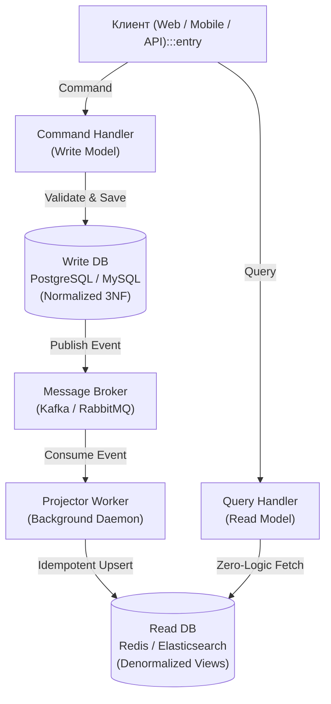

## CQRS: Разделение ответственности за команду и запрос

> *"Спрашивать — не значит менять. Менять — не значит спрашивать. Смешение этих двух намерений в одной структуре данных — верный способ превратить простую программу в клубок неразрешимых компромиссов."*  
> — Брайан Керниган

В традиционной программной инженерии (например, при использовании паттерна Active Record в PHP Laravel, Django ORM в Python или Hibernate/Doctrine в корпоративной Java) разработчики привыкли оперировать единой унифицированной моделью данных как для записи, так и для чтения. Мы определяем сущность `User`, мутируем её внутреннее состояние через геттеры и сеттеры (`setName`, `setEmail`), вызываем метод сохранения в реляционную таблицу `users`, а затем эту же самую тяжелую сущность вычитываем из базы данных, чтобы отобразить имя пользователя в шапке веб-интерфейса.

Этот канонический подход — CRUD (Create, Read, Update, Delete) — безупречно решает задачи на этапе прототипирования и прекрасно масштабируется в небольших приложениях со скромной нагрузкой. Однако по мере роста бизнеса, усложнения бизнес-правил и взрывного увеличения трафика единая модель неизбежно начинает трещать по швам под тяжестью взаимоисключающих требований.

**CQRS (Command Query Responsibility Segregation)** — это архитектурный паттерн, восходящий к принципу CQS Бертрана Мейера (Command-Query Separation), который формулирует фундаментальный закон: **Модель, предназначенная для изменения состояния системы (Command), должна быть физически и логически отделена от модели, предназначенной для чтения состояния (Query).**

---

## Зачем разделять чтение и запись?

В высоконагруженных распределенных системах профили нагрузки, требования к транзакционности и форматы данных для чтения и записи диаметрально противоположны:

1. **Операции записи (Write / Commands):**
   - **Требования:** Строгая изоляция инвариантов, валидация сложных бизнес-правил, атомарность транзакций (ACID).
   - **Модель данных:** Глубоко нормализованные структуры (3NF / Бойса-Кодда), исключающие дублирование данных и аномалии обновления.
   - **Профиль нагрузки:** Относительно невысокая частота (write-to-read ratio обычно составляет от 1:10 до 1:1000).
   - **Цена:** Сложные проверки и блокировки строк в СУБД.

2. **Операции чтения (Read / Queries):**
   - **Требования:** Минимальная хвостовая задержка (low latency), максимальная пропускная способность (QPS), готовность отдавать данные миллионам клиентов одновременно.
   - **Модель данных:** Денормализованные представления, предрассчитанные агрегаты, плоские DTO (Data Transfer Objects), исключающие дорогие операции `JOIN`.
   - **Профиль нагрузки:** Огромный непрерывный поток запросов.
   - **Цена:** Согласие на согласованность в конечном итоге (Eventual Consistency).

Попытка обслужить оба мира одной универсальной моделью неизбежно загоняет архитектора в ловушку компромиссов. Индексы в базе данных, призванные ускорить выборки `SELECT`, драматически замедляют вставки `INSERT` и обновления `UPDATE`, так как B-Tree деревья перебалансируются на каждую запись. Бизнес-логика, инкапсулированная в агрегаты, навешивает накладные расходы на тривиальные выборки списка пользователей.

> [!info] Под капотом
> С точки зрения Mechanical Sympathy, паттерн CQRS позволяет кардинально оптимизировать работу процессора с оперативной памятью и L1/L2/L3 кэшами:
> - **Write Model:** Содержит сложные доменные агрегаты с глубокими графами объектов, указателями и методами валидации инвариантов. В Go это тяжелые структуры, требующие аллокаций в куче и регулярного сканирования сборщиком мусора (Garbage Collector).
> - **Read Model:** Это предельно компактные, плоские структуры данных (DTO), лишенные бизнес-методов. В Go они идеально укладываются в 64-байтные кэш-линии (Cache Lines) процессора, прекрасно аллоцируются на стеке или переиспользуются через пулы, позволяя отдавать десятки тысяч HTTP/gRPC ответов в секунду без лишней нагрузки на аллокатор и GC.

---

## Архитектура CQRS

Хотя паттерн CQRS можно реализовать даже в рамках одной таблицы монолитной базы данных (просто разделяя Go-интерфейсы на команды и запросы), его истинная мощь раскрывается в распределенных архитектурах с независимыми хранилищами.



### 1. Командная сторона (Write Side)

Командная сторона — это логический «мозг» системы. Здесь безраздельно властвуют принципы предметно-ориентированного проектирования (Domain-Driven Design, DDD): богатые **Агрегаты**, границы контекстов (Bounded Contexts) и инварианты предметной области.

- **Вход:** `Command` — иммутабельная структура данных, выражающая намерение изменить состояние (например, `CreateOrderCommand`). Команда всегда формулируется в повелительном наклонении.
- **Обработка:** Команда поступает в `OrderCommandHandler`. Обработчик открывает транзакцию, загружает агрегат из репозитория, вызывает доменный метод, проверяет правила и сохраняет обновленный агрегат.
- **Хранилище:** Оптимизировано под надежную транзакционную запись (PostgreSQL, MySQL).
- **Результат:** При успешном коммите транзакции генерируется доменное событие в прошедшем времени — `OrderCreatedEvent`.

**Пример реализации Command Handler на Go:**

```go
package order

import (
	"context"
	"fmt"
	"time"

	"github.com/google/uuid"
)

// CreateOrderCommand выражает намерение клиента оформить заказ
type CreateOrderCommand struct {
	OrderID   uuid.UUID
	UserID    uuid.UUID
	ProductID uuid.UUID
	Quantity  int
}

type OrderRepository interface {
	Save(ctx context.Context, order *Order) error
	Load(ctx context.Context, id uuid.UUID) (*Order, error)
}

type EventPublisher interface {
	Publish(ctx context.Context, topic string, event any) error
}

type OrderCommandHandler struct {
	repo      OrderRepository
	publisher EventPublisher
}

func (h *OrderCommandHandler) Handle(ctx context.Context, cmd CreateOrderCommand) error {
	// 1. Создание нового агрегата или загрузка существующего
	order := NewOrder(cmd.OrderID, cmd.UserID, cmd.ProductID, cmd.Quantity)

	// 2. Валидация инвариантов бизнес-логики внутри агрегата
	if err := order.Validate(); err != nil {
		return fmt.Errorf("business validation failed: %w", err)
	}

	// 3. Транзакционное сохранение состояния агрегата в Write DB
	if err := h.repo.Save(ctx, order); err != nil {
		return fmt.Errorf("write repository save error: %w", err)
	}

	// 4. Публикация доменного события для подписчиков и проекторов
	// Write Side ничего не знает о том, какие именно Read Models существуют в системе!
	event := NewOrderCreatedEvent(order)
	if err := h.publisher.Publish(ctx, "order-events", event); err != nil {
		// В реальном проде здесь применяется Transactional Outbox Pattern
		return fmt.Errorf("failed to publish order event: %w", err)
	}

	return nil
}
```

### 2. Сторона запросов (Read Side)

Сторона запросов — это «витрина» системы. Здесь полностью отсутствует сложная бизнес-логика, транзакционные блокировки и агрегаты. Её единственная цель — молниеносно вернуть клиенту заранее подготовленные данные.

- **Вход:** `Query` — структура запроса параметров чтения (например, `GetOrderQuery`).
- **Обработка:** `QueryHandler` выполняет прямой плоский `SELECT` или `GET` по первичному ключу из оптимизированного хранилища чтения.
- **Хранилище:** Оптимизировано под чтение (Redis, Elasticsearch, ClickHouse, денормализованные таблицы или Materialized Views в PostgreSQL).

**Пример реализации Query Handler на Go:**

```go
package order

import (
	"context"
	"database/sql"
	"fmt"

	"github.com/google/uuid"
)

type GetOrderQuery struct {
	OrderID uuid.UUID
}

// OrderDTO представляет плоскую структуру ответа для фронтенда
type OrderDTO struct {
	ID        string `json:"id"`
	UserName  string `json:"user_name"` // Имя покупателя уже денормализовано! Никаких JOIN с таблицей users
	Product   string `json:"product"`
	Status    string `json:"status"`
	CreatedAt string `json:"created_at"`
}

type OrderQueryHandler struct {
	readDB *sql.DB // Или клиент Redis / Elasticsearch
}

func (h *OrderQueryHandler) Handle(ctx context.Context, query GetOrderQuery) (*OrderDTO, error) {
	// Никакой бизнес-логики, валидации инвариантов или вызова методов домена.
	// Данные извлекаются из плоской предрассчитанной таблицы orders_view
	var dto OrderDTO
	const querySQL = `
		SELECT id, user_name, product, status, created_at 
		FROM orders_view 
		WHERE id = $1;
	`
	err := h.readDB.QueryRowContext(ctx, querySQL, query.OrderID).Scan(
		&dto.ID,
		&dto.UserName,
		&dto.Product,
		&dto.Status,
		&dto.CreatedAt,
	)
	if err != nil {
		if err == sql.ErrNoRows {
			return nil, fmt.Errorf("order not found: %w", err)
		}
		return nil, fmt.Errorf("failed to execute read query: %w", err)
	}

	return &dto, nil
}
```

---

## Projection (Проекции)

Ключевым звеном, соединяющим разделенный мир CQRS, является **Проектор (Projector)**. Это фоновый асинхронный воркер, который подписывается на поток событий от командной стороны и материализует плоские проекции (Read Models).

Именно в проекторе происходит инженерное таинство денормализации.
Представьте событие `UserChangedEmail`. На стороне записи (Write DB) мы обновили всего одну строчку в реляционной таблице `users`. Однако на стороне чтения у нас развернут кластер Elasticsearch или плоская таблица `orders_view`, в которой имя и email покупателя продублированы в каждой исторической записи заказа для мгновенной фильтрации.

Проектор получает событие `UserChangedEmail`, находит все соответствующие строки в `orders_view` и выполняет пакетный апдейт:

```
Событие: UserChangedEmail {UserID: 42, NewEmail: "alice@example.com"}
                              |
                     [Kafka Consumer / Projector]
                              |
       +----------------------+----------------------+
       |                                             |
       v                                             v
[Read DB: orders_view]                      [Search DB: Elastic]
Обновить email во всех                      Обновить документы
заказах пользователя #42                    в поисковом индексе
```

> [!warning] Ловушка / Gotcha
> **Eventual Consistency (Согласованность в конечном итоге):**
> При асинхронной схеме CQRS сторона чтения обновляется с небольшой сетевой задержкой (от единиц миллисекунд до секунд при лаге брокера).  
> Классический сценарий: пользователь меняет профиль, нажимает кнопку «Сохранить», получает ответ `200 OK`, страница мгновенно перезагружается — и пользователь видит свой **старый** email!  
> Это естественное поведение eventual consistency, которое может вызвать панику у бизнеса.  
> **Инженерные решения:**  
> 1. *Optimistic UI Updates:* Клиентский фреймворк на фронтенде не ждет перезапроса с сервера, а сразу локально обновляет интерфейс новым значением.  
> 2. *Read-Your-Own-Writes:* Сервер отдает токен версии или отправляет пользователя читать свежие данные со стороны записи (или кэша) в течение первых 2 секунд после мутации.

---

## Polyglot Persistence (Полиглотное хранение)

CQRS выступает идеальным архитектурным трамплином для перехода к полиглотному хранению данных (Polyglot Persistence): использованию специализированных СУБД под каждую задачу вместо одной универсальной базы данных:

- **Write DB (PostgreSQL / CockroachDB):** Строгий ACID, реляционная модель, гарантия целостности внешних ключей (Foreign Keys), транзакционные блокировки.
- **Read DB (Специализированные движки):**
  - **Redis / Dragonfly:** Сверхбыстрое чтение горячих профилей пользователей, сессий и корзин по первичному ключу за доли миллисекунды из оперативной памяти;
  - **Elasticsearch / Meilisearch:** Мгновенный полнотекстовый поиск, нечеткое сопоставление (fuzzy search), фасетная фильтрация по каталогу товаров;
  - **ClickHouse:** Аналитические дашборды, тяжелые OLAP-агрегаты по миллионам заказов в реальном времени;
  - **Neo4j:** Анализ графов социальных связей и рекомендательных систем.

В Go воркеры-проекторы оформляются как конкурентные слушатели очередей сообщений:

```go
package projection

import (
	"context"
	"log/slog"
)

type Projector struct {
	consumer Consumer
}

func (p *Projector) Run(ctx context.Context) {
	for {
		select {
		case <-ctx.Done():
			slog.Info("Stopping projection worker")
			return
		case msg, ok := <-p.consumer.Messages():
			if !ok {
				return
			}

			event := p.deserialize(msg.Value)

			// Идемпотентно проецируем событие в соответствующую Read Model
			switch e := event.(type) {
			case *OrderCreatedEvent:
				p.handleOrderCreated(ctx, e)
			case *UserChangedEmailEvent:
				p.handleUserEmailChanged(ctx, e)
			}

			// Фиксируем смещение (Offset) только после успешного обновления Read DB
			p.consumer.CommitMessages(ctx, msg)
		}
	}
}
```

---

## Когда НЕЛЬЗЯ использовать CQRS

CQRS — это тяжелая инженерная артиллерия. Он решает проблемы масштабирования ценой резкого усложнения инфраструктуры.

Внедряя CQRS, вы берете на себя обязательства:
1. Развернуть и эксплуатировать брокер сообщений высокой доступности (Kafka, RabbitMQ);
2. Написать, протестировать и поддерживать код десятков воркеров-проекторов;
3. Синхронизировать схемы данных между разнородными СУБД;
4. Реализовать механизмы разрешения рассинхронизации (Event Replay, Repair Scripts) и надежную публикацию (Transactional Outbox).

> [!tip] Собеседование
> **Вопрос:** В каких случаях внедрение CQRS архитектурно оправдано, а когда является грубой ошибкой?  
> **Ответ:**  
> **Оправдано:**  
> 1. Радикальная асимметрия нагрузки (соотношение чтений к записям $100:1$ или $1000:1$).  
> 2. Сложная валидация инвариантов на записи, которая требует тяжелых агрегатов, мешающих быстрым выборкам.  
> 3. Данные требуются во множестве принципиально разных форматов отображения (поиск, аналитика, мобильные клиенты, кэш).  
>  
> **Категорически не рекомендуется:**  
> Для классических CRUD-приложений (блоги, системы учета, простые административные панели), где требования к чтению и записи совпадают, а нагрузка невелика. Попытка натянуть CQRS на простой CRUD — хрестоматийный пример вредоносного Overengineering, порождающий «распределенный монолит» и ад сопровождения.

---

## Связь с Event Sourcing

В профессиональной литературе CQRS практически всегда упоминается в одном предложении с паттерном [[3. Event sourcing]]. Из-за этого многие начинающие инженеры ошибочно считают их синонимами. 

Это фундаментальное заблуждение. **CQRS и Event Sourcing — концептуально ортогональные паттерны:**
- **CQRS** разделяет *модели* доступа: одна модель для изменения, другая — для чтения.
- **Event Sourcing** меняет *метод персистентности*: мы перестаем хранить текущее состояние сущности, а сохраняем полный упорядоченный журнал всех произошедших с ней событий (Event Log).

Однако вместе они образуют идеальный симбиоз. Дело в том, что хранилище событий (Event Store) на запись оптимизировано феноменально (это чистый последовательный Append-Only лог), но выполнять по нему произвольные выборки и фильтрации практически невозможно. CQRS естественным образом решает этот недостаток: Event Store становится идеальной Write DB, а проекторы непрерывно строят денормализованные Read Models для любых пользовательских запросов.

---

## Итог

- Паттерн **CQRS** разделяет систему на независимые половины: Command Side (бизнес-инварианты, транзакционность, нормализация) и Query Side (быстрые плоские DTO, денормализация, кэши).
- Разделение моделей позволяет независимо масштабировать чтение и запись, а также внедрять полиглотное хранение (Polyglot Persistence).
- Плата за CQRS — появление задержки обновления проекций (**Eventual Consistency**) и необходимость инфраструктуры фоновой проекции событий.
- Воркеры-проекторы в Go реализуются как надежные потоковые консьюмеры с ручным коммитом смещений (offsets) и гарантией идемпотентности.

В следующей главе мы разберем паттерн [[3. Event sourcing]], который заменяет традиционные перезаписи состояния на вечный, иммутабельный журнал событий.