## Event Sourcing: Храним историю, а не состояние

> *"Бухгалтеры не пользуются ластиком. Если в бухгалтерской книге допущена ошибка, они делают компенсирующую проводку, сохраняя всю хронологию операций. Программистам следовало бы поучиться у финансистов, открывших Event Sourcing за пятьсот лет до появления первых ЭВМ."*  
> — Брайан Керниган

В традиционном CRUD-ориентированном проектировании баз данных инженеры привыкли манипулировать **текущим состоянием** сущностей (Current State). Если клиент снимает деньги в банкомате, бэкенд выполняет тривиальный SQL-запрос `UPDATE accounts SET balance = balance - 100`. Предыдущее значение баланса в строке таблицы мгновенно и безвозвратно перезаписывается новым числом.

Но задумайтесь: что, если финансовый аудитор потребует поминутную историю всех движений средств за последние пять лет? Что, если в алгоритме начисления процентов обнаружился баг, и нам необходимо восстановить точный баланс на 12:00 вчерашнего дня? Что, если бизнес захочет проанализировать поведенческие паттерны клиентов («сколько раз пользователь открывал и закрывал корзину перед покупкой»)? В классической CRUD-модели эта критически важная контекстная информация уничтожена оператором `UPDATE`.

**Event Sourcing (ES)** — это архитектурный паттерн, переворачивающий парадигму персистентности с ног на голову. Вместо хранения мутабельного текущего снимка данных мы сохраняем **вечную, иммутабельную последовательность доменных событий**, которые привели систему в текущее состояние.

---

## Основная идея: Событие как источник истины

В архитектуре Event Sourcing состояние бизнес-сущности (Агрегата) не сохраняется в реляционных строках напрямую. Истинным источником правды (Single Source of Truth) объявляется **поток событий (Event Stream)**. Текущее состояние объекта динамически реконструируется («накатывается») в оперативной памяти путем последовательного воспроизведения всех событий с момента зарождения сущности.

> [!info] Под капотом
> С точки зрения архитектуры операционных систем и Mechanical Sympathy, Event Sourcing реализует фундаментальный паттерн **Append-Only Log** (журнал только для добавления).  
> При операции `UPDATE` в реляционной СУБД происходит случайная запись (Random Write): движку требуется найти страницу в B-Tree индексе, загрузить её в буферный пул, заблокировать строку, модифицировать память и сбросить грязную страницу на диск, вызывая фрагментацию и существенный Write Amplification.  
> В отличие от этого, запись в Append-Only хранилище событий — это строго последовательный ввод-вывод (Sequential I/O). Запись в конец файла не требует перемещения головок HDD и идеально укладывается в физические блоки памяти NVMe SSD, позволяя специализированным Event Store обрабатывать сотни тысяч транзакций в секунду при минимальных накладных расходах.

### Пример: Банковский счет

Сравним два подхода на элементарном примере управления банковским счетом:

- **CRUD подход:**  
  В таблице хранится одна мутабельная строка: `id: 1, balance: 900`. Откуда взялось это число? Было ли это одно пополнение на $900 или череда из ста переводов? Были ли отмены? Ответ навсегда утерян.
  
- **Event Sourcing подход:**  
  В базе данных хранится строгий хронологический журнал фактов:
  1. `AccountOpened` (initial_balance: 0)
  2. `MoneyDeposited` (amount: 1000)
  3. `MoneyWithdrawn` (amount: 100)
  4. `MoneyDeposited` (amount: 50)

Чтобы узнать текущий баланс счета, рантайм просто «проигрывает» математическую функцию свертки (Fold / Reduce) по массиву событий:
$$0 + 1000 - 100 + 50 = 950$$

```mermaid
flowchart LR
    classDef process  fill:#1e293b,stroke:#38bdf8,stroke-width:1px,color:#f8fafc
    classDef success  fill:#064e3b,stroke:#34d399,stroke-width:1px,color:#f8fafc
    classDef error    fill:#7f1d1d,stroke:#f87171,stroke-width:1px,color:#f8fafc
    classDef warning  fill:#78350f,stroke:#fbbf24,stroke-width:1px,color:#f8fafc
    classDef entry    fill:#1e3a5f,stroke:#38bdf8,stroke-width:2px,color:#f8fafc
    classDef aux      fill:#334155,stroke:#64748b,stroke-width:1px,color:#f8fafc
    classDef system   fill:#312e81,stroke:#a78bfa,stroke-width:1px,color:#f8fafc
    classDef data     fill:#132d29,stroke:#2dd4bf,stroke-width:1px,color:#f8fafc
    classDef network  fill:#881337,stroke:#fb7185,stroke-width:1px,color:#f8fafc
    classDef accent   fill:#1e1b4b,stroke:#818cf8,stroke-width:1px,color:#f8fafc
    A["Команда<br>Снять 100$"]:::process --> B["Агрегат Account"]
    B -->|Текущее состояние из событий| C["Проверка баланса >= 100"]
    C -->|Успех| D["Генерация события<br>MoneyWithdrawn"]
    D --> E["Event Store<br>(Append-Only Log)"]
    
    E -->|Поток событий| F["Проекция<br>Read Model"]
    E -->|Поток событий| G["Аудит / Аналитика"]
```



Каждое событие — это свершившийся факт объективной реальности. Прошлое неизменно: вы не можете «отменить» факт передачи денег, вы можете лишь зафиксировать новое событие компенсации.

---

## Архитектура Event Sourcing в Go

В языке Go реализация Event Sourcing строится вокруг чистых структур без скрытого ORM-состояния. Код разделяется на определение событий, доменные агрегаты и интерфейс Event Store.

### 1. Определение событий

События в Go моделируются как иммутабельные структуры данных. Имя события всегда формулируется в прошедшем времени: `AccountOpened`, `MoneyDeposited`, `MoneyWithdrawn`.

```go
package domain

import "time"

// Event представляет интерфейс любого доменного факта
type Event interface {
	AggregateID() string
	EventType() string
}

type AccountOpened struct {
	ID   string    `json:"id"`
	Date time.Time `json:"date"`
}

func (e AccountOpened) AggregateID() string { return e.ID }
func (e AccountOpened) EventType() string   { return "account_opened" }

type MoneyDeposited struct {
	ID     string    `json:"id"`
	Amount float64   `json:"amount"`
	Date   time.Time `json:"date"`
}

func (e MoneyDeposited) AggregateID() string { return e.ID }
func (e MoneyDeposited) EventType() string   { return "money_deposited" }

type MoneyWithdrawn struct {
	ID     string    `json:"id"`
	Amount float64   `json:"amount"`
	Date   time.Time `json:"date"`
}

func (e MoneyWithdrawn) AggregateID() string { return e.ID }
func (e MoneyWithdrawn) EventType() string   { return "money_withdrawn" }
```

### 2. Агрегат (Aggregate) и реконструкция состояния

Агрегат инкапсулирует бизнес-правила и защищает инварианты предметной области. У него нет публичных полей и мутаторов. Все изменения инициируются бизнес-методами, генерирующими события, а само состояние модифицируется исключительно через внутренний обработчик `Apply(event)`.

```go
package domain

import (
	"errors"
	"fmt"
	"time"
)

type Account struct {
	ID      string
	Balance float64
	Version int // Для оптимистичной блокировки (Optimistic Concurrency Control)

	// Список новых событий, порожденных текущей командой и ожидающих коммита
	uncommittedChanges []Event
}

// OpenAccount — фабричный конструктор агрегата
func OpenAccount(id string) *Account {
	acc := &Account{}
	acc.raiseEvent(AccountOpened{ID: id, Date: time.Now().UTC()})
	return acc
}

// Deposit реализует бизнес-логику пополнения счета
func (a *Account) Deposit(amount float64) error {
	if amount <= 0 {
		return fmt.Errorf("deposit amount must be positive, got: %f", amount)
	}
	// Мы не меняем a.Balance напрямую! Мы фиксируем свершившееся событие
	a.raiseEvent(MoneyDeposited{ID: a.ID, Amount: amount, Date: time.Now().UTC()})
	return nil
}

// Withdraw проверяет бизнес-инвариант: нельзя снять больше, чем есть на балансе
func (a *Account) Withdraw(amount float64) error {
	if amount <= 0 {
		return errors.New("withdrawal amount must be positive")
	}
	if a.Balance < amount {
		return fmt.Errorf("insufficient funds: balance %.2f < requested %.2f", a.Balance, amount)
	}
	a.raiseEvent(MoneyWithdrawn{ID: a.ID, Amount: amount, Date: time.Now().UTC()})
	return nil
}

// raiseEvent применяет событие к локальному состоянию и ставит в очередь на сохранение
func (a *Account) raiseEvent(event Event) {
	a.applyChange(event)
	a.uncommittedChanges = append(a.uncommittedChanges, event)
}

// applyChange — чистая детерминированная функция перехода состояния
func (a *Account) applyChange(event Event) {
	switch e := event.(type) {
	case AccountOpened:
		a.ID = e.ID
		a.Balance = 0
	case MoneyDeposited:
		a.Balance += e.Amount
	case MoneyWithdrawn:
		a.Balance -= e.Amount
	}
	a.Version++
}

// LoadFromHistory реконструирует агрегат из сохраненного в БД списка событий
func (a *Account) LoadFromHistory(events []Event) {
	for _, event := range events {
		a.applyChange(event)
	}
	// При регидрации из БД очередь новых событий остается пустой
	a.uncommittedChanges = nil
}
```

### 3. Репозиторий и Event Store

Репозиторий агрегата абстрагирует взаимодействие с физическим хранилищем событий (Event Store):

```go
package repository

import (
	"context"
	"fmt"
	"myapp/domain"
)

type EventStore interface {
	Save(ctx context.Context, aggregateID string, events []domain.Event, expectedVersion int) error
	Load(ctx context.Context, aggregateID string) ([]domain.Event, error)
}

type AccountRepository struct {
	store EventStore
}

func NewAccountRepository(store EventStore) *AccountRepository {
	return &AccountRepository{store: store}
}

func (r *AccountRepository) Save(ctx context.Context, acc *domain.Account) error {
	// Вычисляем базовую версию агрегата до внесения текущих изменений
	expectedVersion := acc.Version - len(acc.UncommittedChanges())
	
	err := r.store.Save(ctx, acc.ID, acc.UncommittedChanges(), expectedVersion)
	if err != nil {
		return fmt.Errorf("failed to append events to stream: %w", err)
	}

	acc.ClearUncommittedChanges()
	return nil
}

func (r *AccountRepository) Get(ctx context.Context, id string) (*domain.Account, error) {
	// 1. Загружаем полный поток событий агрегата из Event Store
	events, err := r.store.Load(ctx, id)
	if err != nil {
		return nil, fmt.Errorf("failed to load event stream for %s: %w", id, err)
	}
	if len(events) == 0 {
		return nil, fmt.Errorf("account with id %s not found", id)
	}

	// 2. Воспроизводим события в памяти (Rehydration)
	acc := &domain.Account{}
	acc.LoadFromHistory(events)
	return acc, nil
}
```

---

## Проблемы и решения

Хотя концепция Event Sourcing элегантна, в продакшене она ставит перед инженерами ряд нетривиальных вызовов.

### 1. Производительность: Снэпшоты (Snapshots)

Что произойдет, если банковский счет существует 10 лет и насчитывает 200 000 транзакций? Считывание двухсот тысяч JSON-событий из базы данных и прогон их через цикл десериализации займет секунды процессорного времени на каждый тривиальный запрос!

**Инженерное решение: Снэпшоты.**  
Мы периодически (например, каждые 100 или 500 событий) сбрасываем скомпилированный слепок текущего состояния агрегата в отдельную таблицу `snapshots`:

```go
type Snapshot struct {
	AggregateID string
	Version     int
	Data        []byte // JSON-сериализованное состояние агрегата
}
```

Алгоритм регидрации со снэпшотами:
1. Загружаем последний актуальный снэпшот из хранилища `snapshots`.
2. Если снэпшот найден (например, на версии 100 000), десериализуем его в `Account`.
3. Загружаем из Event Store не все 100 150 событий, а строго события с версией $> 100\,000$.
4. Накатываем всего 150 свежих событий. Время восстановления сокращается с 2 секунд до 1 миллисекунды!

```go
func (r *AccountRepository) GetWithSnapshot(ctx context.Context, id string) (*domain.Account, error) {
	snap, _ := r.snapshotStore.Load(ctx, id)

	acc := &domain.Account{}
	startVersion := 0

	if snap != nil {
		_ = json.Unmarshal(snap.Data, acc)
		startVersion = snap.Version
	}

	// Загружаем только события ПОСЛЕ версии снэпшота
	events, err := r.store.LoadFromVersion(ctx, id, startVersion)
	if err != nil {
		return nil, err
	}

	acc.LoadFromHistory(events)
	return acc, nil
}
```

### 2. Schema Evolution (Эволюция схемы)

В классической реляционной БД при изменении структуры полей выполняется миграция `ALTER TABLE`.  
В Event Sourcing события **иммутабельны**. Вы не можете задним числом отредактировать исторические записи в Event Store. Если вы изменили структуру события `OrderCreated`, добавив обязательное поле `Source`, миллионы старых событий останутся в базе в исходном формате.

$$\text{Event\_V1} \longrightarrow \text{Upcaster} \longrightarrow \text{Event\_V2}$$
(`Event_V1 -> Upcaster -> Event_V2`).

Апкастер прозрачно на лету обогащает устаревшие структуры дефолтными значениями или преобразует типы данных, избавляя доменный код от необходимости поддерживать зоопарк старых форматов.

> [!warning] Ловушка / Gotcha
> Никогда не удаляйте и не переименовывайте существующие поля в контрактах событий. События в Event Sourcing — это исторический документ, зафиксированный навечно.  
> Для поддержания гибкости сериализации в Go разработчики часто используют гибкие структуры или динамические поля `interface{}` / `any`, дополняя их строгими схемами версионирования (Protobuf, Avro, JSON Schema).

### 3. Конкуренция (Concurrency)

Представьте двух пользователей, которые одновременно отправляют команду на снятие $100 со счета:
1. Оба процесса параллельно загружают баланс ($100).
2. Оба процесса выполняют валидацию `Balance >= 100` — проверка проходит успешно.
3. Оба процесса вызывают метод `Withdraw(100)` и пытаются сохранить событие `MoneyWithdrawn`.

В обычной БД нас защитил бы запрос `UPDATE ... WHERE balance >= 100`.  
В Event Sourcing применяется **Optimistic Concurrency Control (OCC)**. При сохранении событий в базу передается параметр `expectedVersion`. В БД на уровне таблицы событий накладывается уникальный составной ключ `UNIQUE(aggregate_id, version)`:

```sql
INSERT INTO event_store (aggregate_id, version, event_type, payload)
VALUES ($1, $2, $3, $4);
```

Если второй процесс попытается вставить событие с той же версией, СУБД вернет ошибку нарушения уникальности. Репозиторий перехватит конфликт, автоматически перезагрузит свежие события (увидит, что баланс уже равен 0) и отклонит повторное списание.

---

## Связь с CQRS

Event Sourcing и [[2. CQRS]] — идеальный архитектурный тандем.

Дело в том, что «голый» Event Sourcing делает произвольные выборки данных невероятно дорогими. Если вам понадобится ответить на простой вопрос: *«Показать всех клиентов с балансом более 5000 рублей, открывших счет в марте»*, вам пришлось бы вычитать миллионы событий всех пользователей в оперативную память.

Именно поэтому Event Sourcing практически всегда внедряется совместно с CQRS:
- **Write Side:** Event Store с последовательным потоком событий и агрегатами, обеспечивающими транзакционную валидацию.
- **Read Side:** Проекторы асинхронно слушают поток новых событий и формируют оптимизированные денормализованные представления — например, плоскую таблицу `users_balance_view` в PostgreSQL, документы в Elasticsearch для поиска или кэш в Redis.

---

## Итог

1. **Event Sourcing** хранит полную последовательность иммутабельных доменных событий вместо мутабельного текущего снимка состояния.
2. Паттерн гарантирует 100% аудируемость, возможность отладки с перемещением во времени (Time Travel Debugging) и идеально ложится на финансовые и юридические домены.
3. С точки зрения «механического сочувствия», последовательная запись (Append-Only Log) на порядок превосходит случайные обновления `UPDATE` по скорости ввода-вывода.
4. Для предотвращения деградации производительности при чтении применяются **снэпшоты** (Snapshots), а для эволюции структур — **апкастеры** (Upcasters).
5. На стороне чтения Event Sourcing естественным образом дополняется паттерном **CQRS**, транслирующим факты в плоские витрины данных.

В следующей главе мы поднимемся на уровень периметра инфраструктуры и разберем централизованную точку входа для клиентских запросов — [[4. API Gateway]].