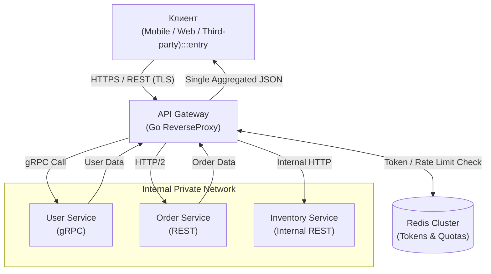

## API Gateway: Единая точка входа в микросервисный джунгли

> *"Хороший шлюз подобен опытному портье в первоклассном отеле: он встречает гостя, вежливо проверяет документы, берет багаж и незаметно распределяет поручения по внутренним службам, избавляя постояльца от необходимости блуждать по служебным лабиринтам кухни и прачечной."*  
> — Брайан Керниган

В классической монолитной архитектуре клиентское приложение (браузер, мобильный клиент или партнерский сервис) взаимодействует с единым сервером. Ментальная модель предельно проста: один доменный адрес, один протокол, один сквозной механизм аутентификации и предсказуемая маршрутизация.

В микросервисной архитектуре эта простота мгновенно сменяется хаосом распределенных джунглей. В реальной системе сосуществуют десятки и сотни независимых сервисов: Auth Service, Order Service, `Inventory` Service, User Profile Service, Recommendation Service.

Если мобильное приложение или веб-фронтенд попытается обращаться к каждому микросервису напрямую через публичный интернет:
1. **Катастрофическое усложнение клиента:** Клиент обязан знать сетевые адреса, порты и топологию всех внутренних компонентов платформы. Любой переезд сервиса или смена домена требует обновления мобильного приложения через App Store / Google Play.
2. **Бреши в безопасности:** Внутренние микросервисы (например, складской сервис `Inventory` или закрытые финансовые шлюзы) оказываются выставлены наружу, расширяя вектор атаки до колоссальных масштабов.
3. **Разнородность протоколов (Protocol Mismatch):** Внутренний кластер взаимодействует на сверхбыстром бинарном gRPC/Protobuf по HTTP/2, тогда как веб-браузеры клиентов требуют классический REST/JSON через HTTP/1.1 или WebSockets.
4. **Избыточные сетевые раунды (Chattiness):** Чтобы отрисовать один экран личного кабинета, мобильный телефон через медленный мобильный 4G/LTE вынужден выполнить 7–10 последовательных запросов к разным серверам, разряжая батарею и заставляя пользователя наблюдать вечные спиннеры.

Паттерн **API Gateway** элегантно устраняет эти противоречия, выступая в роли единого защищенного «привратника» и фасада для всей распределенной экосистемы.

---

## Что такое API Gateway?

**API Gateway** — это высокопроизводительный сервер-посредник, выступающий **единой точкой входа** (Single Entry Point) для всех внешних клиентов системы. Он функционирует как специализированный обратный прокси (Reverse Proxy), принимая входящие HTTP-запросы из ненадежной внешней сети, проводя их через конвейер валидации и маршрутизируя к целевым бэкенд-сервисам с возвратом агрегированного ответа.

> [!info] Под капотом
> С точки зрения сетевого стека, Gateway оперирует на 7-м прикладном уровне (Application Layer) модели OSI.  
> Он разрывает внешнее TCP-соединение с клиентом, выполняет ресурсоемкую терминацию TLS-сертификатов (TLS Offloading), парсит HTTP-заголовки, проверяет тело запроса (JSON/XML) и мультиплексирует трафик во внутренние постоянные пулы TCP-соединений (Keep-Alive) к микросервисам.  
> В экосистеме Go это реализуется либо через стандартный мультиплексор `http.ServeMux`, либо через оптимизированные высокопроизводительные HTTP-роутеры (Chi, Gin, Echo), предоставляющие гибкие конвейеры Middleware без лишних аллокаций памяти.

### Основные функции

Современный API Gateway берет на себя всю сквозную инфраструктурную рутину:

1. **Маршрутизация (Routing):** Интеллектуальный разбор URL-путей: запросы `/users/*` отправляются в User Service, а маршруты `/orders/*` диспетчеризируются в Order Service.
2. **Аутентификация и Авторизация:** Валидация криптографических подписей JWT-токенов, проверка API-ключей или сверка сессий в распределенном кэше. Внутренние микросервисы освобождаются от криптографии и получают уже проверенные метаданные пользователя.
3. **Rate Limiting & Throttling:** Защита периметра от всплесков трафика, брутфорса и DDoS-атак путем ограничения количества запросов (Token Bucket / Leaky Bucket) по IP, User ID или API Key.
4. **Агрегация данных (API Composition):** Параллельный опрос трех-четырех микросервисов с объединением ответов в единый компактный JSON-пейлоад для клиента.
5. **Трансляция протоколов (Protocol Translation):** Преобразование внешнего публичного REST/JSON в компактные внутренние gRPC-вызовы.
6. **Кэширование ответов:** Отдача неизменяемых данных (каталог, справочники) прямо с границы сети без нагрузки на базу данных.



---

## Реализация API Gateway на Go

Хотя в индустрии популярны готовые коробочные решения (Kong, Envoy, Emissary, Traefik), на языке Go очень часто создают кастомные шлюзы. Это обусловлено тем, что специализированный шлюз на Go потребляет десятки мегабайт памяти вместо гигабайтов, запускается за миллисекунды, легко кастомизируется под специфическую доменную агрегацию и пишется на том же стеке, что и основные микросервисы.

### Простейший Reverse Proxy

В стандартной библиотеке Go содержится мощный модуль `net/http/httputil`, предоставляющий готовую структуру `ReverseProxy`. Это промышленный фундамент, на котором строятся шлюзы любой сложности.

```go
package main

import (
	"log"
	"net/http"
	"net/http/httputil"
	"net/url"
	"time"
)

func main() {
	// Сетевые адреса внутренних микросервисов в закрытой подсети
	userServiceURL, err := url.Parse("http://user-service:8081")
	if err != nil {
		log.Fatalf("Invalid user service URL: %v", err)
	}

	orderServiceURL, err := url.Parse("http://order-service:8082")
	if err != nil {
		log.Fatalf("Invalid order service URL: %v", err)
	}

	// Инициализируем обратные прокси
	userProxy := httputil.NewSingleHostReverseProxy(userServiceURL)
	orderProxy := httputil.NewSingleHostReverseProxy(orderServiceURL)

	// Настраиваем оптимизированный транспорт для пула соединений (Keep-Alive)
	customTransport := &http.Transport{
		MaxIdleConns:        1000,
		MaxIdleConnsPerHost: 100,
		IdleConnTimeout:     90 * time.Second,
	}
	userProxy.Transport = customTransport
	orderProxy.Transport = customTransport

	// Регистрация маршрутов
	mux := http.NewServeMux()
	mux.Handle("/users/", http.StripPrefix("/users", userProxy))
	mux.Handle("/orders/", http.StripPrefix("/orders", orderProxy))

	server := &http.Server{
		Addr:         ":8080",
		Handler:      mux,
		ReadTimeout:  5 * time.Second,
		WriteTimeout: 10 * time.Second,
	}

	log.Println("API Gateway successfully started on :8080")
	log.Fatal(server.ListenAndServe())
}
```

### Расширение функционала: Middleware

Истинная сила шлюза на Go заключается в конвейерной обработке (Middleware Pipeline). Здесь запросы обогащаются контекстом, валидируются и проверяются до того, как они попадут в сетевой сокет бэкенда:

```go
package main

import (
	"log/slog"
	"net/http"
	"time"
)

// withMiddleware реализует централизованную проверку безопасности и аудит
func withMiddleware(next http.Handler) http.Handler {
	return http.HandlerFunc(func(w http.ResponseWriter, r *http.Request) {
		start := time.Now()

		// 1. Централизованное логирование входящего вызова
		slog.Info("Incoming Gateway request",
			"method", r.Method,
			"path", r.URL.Path,
			"remote_addr", r.RemoteAddr,
		)

		// 2. Аутентификация: проверка наличия и валидности JWT токена
		token := r.Header.Get("Authorization")
		if !validateToken(token) {
			http.Error(w, "Unauthorized: invalid or missing token", http.StatusUnauthorized)
			return // Прерываем исполнение, запрос не дойдет до бэкенда
		}

		// 3. Защита периметра: Rate Limiting
		if isRateLimited(r.RemoteAddr) {
			http.Error(w, "Too Many Requests: rate limit exceeded", http.StatusTooManyRequests)
			return
		}

		// 4. Передача управления целевому ReverseProxy
		next.ServeHTTP(w, r)

		// 5. Сбор метрик хвостовой задержки
		duration := time.Since(start)
		observeDuration(r.URL.Path, duration)
	})
}

func validateToken(token string) bool {
	return len(token) > 10 // Упрощенная заглушка валидации
}

func isRateLimited(ip string) bool {
	return false // Заглушка проверки квоты в Redis
}

func observeDuration(path string, d time.Duration) {}
```

### Director: Модификация запроса на лету

В реальной эксплуатации шлюз обязан обогащать исходящие запросы к бэкенду. Например, после расшифровки JWT-токена шлюз извлекает `userID` и передает его во внутреннюю сеть через заголовок `X-User-ID`. Это избавляет внутренние сервисы от необходимости повторно парсить и валидировать криптографическую подпись токена.

Для тонкой настройки запроса используется функция `Director` в структуре `httputil.ReverseProxy`:

```go
package main

import (
	"context"
	"net/http"
	"net/http/httputil"
	"net/url"
)

func NewCustomProxy(targetURL *url.URL) *httputil.ReverseProxy {
	proxy := &httputil.ReverseProxy{
		Director: func(req *http.Request) {
			// Направляем запрос на целевой хост
			req.URL.Scheme = targetURL.Scheme
			req.URL.Host = targetURL.Host
			req.URL.Path = targetURL.Path + req.URL.Path

			// Извлекаем userID, сохраненный в контексте запроса на этапе аутентификации
			if userID, ok := req.Context().Value("userID").(string); ok {
				req.Header.Set("X-User-ID", userID)
			}

			// Вычищаем внешний заголовок Authorization, чтобы не передавать секреты
			// и минимизировать накладные расходы на заголовки во внутренней сети
			req.Header.Del("Authorization")
		},
	}
	return proxy
}
```

---

## Mechanical Sympathy: Цена косвенности

Введение промежуточного узла неизбежно подчиняется законам физики. Каждый API Gateway добавляет в архитектуру дополнительный сетевой транзит (network hop):

- **Прямое соединение (Client $\to$ Microservice):**  
  2 сетевых перехода: клиент отправил пакет $\to$ сервис обработал $\to$ ответ вернулся клиенту.
- **Соединение через Gateway (Client $\to$ Gateway $\to$ Microservice):**  
  4 сетевых перехода: клиент $\to$ Gateway, Gateway $\to$ Microservice, Microservice $\to$ Gateway, Gateway $\to$ клиент.

В языке Go этот оверхед минимизируется благодаря высокоэффективному сетевому поллеру (netpoller на базе `epoll` в Linux) и горутинам. Шлюз способен удерживать миллионы параллельных соединений, а переиспользование пула TCP-сокетов с бэкендами через Keep-Alive исключает затраты на 3-way handshake на каждый входящий запрос.

> [!warning] Ловушка / Gotcha
> **Timeout Cascade (Каскад таймаутов):**  
> Если внешний клиент настроил тайм-аут ожидания в 30 секунд, шлюз ждет ответа от бэкенда 29 секунд, а бэкенд обращается к PostgreSQL с тайм-аутом 28 секунд — вы создаете опасную гонку за ресурсы. Если база ответит через 29.5 секунд, бэкенд и шлюз сожгут процессорные такты и память, но клиент уже закроет сокет по таймауту!  
>  
> Всегда жестко ограничивайте контексты через `context.WithTimeout` и распространяйте отмену вниз по стеку:  
> **Железное правило иерархии:**  
> $$\text{Timeout Бэкенда} < \text{Timeout Gateway} < \text{Timeout Клиента}$$

```go
// Жесткое ограничение времени жизни проксируемого запроса
ctx, cancel := context.WithTimeout(r.Context(), 2*time.Second)
defer cancel()
r = r.WithContext(ctx)
```

---

## Агрегация данных (API Composition)

Одна из ключевых задач шлюза — спасение мобильных клиентов от «болтливости» сети (Network Chattiness). Вместо выполнения череды разрозненных сетевых запросов клиент отправляет шлюзу один запрос, а шлюз параллельно опрашивает нужные сервисы и склеивает результаты:

```go
package main

import (
	"encoding/json"
	"io"
	"net/http"
	"sync"
	"time"
)

type AggregatedProfile struct {
	User   json.RawMessage `json:"user"`
	Orders json.RawMessage `json:"orders"`
}

func aggregateHandler(w http.ResponseWriter, r *http.Request) {
	var wg sync.WaitGroup
	userDataChan := make(chan []byte, 1)
	orderDataChan := make(chan []byte, 1)

	// Параллельный запрос 1: User Service
	wg.Add(1)
	go func() {
		defer wg.Done()
		client := http.Client{Timeout: 1 * time.Second}
		resp, err := client.Get("http://user-service/profile")
		if err == nil && resp.StatusCode == http.StatusOK {
			defer resp.Body.Close()
			body, _ := io.ReadAll(resp.Body)
			userDataChan <- body
			return
		}
		userDataChan <- []byte("{}")
	}()

	// Параллельный запрос 2: Order Service
	wg.Add(1)
	go func() {
		defer wg.Done()
		client := http.Client{Timeout: 1 * time.Second}
		resp, err := client.Get("http://order-service/history")
		if err == nil && resp.StatusCode == http.StatusOK {
			defer resp.Body.Close()
			body, _ := io.ReadAll(resp.Body)
			orderDataChan <- body
			return
		}
		orderDataChan <- []byte("[]")
	}()

	// Ожидаем завершения параллельных запросов
	wg.Wait()
	close(userDataChan)
	close(orderDataChan)

	// Формируем агрегированный JSON-ответ
	profile := AggregatedProfile{
		User:   <-userDataChan,
		Orders: <-orderDataChan,
	}

	w.Header().Set("Content-Type", "application/json")
	_ = json.NewEncoder(w).Encode(profile)
}
```

> [!tip] Собеседование
> **Вопрос:** В чем принципиальная разница между классическим Load Balancer (балансировщиком нагрузки) и API Gateway?  
> **Ответ:**  
> **Load Balancer (L4/L7):** Оперирует на транспортном или сетевом уровне. Его единственная задача — равномерно распределить поток байт или соединений по идентичным экземплярам *одного и того же* сервиса (Round Robin, Least Connections). Он не вникает в бизнес-смысл пейлоада.  
> **API Gateway (L7 Application):** Это прикладной фасад всей системы. Он глубоко анализирует структуру запроса, валидирует JWT-токены, маршрутизирует вызовы в десятки *разных* микросервисов, трансформирует протоколы (REST в gRPC) и выполняет агрегацию данных.  
> Балансировщик отвечает за доступность и распределение мощностей, Gateway — за прикладную логику периметра.

---

## API Gateway vs Service Mesh

С развитием облачных платформ и технологий Service Mesh (Istio, Linkerd, Cilium) произошло естественное разделение зон ответственности:

- **API Gateway (Edge Routing):** Фокусируется на внешней границе периметра (North-South трафик: вход из интернета в кластер). Отвечает за публичные API, биллинг, квоты, внешнюю авторизацию и защиту от атак.
- **Service Mesh (East-West Routing):** Управляет межсервисным общением *внутри* закрытого кластера через Sidecar-прокси (Envoy). Берет на себя взаимный mTLS, канареечный роутинг между подами и распределенную трассировку.

В современных архитектурах они работают в синергии: внешний трафик принимает API Gateway, а далее направляет его внутрь Service Mesh.

---

## Итог

1. **API Gateway** — это единая точка входа, защищающая внутреннюю микросервисную топологию от внешнего мира и спасающая клиентов от чрезмерной сложности.
2. Шлюз централизует сквозные задачи: терминацию TLS, аутентификацию, rate limiting, маршрутизацию и мониторинг.
3. В Go шлюзы строятся на базе производительного `httputil.ReverseProxy`, обогащаются логикой через кастомный `Director` и цепочки Middleware.
4. Архитекторы обязаны жестко контролировать каскады таймаутов (`context.WithTimeout`) и переиспользование пулов сокетов (Keep-Alive), чтобы шлюз не стал узким местом системы.

В следующей статье мы разберем специализированную эволюцию этой концепции — паттерн [[5. BFF]], где под каждый тип клиента проектируется собственный легковесный шлюз.