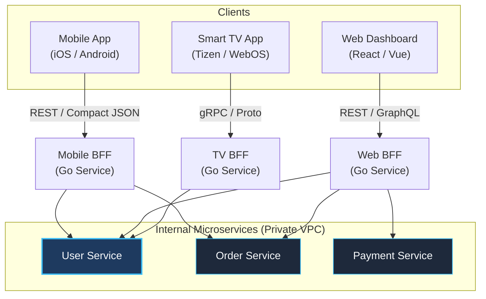

## BFF (Backend for Frontend): Специализация ради эффективности

> *"Универсальный инструмент, призванный одинаково хорошо подходить для всего на свете, обычно одинаково посредственно справляется со всякой конкретной задачей. В архитектуре пользовательских интерфейсов это правило подтверждается ежедневно."*  
> — Брайан Керниган

В предыдущей главе мы детально разобрали [[4. API Gateway]] как централизованную точку входа и защитный фасад для распределенной системы. Однако по мере масштабирования бизнеса и появления разнообразных клиентских платформ инженеры неизбежно сталкиваются с тем, что «универсальный шлюз» превращается в поле бесконечных компромиссов.

Мобильное приложение (iOS / Android) остро нуждается в максимально компактных, легковесных JSON-ответах для экономии дорогого сотового трафика и сбережения заряда аккумулятора смартфона. Напротив, настольное веб-приложение (Rich Web Dashboard) требует глубокого, насыщенного агрегированного состояния сразу: с пагинацией, фасетными фильтрами, историей операций и связанными сущностями. Приложение для умных часов (Smartwatch) или телевизоров (Smart TV) и вовсе запрашивает минималистичный срез данных из двух-трех строк.

Если принудительно заставить всех этих разнородных клиентов ходить в единый публичный API, мы попадем в классическую ловушку: либо мы заставим мобильных пользователей выкачивать мегабайты избыточных полей (Overfetching), либо вынудим веб-фронтенд делать десятки разрозненных запросов для сборки одного экрана (Underfetching / Network Chattiness).

Паттерн **BFF (Backend for Frontend)** элегантно разрешает этот конфликт. Его суть проста и прагматична: **для каждого конкретного типа пользовательского интерфейса создается выделенный, специализированный промежуточный сервис.**

---

## Проблема "One Size Fits All"

Рассмотрим хрестоматийную проблему «универсального интерфейса» на примере получения профиля пользователя:

- **Мобильный клиент (Смартфон на ходу):**  
  Требует отобразить компактную карточку: только имя, аватар и статус подписки. Сетевое подключение нестабильно (скачки между LTE, 3G и зонами отсутствия связи в метро).
- **Веб-панель администратора:**  
  Требует полный профиль: имя, расширенный аудит последних входов, журнал безопасности, настройки уведомлений, биллинговую историю и график активности.

Если мы предоставляем единственный универсальный эндпоинт `GET /users/{id}`:
1. **Стратегия «Возвращаем всё сразу»:**  
   Мобильное приложение выкачивает сотни килобайт ненужных полей, тратит такты процессора на десериализацию огромного JSON и разряжает аккумулятор.
2. **Стратегия «Возвращаем только минимальное ядро»:**  
   Веб-приложению приходится выполнять 5–7 дополнительных параллельных HTTP-запросов к смежным ручкам, раздувая время до интерактивности (Time to Interactive, TTI).

Попытка угодить всем с помощью одного эндпоинта неизбежно вредит каждому из клиентов.

---

## Суть паттерна BFF

Паттерн BFF предлагает отказаться от идеи единого «всемогущего» шлюза в пользу специализированных фасадов представления:
1. **Mobile BFF:** сервис на Go, спроектированный с учетом специфики мобильных ОС, оптимизирующий размер пейлоада и объединяющий вызовы.
2. **Web BFF:** сервис на Go, спроектированный под высокую пропускную способность, отдающий богатые структуры для десктопного веб-интерфейса (часто через GraphQL).
3. **Smart TV / IoT BFF:** сверхкомпактный фасад, адаптированный под слабые процессоры умных устройств.

Каждый BFF — это автономный сервис на Go, который:
- Принимает трафик исключительно от «своего» клиентского приложения;
- Обращается к защищенным внутренним микросервисам (User Service, Order Service, Payment Service) по быстрой закрытой сети;
- Фильтрует, агрегирует и форматирует данные строго под экранные формы своего UI;
- Возвращает клиенту идеально подогнанный, готовый к отображению ответ.



---

## Реализация BFF на Go

С точки зрения архитектуры, BFF — это специализированный агрегатор данных. Он не содержит доменной бизнес-логики (она инкапсулирована в соответствующих микросервисах), но целиком отвечает за **логику представления (Presentation Logic)**: локализацию, склейку, сортировку и форматирование экранных моделей.

### Пример: Aggregation Pattern

Представьте задачу отображения детальной карточки заказа на экране мобильного телефона. Для отрисовки мобильного экрана требуются данные из Order Service (стоимость и статус) и User Service (имя покупателя и локаль).

```go
package main

import (
	"context"
	"encoding/json"
	"fmt"
	"net/http"
	"sync"
	"time"
)

// MobileOrderView — структура ответа, идеально подогнанная под мобильный виджет
type MobileOrderView struct {
	OrderID    string `json:"order_id"`
	StatusText string `json:"status_text"` // Человекочитаемый локализованный статус
	Customer   string `json:"customer"`    // Только краткое имя для экрана
	TotalPrice string `json:"total_price"` // Заранее отформатированная строка валюты
}

type MobileBFF struct {
	orderClient *OrderClient
	userClient  *UserClient
}

func (b *MobileBFF) GetOrderDetails(w http.ResponseWriter, r *http.Request) {
	orderID := r.URL.Query().Get("id")
	if orderID == "" {
		http.Error(w, "missing order id", http.StatusBadRequest)
		return
	}

	// Жесткий тайм-аут на агрегацию: не заставляем мобильный клиент ждать вечно
	ctx, cancel := context.WithTimeout(r.Context(), 2*time.Second)
	defer cancel()

	var (
		order *Order
		user  *User
		err1  error
		err2  error
	)

	// Параллельный опрос бэкендов через WaitGroup
	var wg sync.WaitGroup
	wg.Add(2)

	// Запрос 1: Получение данных заказа
	go func() {
		defer wg.Done()
		order, err1 = b.orderClient.GetOrder(ctx, orderID)
	}()

	// Запрос 2: Получение профиля покупателя (если ID известен заранее из сессии/токена)
	go func() {
		defer wg.Done()
		// В реальном приложении UserID извлекается из контекста авторизации
		userID := r.Header.Get("X-User-ID")
		user, err2 = b.userClient.GetUser(ctx, userID)
	}()

	wg.Wait()

	if err1 != nil {
		http.Error(w, "failed to load order details", http.StatusBadGateway)
		return
	}

	// Graceful degradation: если упал сервис пользователей, показываем заказ без имени
	customerName := "Клиент"
	locale := "ru-RU"
	if err2 == nil && user != nil {
		customerName = user.Name
		locale = user.Locale
	}

	// Трансформация и подготовка экранной модели (Presentation Logic)
	view := MobileOrderView{
		OrderID:    order.ID,
		StatusText: localizeStatus(order.Status),
		Customer:   customerName,
		TotalPrice: formatCurrency(order.Total, locale),
	}

	w.Header().Set("Content-Type", "application/json")
	_ = json.NewEncoder(w).Encode(view)
}

func localizeStatus(status string) string {
	switch status {
	case "PAID":
		return "Оплачен"
	case "SHIPPED":
		return "В пути"
	default:
		return "Обрабатывается"
	}
}

func formatCurrency(cents int64, locale string) string {
	return fmt.Sprintf("%.2f ₽", float64(cents)/100.0)
}
```

### Особенности реализации

1. **Конкурентность из коробки:** Язык Go с его легковесными горутинами (`wg.Add`, каналы, `errgroup`) идеально подходит для роли BFF. Запросы к внутренним микросервисам выполняются параллельно, а общая задержка ответа равна задержке самого медленного бэкенда, а не их сумме.
2. **Отказоустойчивость и Graceful Degradation:** BFF обязан изолировать сбои. Если упал второстепенный сервис рекомендаций или персонализации, BFF не должен отдавать HTTP 500 на весь экран — он просто отдает пустой массив в соответствующем блоке.
3. **Строгие тайм-ауты:** BFF находится на переднем крае. Он обязан прерывать зависшие запросы к бэкендам через `context.WithTimeout`, сохраняя системные ресурсы.

---

## Mechanical Sympathy: Сетевой аспект

С точки зрения физики сетей, перенос агрегации в BFF дает колоссальный выигрыш в задержках и расходе батареи смартфонов:

1. **Сокращение Round-Trip Time (RTT):**
   - **Без BFF (Прямые вызовы из смартфона):**  
     Мобильное приложение делает 3 последовательных запроса по мобильной сети 4G/LTE. При пинге в 100–150 мс суммарная сетевая задержка составляет $3 \times 150\,\text{мс} = 450\,\text{мс}$ только на передачу пакетов!
   - **С паттерном BFF:**  
     Смартфон выполняет ровно 1 запрос к BFF по сотовой сети ($150\,\text{мс}$). Внутри дата-центра BFF опрашивает три микросервиса по сверхбыстрому оптоволокну (LAN RTT $< 1\,\text{мс}$) параллельно. Итоговая задержка: $150\,\text{мс} + 1\,\text{мс} \approx 151\,\text{мс}$! Выигрыш в отзывчивости интерфейса — трехкратный.
2. **Энергосбережение сотового модема (Radio Resource Control):**  
   Радиомодем смартфона переходит в активный энергозатратный режим при каждом исходящем сетевом пакете и остается в нем еще 10–20 секунд после завершения передачи. Череда мелких запросов держит модем постоянно горячим, мгновенно сжигая батарею. Один агрегированный вызов в BFF позволяет модему немедленно уснуть.
3. **Экономия трафика:**  
   Внутри дата-центра BFF общается с микросервисами по эффективному бинарному протоколу gRPC. С наружным клиентом BFF работает по сжатому HTTP/2 JSON, безжалостно отрезая все неиспользуемые мобильным экраном поля.

---

## Анти-паттерн: Размывание ответственности

Главный архитектурный соблазн и фатальная ловушка при внедрении BFF — утечка бизнес-логики из доменных сервисов в слой BFF.

> [!warning] Ловушка / Gotcha
> BFF категорически **не должен** валидировать сложные бизнес-правила (например: *«разрешено ли пользователю применить скидочный промокод при заказе от 5000 рублей?»*).  
> Это исключительная прерогатива Domain Services (Order Service / Pricing Service).  
> Если вы начнете размещать доменные правила в BFF, вы мгновенно получите худшую форму архитектурного ада — **«Распределенный монолит»**: бизнес-логика окажется продублирована в кодовых базах Mobile BFF и Web BFF, рассинхронизируется, а любое изменение правил потребует синхронного деплоя десятка репозиториев.

**Что ОБЯЗАНО жить в BFF:**
- Форматирование дат, денежных сумм и локализованных строк;
- Фильтрация конфиденциальных полей (вырезание внутренних хэшей и служебных флагов);
- Параллельная агрегация и склеивание данных из разнородных источников;
- Адаптация сетевых протоколов (трансляция внутреннего gRPC во внешний REST/JSON).

**Чего в BFF быть НЕ ДОЛЖНО:**
- Расчета бизнес-скидок, балансов и штрафов;
- Прямого доступа к базам данных микросервисов (нарушение инкапсуляции);
- Реализации сквозных доменных транзакций.

---

## BFF и GraphQL

В веб-среде (Web BFF) разработчики очень часто отдают предпочтение не классическому REST, а технологии **GraphQL**.

Причина кроется в динамичности веб-интерфейсов: добавление нового компонента или поля в форму на React требует изменения API. В традиционном REST бэкендеры вынуждены бесконечно переписывать DTO. GraphQL же позволяет фронтенд-инженеру самостоятельно декларировать точный перечень запрашиваемых полей, не трогая бэкенд.

В экосистеме Go лидером для построения GraphQL BFF является библиотека `gqlgen`, обеспечивающая строгую статическую кодогенерацию типов:

```graphql
# Фронтенд самостоятельно определяет требуемые данные
query GetUserProfile {
  user(id: "42") {
    name
    lastLogin # Веб-панель запрашивает дату входа, тогда как мобильный BFF это поле даже не объявляет
    orders(first: 5) {
      items {
        title
      }
    }
  }
}
```

Mobile BFF при этом остается на строгом REST/Protobuf, что гарантирует предсказуемость сетевого пейлоада и максимальную простоту клиентского парсера.

---

## Итог

1. **BFF (Backend for Frontend)** решает проблему конфликта интересов между разнородными клиентами (Mobile, Web, IoT), предоставляя каждому оптимизированный фасад.
2. Паттерн ликвидирует избыточный сетевой трафик (Overfetching) и избавляет клиентов от болтливости сети (Chatty API).
3. **Go** — идеальный технологический фундамент для BFF благодаря непревзойденной производительности горутин при параллельной агрегации данных и низкому потреблению памяти.
4. Главная опасность — превращение BFF в свалку бизнес-логики. BFF должен оставаться тонким слоем трансформации представления.

В следующей статье мы рассмотрим [[6. Backend for frontend]], где углубимся в организационные аспекты владения кодовой базой BFF, топологию команд и эволюционные сценарии миграции.