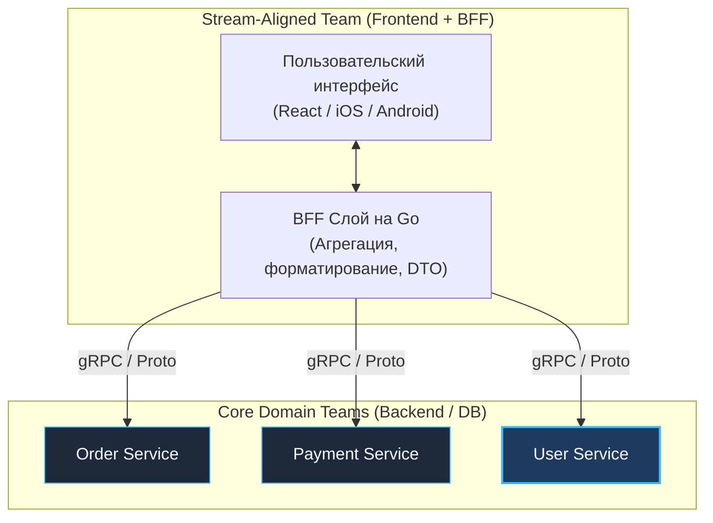
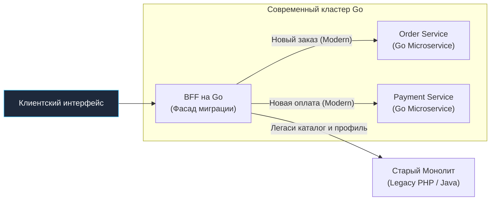

## Backend for Frontend: Глубокое погружение и организация команды

> *"Организации, проектирующие системы, неизбежно воспроизводят структуру собственных коммуникаций. Если разработчики интерфейса и инженеры бэкенда разделены глубоким рвом из формальных тикетов и двухнедельных спринтов, их программный интерфейс будет в точности отражать этот ров."*  
> — Закон Конвея в современной интерпретации

В главе [[5. BFF]] мы рассмотрели архитектурный фундамент Backend for Frontend: как разделение шлюзов под разные платформы (Mobile, Web, IoT) решает проблемы сетевого оверхеда, лагов сотовой связи и избыточных данных.

Однако концепция **Backend for Frontend (BFF)** простирается далеко за пределы технического паттерна проксирования. В первую очередь это **организационная парадигма**, трансформирующая культуру взаимодействия команд разработки и разрушающая классические коммуникационные барьеры.

Фундаментальный постулат организационного BFF гласит: **BFF — это сервис, который проектируется, разрабатывается и всецело принадлежит команде фронтенда.**

В традиционной инженерной модели разработчики бэкенда пытаются создать «абстрактный, универсальный API», а разработчики интерфейсов годами страдают, пытаясь подогнать экранные формы под неповоротливые сущности реляционных баз данных. Модель BFF передает бразды правления интерфейсным инженерам: они сами определяют и контролируют слой доставки данных в свои приложения.

---

## Организационный аспект: Team Topology

В современной методологии проектирования инженерных организаций (*Team Topologies* Мэтью Скелтона и Мануэля Пайса) выделяют четыре базовых типа команд:
1. **Stream-aligned teams (Команды потока ценности):** Кросс-функциональные группы, непрерывно поставляющие ценность конечному пользователю (например, «Команда корзины и оформления», «Команда поисковой выдачи»).
2. **Enabling teams (Команды фасилитации):** Эксперты, помогающие другим командам осваивать новые технологии и инженерные практики.
3. **Complicated subsystem teams (Команды сложных подсистем):** Узкие специалисты, отвечающие за математически сложные или критические модули (криптография, видеостриминг, рекомендательные нейросети).
4. **Platform teams (Команды платформы):** Инженеры инфраструктуры, предоставляющие внутренние сервисы (Kubernetes, пайплайны CI/CD, брокеры сообщений).

В этой топологии **BFF-команда** выступает классическим ядром Stream-aligned команды. Она владеет сквозным пользовательским опытом (User Experience) целиком: от пикселя на экране смартфона или кнопки в браузере до серверного кода BFF-слоя.



> [!info] Под капотом
> Паттерн BFF устраняет организационное трение («фрикцию») и ликвидирует задержки в цикле обратной связи:
> - **Как было раньше:** Фронтенд-разработчик обнаруживает, что на экране заказа не хватает имени покупателя. Он заводит тикет в трекере бэкенд-команды: *«Добавьте поле `userName` в ответ ручки `/order`»*. Бэкендеры ставят задачу в бэклог следующего спринта, через 3 недели релизят изменение, ломая смежный мобильный клиент.
> - **Как стало с BFF:** Фронтенд-инженер сам открывает репозиторий своего BFF (на Go), дописывает вызов метода `GetUser()` параллельно к заказу, склеивает поле `userName` в локальный DTO и выкатывает релиз за 15 минут, совершенно не отвлекая базовую команду заказов от оптимизации базы данных.

---

## Эволюция BFF: От Monolith to Micro-frontends

BFF выступает главным архитектурным инструментом и спасательным кругом при распиле тяжелых монолитных систем.

### Сценарий: Strangler Fig Pattern

Представьте унаследованный монолит («Legacy Monolith») на PHP, Ruby или Java с пятнадцатилетней историей. Бизнес требует переписать систему на современный микросервисный стек на Go, но остановить разработку новых фич на два года ради «великого переписывания» невозможно.

Вместо опасного «Big Bang» релиза перед монолитом выставляется **BFF на Go**, реализующий паттерн «Душитель» (Strangler Fig Pattern, названный Мартином Фаулером в честь австралийского фикуса-душителя, постепенно оплетающего и замещающего дерево-хозяина):

1. Новый микросервисный функционал реализуется изолированно на Go (Order Service, Payment Service).
2. BFF принимает все входящие пользовательские запросы.
3. Если запрос относится к новой функциональности — BFF направляет его в новые Go-микросервисы.
4. Все старые, еще не распиленные маршруты прозрачно проксируются в легаси-монолит.
5. Шаг за шагом ветви монолита отмирают, пока он полностью не превратится в пустую оболочку и не будет безопасно отключен.



---

## Проблема разделения ресурсов

Если у компании есть 5 клиентских платформ (iOS, Android, Web, Smart TV, Apple Watch), означает ли это, что нужно развернуть 5 изолированных BFF-сервисов?

Эта опасность известна как **BFF Explosion** (взрывной рост числа сервисов). Поддерживать 5 независимых репозиториев, 5 пайплайнов CI/CD и 5 команд сопровождения для небольшого стартапа экономически непосильно.

Для решения этой проблемы применяются два зрелых инженерных подхода:

1. **Shared Kernel (Общее ядро):**  
   BFF пишется как единый сервис на Go (или модульный монолит), внутри которого четко разделены слои:
   - **Core Kernel:** Общая инфраструктурная часть (gRPC-клиенты к внутренним сервисам, конфигурация, логика повторов с джиттером, трейсинг, кеширование).
   - **Transport Layer:** Независимые группы HTTP-ручек под каждую платформу: `/mobile/order` возвращает минимальный срез данных, а `/web/order` отдает развесистую модель со всеми деталями.
2. **GraphQL Federation:**  
   BFF вырождается в единый высокопроизводительный GraphQL Router (Apollo Router / Cosmonaut на Go/Rust). Клиенты сами декларируют требуемые поля через запросы, полностью исключая необходимость ручного написания отдельных эндпоинтов `/mobile/order` и `/web/order`.

---

## Backend for Frontend и Code Sharing

Самая раздражающая проблема на стыке фронтенда и бэкенда — рассинхронизация структур данных.  
Фронтенд-приложение на TypeScript ожидает интерфейс `User` с определенным набором полей. Бэкенд-сервис на Go отдает сериализованную структуру `UserDTO`. Стоит бэкендеру опечататься в имени поля JSON или изменить тип с `int` на `string` — и в продакшене падает клиентский интерфейс.

Для ликвидации ручной рутины применяется строгая сквозная генерация кода по спецификации.

### OpenAPI / Swagger Specification

Контракт взаимодействия BFF и фронтенда фиксируется в виде машинно-читаемого файла спецификации OpenAPI 3.0 (`api.yaml`):

1. **Бэкенд-генератор:** Утилита `oapi-codegen` генерирует типобезопасные структуры Go, валидаторы и каркасы роутеров.
2. **Фронтенд-генератор:** Утилита `openapi-typescript` генерирует строгие TypeScript-интерфейсы для клиентского кода.

```go
// Директивы кодогенерации в Go-проекте BFF:
//go:generate go run github.com/deepmap/oapi-codegen/cmd/oapi-codegen --package=api -generate types api.yaml
//go:generate go run github.com/deepmap/oapi-codegen/cmd/oapi-codegen --package=api -generate gin api.yaml

// Go-структуры и обработчики автоматически синтезируются из единого источника правды.
// Фронтенд-команда компилирует тот же api.yaml в TypeScript-типы.
```

В результате рассинхронизация контрактов становится невозможной физически: при несовпадении типов сборка проекта падает на этапе компиляции в CI/CD.

---

## Mechanical Sympathy: Go vs Node.js для BFF

Исторически BFF-слои нередко создавали на базе Node.js, руководствуясь соображением: *«Фронтендеры пишут на JavaScript/TypeScript, им проще всего писать BFF на той же платформе»*.

Однако для высоконагруженных платформ с сотнями тысяч пользователей **язык Go демонстрирует подавляющее преимущество**:

1. **Строгая статическая типизация:**  
   Компилятор Go гарантирует отсутствие классических JavaScript-ошибок вроде `TypeError: Cannot read properties of undefined` прямо на этапе сборки бинарника.
2. **Поведение под пиковыми нагрузками (CPU-Bound & I/O):**
   - **Node.js:** Функционирует в рамках однопоточного цикла событий (Single-threaded Event Loop). Если BFF выполняет тяжелую парсинг-трансформацию большого JSON-массива, выполняет вычисление хэшей или компрессию gzip, Event Loop блокируется. В этот момент **все остальные тысячи параллельных запросов клиентов замирают в очереди**, взвинчивая p99 latency.
   - **Go:** Модель GMP распределяет горутины по всем доступным физическим ядрам процессора (`GOMAXPROCS`). Тяжелая сериализация одного заказа выполняется в изолированной горутине и не оказывает никакого влияния на параллельные запросы.
3. **Эффективность памяти (RSS Footprint):**  
   Минималистичный сервис на Go в контейнере Kubernetes потребляет всего 15–30 МБ оперативной памяти. Аналогичный сервис на Node.js требует от 150 до 400 МБ из-за прожорливости движка V8. При масштабировании до десятков реплик Go экономит тысячи долларов на облачной инфраструктуре.

> [!tip] Собеседование
> **Вопрос:** Какая команда должна разрабатывать и сопровождать BFF?  
> **Ответ:**  
> BFF обязана разрабатывать команда, отвечающая за конкретный пользовательский интерфейс (Feature Team / Stream-aligned Team).  
> Выбор стека (Go vs Node.js) определяется требованиями к нагрузке и компетенциями:  
> - Если нагрузка умеренная, а фронтендеры не имеют опыта в системных языках — допустим Node.js/TypeScript.  
> - Если система высоконагруженная, критична низкая хвостовая задержка (p99 latency) и строгая типобезопасность — **Go является безусловным фаворитом**. Благодаря лаконичности и простоте Go, современные фулстек-инженеры осваивают его основы буквально за пару недель.

---

## Итог

1. **Backend for Frontend** — это организационно-архитектурный паттерн, ставящий во главу угла потребности пользовательского интерфейса и скорость продуктовой разработки.
2. BFF ликвидирует коммуникационные барьеры между командами, позволяя фронтенд-инженерам самостоятельно развивать свой слой доставки данных.
3. Паттерн выступает главным оружием при поэтапном распиле монолитов через **Strangler Fig Pattern**.
4. Проблема дублирования кода и «взрыва числа BFF» эффективно купируется выделением **Shared Kernel** или переходом на **GraphQL Federation**.
5. Язык **Go** обеспечивает непревзойденную производительность BFF-сервисов, исключая блокировки Event Loop и драматически снижая потребление памяти в облаке.

В следующей, завершающей главе практического блока паттернов мы разберем темную сторону распределенных систем — [[7. Anti patterns микросервисов]] — и научимся распознавать опасные архитектурные ловушки до того, как они попадут в продакшен.