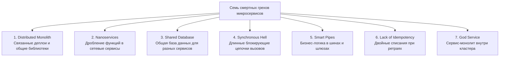
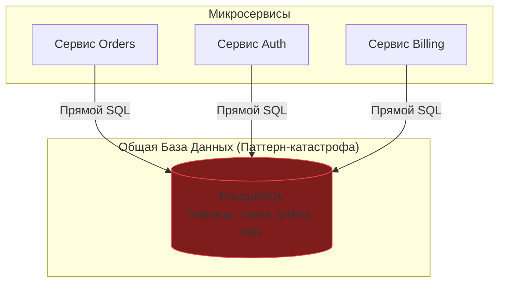

## Антипаттерны микросервисов: Как не надо строить распределенные системы

> *"Проще написать новую программу, чем исправить старую. Но еще проще — создать распределенный кошмар, механически разрезав работающий монолит на сотню мелких, намертво связанных кусочков."*  
> — Перефразируя классические законы программирования

В индустрии программной инженерии микросервисы нередко воспринимаются как «серебряная пуля»: достаточно разбить монолитный репозиторий на десяток мелких сервисов — и компания мгновенно обретет скорость деплоя Netflix, безграничную масштабируемость и счастье командной автономности.

Суровая реальность системного дизайна заключается в том, что микросервисная архитектура — это всегда вынужденный, дорогой компромисс. Переходя к микросервисам, вы не уничтожаете сложность предметной области: вы лишь **обмениваете сложность внутрипроцессного кода на колоссальную сложность сети, инфраструктуры и распределенной эксплуатации**.

Если переступить тонкую грань между грамотно спроектированными микросервисами и архитектурным хаосом, вы неизбежно построите **Распределенный Монолит (Distributed Monolith)** — худшую из всех возможных архитектурных форм, объединяющую в себе эксплуатационный ад распределенных систем с жесткой, удушающей связностью монолита.

В этой главе мы систематизируем семь самых разрушительных антипаттернов, которые уничтожают пропускную способность Go-сервисов, раздувают облачные счета и разрушают душевное спокойствие дежурных инженеров.



---

## 1. Распределенный Монолит (Distributed Monolith)

Это самый опасный и коварный антипаттерн в распределенных системах. Вы разрезали монолитную кодовую базу на отдельные бинарники, но оставили нетронутыми невидимые нити сильной связанности (Coupling) между ними.

**Явные симптомы болезни:**
- Чтобы выкатить в продакшен сервис A версии 2.1, вы обязаны одновременно задеплоить сервис B строго версии 2.1 и сервис C версии 1.8 («Lockstep Deployment»).
- Сервисы не могут запуститься автономно и падают в циклических зависимостях при старте кластера.
- Сервисы напрямую лезут в таблицы чужих баз данных.
- Любое изменение сигнатуры метода во внутреннем DTO ломает рантайм пяти соседних сервисов.

### Почему это плохо?

Вы собрали все фундаментальные пороки микросервисов (непредсказуемые сетевые задержки, потерю пакетов, сериализационный оверхед, необходимость распределенной трассировки и сложных саг), но лишились всех их преимуществ (автономия команд, независимый цикл релизов, точечное масштабирование). 

Система становится хрупкой, как хрустальная ваза: транзиентное падение второстепенного вспомогательного сервиса мгновенно обрушивает весь стек по цепочке.

> [!warning] Ловушка / Gotcha
> В сообществе Go очень популярен соблазн вынести все общие структуры, хелперы и валидаторы в единую общую библиотеку (Shared Library), подключаемую через `go.mod` ко всем сервисам компании.  
> Стоит вам изменить сигнатуру одной функции или структуру общей сущности в этой библиотеке — и вы оказываетесь перед необходимостью пересобрать, протестировать и передеплоить 30 микросервисов, чтобы починить один эндпоинт. Это верный признак распределенного монолита.  
> **Инженерное решение:** Применяйте строгое семантическое версионирование (SemVer), защищайте обратную совместимость API и помните золотое правило Go: *«Немного дублирования кода обходится в сто раз дешевле, чем одна неверно выбранная общая абстракция»* (Rob Pike).

---

## 2. Наносервисы (Nanoservices)

Наносервисы — это болезнь чрезмерного дробления системы, когда разработчики начинают нарезать границы сервисов не по границам бизнес-контекстов, а по классам или отдельным функциям.

**Пример:** В интернет-магазине создаются независимые микросервисы: «Сервис скидок по пятницам», «Сервис расчета ставки НДС», «Сервис округления копеек» и «Сервис валидации email».


### Почему это плохо?

1. **Взрывной рост хвостовой задержки (Network Latency Explosion):** Вместо атомарного вызова скомпилированной машинной инструкции в оперативной памяти (1–2 наносекунды) система совершает тяжелый сетевой вояж через операционную систему и физическую сеть (2–5 миллисекунд). Суммарная задержка одного пользовательского клика возрастает в тысячи раз.
2. **Болтливый интерфейс (Chatty Interface):** Чтобы сформировать элементарный расчет корзины, родительский сервис вынужден выполнить 15–20 последовательных сетевых запросов.

> [!info] Под капотом
> Физическая разница между вызовом функции и сетевым RPC колоссальна:
> - **Вызов функции в Go (Function Call):** Процессор загружает аргументы в регистры CPU (ABIInternal в современных версиях Go), выполняет инструкцию `CALL`, сдвигает указатель стека `RSP`. Время исполнения — доли наносекунды (такты CPU), нулевые системные вызовы.
> - **Сетевой HTTP/gRPC вызов:**  
>   1. Сериализация структуры в JSON/Protobuf (рефлексия, аллокации в куче Go, сборка мусора);  
>   2. Системный вызов `write` в ядро Linux;  
>   3. Прохождение пакета через сетевой стек ядра (TCP, IP, сокетные буферы);  
>   4. Контекстное переключение процессора (Context Switch);  
>   5. Передача по физической среде (кабель, оптоволокно, сетевые коммутаторы);  
>   6. Системный вызов `read` на стороне получателя, разбор пакета и обратная десериализация.  
>  
> В Go рефлексивный маршалинг JSON — это ресурсоемкая операция. Если ваш бизнес-процесс прогоняет данные через цепочку из пяти наносервисов, процессор сжигает до 60% полезного времени исключительно на упаковку и распаковку одних и тех же байтов!

**Инженерное решение:** Группируйте функционал по предметным поддоменам (Domain-Driven Design). Сервис ценообразования (Pricing Service) обязан локально инкапсулировать расчет скидок, налогов и валютных курсов внутри единого бинарного процесса.

---

## 3. Общая база данных (Shared Database)

Самый распространенный антипаттерн команд, совершающих поспешную миграцию с монолита. Сервисы формально разделены по отдельным репозиториям и контейнерам, однако все они продолжают ходить в одну общую базу данных PostgreSQL или MySQL.



В этой схеме реляционная база данных становится невидимым, неконтролируемым публичным API:
1. Команда сервиса `Orders` проводит миграцию и меняет тип колонки или удаляет поле в таблице `users`.
2. Сервис `Auth`, который на старте выполнял наивный запрос `SELECT * FROM users`, падает в продакшене с фатальной ошибкой десериализации колонок!

### Почему это плохо?

- **Полная потеря автономии (Schema Coupling):** Ни одна команда не может безопасно изменить схему своих данных без согласования со всеми смежными отделами компании.
- **Борьба за блокировки (Lock Contention):** Фоновый аналитический запрос сервиса отчетов блокирует строки таблиц, намертво вешая транзакции сервиса авторизации.

**Инженерное решение:** Непререкаемый стандарт микросервисной архитектуры — **Database per Service** (изолированная база на каждый сервис). Сервис обязан быть единоличным владельцем своих данных. Если сервису заказов нужны сведения о покупателе, он запрашивает их через сетевой API сервиса пользователей, либо получает синхронизированную копию через брокер сообщений ([[1. Saga pattern]], [[2. CQRS]]).

---

## 4. Синхронный ад (Synchronous Hell)

Сервисы вызывают друг друга по цепочке строго синхронно в блокирующем режиме:
$$\text{Client} \longrightarrow \text{Gateway} \longrightarrow \text{Service A} \longrightarrow \text{Service B} \longrightarrow \text{Service C}$$

Если сервис C отвечает за 1 секунду, клиент гарантированно ждет не менее 1.5–2 секунд. Но настоящая беда кроется не в базовой задержке.

### Почему это плохо?

- **Каскадный коллапс (Cascading Failure):** Если сервис C начинает испытывать задержки из-за перегрузки диска, горутины сервиса B блокируются в ожидании сетевого ответа. Пул соединений исчерпывается, память под стеки горутин растет, сервис B падает. Следом падает сервис A, и весь сайт уходит в оффлайн.
- **Произведение доступности:** Если в цепочке участвуют 4 сервиса с доступностью 99.5% каждый, суммарная доступность сквозной цепочки падает до:
  $$0.995^4 \approx 0.98 \quad (98\%)$$
  Система будет лежать часами каждый месяц!

**Инженерное решение:** Асинхронное взаимодействие через брокеры очередей (Kafka, RabbitMQ, NATS) везде, где не требуется мгновенный ответ пользователю. Для критических синхронных вызовов — обязательное внедрение Circuit Breaker и агрессивных тайм-аутов.

---

## 5. Умные пайпы и глупые эндпоинты (Smart Pipes, Dumb Endpoints)

Этот антипаттерн нарушает фундаментальный манифест распределенных систем Мартина Фаулера: *«Smart endpoints and dumb pipes»* (Умные эндпоинты, глупые каналы связи).

Разработчики поддаются соблазну внедрить бизнес-логику внутрь инфраструктурных компонентов: в брокеры сообщений, в [[4. API Gateway]] или в промежуточные фильтры (Middleware / gRPC Interceptors).

```go
// Антипаттерн: Доменные бизнес-правила внутри Middleware шлюза!
func DiscountMiddleware(next http.Handler) http.Handler {
    return http.HandlerFunc(func(w http.ResponseWriter, r *http.Request) {
        // Проверка тонкого бизнес-правила в слое периметра сети!
        if user.IsPremium && time.Now().Weekday() == time.Friday {
            // ... вычисление скидок и модификация заголовков ...
        }
        next.ServeHTTP(w, r)
    })
}
```

### Почему это плохо?

Сетевой шлюз и транспортные шины обязаны оставаться «глупыми» и предельно быстрыми. Их задача — маршрутизировать бинарные байты, терминировать TLS и защищать от перегрузок. 

Как только вы размазываете правила скидок или валидацию цен по шлюзам, логика системы превращается в неуправляемый «черный ящик». Локальное тестирование становится невозможным, а поведение сервисов начинает зависеть от того, через какой именно прокси прошел запрос.

---

## 6. Отсутствие идемпотентности (Lack of Idempotency)

В физическом мире компьютерных сетей пакеты теряются, сокеты закрываются операционной системой, а сетевые тайм-ауты неизбежны:
1. Мобильный клиент отправляет сетевой запрос: `POST /pay`.
2. Сервис платежей успешно списывает 10 000 рублей с банковской карты.
3. В момент отправки ответа сетевой шлюз дропает соединение из-за потери пакета.
4. Клиент ловит сетевую ошибку и запускает встроенный механизм повтора (Retry).
5. Запрос `POST /pay` прилетает во второй раз — и со счета клиента списывается еще 10 000 рублей!

> [!warning] Ловушка / Gotcha
> Стандартный клиент `http.Client` в Go благоразумно не повторяет запросы методом POST автоматически. Однако если в вашем кластере развернуты service mesh прокси (Istio, Linkerd) с включенной политикой ретраев или мобильный клиент использует агрессивные повторные попытки, вы гарантированно столкнетесь с катастрофическими дублями финансовых операций.

**Инженерное решение:** Любая операция, изменяющая состояние (Mutation), обязана сопровождаться уникальным ключом идемпотентности (`Idempotency-Key`):

```go
package payment

import (
	"context"
	"fmt"
	"time"
)

type ChargeRequest struct {
	UserID int64
	Amount int64
}

func (s *PaymentService) Charge(ctx context.Context, req ChargeRequest, idempotencyKey string) error {
	// 1. Проверяем в Redis, обрабатывали ли мы данный Idempotency-Key
	exists, err := s.cache.Get(ctx, idempotencyKey)
	if err == nil && exists != "" {
		// Ключ уже зафиксирован: возвращаем nil или закэшированный результат прошлой операции
		return nil
	}

	// 2. Выполняем финансовую проводку в базе данных
	err = s.db.Withdraw(ctx, req.UserID, req.Amount)
	if err != nil {
		return fmt.Errorf("transaction failed: %w", err)
	}

	// 3. Атомарно сохраняем ключ с разумным TTL (например, 24 часа)
	_ = s.cache.Set(ctx, idempotencyKey, "processed", 24*time.Hour)
	return nil
}
```

---

## 7. God Service (Божественный сервис)

Антипод наносервисов: гигантомания одного компонента. Внешне система декларируется как микросервисная, но внутри кластера живет один монструозный сервис, выполняющий 90% всей работы компании: он отвечает и за авторизацию, и за оформление заказов, и за биллинг, и за рассылку писем, и за генерацию PDF-отчетов.

**Симптомы «божественного сервиса»:**
- Конструктор сервиса принимает десятки разнородных репозиториев и внешних клиентов;
- Любая продуктовая задача затрагивает кодовую базу этого единственного монолита;
- Очередь на мерж PR превращается в затор, а инженеры боятся деплоить сервис в пятницу, потому что в нем переплетена вся логика бизнеса.

**Инженерное решение:** Безжалостная декомпозиция по границам контекстов (Bounded Contexts) в соответствии с принципами DDD. Выделяйте второстепенные автономные домены (нотификации, биллинг, аналитика) в независимые изолированные сервисы с собственными циклами релиза.

---

## Итог

Микросервисы — это мощный хирургический инструмент масштабирования организации, а не универсальное украшение резюме. Чтобы распределенная архитектура не похоронила проект:

1. **Остерегайтесь Distributed Monolith:** Сервисы обязаны развертываться независимо; избегайте жесткой связанности через разделяемые библиотеки без версионирования.
2. **Не плодите Nanoservices:** Помните о физике сетей: системные вызовы `write`/`read` и сериализация в тысячи раз дороже вызова скомпилированной Go-функции.
3. **Храните данные раздельно (Database per Service):** Никаких общих баз данных и запросов `SELECT * FROM users` в чужие таблицы.
4. **Рвите Synchronous Chains:** Длинные блокирующие цепочки HTTP-вызовов заменяйте асинхронными брокерами и событийными шинами.
5. **Держите инфраструктуру «глупой»:** Бизнес-логика живет строго в доменных агрегатах, а не в шлюзах и middleware.
6. **Проектируйте идемпотентность с первого дня:** Сеть ненадежна всегда; любая команда списания обязана нести Idempotency Key.
7. **Пресекайте появление God Services:** Соблюдайте границы ограниченных контекстов (Bounded Contexts).