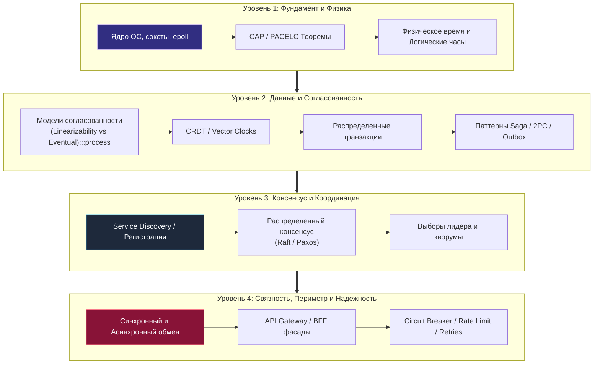
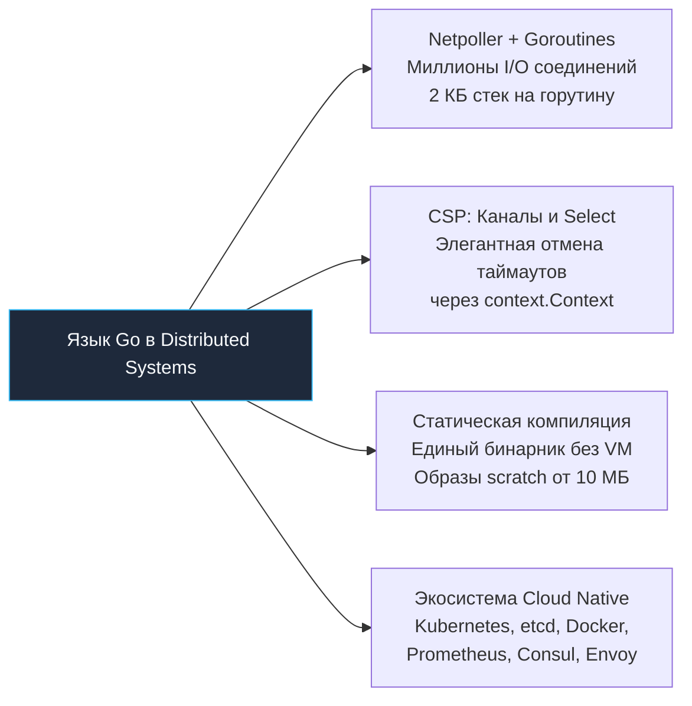

## От теории к практике: Итоги раздела распределенных систем

> *"Простота — это не отправная точка проектирования, это долгожданная награда за глубокое понимание природы вещей. В распределенных системах побеждает не тот, кто внедрил максимальное количество модных паттернов, а тот, кто сумел сохранить систему простой, наблюдаемой и жизнеспособной перед лицом неумолимой физики физических сетей."*  
> — Брайан Керниган

Мы завершили фундаментальное путешествие по миру проектирования и эксплуатации распределенных систем на языке Go. Этот путь начался с честного признания суровой реальности: в вводной статье [[1. Обзор раздела. Почему распределенные системы сложны]] мы сформулировали, почему переход от одного сервера к кластеру кардинально меняет саму парадигму программирования. 

Мы прошли сквозь математические дебри консенсуса (Paxos, Raft), препарировали модели согласованности данных, приручили контейнеризацию в Kubernetes, отточили реактивные инструменты локализации сбоев и завершили путь систематизацией канонических архитектурных паттернов и разрушительных антипаттернов.

Теперь настало время собрать разрозненные элементы мозаики в единый инженерный монолит: сформировать «навигационный компас» Senior-инженера и системного архитектора для принятия взвешенных компромиссных решений в реальном продакшене.

---

## Главный урок: Fallacies of Distributed Computing

Если из всего этого обширного модуля вам нужно вынести одно-единственное фундаментальное правило, то это **Заблуждения распределенных вычислений (Fallacies of Distributed Computing)**, впервые сформулированные Питером Дойчем и Джеймсом Гослингом в Sun Microsystems.

Практически каждая катастрофа в продакшене — будь то каскадный отказ дата-центра, деградация p99 latency до минут или потеря финансовых проводок — происходит ровно в тот момент, когда разработчик наивно предполагает истинность хотя бы одного из этих опасных мифов:

1. **«Сеть надежна» (The network is reliable).**  
   Сеть не просто ненадежна — она враждебна. Кабели перебивают экскаваторы, коммутаторы теряют кадры при переполнении буферов, а Wi-Fi и сотовая связь стохастически рвут соединения. Именно поэтому мы обязаны закладывать механизмы повторов с экспоненциальной задержкой и джиттером ([[1. Retry и backoff]]) и защитные экраны [[1. Circuit breaker]], предотвращающие каскадное выгорание зависимостей.
2. **«Задержка равна нулю» (Latency is zero).**  
   Задержка передачи байта по кремниевой шине процессора в кэш L1 измеряется долями наносекунды. Задержка сетевого пакета между дата-центрами через океан измеряется сотнями миллисекунд — это разница в **восемь порядков** величины! Мы детально изучали Mechanical Sympathy и выяснили, почему замена внутрипроцессного вызова функции на сетевой RPC в наносервисах превращает приложение в парализованную черепаху.
3. **«Пропускная способность бесконечна» (Bandwidth is infinite).**  
   Сетевой интерфейс, коммутаторы и внутренние шины имеют жесткий физический предел пропускной способности. Игнорирование этого ограничения ведет к исчерпанию буферов сокетов ядра и потере пакетов. Для обуздания цунами трафика мы внедряли жесткое квотирование [[6. Rate limiting]], противодавление (Backpressure) и алгоритмы сброса избыточной нагрузки [[5. Load shedding]].
4. **«Топология сети статична» (The topology doesn't change).**  
   В современных облаках и Kubernetes поды умирают, создаются, мигрируют между физическими гипервизорами и меняют IP-адреса ежеминутно. Попытка захардкодить сетевой адрес ведет к мгновенной аварии; спасением выступает динамический каталог сервисов [[8. Service discovery]] и балансировка нагрузки.
5. **«Существует один администратор» (There is one administrator).**  
   Распределенная система охватывает сотни серверов, облачных провайдеров, пограничных маршрутизаторов и сторонних SaaS-шлюзов. Ни у одного живого человека в мире нет монопольного контроля над всей цепочкой прохождения запроса. Ответом на этот хаос служат регулярные учения Chaos Engineering и честная культура разбора полетов [[10. Постмортемы]].

> [!tip] Собеседование
> **Вопрос:** Какие главные фундаментальные сложности возникают при переходе от монолита к микросервисной архитектуре?  
> **Ответ:**  
> Настоящий Senior-инженер всегда начинает ответ не с перечисления названий фреймворков, а с физических законов и **заблуждений распределенных вычислений (Fallacies of Distributed Computing)**. Главный вызов микросервисов — это потеря единой разделяемой памяти: вызовы функций превращаются в ненадежные сетевые RPC с негарантированной доставкой, локальные ACID-транзакции становятся невозможными без сложной компенсации (Saga), а время и одновременность событий становятся относительными понятиями (NTP-дрифт, относительность Эйнштейна).

---

## Слои архитектуры: Итоговая карта

Проектирование распределенной системы подобно возведению слоеного пирога или фундаментального здания: дефект, допущенный на нижнем физическом уровне, неотвратимо разрушает верхние прикладные этажи.

### Уровень 1: Фундамент

Здесь властвуют физические законы оптоволокна, архитектура ядра Linux (TCP сокеты, неблокирующий ввод-вывод `epoll`, очереди `sk_buff`) и теоретические ограничения распределенных систем.

В сердце этого уровня лежат **теоремы CAP и PACELC**. Они постулируют невозможность одновременного достижения абсолютной согласованности данных и 100% доступности в условиях обязательного сетевого разделения (Network Partition). В реальных распределенных системах мы никогда не выбираем абстрактные ярлыки «CP» или «AP» в вакууме — мы балансируем на весах компромисса PACELC: платим ростом задержки (Latency) ради строгой согласованности (Consistency), либо жертвуем актуальностью данных ради мгновенного ответа клиенту.

### Уровень 2: Данные

Данные — это самое ценное, что доверил нам бизнес, и одновременно самое сложное для масштабирования в распределенной среде. 

В этом разделе мы научились:
- Избегать хрупкого двухфазного коммита (2PC) в пользу асинхронных компенсирующих транзакций (**Saga**);
- Гарантировать надежную доставку событий в брокер без двухфазных транзакций через **Transactional Outbox Pattern**;
- Разрешать конфликты параллельных изменений без централизованных блокировок с помощью **CRDT** (Conflict-free Replicated Data Types) и векторных часов (Vector Clocks).

*Ключевой инсайт Go:* В распределенной среде сериализация данных — это прямой потребитель процессорных тактов. Переход от рефлексивного JSON к кодогенерированному бинарному Protobuf/gRPC сокращает время маршалинга в 5–10 раз и исключает давление на сборщик мусора.

### Уровень 3: Координация

Узлы кластера обязаны знать о существовании друг друга (Service Discovery) и принимать однозначные, согласованные решения в условиях падения части машин (Consensus).

*Ключевой инсайт Go:* **Избегайте координации везде, где это только возможно!**  
Если система может быть спроектирована асинхронной и автономной (Event Sourcing, CQRS, партиционирование данных без общего состояния), она будет масштабироваться линейно. Как только вам требуется общее голосование кворума (алгоритм Raft в `etcd` или Consul) или распределенные распределенные мьютексы (Distributed Locks) — пропускная способность вашей системы упирается в потолок задержки сетевого раунда согласования.

### Уровень 4: Связь и Надежность

Это парадный фасад системы, встречающий пользователей и сторонние API. Сюда входят специализированные фасады **API Gateway** и **BFF (Backend for Frontend)**, брокеры сообщений (Kafka, RabbitMQ, NATS) и защитная сеть паттернов устойчивости.

*Ключевой инсайт Go:* Переход от синхронных цепочек вызовов к асинхронным событийно-ориентированным потокам (Message-Driven Architecture) — это переход от хрупкости к органической неуязвимости. Временная недоступность сервиса аналитики или биллинга больше не блокирует оформление заказов клиентами.

---

## Роль Go в распределенных системах

Почему язык Go стал безоговорочным «языком облачной революции» и де-факто стандартом индустрии для микросервисов и распределенной инфраструктуры?

1. **Горутины как супероружие против задержки (Latency):**  
   В статье [[3. Latency и network fallacies]] мы доказали, что сеть медлительна по своей природе. Если бы мы использовали классическую потоковую модель операционной системы (Thread-per-request в старых веб-серверах Java или блокирующие процессы PHP), серверы захлебнулись бы в миллионах потоков, каждый из которых требует от 1 до 8 МБ стека ОС.  
   Рантайм Go с кооперативным сетевым поллером (`netpoller` на базе `epoll`/`kqueue`) и динамическими стеками горутин (начиная всего с 2 КБ) позволяет одному инстансу удерживать сотни тысяч одновременных сетевых ожиданий, потребляя считанные мегабайты памяти.
2. **Философия CSP и контексты (`context.Context`):**  
   Реализация защитных паттернов ([[1. Circuit breaker]], семафоры, пулы воркеров) в Go естественна и безопасна благодаря модели передачи сообщений через каналы (Communicating Sequential Processes) и оператор `select`. Древовидное распространение сигналов отмены через стандартный `context.Context` гарантирует, что при разрыве соединения клиентом все нижележащие горутины немедленно освободят память и сокеты.
3. **Статическая типизация и феноменальная скорость компиляции:**  
   В мире микросервисов время сборки бинарника определяет скорость поставки фич (Time to Market). Go компилируется за секунды, выдавая автономный исполняемый файл без внешних динамических зависимостей (`libc`), который идеально упаковывается в минималистичный Docker-образ `scratch` размером в 15–20 МБ.
4. **Язык экосистемы Cloud Native:**  
   Docker, Kubernetes, `etcd`, Prometheus, Consul, Terraform, Traefik, Cilium — весь технологический стек современных распределенных систем написан на Go. Глубоко понимая рантайм языка, структуры данных и планировщик Go, вы понимаете саму инфраструктуру, на которой развернуты ваши приложения.

---

## Чек-лист зрелости архитектора

Прежде чем отправить распределенный сервис в боевой продакшен, протестируйте себя по этому чеклисту. Способна ли ваша архитектура дать аргументированный ответ на каждый из этих вызовов?

- [ ] **Сетевой сплит (Network Partition):** Что произойдет с узлами вашего сервиса, если связь между двумя зонами доступности разорвется на 30 минут? Система продолжит принимать записи ценой рассинхрона, либо перейдет в режим «только чтение» для сохранения целостности?
- [ ] **Защита от каскадного тайм-аута:** Если база данных или зависимый микросервис внезапно увеличит p99 latency с 5 мс до 2 секунд, выдержит ли пул соединений? Не сгорят ли квоты потоков шлюза? Настроена ли иерархия таймаутов `Timeout Backend < Timeout Gateway < Timeout Client`?
- [ ] **Идемпотентность мутаций:** Если сетевой сбой оборвет соединение в момент отправки HTTP 200 на команду оплаты, сможет ли клиент безопасно повторить вызов с тем же `Idempotency-Key` без повторного списания денег?
- [ ] **Ликвидация единых точек отказа (SPOF):** Есть ли в архитектуре монопольные синглтон-компоненты (мастер-ноды, лидеры Raft, нешардированные кэши), выход из строя которых парализует 100% операций компании?
- [ ] **Деградация возможностей (Graceful Degradation):** Если рекомендательный алгоритм или аналитический движок падает под нагрузкой, продолжает ли работать основная витрина товаров, отдавая статический кэш или базовые заглушки?
- [ ] **Стратегия отката данных:** Готова ли команда к тому, что в распределенной среде откат версии бинарника (`rollout undo`) **не откатывает** уже смутированные и разъехавшиеся данные в распределенных базах? Заложены ли механизмы версионирования схем (Expand and Contract) и компенсирующие процедуры?

---

> [!NOTE] 
> На этом мы торжественно завершаем **Модуль 14: Распределенные системы на Go**.  
> Вы освоили весь фундамент современной распределенной инженерии — от микроархитектуры рантайма до глобальных облачных систем. Применяйте эти знания взвешенно, помните об эмпатии к коллегам и к машине, и создавайте надежный, элегантный и отказоустойчивый софт!