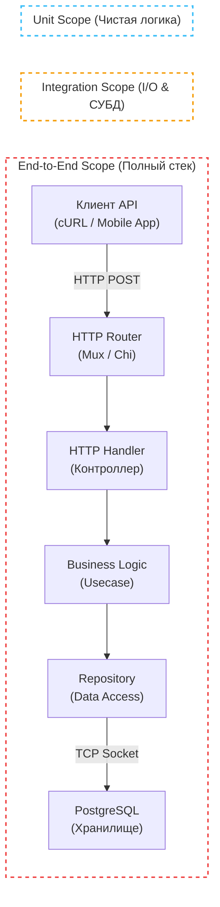

## Анатомия доверия: Зачем нам разные уровни тестирования?

> *"Программа, проверенная исключительно на уровне отдельных функций — это россыпь безупречно выточенных шестеренок. Но лишь испытав весь собранный механизм под реальной нагрузкой, вы узнаете, способны ли эти шестеренки вращаться вместе, не ломая зубья."*  
> — Брайан Керниган

Когда вы разрабатываете распределенный микросервис на Go, ваша конечная цель — не просто выполнить последовательность изолированных процессорных инструкций, а надежно принять входящий сетевой запрос (HTTP, gRPC, WebSocket), провалидировать входной пейлоад, применить доменную бизнес-логику, обновить транзакционное состояние в базе данных, отправить событие в шину сообщений и вернуть корректный ответ клиенту.

Ни один инструмент в мире не способен проверить эту сложную цепочку за один универсальный прогон с оптимальным балансом между скоростью и достоверностью. 

Представьте две крайности:
1. **Только сквозные тесты (End-to-End):** Мы разворачиваем реальный кластер, поднимаем PostgreSQL, Kafka и Redis, и на каждый мелкий чих отправляем реальные HTTP-запросы через сокеты. Сборка такого пайплайна длится 40 минут, тесты флакуют из-за сетевых тайм-аутов, а разработчики перестают запускать тесты локально.
2. **Только тотальное мокирование (100% Mocking):** Мы изолировали всё на свете через виртуальные заглушки. Тесты пролетают за 200 миллисекунд, отчет о покрытии сияет заветными 98%, но в боевом продакшене сервис падает при первом же запросе из-за банальной опечатки в SQL-запросе (`SELECT column_name`) или несовпадения регистра заголовков HTTP.

Именно поэтому современная программная инженерия разделяет тестирование серверных систем на три фундаментальных уровня, каждый из которых решает строго очерченную задачу и обладает своей физической стоимостью.

---

## 1. Unit-тестирование (Модульные тесты)

**Unit-тесты (модульные тесты)** проверяют наименьшую неделимую единицу исходного кода в полной, стерильной изоляции от внешнего мира. В контексте языка Go такой атомарной единицей обычно выступает отдельная функция, метод структуры или доменный агрегат.

Главное правило истинного Unit-теста: **Он не должен покидать пределы пользовательского пространства процесса (User Space) и не имеет права совершать системные вызовы ввода-вывода (I/O).**

### Mechanical Sympathy и Unit-тесты

В идеальном Unit-тесте напрочь отсутствуют I/O операции: нет сетевых вызовов, нет чтения с диска, нет обращения к операционной системе через `syscall`. Вся работа выполняется исключительно транзисторами арифметико-логического устройства (ALU), регистрами процессора и кэшами L1/L2/L3.

Благодаря этому планировщик Go (GMP модель) никогда не переводит горутины тестов в состояние ожидания (`_Gwaiting`), потоки операционной системы (`M`) не блокируются на дескрипторах, а context switch сводится к нулю. Десять тысяч качественно написанных unit-тестов на Go способны выполниться за считанные сотни миллисекунд.

**Что проверяется на уровне Unit:**
- Чистые алгоритмы и математические формулы;
- Бизнес-правила доменных моделей и валидация структур;
- Парсинг и валидация криптографических токенов (если ключ передан в памяти);
- Логика переходов конечных автоматов (State Machines).

```go
// Пакет корзины заказов: чистая бизнес-логика, не знающая о базах данных и сети
package cart

import "errors"

var ErrNegativeQuantity = errors.New("quantity cannot be negative")

type Cart struct {
	Items map[string]int
}

func NewCart() *Cart {
	return &Cart{Items: make(map[string]int)}
}

func (c *Cart) AddItem(itemID string, qty int) error {
	if qty < 0 {
		return ErrNegativeQuantity
	}
	c.Items[itemID] += qty
	return nil
}
```

> [!info] Под капотом: Пакеты в Go и тестирование
> В Go реализованы два принципиальных подхода к организации модульных тестов: **White-box (внутреннее)** и **Black-box (внешнее)**.
> 1. Если ваш файл называется `cart_test.go` и объявлен как `package cart`, тестовый код компилируется в то же пространство имен. Вы получаете прямой доступ к неэкспортируемым (приватным) полям и вспомогательным функциям. Это *White-box* тестирование.
> 2. Если файл имеет заголовок `package cart_test`, он компилируется компилятором Go как абсолютно независимый внешний пакет. Вы можете обращаться *строго* к публичному экспортируемому API (`cart.NewCart()`, `cart.AddItem()`).  
> В профессиональной среде Go настоятельно рекомендуется следовать стилю **Black-box (`package cart_test`)**: он заставляет вас тестировать контракт и наблюдаемое поведение компонента, не привязываясь к скрытым деталям реализации, которые могут часто подвергаться рефакторингу.

> [!warning] Ловушка / Gotcha
> Типичная ошибка инженеров, пришедших из языков с развитой рефлексией (Java, Python) — непреодолимое желание «протестировать приватный метод во что бы то ни стало».  
> Если внутреннюю неэкспортируемую функцию невозможно проверить через публичный интерфейс, это кричащий признак архитектурного порока. Скорее всего, функция перегружена лишней ответственностью; ее необходимо выделить в отдельный независимый интерфейс или доменный компонент и протестировать его собственный публичный контракт.

---

## 2. Integration-тестирование (Интеграционные тесты)

Если модульные тесты гарантируют, что каждая шестеренка выточена строго по чертежу, то **Интеграционные тесты** проверяют, способны ли эти шестеренки надежно зацепляться друг с другом при сборке узла.

На этом уровне мы пересекаем границу собственного Go-процесса. Интеграционный тест **обязан** выполнять реальные системные вызовы, работать с дисковой подсистемой или передавать пакеты по сетевому стеку.

**Объекты интеграционного тестирования:**
- **Слой доступа к данным (Repository / Data Access Layer):** отправка настоящих SQL-запросов (`db.QueryRow()`, `INSERT`, `UPDATE`) в реальную СУБД;
- **Внешние HTTP/gRPC клиенты:** обращение к сетевым эндпоинтам внешних партнеров или локальным тестовым серверам;
- **Шины сообщений и очереди:** публикация сообщений в брокер (Kafka, RabbitMQ, NATS) и проверка консьюмеров.

### Цена интеграционного теста

Давайте проследим путь выполнения одного SQL-запроса с точки зрения операционной системы:

```mermaid
flowchart TD
    GoApp["Go Приложение<br>(User Space / Горутина)"]
    Syscall["Системный вызов syscall<br>(write / sendto / epoll)"]
    Kernel["Ядро Linux<br>(Kernel Space / Network Stack)"]
    DB["Внешний процесс СУБД<br>(PostgreSQL в Docker)"]

    GoApp -->|"1. Вызов db.QueryRow()"| Syscall
    Syscall -->|"2. Переключение контекста Ring 3 -> Ring 0"| Kernel
    Kernel -->|"3. Запись в сокетный буфер (sk_buff)"| DB
    DB -.->|"4. Обработка SQL и ответ по TCP"| Kernel
    Kernel -.->|"5. Netpoller пробуждает горутину"| GoApp

    style GoApp fill:#1e293b,stroke:#38bdf8,stroke-width:2px
    style Syscall fill:#1e293b,stroke:#f59e0b,stroke-width:2px
    style Kernel fill:#1e293b,stroke:#6366f1,stroke-width:2px
    style DB fill:#7f1d1d,stroke:#ef4444,stroke-width:2px
```



В момент, когда Go-код инициирует `db.QueryRow()`, происходит системный вызов `syscall` (например, `write` или `sendto` в сетевой сокет). Горутина немедленно переходит из состояния выполнения в состояние `Gsyscall`. Планировщик Go отцепляет логический процессор `P` от потока ОС `M`, чтобы поток мог заблокироваться на системном вызове, пока TCP-пакет летит по сетевому интерфейсу к базе данных.

Тест становится **I/O-bound (ограниченным скоростью ввода-вывода)**. Его задержка подскакивает на несколько порядков: с наносекунд до десятков миллисекунд.

В современном бэкенде стандартом надежности стало использование эфемерных контейнеров (см. [[4. testcontainers go]]). Мы не пытаемся подделывать поведение сложной СУБД сомнительными моками: тест программно поднимает полноценный PostgreSQL в Docker, применяет боевые миграции, прогоняет реальные транзакции и гарантированно утилизирует контейнер после завершения.

> [!tip] Собеседование
> **Вопрос:** В чем заключается фундаментальная разница между тестированием HTTP-хэндлера с помощью `httptest.ResponseRecorder` и через `httptest.NewServer`?  
> **Ответ:**  
> Это тонкая граница между модульным и интеграционным тестом:  
> - `httptest.ResponseRecorder` (или просто `ResponseRecorder`) передает объект `http.Request` напрямую в функцию хэндлера в оперативной памяти. Сетевой стек операционной системы не задействован, сетевые порты не открываются, системных вызовов нет — это **чистый Unit-тест**.  
> - `httptest.NewServer` запускает полноценный HTTP-сервер, который привязывается к реальному сетевому интерфейсу (слушает порт на `127.0.0.1`). Клиент выполняет настоящий сетевой вызов через loopback-интерфейс ядра ОС с прохождением полного сетевого стека TCP/IP — это полноценный **Интеграционный тест**.

---

## 3. E2E-тестирование (End-to-End, Сквозное тестирование)

**E2E-тест (сквозной тест)** рассматривает программную систему как неделимый «черный ящик», полностью собранный, сконфигурированный и запущенный в окружении, максимально приближенном к боевому продакшену.

Здесь нет прямого вызова внутренних функций на Go. Сервис компилируется в бинарник, запускается в Docker/Kubernetes, соединяется с реальными репликами баз данных, кэшами и внешними шлюзами. Тестовый стенд эмулирует поведение реального конечного пользователя (браузера, мобильного приложения или стороннего платежного шлюза).

**Что верифицируется на уровне E2E:**
- Корректность инициализации графа зависимостей (Dependency Injection) и чтение конфигураций из окружения;
- Цепочки промежуточных обработчиков (Middleware): проверка JWT-авторизации, CORS, распределенный Rate Limiting;
- Сценарии деградации: поведение системы при отказе второстепенных сервисов (например, доступен ли каталог, если упал сервис персональных рекомендаций).

Главный недостаток E2E-тестов — высокая стоимость сопровождения, медлительность и риск ложных срабатываний (Flaky Tests) из-за сетевых коллизий, асинхронных задержек и межсервисных тайм-аутов.

---

## Резюме: Распределение зон ответственности

Давайте визуализируем, как различные уровни тестирования накладываются на слои классического серверного приложения при создании нового пользователя:



Понимание этих зон ответственности критично для проектирования пайплайнов CI/CD. Быстрые Unit-тесты запускаются локально на каждый коммит и отрабатывают за секунды. Интеграционные и сквозные тесты подключаются перед слиянием Pull Request в ветку `master` или в процессе релизного развертывания.

Как грамотно распределить пропорции между этими уровнями, чтобы не разориться на поддержке тяжелых тестов, но при этом уверенно деплоить сервис в пятницу вечером? Ответ дает классическая концепция, которую мы изучим в следующей лекции: [[3. Пирамида тестирования]].