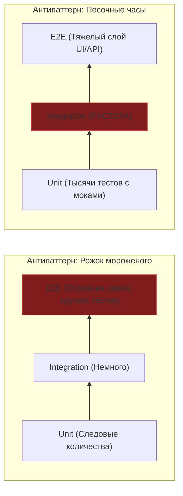

## Пирамида тестирования: Баланс скорости и надежности

> *"Тесты, проверяющие лишь то, что функция А вызвала функцию Б с аргументом В, не дают уверенности ни в чем, кроме того, что код написан ровно так, как он написан. Настоящие инженерные тесты проверяют инварианты системы, а не конспектируют ее реализацию."*  
> — Брайан Керниган

В предыдущей лекции [[2. Виды тестирования. Unit, Integration, E2E]] мы провели строгую границу между физическими уровнями тестов: выяснили, что Unit-тесты всецело изолированы внутри пользовательского пространства процесса и кэшей CPU, тогда как интеграционные и сквозные проверки неизбежно пересекают границу ядра через системные вызовы, сокеты и дисковый ввод-вывод.

Перед системным инженером встает фундаментальный архитектурный вопрос: **в какой именно пропорции следует писать тесты разных уровней?**  
Если интеграционные тесты дают значительно больше уверенности в боевой работоспособности (ведь они обращаются к настоящей СУБД, а не к воображаемым заглушкам), почему бы просто не покрыть 100% кодовой базы интеграционными сценариями? Ответ дает концепция **Пирамиды тестирования (Test Pyramid)** и ее современная эволюция в мире распределенных микросервисов.

---

## Классическая пирамида тестирования

Классическая модель пирамиды была сформулирована Майком Коном (Mike Cohn) в начале 2000-х годов в контексте гибких методологий разработки. Ее базовый постулат предельно прагматичен: объем тестов в кодовой базе должен распределяться слоями в зависимости от скорости их исполнения, изоляции и совокупной стоимости владения.

```mermaid
flowchart BT
    Unit["Unit-тесты (Модульные)<br>~70% тестовой базы<br>Микросекунды, нулевой I/O, стерильная изоляция"] -->|Широкий базис| Integ["Интеграционные тесты<br>~20% тестовой базы<br>Проверка SQL, контрактов и сетевых адаптеров"]
    Integ -->|Вершина пирамиды| E2E["E2E тесты (Сквозные)<br>~10% тестовой базы<br>Секунды/минуты, полный стек, высокая хрупкость"]
    
    style Unit fill:#1e293b,stroke:#10b981,stroke-width:2px
    style Integ fill:#1e293b,stroke:#f59e0b,stroke-width:2px
    style E2E fill:#7f1d1d,stroke:#ef4444,stroke-width:2px
```

Чем выше вы поднимаетесь от подножия пирамиды к ее вершине:
1. **Уверенность в интеграции:** растет (проверяется реальное взаимодействие боевых компонентов);
2. **Стоимость разработки и сопровождения:** возрастает многократно;
3. **Скорость выполнения (Feedback Loop):** падает на порядки;
4. **Вероятность флакования (Flakiness):** стремительно увеличивается из-за стохастических задержек операционной системы, сетевых тайм-аутов и гонок инициализации внешних контейнеров.

### Mechanical Sympathy Пирамиды

Давайте взглянем на пирамиду через призму кремния и планировщика Go (модель GMP):

- **Фундамент (Unit-слой):**  
  Запуск 1 000 модульных тестов происходит полностью в User Space. Горутины тестов (`G`) непрерывно сменяют друг друга на очередях логических процессоров (`P`). Память под локальные структуры размещается в стеках и попадает в ультрабыстрые кэши L1/L2 процессора (задержка доступа ~1–4 нс). Системные вызовы отсутствуют. Тысяча тестов завершается за считанные миллисекунды.
- **Середина пирамиды (Integration-слой):**  
  Запуск 100 интеграционных тестов с реальным экземпляром PostgreSQL требует установления TCP-сокетов. Горутина выполняет системный вызов `write` для отправки SQL-запроса (`SELECT` или `INSERT`). Планировщик Go немедленно паркует горутину в `netpoller`, высвобождая рабочий тред ОС (`M`) для другой полезной нагрузки. Когда база данных присылает ответ, сетевая карта генерирует аппаратное прерывание, ядро Linux пробуждает сетевой поллер, и горутина возвращается в локальную очередь запуска.  
  Цена этой операции — переключение контекста, выделение буферов ядра `sk_buff` и сетевая задержка. Интеграционный тест длится миллисекунды или секунды.

> [!info] Под капотом: t.Parallel() на разных слоях
> Стандартный пакет `testing` в Go предоставляет мощную директиву `t.Parallel()`, сигнализирующую раннеру о возможности параллельного исполнения тестов на доступных ядрах процессора (`GOMAXPROCS`).  
> На уровне **Unit-тестов** это дает практически линейное ускорение: чистые вычисления параллелятся по всем ядрам без блокировок.  
> Однако если вы бездумно вызовете `t.Parallel()` в сотне **интеграционных тестов**, каждая параллельная горутина попытается открыть собственный пул соединений с базой данных. В результате вы мгновенно исчерпаете пул соединений СУБД (`max_connections` в Postgres) либо натолкнетесь на лимит открытых файловых дескрипторов в ядре Linux (`ulimit -n`). Интеграционные тесты требуют строгой оркестрации ресурсов и управления пулами соединений.

---

## Эволюция пирамиды: Go и микросервисы

Классическая пропорция пирамиды (70% Unit / 20% Integration / 10% E2E) идеально подходила для классических монолитов 2000-х годов с богатыми предметными доменами, сложнейшими графами наследования и многостраничными бизнес-правилами.

Однако в современном облачном бэкенде на Go микросервисы чаще всего устроены принципиально иначе:
Сервис принимает JSON-запрос по HTTP, валидирует типы полей, выполняет `INSERT` в PostgreSQL и публикует событие в Kafka.
Где здесь сложнейшая математика или запутанные алгоритмы? Их практически нет. Вся суть подобного сервиса — **надежная оркестрация потоков I/O и координация контрактов**.

Если в таком сервисе слепо следовать догме классической пирамиды, разработчик оказывается вынужден покрывать код тысячами строк хрупких моков:
- Мокать базу данных через библиотеки вроде `sqlmock`;
- Генерировать моки для внутренних интерфейсов через `gomock`.

В итоге рождаются тесты-пустышки, проверяющие лишь то, что метод контроллера вызвал мок репозитория с аргументом $X$. Стоит вам изменить регистр имени колонки в SQL или забыть добавить миграцию таблицы — моки останутся зелеными, а сервис мгновенно упадет в продакшене.

Поэтому в современной микросервисной разработке на Go на смену жесткой пирамиде пришла модель **Testing Honeycomb («Соты тестирования»)**, сформулированная инженерами Spotify.

```mermaid
flowchart TD
    E2E["E2E тесты<br>(Минимум на критические сценарии)"]
    Integ["Интеграционные тесты<br>(ЯДРО СИСТЕМЫ: ~60-70% фокуса)<br>Реальная СУБД, Testcontainers, net/http/httptest"]
    Unit["Unit-тесты<br>(~20-30%: алгоритмы, парсеры, конечные автоматы)"]

    E2E --- Integ
    Integ --- Unit
    
    style Integ fill:#1e293b,stroke:#38bdf8,stroke-width:3px
    style Unit fill:#1e293b,stroke:#10b981,stroke-width:2px
    style E2E fill:#1e293b,stroke:#ef4444,stroke-width:2px
```

Благодаря легковесности Go, стандартному пакету `net/http/httptest` и мощи библиотек оркестрации вроде [[4. testcontainers go]], мы можем поднимать реальные эфемерные экземпляры PostgreSQL или Redis прямо внутри `go test` за доли секунды.

В современных Go-сервисах **интеграционные тесты становятся главным источником инженерной уверенности**. Модульные Unit-тесты мы оставляем для тех участков, где действительно сосредоточена нетривиальная алгоритмическая сложность (расчет динамических тарифов, парсинг бинарных кадров, валидация криптографии).

---

## Антипаттерны тестирования

Нарушение баланса слоев порождает две классические архитектурные деформации:

### 1. Рожок с мороженым (Ice Cream Cone)

Перевернутая пирамида. Команда пренебрегает быстрыми модульными и компонентными проверками, возводя гигантский купол из сквозных E2E-тестов.
- **Симптомы:** Пайплайн CI длится 45–60 минут. Стоит временно зафлаковать сетевому интерфейсу на сервисе авторизации — в красный цвет окрашиваются 400 независимых E2E-тестов. Найти истинную первопричину (Root Cause) среди сотен упавших логов становится практически невозможно.

### 2. Паттерн «Песочные часы» (Hourglass)

Огромное количество модульных тестов с тотальным мокированием внизу, массивная шапка сквозных E2E-тестов наверху — и полная пустота в середине (отсутствие интеграционных тестов с реальной СУБД).
- **Симптомы:** Разработчики локально наслаждаются мгновенными «зелеными» тестами, однако любая реальная интеграция на Staging выявляет несовместимость схем данных и блокировки.

> [!tip] Собеседование
> **Вопрос:** Почему показатель «100% покрытия кода» (100% Test Coverage) на практике часто называют ложной метрикой тщеславия (Vanity Metric)?  
> **Ответ:**  
> Метрика покрытия фиксирует лишь факт того, что конкретная строка кода была физически *выполнена* процессором в процессе прогона теста. Она никоим образом не гарантирует, что полученные сайд-эффекты и возвращаемые значения были корректно *проверены* утверждениями.  
> Более того, административное требование 100% покрытия провоцирует антипаттерны: инженеры начинают мокать каждую строку, проверяя тривиальные геттеры, структуры DTO и автогенерированный код. Это цементирует детали внутренней реализации: любой рефакторинг ломает десятки тестов, даже если внешнее поведение API осталось неизменным. Тесты обязаны фиксировать контракты и поведение, а не строки исходников.

---

## Балансировка в реальном Go-проекте

Чтобы тесты приносили уверенность, а не замедляли релизы, тестируемость должна быть заложена в архитектуру с первого дня. 

Если ваш HTTP-хэндлер прямо внутри своего тела создает подключение к `sql.DB` и выполняет неизолированный запрос `SELECT`, вы физически лишены возможности протестировать этот модуль автономно: вы оказались заложником собственного монолитного сцепления.

Пирамида и соты тестирования — это главный лакмусовый индикатор чистоты архитектурных решений. В следующей лекции мы разберем ключевые приемы проектирования, делающие код элегантно тестируемым на любом уровне пирамиды: [[4. Testability и дизайн кода]].