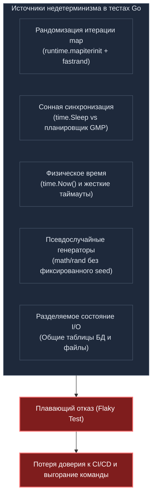
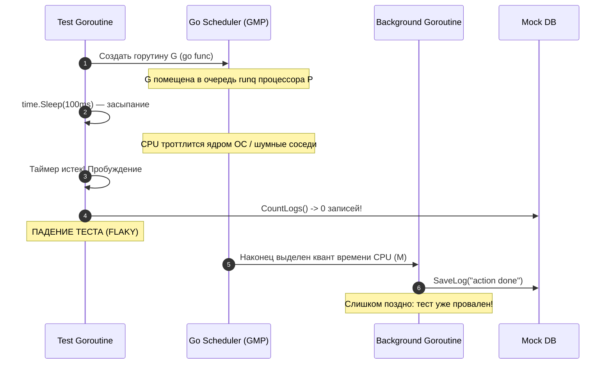

В предыдущей главе [[4. Testability и дизайн кода]] мы убедились, что тестируемость — это прямое следствие архитектурной дисциплины. Если код разбит на слабосвязанные модули с прозрачными интерфейсными швами, написать тест не составляет труда. Но написать тест — это лишь половина пути. Настоящая инженерная драма разворачивается в тот момент, когда тест начинает вести себя как капризный генератор случайных чисел: сегодня на вашей машине он радостно зеленеет, а завтра в ночном CI-пайплайне падает с красным крестом, хотя в кодовой базе не изменилось ни единого байта.

Фундаментальное свойство любой зрелой инженерной тестовой системы — это **детерминизм (Determinism)** и **воспроизводимость (Reproducibility)**.

В естественных науках эксперимент считается научным только тогда, когда независимый исследователь при соблюдении тех же условий получает идентичный результат. Если химическая реакция по понедельникам дает осадок, а по вторникам взрывается — это не наука, а алхимия. В программной инженерии детерминированный тест при одинаковых входных данных и идентичном начальном состоянии системы *обязан всегда* возвращать один и тот же результат. Будь то мощная рабочая станция разработчика, перегруженный контейнер в Kubernetes или агент GitHub Actions с квотой в пол-ядра CPU.

Отсутствие детерминизма методично уничтожает культуру разработки. Как только инженеры привыкают механически жать кнопку «Re-run failed jobs» в надежде на то, что «со второго раза проскочит», автоматизированное тестирование перестает быть страховкой. Оно превращается в назойливый ритуал, а баги неизбежно просачиваются в production.

Язык Go славится своей прямолинейностью, однако его рантайм и стандартная библиотека содержат несколько намеренно встроенных механизмов энтропии. Чтобы писать надежные системы, старший инженер обязан понимать механику этих источников случайности и уметь подчинять их строгому детерминизму.



---

## Враг №1: Итерация по `map`

Классическая ловушка для новичков в Go — скрытое предположение о том, что элементы из хэш-таблицы (`map`) извлекаются в порядке их добавления либо в каком-то предсказуемом фиксированном порядке.

В Go обход ассоциативного массива через конструкцию `for ... range` **намеренно рандомизирован на уровне рантайма**.

> [!info] Под капотом
> Внутреннее представление хэш-таблицы в исходном коде `runtime` языка Go описывается структурой `hmap`. В ней содержится поле `hash0` — случайное 32-битное зерно (seed), которое генерируется заново для каждой вновь создаваемой мапы.
> 
> Но рандомизации ключей на основе `hash0` создателям языка показалось мало. При запуске цикла обхода компилятор подставляет вызов функции `runtime.mapiterinit`. Внутри нее рантайм вызывает внутренний быстрый генератор случайных чисел `fastrand()`, выбирая абсолютно случайный стартовый бакет (bucket) и случайное смещение (offset) внутри этого бакета.
> 
> Это решение было принято Робом Пайком и командой Go вполне осознанно. Во-первых, оно защищает веб-сервисы от атак типа Hash DoS (алгоритмическая сложность поиска при коллизиях). Во-вторых, оно предотвращает появление скрытых архитектурных зависимостей от порядка обхода: хэш-таблицы по определению математически не упорядочены, и при росте структуры (эвакуация бакетов при переполнении) порядок элементов всё равно неизбежно изменился бы. Рандомизация бьет по рукам сразу.

### Как недетерминизм `map` ломает тесты

Представьте простую вспомогательную функцию, формирующую строку URL-query параметров:

```go
package urlutil

// BuildQuery склеивает параметры запроса в строку формата key=val&
func BuildQuery(params map[string]string) string {
	query := ""
	for k, v := range params {
		query += k + "=" + v + "&"
	}
	return query
}
```

Если вы напишете наивный тест:

```go
func TestBuildQuery(t *testing.T) {
	params := map[string]string{"a": "1", "b": "2"}
	expected := "a=1&b=2&"
	
	actual := BuildQuery(params)
	if actual != expected {
		t.Fatalf("Ожидали %s, получили %s", expected, actual)
	}
}
```

Этот тест превратится в подлинную рулетку: он будет успешно проходить ровно в 50% запусков, а в остальных 50% падать с ошибкой, так как `BuildQuery` вернет строку `b=2&a=1&`.

### Рецепт детерминизации

Единственный корректный способ обеспечить воспроизводимость при работе со строковыми представлениями коллекций — явная сортировка ключей перед итерацией:

```go
package urlutil

import "sort"

func BuildQuery(params map[string]string) string {
	keys := make([]string, 0, len(params))
	for k := range params {
		keys = append(keys, k)
	}
	sort.Strings(keys) // Детерминируем порядок ключей раз и навсегда

	query := ""
	for _, k := range keys {
		query += k + "=" + params[k] + "&"
	}
	return query
}
```

> [!tip] Собеседование
> **Вопрос:** Как в тестах сравнивать сложные вложенные DTO-структуры, внутри которых содержатся `map` или срезы с неупорядоченными данными? Не писать же сортировку вручную для каждого вложенного поля?  
> **Ответ:** Золотой стандарт современной Go-экосистемы — библиотека `github.com/google/go-cmp/cmp`. В отличие от примитивного `reflect.DeepEqual`, который слепо сравнивает внутреннее представление и падает при несовпадении типов `nil` против пустого среза, пакет `cmp` спроектирован именно для тестирования.  
> С помощью опции `cmpopts.SortMaps(func(k1, k2 string) bool { return k1 < k2 })` или `cmpopts.SortSlices(...)` вы указываете компаратору правила приведения структур к каноническому виду, а при падении получаете исчерпывающий визуальный diff в стиле `git diff`, указывающий на точное несовпадающее поле.

---

## Враг №2: "Сонная" конкурентность

Тестирование многопоточного кода — сложнейшая дисциплина в бэкенд-разработке. Самая коварная анти-практика, с которой приходится сталкиваться при ревью тестов — использование усыпления горутины через `time.Sleep` или `time.Sleep()` для «синхронизации» с фоновыми процессами.

Взгляните на типичный антипаттерн «выстрелил и забыл»:

```go
package audit

import (
	"testing"
	"time"
)

func FireAndForgetAction(db Database) {
	go func() {
		// Асинхронная запись аналитического события в хранилище
		db.SaveLog("action done") 
	}()
}

// ПЛОХОЙ ТЕСТ: "Сонная" синхронизация
func TestFireAndForget(t *testing.T) {
	db := NewMockDB()
	FireAndForgetAction(db)
	
	// Автор надеется, что 100 миллисекунд хватит с головой
	time.Sleep(100 * time.Millisecond) 
	
	count := db.CountLogs()
	if count != 1 {
		t.Fatalf("Ожидали 1 запись в логе, найдено: %d", count)
	}
}
```

### Почему это сломается: анатомия планировщика GMP

На вашей рабочей машине с 16 ядрами процессор практически свободен: горутина переключается на свободный поток операционной системы (M) за доли микросекунды, и `time.Sleep(100 * time.Millisecond)` выглядит как гигантский запас надежности.

Но запустите этот же код на CI-сервере. Под управлением CFS (Completely Fair Scheduler) ядра Linux виртуальный CPU тестового раннера жестко троттлится из-за лимитов контейнеризации и соседей по хосту. Планировщик рантайма Go (модель GMP) помещает созданную горутину в локальную очередь процессора `P`. Пока тестовая горутина спит в таймере, ОС отнимает у контейнера процессорный квант. 100 миллисекунд физического времени истекают, тестовая горутина просыпается, проверяет базу данных — а фоновая горутина *еще даже не успела начать свое выполнение*!



Разработчик, столкнувшись с падением в CI, обычно делает худшее, что можно придумать: увеличивает паузу до `sleep(500ms)`, а затем до `sleep(2s)`. В результате тестовый сьют раздувается с 5 секунд до 15 минут, а в моменты пиковых нагрузок на CI тесты всё равно продолжают случайно мигать.

### Решение: Детерминированная синхронизация

Вместо надежды на физические таймеры используйте явные примитивы синхронизации:
1. Передавайте `sync.WaitGroup` или объект-координатор в функцию бизнес-логики.
2. Проектируйте асинхронные API так, чтобы они возвращали канал завершения (сигнальный канал `<-chan struct{}`).
3. Используйте каналы (Channels) для гарантированной передачи сигнала об окончании работы.

```go
// Чистый дизайн: функция возвращает канал уведомления о готовности
func FireAndForgetActionWithSignal(db Database) <-chan struct{} {
	done := make(chan struct{})
	go func() {
		defer close(done) // Канал закроется строго после завершения записи
		db.SaveLog("action done")
	}()
	return done
}

func TestFireAndForgetDeterministic(t *testing.T) {
	db := NewMockDB()
	done := FireAndForgetActionWithSignal(db)

	// Детерминированное ожидание без лишних миллисекунд задержки
	select {
	case <-done:
		// Успешно завершилось
	case <-time.After(2 * time.Second):
		t.Fatal("Таймаут: горутина зависла")
	}

	if count := db.CountLogs(); count != 1 {
		t.Fatalf("Ожидали 1 запись, получено %d", count)
	}
}
```

Если же сигнальный канал вернуть невозможно, используйте `sync.WaitGroup` либо `WaitGroup` в качестве зависимости или вспомогательного счетчика.

---

## Враг №3: Время как глобальная переменная

Прямой вызов `time.Now()` внутри бизнес-логики превращает функцию в недетерминированный автомат. Каждая наносекунда смещает текущий таймстамп, делая точное побайтовое сравнение структур невозможным.

Как мы выяснили в предыдущей лекции, время должно выступать управляемой зависимостью. Мы выделяем интерфейс `Clock`:

```go
type Clock interface {
	Now() time.Time
}
```

В тестах мы внедряем статический или программно управляемый `MockClock`, гарантируя, что проверка истечения срока годности сессии или расчет кредитных процентов выполняются в абсолютно застывшей временной точке.

> [!warning] Ловушка / Gotcha
> Остерегайтесь крошечных жестких таймаутов в сетевых и конкурентных тестах. Конструкции вроде `context.WithTimeout(ctx, 10*time.Millisecond)` — это гарантированная бомба замедленного действия для CI/CD. В нагруженном виртуальном окружении на один системный вызов ядра Linux или переключение контекста потока может уйти больше 15 миллисекунд.  
> Всегда выносите таймауты в параметры конфигурации, либо калибруйте их динамически. Например, многие команды считывают флаг переменной окружения `CI=true` и автоматически умножают все базовые таймауты на адаптивный коэффициент (10x–20x), защищая пайплайн от ложных срабатываний.

---

## Враг №4: Генераторы псевдослучайных чисел (PRNG)

Если бизнес-логика использует генераторы случайных чисел из пакета `math/rand` (или модернизированного `math/rand/v2`, появившегося в Go 1.22+) для балансировки трафика, генерации проверочных кодов или случайного перемешивания очередей, тесты неизбежно будут выдавать расходящиеся результаты.

Детерминированный тест обязан полностью контролировать *зерно (seed)* генератора:

```go
package balancer

import (
	"math/rand/v2"
	"testing"
)

type LoadBalancer struct {
	nodes []string
	rng   *rand.Rand
}

func NewBalancer(nodes []string, rng *rand.Rand) *LoadBalancer {
	return &LoadBalancer{nodes: nodes, rng: rng}
}

func (b *LoadBalancer) Next() string {
	idx := b.rng.IntN(len(b.nodes))
	return b.nodes[idx]
}

func TestRandomLoadBalancer(t *testing.T) {
	// В Go 1.22+ math/rand/v2 использует эффективный генератор PCG
	// Инициализируя локальный источник фиксированными константами,
	// мы гарантируем 100% повторяемость последовательности:
	rng := rand.New(rand.NewPCG(42, 1024))
	
	nodes := []string{"node-1", "node-2", "node-3"}
	lb := NewBalancer(nodes, rng)
	
	firstPick := lb.Next()
	// При заданном фиксированном seed первое число всегда детерминировано:
	if firstPick != "node-3" {
		t.Fatalf("Ожидали выбор node-3, получили %s", firstPick)
	}
}
```

Старый пакет `math/rand` имел глобальный источник случайности с разделяемым состоянием под мьютексом, что провоцировало гонки данных и взаимное влияние параллельных тестов. В современном коде всегда создавайте изолированные экземпляры `rand.New(...)` с детерминированным сидом.

---

## Враг №5: Состояние внешнего мира (I/O и БД)

Детерминизм мгновенно разрушается, когда независимые тесты начинают взаимодействовать с общим разделяемым состоянием: файловой системой, разделяемыми переменными окружения или общей базой данных.

Классическая ситуация:
- Тест `TestA` регистрирует нового пользователя с жестко зашитым email `test@test.com`.
- Тест `TestB` проверяет аналитический отчет и утверждает, что таблица пользователей пуста.

Если `TestA` выполнится раньше `TestB`, второй тест неминуемо рухнет. А если порядок изменится — оба теста пройдут успешно!

В стандартном пакете `testing` компилятор Go может выполнять тесты в произвольном порядке. Чтобы целенаправленно выявлять скрытые зависимости между тестами, всегда запускайте тестовый раннер со специальным флагом:

```bash
go test -shuffle=on ./...
```

Этот флаг перемешивает порядок исполнения тестовых функций и подтестов на каждом прогоне, безжалостно обнажая любые утечки состояния между тестами.

### Три правила изоляции данных:

1. **Генерация уникальных суррогатных ключей:** Никаких констант вида `test@test.com`. Используйте уникальные суффиксы для каждой сущности: `fmt.Sprintf("user-%s@example.com", uuid.NewString())`.
2. **Транзакционный откат (Transaction Rollback):** Интеграционный тест открывает транзакцию, производит запись и гарантированно откатывает ее по завершении:
   ```go
   tx, err := db.BeginTx(ctx, nil)
   if err != nil {
       t.Fatal(err)
   }
   defer tx.Rollback() // Гарантированная очистка состояния
   ```
3. **Изолированный сброс таблиц (`TRUNCATE`):** Перед запуском сьюта тестов (или в функции финализации) выполняйте `TRUNCATE` затрагиваемых таблиц, приводя тестовую базу данных в стерильное исходное состояние.

---

## Итог

Детерминизм и воспроизводимость — это фундамент инженерного спокойствия. Надежный тест обязан быть математической функцией от входных параметров, свободной от внешней энтропии.

Главные принципы контроля недетерминизма:
1. **Канонизируйте порядок:** всегда сортируйте ключи `map` перед сериализацией или форматированием строк.
2. **Откажитесь от `time.Sleep`:** синхронизируйте горутины через `sync.WaitGroup`, примитив `WaitGroup` или сигнальные каналы (`Channels`).
3. **Управляйте временем и случайностью:** внедряйте интерфейс `Clock` и инициализируйте генераторы `math/rand` и `math/rand/v2` детерминированным сидом.
4. **Изолируйте окружение:** используйте транзакции с `defer tx.Rollback()`, команду `TRUNCATE` для очистки БД и флаг рандомизации `go test -shuffle=on` для проверки тестов на взаимную независимость.

Если детерминизм нарушен хотя бы в одном месте, система неизбежно порождает мигающие (flaky) тесты. О том, как выявлять, диагностировать и побеждать таких «призраков» в промышленных репозиториях, мы подробно поговорим в следующей главе: [[6. Flaky тесты и их причины]].