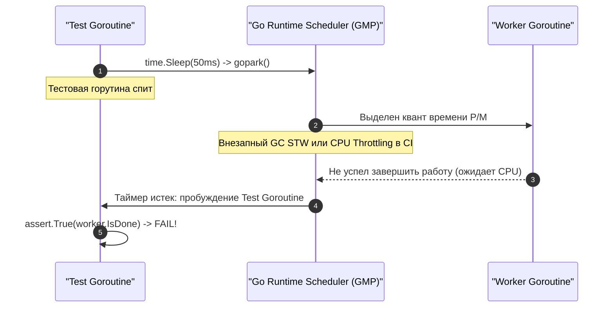

Вы написали элегантный тест. Запустили локально — всё безупречно работает. Сделали коммит, отправили Pull Request, и удаленный CI/CD пайплайн запустил прогон всего тестового сьюта. Через пару минут экран окрашивается в тревожный красный цвет: ваш тест упал. Вы в недоумении открываете логи, не находите ни одной очевидной ошибки, нажимаете спасительную кнопку «Re-run failed job» — и тест триумфально завершается с зеленой галочкой, хотя вы не изменили ни единой строчки кода.

Добро пожаловать в чистилище бэкенд-инженерии — мир **мигающих тестов (Flaky Tests)**.

Мигающий тест — это тест, который при абсолютно неизменном исходном коде и неизменном тестовом окружении демонстрирует недетерминированный результат: то проходит, то падает. Подобно ржавчине на несущих опорах моста, flaky-тесты незаметно разрушают инженерную культуру команды. Разработчики быстро привыкают к мысли: «А, этот тест опять мигает, просто перезапусти пайплайн». В результате реальные регрессионные баги и критические гонки данных беспрепятственно просачиваются в промышленную эксплуатацию.

Язык Go с его легковесными горутинами, асинхронным сетевым поллером и специфическим устройством рантайма предоставляет богатейший арсенал для создания скрытых недетерминированных ошибок. Давайте препарируем фундаментальные анатомические причины миганий на стыке рантайма Go, ядра Linux и микроархитектуры современных процессоров.

---

## 1. Иллюзия времени: `time.Sleep` в тестах

Абсолютный лидер среди причин появления нестабильных тестов — попытка скоординировать конкурентный код с помощью искусственных пауз физического времени (`time.Sleep`).

Представьте себе классический сценарий: мы тестируем асинхронный компонент, выполняющий фоновую обработку сообщений в отдельной горутине:

```go
package worker_test

import (
	"testing"
	"time"

	"github.com/stretchr/testify/assert"
)

// АНТИПАТТЕРН: Никогда так не синхронизируйте тесты
func TestWorker_Bad(t *testing.T) {
	worker := NewWorker()
	
	// Запускаем асинхронную обработку
	go worker.DoWork("task-1")
	
	// Инженер наивно надеется, что 50 миллисекунд хватит с огромным запасом
	time.Sleep(50 * time.Millisecond)
	
	assert.True(t, worker.IsDone("task-1")) // FLAKY!
}
```

На локальном ноутбуке с процессором Apple M-серии или 16-ядерным Intel Core i7 этот тест будет стабильно проходить тысячу раз подряд: система не нагружена, горутина воркера мгновенно подхватывается свободным потоком ОС (M), а 50 миллисекунд — это астрономически долгий срок (порядка 150 000 000 тактов CPU).

Но как только этот код попадает на перегруженный CI-сервер (например, в дешевый контейнер GitHub Actions или раннер GitLab), начинаются чудеса.

> [!info] Под капотом: Планировщик ОС и Go Runtime
> Когда горутина вызывает `time.Sleep`, рантайм Go вызывает `goparkunlock()`, снимая горутину с логического процессора `P` и помещая ее в таймерную кучу. 
> 
> Однако ядро Linux и его планировщик CFS (Completely Fair Scheduler) не предоставляют жестких гарантий реального времени (Hard Real-Time). Если контейнеру выделен лимит CPU (cgroups quota), при его исчерпании ядро принудительно замораживает все потоки процесса (CPU Throttling). 
> 
> Более того, в этот же 50-миллисекундный интервал рантайм Go может инициировать цикл сборки мусора (Garbage Collector). Фаза Mark Termination потребует кратковременной остановки мира (Stop-The-World, STW). В итоге физические 50 миллисекунд истекают, планировщик Go будит тестовую горутину, а фоновый воркер из-за троттлинга ОС даже не успел получить квант процессорного времени! Вызов `assert.True` терпит крах.



### Как лечить? Механизмы синхронизации

Запомните железное правило: **в надежных тестах никогда не ждут времени — в них ждут событий**.

Используйте каналы синхронизации, `sync.WaitGroup` или явные обратные вызовы (callbacks):

```go
package worker_test

import (
	"testing"
	"time"

	"github.com/stretchr/testify/assert"
)

// ИДИОМАТИЧНЫЙ ПОДХОД: Синхронизация на сигналах
func TestWorker_Good(t *testing.T) {
	worker := NewWorker()
	done := make(chan struct{})
	
	go func() {
		worker.DoWork("task-1")
		close(done) // Сигнализируем о физическом окончании работы
	}()
	
	select {
	case <-done:
		// Дождались ровно в момент готовности, ни микросекундой позже!
		assert.True(t, worker.IsDone("task-1"))
	case <-time.After(2 * time.Second):
		// Таймаут безопасности: защищает сьют от мертвого зависания (deadlock)
		t.Fatal("Таймаут ожидания воркера: задача не завершилась вовремя")
	}
}
```

---

## 2. Недетерминированность `map`

Вторая по распространенности причина мигающих тестов — слепая вера в то, что обход хэш-таблицы (`map`) сохраняет порядок ключей.

Взгляните на простую функцию сериализации конфигурации:

```go
func TestSerializeConfig(t *testing.T) {
	cfg := map[string]string{
		"host": "localhost",
		"port": "8080",
	}
	
	result := Serialize(cfg)
	// FLAKY: Иногда вернет "host=localhost;port=8080", 
	// а иногда "port=8080;host=localhost"
	assert.Equal(t, "host=localhost;port=8080", result) 
}
```

Этот тест будет случайно падать в 50% запусков.

> [!tip] Собеседование
> **Вопрос:** Почему при итерации по `map` в Go порядок элементов каждый раз меняется? Разве данные физически перемещаются по оперативной памяти?  
> **Ответ:** Нет, структура данных в памяти (массив бакетов структуры `hmap`) остается абсолютно статичной. Но авторы Go сознательно внедрили аппаратную защиту от скрытой связности. В функции `runtime.mapiterinit`, которая вызывается в начале каждого цикла `for range` по мапе, рантайм генерирует псевдослучайное число с помощью вызова `fastrand()`. Итератор стартует со **случайного бакета** и со случайного смещения внутри него. Это проектное решение предотвращает появление кода, завязанного на детали реализации рантайма, и защищает от внешних коллизионных атак (Hash DoS).

### Как лечить?

1. Если вы тестируете сериализацию (JSON, YAML, строки), десериализуйте результат обратно в объект и сравнивайте структуры через `assert.Equal` или `cmp.Equal`.
2. Если формат строго текстовый, извлекайте ключи в срез, сортируйте их через `sort.Strings`, и лишь затем стройте детерминированную строку.

---

## 3. Конфликты портов (Порты Шредингера)

При написании интеграционных и компонентных тестов сетевых сервисов разработчики часто поднимают реальные TCP/HTTP слушатели:

```go
// ОПАСНО ДЛЯ ПАРАЛЛЕЛЬНЫХ ТЕСТОВ
listener, err := net.Listen("tcp", "localhost:8080")
```

При запуске набора тестов через стандартную команду:

```bash
go test ./...
```

Раннер Go компилирует и запускает разные тестовые пакеты **параллельно** в отдельных процессах операционной системы. Если два независимых пакета одновременно выполнят системный вызов `bind` на фиксированный порт `8080`, один из них неизбежно завершится аварийным падением:

```text
bind: address already in use
```

### Как лечить? Эфемерные порты

Никогда не зашивайте фиксированные номера портов в тесты. Делегируйте распределение портов сетевому стеку ядра Linux/macOS.

Если в качестве номера порта указать `0`, операционная система автоматически выделит свободный порт из диапазона динамических эфемерных портов (обычно 32768–60999):

```go
package server_test

import (
	"net"
	"testing"

	"github.com/stretchr/testify/require"
)

func TestHTTPServer_Isolated(t *testing.T) {
	// Порт 0 указывает ядру ОС выделить любой свободный порт
	listener, err := net.Listen("tcp", "127.0.0.1:0")
	require.NoError(t, err)
	defer listener.Close()

	// Извлекаем фактически назначенный порт
	addr := listener.Addr().String() 
	
	// Поднимаем сервер и передаем динамический адрес клиенту
	srv := NewServer()
	go srv.Serve(listener)

	client := NewClient("http://" + addr)
	resp, err := client.Ping()
	require.NoError(t, err)
	require.Equal(t, "PONG", resp)
}
```

Именно этот паттерн реализован в стандартном пакете `net/http/httptest`: вспомогательный конструктор `httptest.NewServer()` под капотом слушает `127.0.0.1:0`, гарантируя 100% изоляцию сетевых сокетов даже при тысячах конкурентных тестовых прогонов.

---

## 4. Глобальное состояние и `t.Parallel()`

Вызов метода `t.Parallel()` сигнализирует тестовому раннеру: данная тестовая функция может выполняться одновременно с другими параллельными тестами в отдельных горутинах. Это многократно сокращает время выполнения CI-пайплайнов, но мгновенно обнажает дефекты разделяемого глобального состояния.

Если тесты конкурентно вызывают модификацию переменных окружения через `os.Setenv`, подменяют глобальный транспорт `http.DefaultClient.Transport` или обращаются к одной и той же неизолированной схеме базы данных — взаимное повреждение данных неизбежно.

> [!warning] Ловушка / Gotcha: Замыкания в `t.Parallel()`
> До релиза Go 1.22 в языке присутствовала одна из самых коварных ловушек в истории программирования, связанная с захватом переменной цикла в замыкание при использовании `t.Parallel()`:
> 
> ```go
> func TestProcessTable(t *testing.T) {
> 	testCases := []struct {
> 		name     string
> 		input    int
> 		expected int
> 	}{
> 		{"case_1", 1, 10},
> 		{"case_2", 2, 20},
> 	}
> 
> 	for _, tc := range testCases {
> 		tc := tc // ДО GO 1.22 ЭТО БЫЛО ЖИЗНЕННО НЕОБХОДИМО! (Shadowing)
> 		t.Run(tc.name, func(t *testing.T) {
> 			t.Parallel()
> 			assert.Equal(t, tc.expected, Process(tc.input))
> 		})
> 	}
> }
> ```
> 
> Без строчки `tc := tc` все горутины, созданные методом `t.Run` с вызовом `t.Parallel()`, ссылались на один и тот же адрес в памяти единственной переменной цикла `tc`. К моменту, когда планировщик Go фактически запускал горутины, цикл `for` уже завершался, и абсолютно все тестовые случаи выполнялись с аргументами последнего элемента `testCase`!  
> Начиная с **Go 1.22**, семантика циклов `for` была изменена: переменная цикла создается заново на каждой итерации, навсегда устранив этот источник багов.

---

## 5. Незаметные Data Races (Гонки данных)

Нередко причиной периодического падения теста становится не дефект тестового кода, а реальная гонка данных (Data Race) в тестируемом сервисе.

На уровне микроархитектуры современных многоядерных процессоров гонка данных — это рассинхронизация кэш-линий (Cache Lines по 64 байта) в иерархии кэшей L1/L2:


Допустим, Горутина A выполняется на Ядре 1 и записывает флаг `done = true`. Новое значение не попадает в оперативную память мгновенно — оно буферизуется в аппаратно оптимизированном буфере записи (*Store Buffer*) Ядра 1.

В этот же физический момент Горутина B на Ядре 2 считывает значение `done`. При отсутствии барьеров памяти протокол когерентности кэшей (MESI) не форсирует инвалидацию кэш-линии на Ядре 2. Горутина B читает устаревшее значение `false`. Условие проверки не выполняется, и тест падает.

### Главное оружие: Race Detector

Запуск тестов локально и в CI-пайплайне обязан производиться **строго с флагом `-race`**:

```bash
go test -race ./...
```

Race Detector компилирует бинарник со специальной инструментацией на базе Google ThreadSanitizer (TSan). Он отслеживает каждое обращение к каждому байту памяти в 8-байтовых теневых ячейках (Shadow Memory). Запуск с флагом `-race` увеличивает потребление памяти примерно в 4 раза и замедляет выполнение в 2–10 раз, но это единственная математическая гарантия обнаружения несогласованного доступа к памяти.

Если у вас есть обоснованное подозрение на мигающий тест, отключите тестовый кэш и запустите тест в цикле с помощью флага `-count`:

```bash
# Запустить подозрительный сценарий 100 раз подряд в режиме детекции гонок
go test -run=TestMySuspectLogic -count=100 -race
```

Если в коде затаилась плавающая гонка, флаг `-count` в сочетании с переключением контекста горутин обязательно проявит ее за 10–50 итераций.

---

## Итог

Борьба с flaky-тестами — это вопрос профессиональной зрелости и уважения к времени своих коллег:
1. **Искореняйте `time.Sleep`:** синхронизируйте горутины через каналы и примитивы `sync.WaitGroup`.
2. **Не полагайтесь на порядок в `map`:** сортируйте ключи или используйте структурное сравнение.
3. **Используйте порт `0`:** доверяйте операционной системе выделение свободных эфемерных портов.
4. **Изолируйте разделяемое состояние:** помните о влиянии глобальных синглтонов при включении `t.Parallel()`.
5. **Всегда проверяйте код через `-race` и `-count=100`:** это лучший способ обнаружить скрытые гонки данных до того, как они уронят production.

Разобравшись с фундаментом воспроизводимости и источниками недетерминизма, мы переходим к вопросу надежной изоляции тестов от внешнего окружения в главе [[7. Test isolation]], а также глубоко погрузимся в практику взаимодействия с реальными СУБД в статье [[7. Интеграционные тесты]].