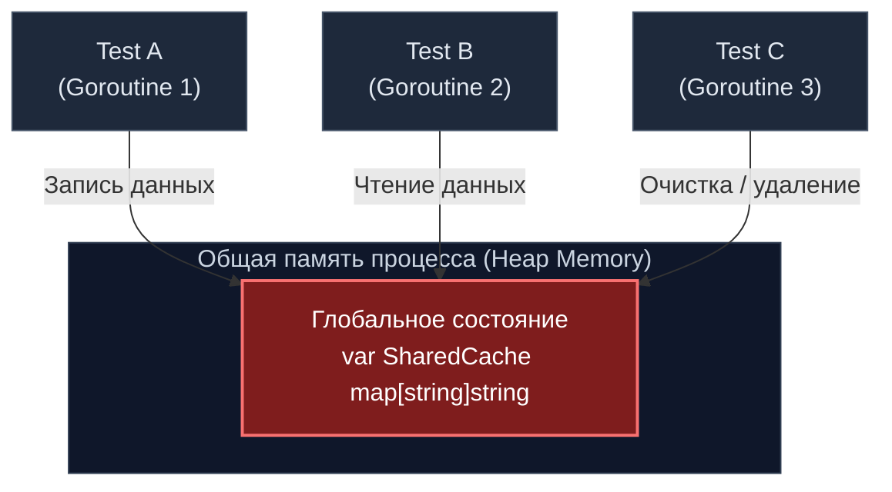
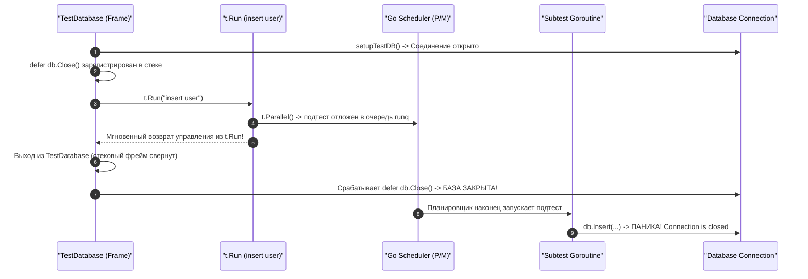

## Анатомия изоляции: Как не наступить на чужие грабли

В предыдущих главах [[5. Determinism и воспроизводимость]] и [[6. Flaky тесты и их причины]] мы выяснили, что главный кошмар CI/CD пайплайнов — это плавающие, нестабильные тесты. Если вскрыть анатомию любого такого сбоя, то в девяти случаях из десяти его первопричиной оказывается **протечка разделяемого состояния (State Leak)** между тестами.

**Изоляция тестов (Test Isolation)** — фундаментальный постулат надежной программной инженерии. Согласно этому принципу, результат выполнения любого теста не имеет права зависеть от того, какие тесты выполнялись до него, какие выполняются параллельно с ним в соседних горутинах и какие будут запущены после. Каждый тест обязан стартовать в абсолютно стерильном окружении и после своего завершения оставлять окружение в первозданной чистоте.

Для разработчиков, имеющих опыт работы с однопоточными скриптовыми языками (где тестовые раннеры часто исполняют сценарии последовательно в рамках изолированных процессов), переход на Go нередко сопровождается шоком. В Go утилита `go test` изначально спроектирована под максимальную многопоточную конкурентность. Если вы не обеспечили бескомпромиссную изоляцию ресурсов на уровне памяти, файловой системы, переменных среды и сети, рантайм Go немедленно накажет вас хаотичными гонками данных (Data Races) и необъяснимыми падениями.

---

## 1. Изоляция памяти: Глобальное состояние

В Go все тестовые функции внутри одного пакета компилируются компилятором в единый исполняемый бинарник и запускаются в общем адресном пространстве процесса операционной системы. Это означает базовый физический факт: **все тесты делят одну и ту же общую кучу (Heap Memory)**.

Если в вашем коде существует глобальная переменная (например, синглтон кэша, пул коннектов или глобальный счетчик метрик), и несколько параллельных тестов попытаются взаимодействовать с ней — катастрофа неизбежна.



> [!warning] Ловушка / Gotcha
> Многие разработчики наивно полагают, что обернув доступ к глобальной переменной в мьютекс (`sync.Mutex`), они решают проблему. Это опаснейшее заблуждение!  
> Мьютекс устраняет гонку данных на уровне кэш-линий процессора, предотвращая аварийное падение рантайма Go. Но он **никак не устраняет логический недетерминизм**: `Test B` может перехватить мьютекс сразу после `Test A`, прочитать чужие тестовые данные и завершиться с ошибкой assertion, поскольку ожидал увидеть абсолютно пустую таблицу.  
> **Решение:** Полностью ликвидируйте глобальные переменные и скрытые синглтоны. Все зависимости обязаны внедряться явно через конструкторы (эту тему мы подробно разберем в статье [[8. Dependency injection для тестируемости]]). Если же вы вынуждены иметь дело с легаси-кодом, опирающимся на глобальные структуры, такие тесты **категорически запрещено** помечать вызовом `t.Parallel()`.

---

## 2. Изоляция окружения: Переменные (Environment Variables)

Бэкенд-приложения повсеместно считывают параметры конфигурации из переменных окружения процесса через стандартный вызов `os.Getenv`. В старых проектах до сих пор можно встретить такой наивный шаблон:

```go
package config_test

import (
	"os"
	"testing"
)

// АНТИПАТТЕРН: Ручное мутирование глобального окружения
func TestLegacy(t *testing.T) {
	oldVal := os.Getenv("CONFIG_PATH")
	os.Setenv("CONFIG_PATH", "/tmp/test.yaml")
	defer os.Setenv("CONFIG_PATH", oldVal) // Попытка восстановить окружение после себя
	
	// Вызов тестируемой функции парсинга конфигурации...
}
```

Этот подход фундаментально порочен. В операционных системах семейств Linux и POSIX переменные окружения процесса хранятся в едином глобальном сегменте памяти (`environ`), на который ссылается ядро. Вызов `os.Setenv` выполняет системный вызов `setenv`, меняя переменную для **всего процесса целиком**. Если в этот же микросекундный момент в соседнем потоке выполняется параллельный тест, он считает искаженное значение `CONFIG_PATH` и пойдет по ложной ветке бизнес-логики.

### Современный подход: Метод `t.Setenv()`

Начиная с Go 1.17, стандартная библиотека предоставляет элегантный и безопасный инструмент `t.Setenv()`:

```go
func TestModern(t *testing.T) {
	t.Setenv("CONFIG_PATH", "/tmp/test.yaml") // Безопасная изоляция окружения
	
	cfg, err := LoadConfig()
	if err != nil {
		t.Fatalf("Не удалось загрузить конфигурацию: %v", err)
	}
	// ...
}
```

> [!info] Под капотом
> Метод `t.Setenv()` устроен гораздо умнее простого вызова `os.Setenv`. При первом вызове он сохраняет оригинальное значение переменной в структуре контекста теста и регистрирует внутренний хук очистки, гарантированно возвращающий исходное значение в фазе финализации `Cleanup`.  
> Но самое главное: метод `t.Setenv()` **немедленно вызывает панику (panic)**, если вы попытаетесь вызвать его внутри теста, уже помеченного как `t.Parallel()`. Рантайм Go намеренно защищает инженера от выстрела в ногу: если вы заявили, что тест конкурентный, модифицировать глобальное окружение процесса вам запрещено на уровне дизайна языка.

---

## 3. Изоляция жизненного цикла: defer vs t.Cleanup

Для очистки созданных ресурсов (закрытие сокетов, освобождение дескрипторов файлов, откат транзакций) инженеры на автомате используют ключевое слово `defer`. В простых плоских тестах это прекрасно работает. Однако при переходе к табличным тестам с подтестами `defer` превращается в скрытую бомбу замедленного действия.

> [!tip] Собеседование
> **Вопрос:** В чем заключается фундаментальная механическая разница между инструкцией `defer` и методом `t.Cleanup()` в многопоточных тестах со структурой `testing.T`?  
> **Ответ:** Оператор `defer` неразрывно привязан к завершению текущего *стекового кадра функции* (stack frame), в то время как `t.Cleanup()` привязан к жизненному циклу самого *тестового узла* в дереве `testing.T`. Метод `t.Cleanup()` гарантированно вызывается только тогда, когда завершился сам родительский тест **и все его параллельные дочерние подтесты**.

Давайте разберем классическую ловушку, на которой спотыкаются даже опытные разработчики:

```go
package db_test

import (
	"testing"
)

func TestDatabase(t *testing.T) {
	db, err := setupTestDB()
	if err != nil {
		t.Fatal(err)
	}
	// На первый взгляд, безупречный код:
	defer db.Close() 

	t.Run("insert user", func(t *testing.T) {
		t.Parallel() // Запускаем подтест конкурентно
		db.Insert("alice@example.com") // ПАНИКА: sql: database is closed!
	})
}
```

### Механика катастрофы:



1. Тестовый раннер входит в тело функции `TestDatabase`.
2. Функция инициализирует базу и регистрирует в своем стеке `defer db.Close()`.
3. Внутри `t.Run` подтест объявляет себя параллельным через `t.Parallel()`. Это заставляет раннер отложить выполнение подтеста в очередь планировщика и **немедленно выйти из функции `t.Run`**.
4. Внешняя функция `TestDatabase` достигает последней строчки и завершается.
5. При сворачивании стекового кадра срабатывает `defer db.Close()`. Пул соединений уничтожен.
6. Планировщик Go выделяет квант времени горутине подтеста `"insert user"`. Подтест пытается вызвать `db.Insert` в закрытый пул и терпит крах.

### Канонический паттерн: Регистрация через `t.Cleanup()`

```go
func TestDatabase(t *testing.T) {
	db, err := setupTestDB()
	if err != nil {
		t.Fatal(err)
	}
	
	// t.Cleanup гарантирует: освобождение произойдет ТОЛЬКО после того,
	// как завершатся ВСЕ параллельные подтесты, порожденные внутри TestDatabase
	t.Cleanup(func() {
		_ = db.Close()
	})

	t.Run("insert user", func(t *testing.T) {
		t.Parallel()
		err := db.Insert("alice@example.com")
		if err != nil {
			t.Fatalf("Ошибка вставки: %v", err)
		}
	})
}
```

---

## 4. Изоляция файловой системы: IO без конфликтов

Если логика вашего сервиса взаимодействует с дисковой подсистемой (сохранение отчетов, чтение локальных конфигураций, экспорт метрик), тесты неизбежно будут конфликтовать при попытке одновременного доступа к фиксированным путям вроде `/tmp/out.log`.

В прошлые годы инженерам приходилось изобретать генераторы случайных имен папок и вручную вызывать удаление файлов. В современном Go эту задачу безупречно решает метод `t.TempDir()`.

```go
package storage_test

import (
	"os"
	"path/filepath"
	"testing"
)

func TestFileWriter(t *testing.T) {
	// Создает уникальную изолированную директорию вида /tmp/TestFileWriter12345
	// и автоматически удаляет её со всеми вложенными файлами после окончания теста:
	dir := t.TempDir() 
	
	filePath := filepath.Join(dir, "config.json")
	payload := []byte(`{"key": "value"}`)
	
	err := os.WriteFile(filePath, payload, 0644)
	if err != nil {
		t.Fatalf("Не удалось записать тестовый файл: %v", err)
	}

	data, err := os.ReadFile(filePath)
	if err != nil || string(data) != string(payload) {
		t.Fatalf("Ошибка верификации содержимого файла")
	}
}
```

### Механическое сочувствие (Mechanical Sympathy): Linux Page Cache и `tmpfs`

В современных серверных дистрибутивах Linux системный каталог `/tmp` по умолчанию монтируется как файловая система `tmpfs`. Это означает, что файлы, создаваемые через `t.TempDir()`, физически не обращаются к контроллеру SSD/NVMe-накопителя. Они размещаются непосредственно в оперативной памяти ядра через VFS (Virtual File System) и Page Cache.

Использование `t.TempDir()` не только гарантирует абсолютную изоляцию файловых путей между параллельными тестами, но и работает с наносекундной скоростью оперативной памяти без блокирующих аппаратных прерываний диска.

---

## 5. Изоляция сети: Эфемерные порты

Классическая задача бэкенд-тестирования — поднять легковесный HTTP или gRPC сервер для проверки сетевого взаимодействия (например, через `httptest.NewServer`).

Если разработчик жестко фиксирует сетевой адрес и порт:

```go
// ОШИБКА: Жесткая привязка к порту
listener, err := net.Listen("tcp", "127.0.0.1:8080")
```

Такой тест мгновенно блокирует масштабирование тестового сьюта. При запуске параллельных тестов второй экземпляр завершится ошибкой уровня ядра:

```text
bind: address already in use
```

### Золотое правило: Порт `0` и динамические эфемерные порты

Никогда не выбирайте номера сетевых портов самостоятельно. Делегируйте эту задачу стеку TCP/IP ядра операционной системы, передав в качестве порта значение `0`:

```go
package api_test

import (
	"net"
	"net/http"
	"net/http/httptest"
	"testing"
)

func TestNetworkService(t *testing.T) {
	// Адрес 127.0.0.1:0 указывает ядру ОС: выдели любой свободный порт
	listener, err := net.Listen("tcp", "127.0.0.1:0") 
	if err != nil {
		t.Fatalf("Не удалось открыть сетевой сокет: %v", err)
	}
	
	// Извлекаем фактический порт, выделенный ядром ОС:
	actualAddr := listener.Addr().String()
	t.Logf("Тестовый сервер запущен на адресе: %s", actualAddr)
	
	t.Cleanup(func() {
		_ = listener.Close()
	})
	
	// Запуск HTTP-обработчика...
}
```

Сетевой стек ядра Linux распределяет эфемерные порты (Ephemeral Ports) из диапазона, заданного в конфигурации ядра (параметр `sysctl net.ipv4.ip_local_port_range`, по умолчанию от 32768 до 60999). Ядро гарантирует уникальность выделенного порта в рамках сетевого пространства имен, обеспечивая безупречную сетевую изоляцию даже при одновременном запуске сотен интеграционных тестов.

Вспомогательный конструктор `httptest.NewServer` из стандартного пакета `net/http/httptest` под капотом использует именно этот механизм: он создает сокет на случайном эфемерном порту и предоставляет удобное поле `URL` для клиентских запросов.

---

## Итог

Изолированный тест — это тест-невидимка. Он не зависит от окружающего мира и бесследно растворяется после выполнения, не оставляя в операционной системе ни единого мусорного байта.

Сводные заповеди изоляции в Go:
1. **Память:** Избегайте разделяемого глобального состояния. Все структуры должны владеть своими данными локально.
2. **Переменные окружения:** Мутируйте окружение только через `t.Setenv()`. Помните, что этот метод запрещен в конкурентных тестах.
3. **Жизненный цикл:** Забудьте про `defer` при работе со вложенными тестами `t.Run` и вызовами `t.Parallel()`. Ресурсы освобождаются строго через `t.Cleanup()`.
4. **Файлы и папки:** Всегда используйте `t.TempDir()` вместо жестко зашитых путей в каталоге `/tmp`.
5. **Сетевые интерфейсы:** Привязывайте серверы к эфемерному сокету `127.0.0.1:0`, делегируя выбор порта операционной системе.

Освоив эти механизмы, вы сможете выжимать 100% мощности из всех ядер вашего процессора в параллельном тестировании. Но как спроектировать сам прикладной код сервиса так, чтобы его компоненты легко принимали тестовые заглушки и изолированные ресурсы? Ответу на этот вопрос посвящена следующая глава: [[8. Dependency injection для тестируемости]].