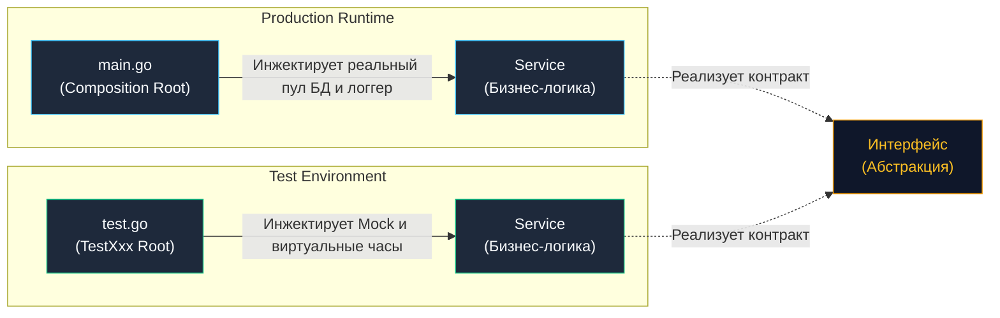

В предыдущей главе [[7. Test isolation]] мы детально разобрали, почему изоляция состояния является абсолютным императивом для надежного тестового сьюта. Но как именно воплотить эту изоляцию в архитектуре приложения? Как подменить реальную базу данных на легковесную тестовую заглушку или изолированный мок, если бизнес-логика жестко завязана на прямое создание пула соединений `sql.DB` внутри своих методов?

Ответ кроется в элегантной концепции **Dependency Injection (DI, Внедрение зависимостей)**.

Когда разработчики, сформировавшиеся в экосистемах Java (Spring Framework) или C# (.NET Core), слышат аббревиатуру DI, у них перед глазами нередко встают исполинские IoC-контейнеры (Inversion of Control), тысячи строк XML-манифестов или непрозрачная магия аннотаций, работающая через рантайм-рефлексию (Reflection). 

В Go философия принципиально иная. **DI в Go — это не сторонний фреймворк и не монструозная библиотека. Это фундаментальный паттерн проектирования.** В девяноста пяти процентах случаев внедрение зависимостей в Go сводится к предельно простой и ясной операции: явной передаче нужных интерфейсов и структур в качестве аргументов обычной функции-конструктора.

---

## Зачем нужен DI в контексте тестирования?

Без внедрения зависимостей любая программная система «собирает сама себя изнутри»: каждый сервис самостоятельно создает клиентов баз данных, считывает системные часы и открывает сетевые сокеты. В таких условиях протестировать модуль изолированно невозможно.

С применением паттерна DI граф объектов приложения собирается строго снаружи — в так называемом **корне композиции (Composition Root)**:
- В промышленной эксплуатации корнем композиции выступает функция `main()` в файле `main.go`.
- В тестовых сценариях корнем композиции становится сам тестовый раннер и функция `TestXxx()`.



Внедрение зависимостей наделяет инженера абсолютным контролем над внешним окружением тестируемого компонента. В тестах мы можем мгновенно симулировать сетевые тайм-ауты, обрывы соединений, застывшее во времени физическое окружение или предзаполненные структуры в оперативной памяти.

---

## Паттерны DI в Go

### 1. Constructor Injection (Классика)

Наиболее идиоматичный, надежный и прозрачный способ внедрения зависимостей в языке Go — передача интерфейсов через аргументы конструктора (функции `New...`):

```go
package payment

import "context"

// Контракты объявляются на стороне потребителя
type PaymentGateway interface {
	Charge(ctx context.Context, amount float64) error
}

type Logger interface {
	Info(msg string)
}

type Service struct {
	gateway PaymentGateway
	logger  Logger
}

// NewService — явный конструктор с внедрением зависимостей
func NewService(gw PaymentGateway, log Logger) *Service {
	return &Service{
		gateway: gw,
		logger:  log,
	}
}
```

**Преимущества для тестирования:**
- **Строгий статический контроль компилятора:** если вы забудете передать хотя бы одну зависимость или передадите несовместимый тип, проект физически не скомпилируется. Никаких внезапных падений в рантайме.
- **Прозрачность сигнатуры:** любой инженер, взглянув на функцию `NewService`, сразу понимает исчерпывающий перечень внешних ресурсов, необходимых для жизнедеятельности сервиса.

---

### 2. Functional Options Pattern (Для опциональных зависимостей)

Паттерн Constructor Injection становится громоздким, когда у компонента появляется множество второстепенных параметров (5+ аргументов), либо некоторые зависимости опциональны и имеют разумные значения по умолчанию. Поскольку в Go отсутствуют перегрузка методов (Method Overloading) и именованные аргументы по умолчанию, инженерное сообщество использует паттерн Functional Options (популяризированный Робом Пайком и Дейвом Чейни).

Это непревзойденный инструмент для подмены тестовых утилит, таких как виртуальные часы `Clock`:

```go
package payment

import (
	"context"
	"time"
)

type Service struct {
	gateway PaymentGateway
	clock   func() time.Time // Опциональная зависимость для управления временем
}

type Option func(*Service)

// WithClock позволяет тестам замораживать время
func WithClock(clock func() time.Time) Option {
	return func(s *Service) {
		s.clock = clock
	}
}

func NewServiceWithOptions(gw PaymentGateway, opts ...Option) *Service {
	s := &Service{
		gateway: gw,
		clock:   time.Now, // Дефолтное поведение для Production
	}
	for _, opt := range opts {
		opt(s)
	}
	return s
}
```

В тестовом сценарии вы подменяете поведение в одну строчку:

```go
func TestService_Charge_FrozenTime(t *testing.T) {
	mockGW := NewMockPaymentGateway()
	frozenTime := time.Date(2026, 1, 1, 12, 0, 0, 0, time.UTC)

	svc := NewServiceWithOptions(mockGW, WithClock(func() time.Time {
		return frozenTime
	}))

	// Тестирование с гарантированным таймстампом...
}
```

> [!warning] Ловушка / Gotcha
> Никогда не используйте паттерн Functional Options для сокрытия **критически важных обязательных зависимостей** (таких как первичная база данных или шлюз платежей). Если компонент в принципе не может функционировать без зависимости, она обязана передаваться в виде явного позиционного аргумента конструктора. Функциональные опции предназначены строго для логгеров, телеметрии, тайм-аутов и интерфейсов времени.

---

## Mechanical Sympathy: DI и Escape Analysis

У любого архитектурного паттерна есть цена на уровне железа и рантайма. Будучи Senior инженером, вы обязаны понимать механические последствия оборачивания структур в интерфейсы.

> [!info] Под капотом
> В рантайме Go значение интерфейса представлено внутренней структурой `iface` (для непустых интерфейсов) или `eface` (для `any`). Структура `iface` состоит из двух 64-битных указателей:
> 1. Указатель на структуру метаданных `itab` (тип сущности + таблица адресов методов).
> 2. Указатель на конкретные данные объекта в памяти.
> 
> Когда вы передаете конкретную структуру по значению в функцию, принимающую интерфейс, компилятор Go запускает процедуру **Escape Analysis (Анализ утечек памяти)**. Если компилятор не способен математически доказать, что время жизни созданной структуры строго ограничено текущим стековым кадром (а при сохранении зависимости в поле возвращаемого объекта `Service.gateway` это именно так), значение неизбежно «убегает» (escapes) со стека в кучу (Heap).
> 
> ```go
> type RealDB struct { ... } // Размер структуры в памяти: 128 байт
> 
> // Вызов конструктора:
> svc := NewService(RealDB{}, logger)
> ```
> В данном коде `RealDB` будет размещена в общей куче, порождая дополнительную работу для сборщика мусора (Garbage Collector). Для сервисов, инициализируемых один раз при старте приложения (Singleton lifecycle), эти накладные расходы ничтожны. Но если вы начнете динамически создавать графы DI на каждый входящий HTTP-запрос (Transient lifecycle), бесконечные аллокации в кучу приведут к просадке пропускной способности (throughput) и росту задержек (tail latency) из-за пауз GC.

**Инженерное правило:** в критических по производительности горячих циклах (Hot Path) избегайте динамического полиморфизма и лишних интерфейсных барьеров. Размещайте интерфейсы на архитектурных границах доменов (БД, Сеть, Внешние очереди), но не раздувайте их внутри плотных вычислительных ядер, о чем мы детально говорили в [[4. Testability и дизайн кода]].

---

## DI Containers: Wire vs Fx

По мере масштабирования микросервиса ручная сборка зависимостей в файле `main.go` может разрастись до сотен строк утомительного монотонного кода:

```go
// Ручная сборка графа зависимостей
cfg := ReadConfig()
logger := NewLogger(cfg)
db := NewDatabase(cfg)
repo := NewRepo(db)
metrics := NewMetrics()
service := NewService(repo, logger, metrics)
handler := NewHandler(service)
// ... и еще десятки конструкторов
```

Для упрощения этой рутины в Go-экосистеме закрепились два полярных подхода к автоматизации:

### 1. Compile-time DI (Рекомендуемый путь: google/wire)

Инструмент `wire` от компании Google использует принцип статической кодогенерации (Code Generation). Вы описываете правила создания компонентов через декларативные наборы провайдеров (Provider Sets). Утилита `wire` анализирует AST-дерево кода, вычисляет топологический порядок графа зависимостей и генерирует отдельный файл `wire_gen.go`.

Сгенерированный файл содержит кристально чистый, валидный Go-код с обычной ручной последовательной инициализацией.

**Преимущества для надежности и тестов:**
- Если какая-то зависимость пропущена, циклически замкнута или не совпадает по типам, сборка аварийно завершится **на этапе компиляции**, а не в production.
- Полное отсутствие накладных расходов в рантайме: скорость запуска приложения максимальна, а стектрейсы ошибок остаются плоскими и читаемыми.

---

### 2. Run-time DI (uber-go/fx)

Фреймворк `fx` от компании Uber исповедует динамический подход. Он использует пакет `reflect` для исследования типов аргументов конструкторов и динамически связывает граф зависимостей непосредственно во время старта приложения.

**Риски и недостатки для тестирования:**
- Если в графе зависимостей допущена ошибка (например, забыли передать провайдер базы данных), ошибка проявится только при старте процесса через фатальную панику (`panic`).
- Это усложняет написание тестов и противоречит духу языка Go, делая систему менее предсказуемой.

---

> [!tip] Собеседование
> **Вопрос:** Почему в Go передача контейнера зависимостей (паттерн `ServiceLocator`) внутрь бизнес-методов считается токсичным антипаттерном?
> ```go
> // АНТИПАТТЕРН: Service Locator
> func (s *Service) DoWork(locator Container) {
>     db := locator.Get("database").(*sql.DB) // Скрытая зависимость и приведение типа
>     // ...
> }
> ```
> **Ответ:** Паттерн Service Locator намертво скрывает реальные контракты компонента. Глядя на сигнатуру метода `DoWork(locator)`, вызывающий код не имеет ни малейшего представления о том, какие внешние ресурсы требуются для работы.  
> При написании модульного теста инженер не знает, что именно нужно положить внутрь объекта `locator`, пока тест во время прогона не упадет с паникой `nil pointer dereference` из-за неудачного приведения типов. В Go зависимости обязаны объявляться **явно** (Explicit is better than implicit).

---

## Итог раздела "Фундамент"

Поздравляем: мы полностью завершили изучение фундаментального блока тестирования бэкенд-систем на Go!

Давайте зафиксируем ключевые инженерные выводы всего подраздела:
1. **Тестирование — часть архитектуры:** Тестируемость кода не возникает сама по себе, она закладывается на этапе проектирования интерфейсных границ и распределения ответственности.
2. **Пирамиды и соты:** Для современных микросервисов интеграционный слой тестирования важнее избыточных изолированных юнит-тестов тривиальных структур.
3. **Борьба с недетерминизмом:** Мы научились укрощать случайный порядок в `map`, отказались от антипаттерна `time.Sleep` в пользу сигнальных каналов и взяли под контроль генераторы случайных чисел.
4. **Стерильность окружения:** Мы освоили изоляцию через `t.Cleanup()`, безопасную работу с переменными среды через `t.Setenv()`, быструю файловую изоляцию на `tmpfs` через `t.TempDir()` и биндинг серверов на эфемерные порты `127.0.0.1:0`.
5. **Явный DI:** Мы научились собирать гибкие, слабосвязанные модули без тяжеловесных сторонних фреймворков.

Теоретический базис заложен, инструменты настроены. Пришло время перейти к детальному изучению стандартного тестового пакета Go, его скрытых возможностей, табличных тестов и практического мастерства. Встречаемся во втором подразделе: [[1. testing пакет. Основы]].