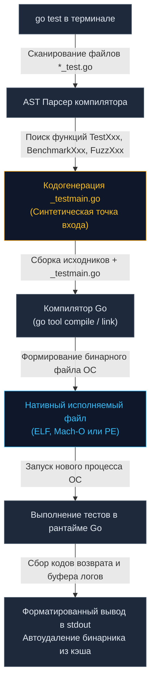
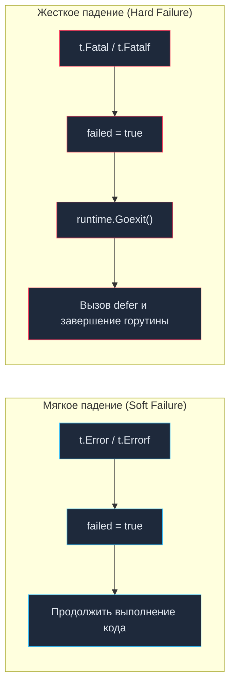

Инструментарий для верификации и тестирования в Go — это не внешняя библиотека или сторонний фреймворк, который приходится подключать через пакетный менеджер. Это фундаментальная часть самого языка, реализованная в стандартном пакете `testing` и органично интегрированная непосредственно в компилятор и тулчейн через команду `go test`.

В других технологических стеках (например, в Java с JUnit или Python с pytest) тестовая среда обычно надстраивается поверх языка с помощью рефлексии, аннотаций или динамического перехвата байткода. Философия Go прямо противоположна: тест должен быть написан на чистом, прозрачном Go, собираться тем же компилятором и выполняться как нативный машинный бинарник.

В этой главе мы разберем анатомию пакета `testing`, заглянем под капот процесса компиляции тестов и исследуем низкоуровневую механику работы главного объекта любого тестового сценария — структуры `*testing.T`.

---

## Анатомия пакета testing

Пакет `testing` предоставляет четыре базовые структуры, каждая из которых инкапсулирует контекст определенного типа инженерной проверки:

1. `*testing.T` — основа модульных (Unit) и интеграционных тестов, отвечающая за контроль логической корректности, регистрацию ошибок и управление жизненным циклом теста.
2. `*testing.B` — контекст бенчмарков, предназначенный для высокоточного замера времени исполнения функций, подсчета тактов процессора и отслеживания аллокаций памяти в куче.
3. `*testing.F` — фаззинг-раннер (Fuzzing, встроенный в Go 1.18+), генерирующий миллионы псевдослучайных мутаций входных байтов для поиска паник и граничных сбоев.
4. `*testing.M` — координатор глобального жизненного цикла тестового пакета, позволяющий реализовать общую пред- и постинициализацию (Setup / Teardown на уровне всего бинарника пакета).

В Go тестовый сценарий представляет собой обычную экспортируемую функцию. Она обязана начинаться с префикса `Test`, принимать единственный параметр `t *testing.T` и не возвращать никаких значений:

```go
package calculator_test

import (
	"testing"
)

func TestAdd(t *testing.T) {
	result := Add(2, 2)
	if result != 4 {
		t.Errorf("Add(2, 2) = %d; want 4", result)
	}
}
```

Никакой сложной магии: структура `testing.T` хранит внутреннее состояние `T`, собирает диагностические логи, отслеживает флаги провала и координирует параллельный запуск.

---

## Под капотом: Как работает go test

В интерпретируемых языках или виртуальных машинах раннер ищет тесты во время выполнения с помощью рефлексии (Reflection). В Go этот процесс устроен принципиально иначе: команда `go test` представляет собой **статический анализатор, генератор кода и обертку над компилятором**.

Когда вы вводите команду `go test` в командной строке, тулчейн Go выполняет следующий строгий алгоритм:



1. **Синтаксический анализ (AST Parsing):** Инструмент сканирует целевой каталог, находит все файлы с суффиксом `*_test.go` и строит абстрактное синтаксическое дерево. Он отбирает все функции с сигнатурами `Test*`, `Benchmark*` и `Fuzz*`.
2. **Кодогенерация точки входа:** В изолированном временном каталоге тулчейн генерирует файл `_testmain.go`. В нем создается синтетическая функция `main()`. Внутри нее регистрируется слайс структур метаданных `testing.InternalTest`, связывающий строковые имена тестов с реальными указателями на функции, после чего вызывается системный движок запуска `testing.Main()` (или метод `testing.Main`).
3. **Компиляция и линковка:** Компилятор объединяет ваш продуктовый код, тестовые файлы и сгенерированный `_testmain.go` в единый нативный исполняемый бинарник операционной системы (ELF в Linux, Mach-O в macOS или PE в Windows).
4. **Исполнение процесса:** Скомпилированный тестовый бинарник запускается операционной системой как отдельный дочерний процесс. По окончании работы процесс передает код возврата (exit code 0 при успехе), а временный исполняемый файл удаляется из кэша сборки.

### Механическое сочувствие (Mechanical Sympathy)

Именно поэтому тесты в Go выполняются с невероятной скоростью. Тестовый код — это не скрипт, интерпретируемый виртуальной машиной. Это оптимизированный машинный код, для которого процессор задействует аппаратные инструкции, конвейерное исполнение и кэши L1/L2. Компилятор проводит полноценный Escape Analysis и инлайнинг функций, если только вы намеренно не отключили оптимизацию при отладке специальным флагом `-gcflags="-N -l"`.

---

## Управление потоком выполнения: Error vs Fatal

Ключевой интерфейс управления тестом сосредоточен в методах структуры `testing.T`. Старший разработчик должен глубоко осознавать разницу между мягким и жестким падением на уровне рантайма:



### 1. Мягкое падение: t.Fail() и t.Error()

* `t.Fail()` взводит внутренний флаг ошибки (`failed = true`), однако **не останавливает** дальнейшее выполнение текущей функции.
* `t.Errorf(format, args...)` (или `t.Errorf()`, `t.Errorf`) — это удобная обертка, эквивалентная последовательному вызову форматированного логирования `t.Logf()` и метода `t.Fail()`.
* Метод `Error` просто форматирует переданные аргументы и вызывает `t.Fail()`.

**Когда использовать:** При валидации комплексных DTO-структур, списков или полей сущности. Если в проверяемой записи из 10 полей допущены 3 опечатки, применение `t.Errorf` позволит увидеть все 3 несоответствия за один прогон, избавив вас от необходимости перезапускать тесты трижды.

---

### 2. Жесткое падение: t.FailNow() и t.Fatal()

* `t.FailNow()` выставляет признак падения и **немедленно прерывает** исполнение текущей функции теста.
* `t.Fatalf(format, args...)` (или `t.Fatalf()`, `t.Fatalf`) — объединяет запись в лог `t.Logf()` с фатальной остановкой `t.FailNow()`.
* Метод `Fatal` аналогично логирует переданные аргументы и прерывает тест.

**Когда использовать:** Когда дальнейшие проверки технически невозможны или заведомо приведут к катастрофе. Если конструктор базы данных вернул ошибку, или объект равен `nil`, дальнейшая попытка чтения полей приведет к панике `nil pointer dereference`. В таких точках обязан вызываться `t.Fatalf`.

> [!info] Под капотом
> Как именно методу `t.FailNow()` удается мгновенно остановить выполнение теста, не аварийно завершая при этом весь процесс раннера?  
> Под капотом `t.FailNow()` вызывает низкоуровневую функцию рантайма `runtime.Goexit()`.  
> Каждый тест в Go запускается диспетчером в отдельной выделенной горутине. Функция `runtime.Goexit()` немедленно сворачивает стек **текущей горутины**, при этом корректно выполняя все зарегистрированные инструкции `defer` внутри нее. Основная координирующая горутина раннера перехватывает завершение потока, считывает состояние `failed = true` и спокойно переходит к выполнению следующего теста.

---

### Главная ловушка конкурентных тестов

Из механики работы `runtime.Goexit()` вытекает коварнейшая ловушка, с которой сталкиваются разработчики при тестировании асинхронного кода:

> [!warning] Ловушка / Gotcha
> Вызов методов `t.Fatal()`, `t.Fatalf` или `t.FailNow()` из **порожденной дочерней горутины категорически запрещен**!

Взгляните на типичную ошибку:

```go
func TestConcurrencyGotcha(t *testing.T) {
	go func() {
		err := doBackgroundWork()
		if err != nil {
			// КАТАСТРОФА! Вызов t.Fatalf убьет дочернюю горутину,
			// но основная горутина TestConcurrencyGotcha продолжит работу,
			// выйдет из функции, и тест может быть ложно помечен как PASS!
			t.Fatalf("фоновая ошибка: %v", err) 
		}
	}()
	
	time.Sleep(100 * time.Millisecond) // Хрупкая псевдо-синхронизация
}
```

Если вызов `t.Fatalf` происходит внутри горутины, `runtime.Goexit()` уничтожает эту отдельную горутину, не оказывая прямого влияния на основной поток `TestConcurrencyGotcha`. Основной тест завершает работу, раннер проверяет статус родительской горутины, и тест помечается зеленым, полностью скрыв фатальный сбой!

Для фиксации ошибок из горутин используйте мягкий метод `t.Errorf()`, который потокобезопасно устанавливает признак ошибки под внутренним мьютексом, либо передавайте ошибку в основную горутину через сигнальные каналы.

---

## Логирование в тестах

Для вывода диагностических сообщений пакет `testing` предоставляет методы `t.Log`, `t.Log()` и `t.Logf()`.

**Ключевая особенность буферизации:**
Вся информация, отправленная через `t.Log`, не пишется в системный `stdout` мгновенно. Она накапливается во внутреннем буфере объекта `T`. Данные выводятся на экран терминала **строго в двух ситуациях**:
1. Если тест завершился провалом (`t.Fail()` или `t.FailNow()`).
2. Если вы явно запустили тесты с флагом подробного вывода: `go test -v`.

Благодаря этому механизму чистый прогон сотен тестов не захламляет консоль посторонним шумом, но при возникновении ошибки вы получаете исчерпывающий отчет с контекстом упавшего сценария.

---

## t.Helper()

При написании вспомогательных тестовых функций (test helpers) инженеры часто сталкиваются с неудобством: в отчете об ошибке Go указывает строку внутри самого хелпера, а не место его реального вызова в тестовом сценарии.

```go
// Вспомогательный хелпер без маркировки
func assertEqual(t *testing.T, got, want int) {
	if got != want {
		// Ошибка укажет на эту строку внутри хелпера,
		// что делает невозможным быстрый поиск места вызова в тесте
		t.Errorf("got %d, want %d", got, want) 
	}
}
```

Чтобы тулчейн при раскручивании стека вызовов (Stack Trace) игнорировал тело вспомогательной функции и выводил строку исходного кода из самого теста `TestXxx`, первой строкой хелпера всегда вызывайте `t.Helper()`:

```go
func assertEqual(t *testing.T, got, want int) {
	t.Helper() // Сообщает рантайму: я вспомогательная функция
	if got != want {
		t.Errorf("got %d, want %d", got, want)
	}
}
```

Метод `t.Helper()` регистрирует счетчик стековых кадров в контексте теста, гарантируя, что любая диагностика в консоли приведет вас ровно к строке сценария, где были переданы некорректные аргументы.

---

> [!tip] Собеседование
> **Вопрос:** Почему в стандартном пакете `testing` языка Go отсутствуют встроенные функции вроде `AssertEqual` или `AssertNotNil`?  
> **Ответ:** Это осознанное проектное решение создателей языка. Роб Пайк и Кен Томпсон стремились избежать создания специализированных диалектов и псевдоязыков внутри языка (DSL), таких как `assert.That(x).IsEqualTo(y)`.  
> В Go проверка условий строится на стандартных идиомах языка: `if a != b`. Это делает код тестов абсолютно понятным любому программисту без необходимости учить синтаксис сторонних ассертов.  
> Тем не менее, в промышленной разработке для устранения монотонного бойлерплейта повсеместно используется проверенная сообществом библиотека `testify`. Также помните, что тестовые пакеты могут содержать стандартные функции инициализации `init`, но злоупотреблять ими не стоит, чтобы не нарушать изоляцию среды.

---

## Итог

Мы препарировали внутреннее устройство пакета `testing` и увидели, что тесты в Go — это высокопроизводительные скомпилированные бинарные процессы. Мы разобрались в механике `runtime.Goexit()`, поняли разницу между мягкими ошибками `t.Errorf` и жесткими остановами `t.Fatalf`, а также научились использовать `t.Helper()` для чистоты стектрейсов.

Теперь настало время изучить архитектуру организации тестовых файлов, правила разделения пакетов с суффиксом `_test` и структуру модулей. Переходим к следующей лекции: [[2. Структура тестов в Go]].