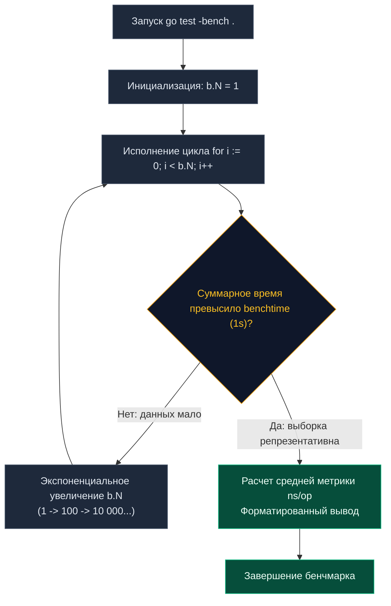

Корректность программной логики — необходимое, но совершенно недостаточное условие для современного бэкенда. Сервис может обладать 100% тестовым покрытием, успешно проходить все интеграционные сценарии и не содержать гонок данных, но под нагрузкой в 10 000 RPS его 99-й перцентиль задержки (p99 latency) улетает в космос, а процессорные ядра упираются в 100% утилизации.

В Go производительность — это не побочный эффект, оптимизируемый в последнюю очередь, а фундаментальная характеристика системного дизайна. Для высокоточного измерения скорости работы алгоритмов и профилирования потребления ресурсов стандартный пакет `testing` предоставляет первоклассный инструмент — структуру `*testing.B` (тип `testing.B`) и встроенный механизм **Benchmarking (Микро-бенчмарки)**.

В этой главе мы препарируем анатомию бенчмарков, заглянем в подсистему адаптивного автомасштабирования измерений, исследуем работу системных таймеров ядра и научимся защищаться от излишне умного оптимизатора компилятора.

---

## Анатомия Benchmark-теста

Бенчмарки в Go размещаются в тех же самых файлах `_test.go`, что и обычные тесты `TestXxx`. Отличие заключается в сигнатуре: функция обязана начинаться с префикса `Benchmark` и принимать единственный аргумент — указатель на контекст бенчмарка `b *testing.B`:

```go
package jsonparser_test

import (
	"encoding/json"
	"testing"
)

// Тестируемая структура DTO
type User struct {
	ID    int    `json:"id"`
	Email string `json:"email"`
}

func BenchmarkJSONUnmarshal(b *testing.B) {
	payload := []byte(`{"id": 42, "email": "test@example.com"}`)
	
	// Цикл измерений — мотор любого бенчмарка
	for i := 0; i < b.N; i++ {
		var u User
		_ = json.Unmarshal(payload, &u)
	}
}
```

Для запуска бенчмарков стандартного вызова `go test` недостаточно (он исполняет только функциональные тесты). Необходимо передать регулярное выражение через флаг `-bench`:

```bash
# Запуск всех бенчмарков в текущем каталоге пакета:
go test -bench=.
```

---

## Что такое b.N? (Магия автомасштабирования)

Первый вопрос, который возникает у разработчиков: «Почему число итераций не задается жестко константой? Что означает счетчик `b.N`?».

> [!info] Под капотом
> Рантайм пакета `testing` заранее не знает, сколько тактов CPU займет один вызов вашей функции. Если запустить тяжелый парсинг 10 раз, общее время составит доли микросекунды, и погрешность планировщика ОС сделает замер бессмысленным. Если жестко задать миллиард итераций, медленная функция заморозит сьют на несколько часов.  
> 
> Поэтому движок бенчмаркинга работает **адаптивно**. Он запускает функцию с `b.N = 1`, затем прогревает код и экспоненциально увеличивает счетчик `b.N` по шкале (1, 100, 10 000, 1 000 000...), пока суммарное время работы цикла не превысит калибровочный интервал `benchtime` (по умолчанию равный ровно 1 секунде).



По окончании калибровки раннер выводит эталонную строку:

```text
BenchmarkJSONUnmarshal-10    3284074     351.4 ns/op
```

**Анатомия отчета:**
* `BenchmarkJSONUnmarshal-10`: суффикс `-10` указывает текущее значение `GOMAXPROCS` (число ядер процессора).
* `3284074`: фактическое число итераций `b.N`, выполненных за время `benchtime`.
* `351.4 ns/op`: среднее физическое время исполнения одной операции в наносекундах (`ns/op`).

---

## Изоляция времени: ResetTimer и StopTimer

В подавляющем большинстве задач перед стартом замеров требуется тяжелая подготовка окружения: сгенерировать мегабайтный срез данных, загрузить тестовые сертификаты или прочитать эталонный файл с диска.

Если не исключить эту подготовку из измерений, время генерации данных равномерно размажется по миллиону итераций, безнадежно исказив результаты. Для очистки замеров предназначен метод `b.ResetTimer()`:

```go
func BenchmarkComplexAlgo(b *testing.B) {
	// Долгая предварительная инициализация (дисковый ввод-вывод, парсинг)
	data := generateHugeDataset() 
	
	// Сбрасываем таймер и накопленные счетчики аллокаций.
	// Всё время и память, потраченные выше, не идут в протокол!
	b.ResetTimer() 

	for i := 0; i < b.N; i++ {
		Process(data)
	}
}
```

Если же сложная подготовка требуется непосредственно *внутри* тела цикла, используются методы `b.StopTimer()` и `b.StartTimer()`.  
Однако помните о накладных расходах: частая остановка и запуск таймера внутри миллионного цикла `b.N` сами по себе создают нагрузку на процессор из-за обращений к виртуальным системным часам ядра Linux (`VDSO clock_gettime`), смещая точность наносекундных замеров.

---

## Mechanical Sympathy: Охота на аллокации

Для серверного бэкенда процессорное время (`ns/op`) — это лишь вершина айсберга. Подлинный враг высокой пропускной способности — аллокации динамической памяти в куче (Heap).

> [!warning] Ловушка / Gotcha
> Каждая аллокация в куче на критическом пути обработки запросов (Hot Path) — это прямая работа для сборщика мусора (Garbage Collector). Фазы Mark и Sweep отнимают такты у рабочих горутин и провоцируют всплески задержек (Tail Latency).  
> Вы обязаны профилировать не только время, но и память. Для этого передавайте флаг `-benchmem` при запуске, либо вызывайте метод `b.ReportAllocs()` прямо в начале бенчмарка.

```go
func BenchmarkStringConcat(b *testing.B) {
	b.ReportAllocs() // Принудительный сбор метрик динамической памяти
	
	for i := 0; i < b.N; i++ {
		s := ""
		for j := 0; j < 100; j++ {
			s += "a" // Антипаттерн: постоянное перевыделение памяти в куче
		}
	}
}
```

Вывод бенчмарка с флагом аллокаций:

```text
BenchmarkStringConcat-10   168231   6870 ns/op   5304 B/op   99 allocs/op
```

**Ключевые метрики памяти:**
* `5304 B/op`: суммарный объем байт, выделенный в куче за одну итерацию `b.N`.
* `99 allocs/op` (метрика `allocs/op`): количество отдельных операций аллокации памяти в куче на один цикл.

Задача инженера — сводить `allocs/op` к нулю в критических контурах сервиса, применяя предварительное резервирование емкости срезов `make([]T, 0, capacity)`, повторное использование буферов через `sync.Pool` и тонкую настройку Escape Analysis.

---

## Ловушка оптимизатора (Dead Code Elimination)

Компилятор Go чрезвычайно эффективен в оптимизации машинного кода. Если компилятор видит, что результат выполнения чистой функции нигде не сохраняется и не оказывает побочных эффектов, он активирует оптимизацию **Dead Code Elimination (Удаление мертвого кода)** и попросту вырезает вызов функции из результирующего бинарника!

```go
// ПЛОХОЙ БЕНЧМАРК: Иллюзия скорости
func BenchmarkCompute(b *testing.B) {
	for i := 0; i < b.N; i++ {
		Compute(i) // Результат игнорируется: компилятор удалит эту строку!
	}
}
```

В консоли вы увидите сказочный результат вида `0.3 ns/op`, решите, что создали самый быстрый алгоритм в мире, а в production получите инцидент. Компилятор просто не выполнял вашу функцию.

### Защита от DCE через глобальные переменные:
Чтобы гарантировать, что компилятор физически выполнит машинные инструкции функции, результат вычислений необходимо экспортировать в глобальную переменную пакета:

```go
// Глобальная переменная на уровне пакета
var Result int 

func BenchmarkCompute(b *testing.B) {
	var r int // Локальная переменная на стеке
	for i := 0; i < b.N; i++ {
		r = Compute(i) 
	}
	// Присваивание глобальной переменной запрещает компилятору удалять вычисления:
	Result = r 
}
```

---

## Параллельные бенчмарки: b.RunParallel

Последовательные бенчмарки измеряют чистую скорость алгоритма в одном потоке. Однако реальный бэкенд на Go функционирует в конкурентной среде, где тысячи горутин одновременно обращаются к разделяемым структурам данных. Если алгоритм содержит примитивы синхронизации (`sync.Mutex`) или общие словари `map`, последовательный тест покажет идеальные цифры, а в реальной эксплуатации возникнет катастрофический Lock Contention (борьба за блокировку кэш-линий ядер CPU).

Для стресс-тестирования в условиях конкуренции используется метод `b.RunParallel(pb *testing.PB)` (или `b.RunParallel`):

```go
func BenchmarkConcurrentCache(b *testing.B) {
	cache := NewThreadSafeCache()
	
	b.ReportAllocs()
	b.ResetTimer()

	// RunParallel создает пул горутин (по умолчанию GOMAXPROCS)
	// и распределяет итерации b.N между ними
	b.RunParallel(func(pb *testing.PB) {
		// Локальный цикл горутины
		for pb.Next() {
			cache.Set("key", "value")
			_ = cache.Get("key")
		}
	})
}
```

---

> [!tip] Собеседование
> **Вопрос:** Если `b.RunParallel` по умолчанию создает количество горутин, равное числу логических ядер процессора (`GOMAXPROCS`), как проверить поведение компонента под имитацией огромной нагрузки из сотен параллельных соединений?  
> **Ответ:** Для этого используется метод `b.SetParallelism(p int)`. Он устанавливает коэффициент параллелизма, умножая `GOMAXPROCS` на аргумент `p`.  
> Например, при вызове `b.SetParallelism(100)` на 8-ядерной машине (`GOMAXPROCS=8`) раннер поднимет пул из 800 конкурирующих горутин. Это позволяет реалистично нагрузить внутренние мьютексы, каналы и аллокации строк (`string`) или пустых интерфейсов (`interface{}`), выявив узкие места архитектуры до выхода в production.

---

## Итог

1. `*testing.B` — стандартный инструмент Go для высокоточного профилирования и написания микро-бенчмарков с автоматическим подбором шага `b.N`.
2. Используйте `b.ResetTimer()` для отсечения времени тяжелой инициализации тестовых наборов.
3. Метрика `allocs/op` (флаг `-benchmem` или вызов `b.ReportAllocs()`) зачастую важнее абсолютного времени `ns/op`, так как аллокации в куче напрямую определяют паузы сборщика мусора.
4. Защищайтесь от оптимизации Dead Code Elimination, сохраняя результат вычислений в глобальную переменную.
5. Для оценки потокобезопасных структур данных и выявления Lock Contention используйте конкурентный раннер `b.RunParallel`.

Теория бенчмаркинга освоена. Теперь пришло время посмотреть на реальный боевой кейс: как профилировать код, интерпретировать выводы утилит сравнения бенчмарков и устранять аллокации на практике. Переходим к заключительной главе подраздела: [[11. Пример benchmarking и анализ результатов]].