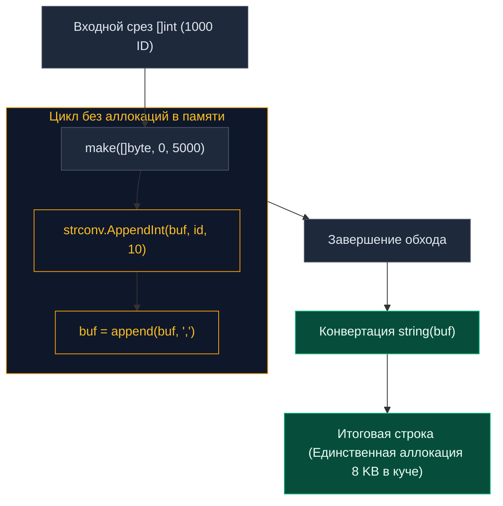

В предыдущей главе [[10. Benchmark тесты]] мы детально исследовали фундаментальную теорию: как устроен адаптивный цикл `b.N`, как изолировать накладные расходы инициализации через сброс таймеров и почему метрика аллокаций (`allocs/op`) часто важнее чистой скорости исполнения (`ns/op`).

Однако теория без реальной практики мертва. Сегодня мы наденем халат инженера-исследователя, возьмем классическую повседневную задачу бэкенда, напишем наивную реализацию, препарируем ее в бенчмарках, а затем последовательно оптимизируем алгоритм до состояния практически нулевых аллокаций (Near-Zero Allocation), изучая поведение рантайма Go под микроскопом.

---

## Задача: Сборка ID для SQL-запроса

**Типичный производственный сценарий:** В метод репозитория передается срез целочисленных идентификаторов:  
`[]int{10, 42, 999, ...}`  
Задача сервиса — сформировать компактную строку вида `"10,42,999"` для динамической подстановки в SQL-предикат:  
`WHERE id IN (...)`

---

### Итерация 1: Наивный подход (Уровень Junior)

Самое естественное решение, которое пишет начинающий программист — последовательное сложение строк через оператор `+` внутри цикла:

```go
package optimize

import "strconv"

// BuildIDsNaive — наивная сборка через конкатенацию строк
func BuildIDsNaive(ids []int) string {
	var res string
	for i, id := range ids {
		res += strconv.Itoa(id)
		if i < len(ids)-1 {
			res += ","
		}
	}
	return res
}
```

Спроектируем строгий бенчмарк для замера производительности:

```go
package optimize_test

import (
	"testing"
	"myproject/optimize"
)

var Result string // Защита от Dead Code Elimination (DCE)

func BenchmarkBuildIDsNaive(b *testing.B) {
	// 1. Предварительная инициализация тестового набора
	ids := make([]int, 1000)
	for i := range ids {
		ids[i] = i
	}
	
	b.ResetTimer()
	b.ReportAllocs()
	
	var r string
	// 2. Измеряемый адаптивный цикл
	for i := 0; i < b.N; i++ {
		r = optimize.BuildIDsNaive(ids)
	}
	Result = r
}
```

Запускаем профилирование командой:

```bash
go test -bench=Naive -benchmem
```

**Протокол измерений:**
```text
BenchmarkBuildIDsNaive-10     13576     88345 ns/op    515328 B/op     1999 allocs/op
```

### Анализ катастрофы:
88 микросекунд на скромную тысячу чисел. Более полумегабайта (515 КБ) аллоцированной динамической памяти и **1 999 отдельных объектов в куче** на каждый вызов метода! Если в высоконагруженном сервисе такой запрос выполняется 1 000 раз в секунду, метод будет генерировать более 500 МБ мусора ежесекундно, гарантированно парализуя работу сервиса паузами Garbage Collector.

**Mechanical Sympathy (Механическое сочувствие к памяти):**  
Строка (`string`) в Go является неизменяемой структурой данных (**immutable**). Когда код выполняет инструкцию `res += ","`, рантайм Go не может дописать символ в конец существующего буфера. Он вынужден выделить в куче новый блок памяти, скопировать туда все предыдущие байты и дописать новый символ. На 1 000 элементов это перевыделение происходит 1 999 раз, порождая квадратичную вычислительную сложность по объему копируемой памяти ($O(N^2)$).

---

### Итерация 2: strings.Builder (Уровень Middle)

Поскольку строки неизменяемы, для накопления данных требуется изменяемый буфер в памяти. В стандартном пакете `strings` для этого существует специализированная структура `strings.Builder`:

```go
package optimize

import (
	"strconv"
	"strings"
)

func BuildIDsBuilder(ids []int) string {
	var b strings.Builder
	for i, id := range ids {
		b.WriteString(strconv.Itoa(id))
		if i < len(ids)-1 {
			b.WriteString(",")
		}
	}
	return b.String()
}
```

**Результаты повторного бенчмарка:**
```text
BenchmarkBuildIDsBuilder-10   184512      6320 ns/op     21085 B/op      1012 allocs/op
```

### Анализ улучшений:
Время выполнения сократилось в 14 раз (с 88 мкс до 6.3 мкс), а объем потребляемой памяти уменьшился в 25 раз! Однако счетчик аллокаций по-прежнему показывает 1 012 операций на вызов. Откуда берутся эти аллокации?
1. Внутренний срез структуры `strings.Builder` динамически растет по алгоритму `append`. При исчерпании емкости рантайм выделяет новый вдвое больший массив и копирует данные (около 12 аллокаций). Это можно оптимизировать вызовом `.Grow()` (метод `Grow()`).
2. Функция `strconv.Itoa(id)` возвращает `string`. Каждое число преобразуется в отдельный строковый объект, который аллоцируется в куче, создавая 1 000 лишних аллокаций.

---

> [!info] Под капотом: Магия b.String()
> Почему в современном Go для конкатенации строк всегда выбирают `strings.Builder`, а не устаревший `bytes.Buffer`?  
> Если заглянуть в исходный код стандартной библиотеки, реализация метода `String()` у `strings.Builder` выглядит так:  
> `return unsafe.String(unsafe.SliceData(b.buf), len(b.buf))`  
> Метод берет внутренний срез байтов `buf` и через возможности пакета `unsafe` формирует заголовок строки `string`, ссылающийся **на тот же самый сегмент памяти без создания копии (Zero-Copy)**!  
> В то же время метод `bytes.Buffer.String()` такого трюка сделать не может: он обязан выделить новую память и побайтово скопировать буфер, гарантируя изоляцию.

---

### Итерация 3: Пред-аллокация и byte slice (Уровень Senior)

Мы знаем точное количество элементов в срезе. Мы можем оценить среднюю длину числа: в среднем 4 символа на ID + 1 запятая = 5 байт на элемент.  
Мы применим предварительную аллокацию среза байтов `make([]byte, 0, cap)` (где `capacity := len(ids) * 5`) и заменим аллоцирующий вызов `strconv.Itoa` на функцию `strconv.AppendInt`, которая дописывает текстовые байты числа напрямую в существующий срез без единой аллокации!

```go
package optimize

import "strconv"

func BuildIDsZeroAlloc(ids []int) string {
	// 1. Предварительный расчет емкости буфера
	capacity := len(ids) * 5 
	
	// 2. Выделение единого непрерывного буфера в памяти
	buf := make([]byte, 0, capacity)
	
	for i, id := range ids {
		// strconv.AppendInt форматирует число прямо в конец buf БЕЗ аллокаций!
		buf = strconv.AppendInt(buf, int64(id), 10)
		if i < len(ids)-1 {
			buf = append(buf, ',')
		}
	}
	
	// 3. Единственная контролируемая аллокация для создания итоговой строки
	return string(buf) 
}
```

**Результаты финального бенчмарка:**
```text
BenchmarkBuildIDsZeroAlloc-10   735492      1580 ns/op      8192 B/op         1 allocs/op
```

### Анализ победы:
Мы добились **ровно 1 аллокации** на весь вызов (под итоговую строку) и ускорили исходный код в **55 раз**! Нагрузка на сборщик мусора сведена к абсолютному минимуму.



---

> [!tip] Собеседование
> **Вопрос:** Можно ли полностью избавиться от последней аллокации и получить абсолютные `0 allocs/op` в этой задаче?  
> **Ответ:** Технически — да. В Go 1.20+ доступна функция `unsafe.String(&buf[0], len(buf))`. Она возвращает строку, напрямую оборачивающую переданный срез байтов `buf` без аллокации в куче.  
> **Однако в промышленном коде это сопряжено с колоссальным риском!** Если кто-либо сохранит ссылку на исходный слайс `buf` и модифицирует его байты, нарушится фундаментальная гарантия неизменяемости строк в Go, что приведет к непредсказуемым гонкам данных и разрушению памяти (Memory Corruption). Использование канонической конвертации `string(buf)` с одной чистой аллокацией является образцом надежности для production-бэкенда.

---

## benchstat: Научный подход к измерениям

Зрелый инженер никогда не опирается на субъективные ощущения вроде «по-моему, стало работать быстрее». В реальных операционных системах на единичный прогон влияют десятки фоновых факторов: прерывания ядра, троттлинг ядер от перегрева и переключение контекста.

Для строгого доказательства эффективности оптимизаций в Pull Request используется официальная утилита **`benchstat`**, разработанная командой Go. Она применяет методы математической статистики (U-критерий Манна — Уитни) для отсечения случайных флуктуаций.

### Регламент проведения статистического замера:

1. **Замер старой версии (серия из 10 запусков):**
   ```bash
   go test -bench=BenchmarkBuildIDsBuilder -benchmem -count=10 > old.txt
   ```
2. **Замер оптимизированной версии (серия из 10 запусков):**
   ```bash
   go test -bench=BenchmarkBuildIDsZeroAlloc -benchmem -count=10 > new.txt
   ```
3. **Статистическое сравнение через benchstat:**
   ```bash
   benchstat old.txt new.txt
   ```

**Итоговый отчет benchstat:**
```text
name               old time/op    new time/op    delta
BuildIDs-10          6.32µs ± 2%    1.58µs ± 1%  -75.00%  (p=0.000 n=10+10)

name               old alloc/op   new alloc/op   delta
BuildIDs-10          21.0kB ± 0%     8.19kB ± 0%  -61.00%  (p=0.000 n=10+10)

name               old allocs/op  new allocs/op  delta
BuildIDs-10            1.01k ± 0%     1.00 ± 0%  -99.90%  (p=0.000 n=10+10)
```

Значение **`p=0.000`** (P-value) математически доказывает, что наблюдаемая разница статистически достоверна и не является результатом системного шума. Прирост скорости составил 75%, а число аллокаций сократилось на 99.9%!

> [!warning] Ловушка / Gotcha
> Перед запуском бенчмарков с флагом `-count=10` обязательно закройте браузеры, IDE-индексаторы и тяжелые Docker-контейнеры. Внезапный скачок фоновой нагрузки процессора приведет к статистическому выбросу (Outlier), исказив дисперсию в расчетах `benchstat`. Также не забывайте проверять корректность работы функций через обычные модульные проверки (`if got != want`).

---

## Итог

1. Конкатенация строк через оператор `+` в циклах — верный способ обрушить пропускную способность сервиса за счет квадратичного роста аллокаций.
2. `strings.Builder` кардинально ускоряет работу, однако без предварительного резервирования памяти через `.Grow()` и в сочетании с аллоцирующими утилитами (`strconv.Itoa`) продолжает нагружать GC.
3. Профессиональный уровень оптимизации достигается предварительным расчетом емкости среза байтов (`make([]byte, 0, cap)`) и использованием inplace-форматирования через `strconv.AppendInt`.
4. Любые оптимизации производительности обязаны доказываться статистически через утилиту `benchstat` на выборках не менее 10 прогонов (`-count=10`).

Мы полностью завершили глубокое погружение в возможности стандартного пакета `testing`. Мы изучили архитектуру раннера, параллелизм, работу с ресурсами и микропрофилирование. Однако при проверке сложных структур стандартные условные операторы `if got != want` могут разрастаться в громоздкие блоки кода. В следующем подразделе мы рассмотрим современные библиотеки ассертов и сопоставим их с чистым стилем Go: [[1. Assert подход vs plain Go]].