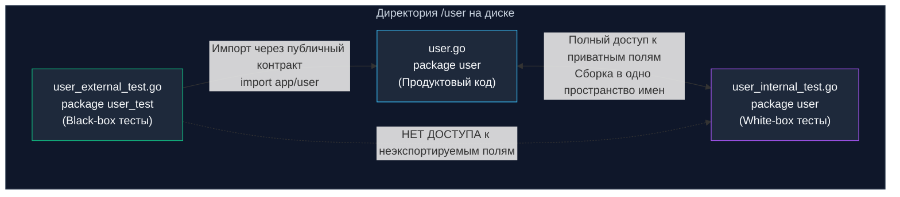

В предыдущей главе [[1. testing пакет. Основы]] мы убедились, что тесты в Go — это не интерпретируемые сценарии, а полноценные скомпилированные машинные бинарники. Однако прежде чем тулчейн сможет скомпилировать исполняемый файл для прогона тестов, он должен проанализировать структуру каталогов и связать файлы пакета в единую стройную систему.

Организация файлов и пакетов в Go — это не просто вопрос вкуса или корпоративных договоренностей. Это строгие правила, зашитые непосредственно в компилятор и сборочную систему. Они напрямую определяют инкапсуляцию, границы видимости идентификаторов, предотвращение циклических зависимостей и компоновку боевого бинарника.

В этой главе мы подробно разберем правила физического размещения тестовых файлов, дилемму White-box и Black-box тестирования на уровне пакетов, скрытые механизмы работы точки входа `TestMain` и работу со специальным каталогом `testdata`.

---

## Топология файлов: Рядом с кодом

В объектно-ориентированных экосистемах вроде Java или C# принято разносить продуктовый код и тесты по зеркальным иерархиям папок: каталог `src/` резервируется под боевой код, а параллельный каталог `tests/` — под проверочные классы. В Go этот подход считается грубым антипаттерном.

В Go тестовые файлы **всегда размещаются бок о бок с тестируемым кодом** в том же самом каталоге файловой системы. Единственное требование — имя тестового файла обязано оканчиваться строгим суффиксом `_test.go`:

```text
user/
├── user.go        # Бизнес-логика сущности
├── user_test.go   # Модульные тесты для user.go
├── auth.go        # Логика аутентификации
└── auth_test.go   # Тесты подсистемы аутентификации
```

> [!info] Под капотом
> Как компилятор отделяет продуктовый код от тестов, если они лежат в одной директории?  
> Тулчейн Go опирается на механизм **Build Constraints (Ограничения сборки)**. Когда вы запускаете стандартную сборку сервиса `go build`, синтаксический анализатор пакетов `go/build` на этапе лексического сканирования безусловно отфильтровывает любые файлы с суффиксом `_test.go`.  
> Они физически не включаются в абстрактное синтаксическое дерево (AST) боевого приложения. Благодаря этому размер production-бинарника не раздувается ни на один байт, а тестовые вспомогательные структуры не засоряют сегмент данных исполняемого файла операционной системы.

---

## Дилемма пакетов: White-box vs Black-box

Создавая тестовый файл `user_test.go` внутри пакета `user`, вы стоите перед фундаментальным архитектурным выбором: объявить в заголовке `package user` или `package user_test`. Это решение определяет степень видимости внутренней структуры модуля:



### 1. Внутренние тесты (White-box: `package user`)

Если в начале тестового файла указан тот же самый идентификатор пакета, что и в боевом коде (`package user`), тест становится **внутренним (White-box)**:
- Тесту доступны абсолютно все внутренности пакета: приватные неэкспортируемые структуры, неэкспортируемые поля, внутренние функции и константы.
- Тестовый код компилируется в то же пространство имен, что и модуль.

**Когда это оправдано:**
- Проверка сложных математических алгоритмов, внутренних состояний конечных автоматов (FSM) или низкоуровневых парсеров, которые нет смысла выставлять в публичный API.
- Точечное стресс-тестирование приватных DTO-мапперов.

---

### 2. Внешние тесты (Black-box: `package user_test`)

Если к имени пакета добавляется суффикс `_test` (`package user_test`), компилятор Go воспринимает этот файл как **совершенно независимый внешний пакет**, несмотря на то, что физически он лежит в той же директории `user`.

В таком файле вы обязаны явно импортировать тестируемый пакет (`import "myapp/user"`), а тесту доступны **строго экспортируемые (публичные) идентификаторы**, начинающиеся с заглавной буквы.

**Преимущества внешнего (Black-box) тестирования:**
1. **Неуязвимость к рефакторингу:** Вы проверяете поведение и стабильность публичного контракта. Внутренняя реализация может быть переписана с нуля, но если внешнее поведение сохранено, тесты останутся зелеными.
2. **Проверка эргономики API:** Вы тестируете библиотеку в шкуре реального стороннего потребителя, мгновенно ощущая любые шероховатости, неудобные конструкторы или избыточные параметры.
3. **Разрыв циклических импортов:** Классическая проблема архитектуры: пакет `A` для проведения тестов нуждается в тестовых утилитах пакета `B`, в то время как продуктовый код `B` уже зависит от `A`. Компилятор прерывает сборку с фатальной ошибкой `import cycle not allowed`. Перевод тестов в отдельный виртуальный пакет `A_test` разрывает замкнутый круг.

---

> [!tip] Собеседование
> **Вопрос:** Вы пишете чистые внешние тесты (`package mypkg_test`), но для проверки одного критического сценария вам жизненно необходимо заглянуть во внутреннее приватное состояние `package mypkg`. Как это сделать, не нарушая инкапсуляцию продуктового кода?  
> **Ответ:** Использовать канонический Go-паттерн **`export_test.go`**.  
> В каталоге пакета создается файл `export_test.go`, объявляющий внутренний `package mypkg`. Внутри этого файла объявляются публичные экспортируемые переменные или функции-алиасы, ссылающиеся на приватные сущности.  
> Поскольку имя файла оканчивается на `_test.go`, эти технические «бэкдоры» будут намертво проигнорированы компилятором `go build` при сборке боевого приложения, однако виртуальный внешний пакет `mypkg_test` сможет легально обратиться к ним во время прогона `go test`!

---

## Глобальный контекст пакета: TestMain

В интеграционном тестировании часто требуется тяжеловесная процедура инициализации и гарантированной финализации на уровне всего пакета (`Setup/Teardown`): поднять контейнер базы данных через Testcontainers, применить миграции, а по завершении сьюта корректно закрыть соединения и очистить ресурсы.

Для этих целей стандартная библиотека предоставляет специальную функцию `TestMain(m *testing.M)`.

Если в пакете объявлена функция с сигнатурой `TestMain`, раннер передает бразды правления ей, а не запускает тесты автоматически. Вызов `m.Run()` осуществляет фактический запуск всех тестов в пакете и возвращает целочисленный статус:

```go
package integration_test

import (
	"fmt"
	"os"
	"testing"
)

func TestMain(m *testing.M) {
	// 1. Глобальный Setup пакета
	fmt.Println("Инициализация инфраструктуры для тестов пакета...")
	
	// 2. Выполнение всех тестовых функций пакета
	code := m.Run() 
	
	// 3. Глобальный Teardown
	fmt.Println("Очистка тестового окружения...")
	
	// 4. Завершение процесса с кодом возврата раннера
	os.Exit(code)
}
```

---

### Mechanical Sympathy и Ловушка os.Exit

Функция `os.Exit(code)` завершает выполнение программы через мгновенный системный вызов ядра операционной системы (в Linux это системный вызов `exit_group`). Ядро немедленно освобождает ресурсы процесса, уничтожает потоки и сбрасывает дескрипторы.

Рантайм Go при этом **не раскручивает стек** и не выполняет отложенные функции!

> [!warning] Ловушка / Gotcha
> Вызов `defer` внутри тела функции `TestMain` **никогда не будет выполнен**, если в конце стоит прямой вызов `os.Exit`!
> 
> ```go
> func TestMain(m *testing.M) {
>     db := SetupDatabase()
>     defer db.Close() // КАТАСТРОФА: Этот defer НИКОГДА не сработает!
>     
>     os.Exit(m.Run()) // os.Exit мгновенно убивает процесс ядра
> }
> ```
> **Идиоматичное решение:** Выносите логику запуска и управления ресурсами во вспомогательную функцию `run(m *testing.M) int`. В ней отложенные инструкции `defer` отработают штатно при возврате значения, и лишь после этого чистый код ошибки будет передан в `os.Exit`:
> 
> ```go
> func TestMain(m *testing.M) {
>     os.Exit(run(m))
> }
> 
> func run(m *testing.M) int {
>     db := SetupDatabase()
>     defer db.Close() // Корректно выполнится при выходе из run()!
>     return m.Run()
> }
> ```

---

## Директория testdata

Когда модульным или интеграционным тестам требуются статические входные артефакты — эталонные JSON-документы, тестовые сертификаты TLS, дампы баз данных или файлы с ожидаемым выводом (Golden Files), их ни в коем случае не следует внедрять в виде громоздких строковых литералов в исходный код.

В Go для этих целей предусмотрено специальное зарезервированное имя каталога: `testdata/` (или `testdata`).

```text
parser/
├── parser.go
├── parser_test.go
└── testdata/
    ├── input_valid.json
    └── input_invalid.json
```

### Механические особенности каталога testdata:

1. **Игнорирование компилятором:** Утилиты `go build` и `go install` на уровне парсера тулчейна безусловно игнорируют любые директории с именем `testdata`. Ваши многомегабайтные фикстуры гарантированно не попадут в production-бинарник.
2. **Детерминированный рабочий каталог (CWD):** При запуске тестов тулчейн `go test` гарантирует, что текущая рабочая директория процесса (Current Working Directory) жестко устанавливается в каталог тестируемого пакета. Благодаря этому в файле `parser_test.go` вы можете безбоязненно использовать относительный путь:
   ```go
   data, err := os.ReadFile("testdata/input_valid.json")
   ```
   Этот путь будет успешно разрешен ядром ОС всегда, независимо от того, запускаете ли вы тест из корня монорепозитория или из вложенной поддиректории.

---

## Итог

Архитектура файловой структуры тестов в Go подчинена ясности и строгому контролю на этапе сборки:
1. **Расположение:** Файлы `*_test.go` всегда живут рядом с реализацией, не влияя на боевой `go build`.
2. **Инкапсуляция:** Предпочитайте `package mypkg_test` (Black-box) для тестирования стабильных контрактов. Прибегайте к `package mypkg` (White-box) или трюку с `export_test.go`, когда требуется протестировать сложные скрытые механизмы.
3. **Пакетный Setup:** Используйте `TestMain(m *testing.M)`, но помните про системный вызов `os.Exit(code)` и оборачивайте инициализацию в функцию с `defer`.
4. **Фикстуры:** Храните тестовые статические данные в специальной папке `testdata/`.

Мы детально исследовали организацию файлов на диске. Но что именно происходит в операционной системе и рантайме Go, когда мы нажимаем Enter после команды `go test`? Какова анатомия компиляции, кэширования и параллелизма? Этому посвящена следующая глава: [[3. go test под капотом]].