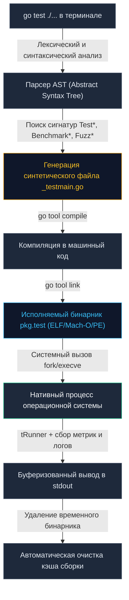
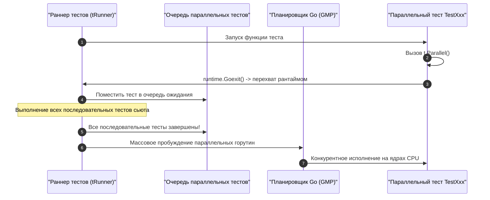

Когда мы вводим в терминале команду `go test` и спустя доли секунды видим аккуратный отчет о выполнении сотен тестовых сценариев, легко поддаться иллюзии, будто Go работает как скриптовый интерпретатор или легковесная виртуальная машина с JIT-компилятором. Кажется, будто система просто считывает исходные файлы и выполняет их на лету.

Однако для инженера магии не существует. За этой головокружительной скоростью скрывается отточенный механизм системного программирования: статическая кодогенерация, нативная компиляция в машинный код, оптимизация графа зависимостей и изощренное взаимодействие с планировщиком операционной системы.

В этой главе мы препарируем тулчейн `go test`, исследуем синтетический код, генерируемый компилятором, и разберем низкоуровневую механику исполнения тестов на стыке рантайма Go и процессорного железа.

---

## Жизненный цикл `go test`

Выполнение команды `go test` состоит из трех строго разграниченных фаз: **Анализ и кодогенерация**, **Компиляция и линковка** и **Исполнение в рантайме**.



---

## Фаза 1: Анализ и Кодогенерация

Тулчейн Go категорически отвергает рантайм-рефлексию для поиска тестов. Рефлексия требует сканирования метаданных во время выполнения программы, что замедляет запуск и увеличивает накладные расходы. Вместо этого инструмент статического анализа строит AST-дерево всех файлов с суффиксом `_test.go` в целевом каталоге.

Анализатор отбирает строго декларированные функции, удовлетворяющие каноническим сигнатурам:
* `TestXxx(t *testing.T)` — модульные и интеграционные проверки;
* `BenchmarkXxx(b *testing.B)` — нагрузочные бенчмарки;
* `FuzzXxx(f *testing.F)` — фаззинг-сценарии;
* `TestMain(m *testing.M)` — координатор пакетного жизненного цикла.

После обнаружения функций инструмент кодогенерации создает во временном системном каталоге (определяемом переменной `$TMPDIR` или директорией кэша сборки `GOCACHE`) временный файл с именем `_testmain.go` (компонент `_testmain`). Этот файл содержит настоящую точку входа операционной системы — функцию `func main`.

> [!info] Под капотом
> Как устроен сгенерированный файл `_testmain.go`?  
> В упрощенном виде генератор создает массив структур `testing.InternalTest`, связывающий текстовые имена функций с реальными адресами функций в кодовой секции программы:
> 
> ```go
> package main
> 
> import (
> 	"os"
> 	"testing"
> 	"testing/internal/testdeps"
> 	_test "myproject/mypackage" // Импорт вашего пакета
> )
> 
> var tests = []testing.InternalTest{
> 	{"TestAdd", _test.TestAdd},
> 	{"TestDelete", _test.TestDelete},
> }
> 
> func main() {
> 	m := testing.MainStart(testdeps.TestDeps{}, tests, nil, nil, nil)
> 	os.Exit(m.Run())
> }
> ```
> Входная точка `main()` передает сгенерированный реестр тестов в низкоуровневый раннер пакета `testing`. Никакого динамического поиска — только прямые вызовы по указателям функций.

---

## Фаза 2: Компиляция

После формирования исходного кода точки входа тулчейн инициирует вызовы компилятора `go tool compile` и линковщика `go tool link`. Ваш продуктовый код, файлы тестов и сгенерированный `_testmain.go` компилируются в единый независимый монолитный бинарник операционной системы — например, `mypackage.test` (или `pkg.test`, а на платформе Windows — `pkg.test.exe`).

Этот бинарный файл подвергается тем же агрессивным оптимизациям компилятора, что и промышленный релиз:
1. **Escape Analysis:** Компилятор стремится разместить структуры на стеке текущего потока, минимизируя аллокации в куче и нагрузку на сборщик мусора.
2. **Function Inlining:** Тела коротких функций встраиваются непосредственно в место вызова, устраняя накладные расходы на вызов функций (Call Overhead) и переключение стековых кадров.

> [!tip] Собеседование
> **Вопрос:** Можно ли скомпилировать тесты на машине разработчика и запустить их на удаленном сервере без установленного Go?  
> **Ответ:** Да, абсолютно. Флаг `go test -c` компилирует полноценный тестовый исполняемый файл `pkg.test`, но не запускает его автоматически.  
> Вы можете скопировать получившийся бинарник на чистый Linux-сервер и запустить его напрямую: `./pkg.test`. Этот прием широко используется в изолированных безопасных CI/CD контурах (Air-gapped Environments), где установка сборочного тулчейна Go запрещена политиками безопасности.

---

## Фаза 3: Исполнение и tRunner

Когда операционная система запускает тестовый бинарник, движок пакета `testing` приступает к последовательному или параллельному прогону зарегистрированных тестов.

Каждый тест запускается рантаймом в отдельной выделенной горутине под контролем внутренней координирующей функции `tRunner`:

```go
// Упрощенная механика функции tRunner из runtime пакета testing
func tRunner(t *T, fn func(t *T)) {
	t.runnerID = getg() // Регистрация горутины
	
	defer func() {
		// Перехват непредвиденных паник внутри пользовательского теста
		if err := recover(); err != nil {
			t.Errorf("panic: %v", err)
			t.FailNow()
		}
		t.signal <- true // Сигнализация основному циклу о завершении
	}()

	fn(t) // Непосредственный вызов вашего сценария TestXxx(t)
}
```

Благодаря защитному блоку `defer recover()` любая паника внутри теста (например, разыменование нулевого указателя `nil pointer dereference` или выход за границы среза `index out of range`) локализуется в горутине конкретного сценария. Функция `recover()` перехватывает сбой, помечает текущий тест статусом `FAIL`, сохраняет дамп стека и возвращает управление главному циклу раннера, который спокойно переходит к следующему тесту без падения всего процесса.

---

## Mechanical Sympathy: Механика t.Parallel()

По умолчанию все тесты внутри пакета выполняются **строго последовательно** в одной горутине раннера. Но как только тест содержит вызов `t.Parallel()`, в рантайме включается двухфазная диспетчеризация:



1. **Фаза откладывания:** Вызов `t.Parallel()` инициирует вызов `runtime.Goexit()`. Горутина текущего теста паркуется, помещается в очередь отложенных задач, а раннер мгновенно переходит к следующему тесту.
2. **Фаза параллельного взрыва:** Только после того, как завершится последний последовательный тест пакета, раннер достает все отложенные горутины из очереди и передает их планировщику Go для конкурентного исполнения.

> [!warning] Ловушка / Gotcha
> Количество тестов, исполняемых параллельно, по умолчанию жестко ограничено значением переменной среды `GOMAXPROCS` (равной числу физических или виртуальных ядер процессора, доступных процессору).  
> Если у вас сотни тяжелых сетевых тестов, они не перегрузят систему неконтролируемым параллелизмом. Однако если ваши тесты упираются в ожидание сетевого I/O, вы можете существенно ускорить прогон, явно увеличив пул параллельных исполнителей через флаг:
> ```bash
> go test -parallel N
> ```
> где `N` — желаемое количество одновременно активных тестовых горутин.

---

## Кеширование: Почему тесты выполняются за 0.001s?

Тулчейн Go славится агрессивным двухуровневым кэшированием. Если при повторном запуске `go test` в кодовой базе не произошло изменений, в терминале мгновенно отображается статус `(cached)`, а время прогона составляет доли миллисекунды.

### Алгоритм вычисления ключа кэша

Go вычисляет криптографический хэш (SHA-256) от совокупности факторов:
1. Содержимое всех исходных файлов `.go` пакета и всех его транзитивных зависимостей.
2. Флаги компилятора и линковщика (`-tags`, `-gcflags`).
3. Переменные окружения, влияющие на бинарный код: `CGO_ENABLED`, `GOOS`, `GOARCH`.
4. Точные бинарные версии установленного компилятора Go.

Если вычисленный хэш совпадает с записью в системном каталоге кэша `GOCACHE`, тулчейн **вообще не компилирует бинарник и не выполняет системный вызов `exec`**. Он мгновенно выводит в `stdout` терминала сохраненный текстовый лог предыдущего успешного запуска.

### Инвалидация кэша

Если ваши тесты взаимодействуют с внешней базой данных, сетью или физическим временем, кеширование результатов может скрыть реальный регресс. Чтобы принудительно отключить кэш результатов тестирования, всегда используйте флаг `-count=1`:

```bash
go test -count=1 ./...
```

Флаг `-count=1` гарантирует, что каждый тестовый бинарник будет заново скомпилирован и физически запущен операционной системой.

---

## Итог

1. **Кодогенерация вместо рефлексии:** Тулчейн `go test` строит AST, генерирует `_testmain.go` и собирает нативный бинарник без накладных расходов во время выполнения.
2. **Автономность артефактов:** Команда `go test -c` позволяет собрать переносимый бинарник `pkg.test` для автономного запуска в закрытых контурах.
3. **Безопасность исполнения:** Внутренняя функция `tRunner` оборачивает каждый тест в `defer recover()`, изолируя системные паники.
4. **Умное кэширование:** Раннер использует хэширование исходников и переменных `GOCACHE`, пропуская повторные запуски; используйте `-count=1` для честного сквозного прогона.

Разобравшись с низкоуровневой анатомией запуска, мы переходим к практическому паттерну, являющемуся золотым стандартом чистого кода в Go: [[4. Table driven tests]].