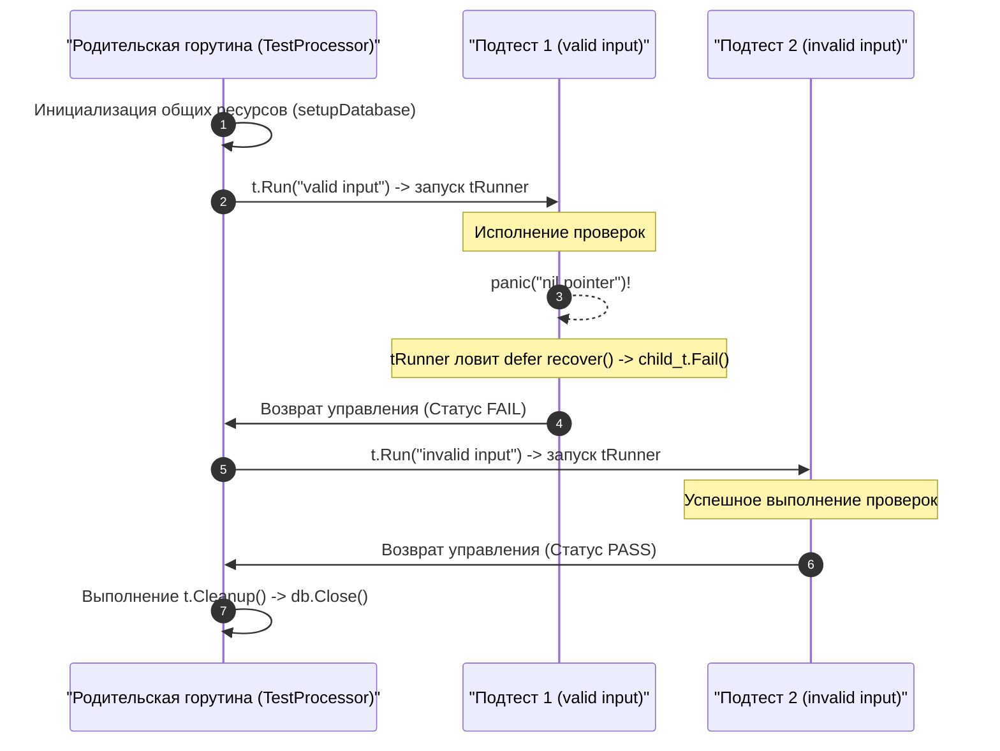

В предыдущей главе [[4. Table driven tests]] мы увидели, насколько выразительно и компактно можно формулировать десятки тестовых сценариев в рамках единого цикла. Однако настоящий архитектурный прорыв в управляемости и читаемости тестов произошел с появлением метода `t.Run()`.

До исторического релиза Go 1.7 для группировки тестов, создания иерархий `Setup/Teardown` и выборочного прогона упавших кейсов разработчикам приходилось тащить в проект сторонние надстройки вроде `testify/suite` или библиотеки `gocheck`. С добавлением нативного метода `t.Run` стандартный пакет `testing` получил первоклассную поддержку **иерархических подтестов (Subtests)**, навсегда изменив культуру тестирования в экосистеме Go.

---

## Что такое t.Run?

Метод `t.Run` связывает человекочитаемое имя сценария с изолированным блоком кода. Он принимает два аргумента: строку с названием подтеста и функцию-замыкание с канонической сигнатурой `func(t *testing.T)`:

```go
package processor_test

import (
	"testing"
)

func TestProcessor(t *testing.T) {
	// Общая инициализация инфраструктуры для группы подтестов
	db := setupDatabase()
	t.Cleanup(func() { db.Close() })

	t.Run("valid input", func(t *testing.T) {
		// Вложенный контекст: параметр t — это НОВЫЙ изолированный указатель на testing.T!
		err := process(db, "good_data")
		if err != nil {
			t.Errorf("unexpected error: %v", err)
		}
	})

	t.Run("invalid input", func(t *testing.T) {
		err := process(db, "bad_data")
		if err == nil {
			t.Errorf("expected error, got nil")
		}
	})
}
```

### Главные преимущества паттерна:

1. **Изоляция сбоев:** Если сценарий `"valid input"` упадет с паникой `panic()` или прервется вызовом `t.Fatal()`, следующий подтест `"invalid input"` **всё равно будет гарантированно выполнен**.
2. **Иерархия имен:** Имя каждого подтеста компонуется через слэш с именем родительской тестовой функции. В диагностических отчетах терминала это отображается в виде кристально понятного пути: `TestProcessor/valid_input`.
3. **Гранулярный контроль из CLI:** Вы можете запускать изолированные сценарии или целые группы подтестов прямо из консоли, не тратя время на повторный прогон всего тяжелого сьюта.

---

> [!info] Под капотом
> Что в действительности происходит внутри рантайма при вызове `t.Run`?  
> Пакет `testing` инстанцирует новый независимый объект структуры `testing.T`, наследующий уровень логирования и параметры родителя, после чего передает его во внутренний координатор `tRunner`.  
> 
> По умолчанию (если внутри подтеста не был вызван метод `t.Parallel()`) замыкание выполняется **строго синхронно в той же самой горутине**, что и родительский тест. Вызов `t.Run` блокирует выполнение родительской функции до тех пор, пока дочерний сценарий не завершится.  
> 
> Однако, благодаря защитному механизму `defer recover()` внутри диспетчера `tRunner`, любая паника в дочернем тесте не роняет родительский процесс. Рантайм перехватывает сбой, вызывает внутренний метод `child_t.Fail()`, корректно раскручивает стек подтеста и возвращает управление в основной цикл родителя.



---

## Выборочный запуск тестов (CLI)

Возможность выборочного запуска тестов через флаг `-run` — ключевой инструмент продуктивности бэкенд-инженера. 

Представьте тяжелый интеграционный тест `TestAPI`, содержащий 50 подтестов для CRUD-операций с базой данных и занимающий 15 секунд. Если один из сценариев упал при разработке новой фичи, ждать полного прогона всех 50 тестов на каждой итерации отладки неэффективно.

Флаг командной строки `-run` принимает **регулярное выражение (regexp)**, которое сопоставляется с полным составным именем теста:

```bash
go test -run="regexp"
```

### Практические сценарии фильтрации:

1. **Запуск строго одного подтеста:**
   При фильтрации пробелы в именах подтестов заменяются на подчеркивания:
   ```bash
   # Запуск ровно одного сценария внутри TestAPI:
   go test -v -run "^TestAPI/invalid_input$"
   ```

2. **Запуск группы подтестов по общему префиксу:**
   Применяя структурированные имена (например, `create_success`, `create_fail`, `delete_success`), вы можете отфильтровать семейство операций:
   ```bash
   go test -v -run "TestAPI/create_.*"
   ```

3. **Многоуровневая иерархическая фильтрация:**
   Подтесты `t.Run` можно вкладывать друг в друга на любую глубину (`Test/Group/Case`). Вы можете запускать целые логические ветви дерева:
   ```bash
   # Запуск всех тестов валидации внутри сценария TestUsers:
   go test -v -run "TestUsers/validation/"
   ```

---

> [!tip] Собеседование
> **Вопрос:** Что произойдет, если передать слэш в имя подтеста (например, `t.Run("math/add", ...)`), и как тулчейн `go test` обработает такое имя в аргументе `-run`?  
> **Ответ:** При разборе флага `-run` раннер `go test` трактует неэкранированные слэши `/` как строгие границы иерархии тестов.  
> Если вы запустите команду `-run "Test/math/add"`, раннер будет искать корневой тест `Test`, вложенный подтест с именем `math`, а внутри него — под-подтест `add`. Поскольку тест `math` не существует (имя было единой строкой `"math/add"`), ни один тест не запустится!  
> Чтобы сматчить реальный слэш внутри имени, придется писать регулярное выражение с подстановкой: `-run "Test/math.add"`, где символ `.` заменяет литеральный слэш.  
> **Золотое правило:** никогда не используйте символ `/` внутри строковых имен в `t.Run`.

---

## Иерархический Setup и Teardown

Метод `t.Run` позволяет формировать элегантные деревья инициализации ресурсов, где каждый уровень абстракции подготавливает строго свое окружение:

```go
func TestSystem(t *testing.T) {
	// Уровень 1: Поднимаем тяжелый контейнер PostgreSQL (1 раз на весь сьют)
	db := startDatabase(t) 
	
	t.Run("users logic", func(t *testing.T) {
		// Уровень 2: Накатываем схемы и таблицы пользователей
		setupUserTables(t, db)
		
		t.Run("create user", func(t *testing.T) {
			// Уровень 3: Точечная проверка бизнес-логики создания
			createUser(t, db)
		})
	})
	
	t.Run("payments logic", func(t *testing.T) {
		// Уровень 2: Полностью изолированная ветка биллинга
		setupPaymentTables(t, db)
		// ...
	})
}
```

> [!warning] Ловушка / Gotcha
> Как мы подробно выяснили в главе [[7. Test isolation]], использование оператора `defer` в родительском тесте, содержащем асинхронные подтесты — тяжелая архитектурная ошибка.  
> Если дочерний подтест вызывает `t.Parallel()`, метод `t.Run` родительской функции немедленно возвращает управление. Инструкция `defer db.Close()` внутри `TestSystem` сработает **до** того, как параллельные подтесты успеют обратиться к базе данных!  
> **Железное правило:** в любых тестах, использующих вызовы `t.Run`, всегда заменяйте `defer` на регистрацию хуков очистки `t.Cleanup` или `t.Cleanup(func)`. Рантайм гарантирует, что хук очистки родителя выполнится строго после полного завершения всех его параллельных дочерних подтестов.

---

## Итог

1. `t.Run` превращает плоские сценарии в гранулярные иерархические деревья подтестов (Subtests).
2. Любая паника внутри подтеста изолируется механизмом `tRunner` и `defer recover()`, не прерывая выполнение соседних проверок.
3. Полные пути тестов имеют канонический формат `TestName/subtest_name`, поддерживая гибкую regex-фильтрацию через флаг командной строки `-run`.
4. В связке с `t.Cleanup`, подтесты формируют надежный каркас для управления зависимостями интеграционных стендов.

До сих пор мы рассматривали синхронное исполнение подтестов. Но настоящее ускорение тестов в Go достигается параллелизмом. Давайте перейдем к глубокому исследованию многопоточного выполнения проверок в следующей главе: [[6. Параллельные тесты t.Parallel]].