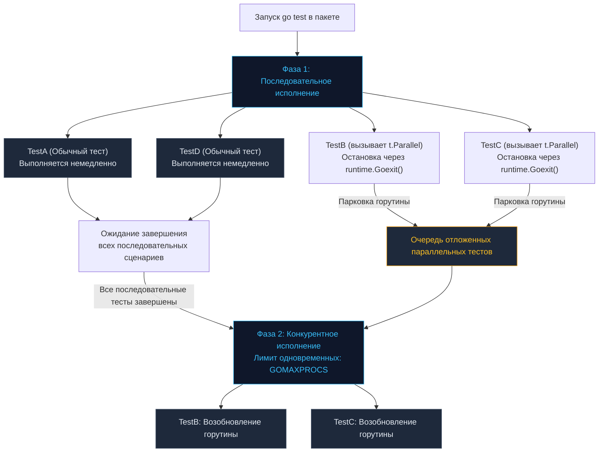

Медленный тестовый сьют — это скрытый и безжалостный налог на продуктивность инженерной команды. Если сборка и тестирование в CI/CD занимают пятнадцать-двадцать минут, разработчики перестают прогонять тесты локально, теряют фокус и отправляют изменения наугад. В современных микросервисах значительная часть сценариев упирается во взаимодействие с базами данных, внешними API и сетевыми сокетами — тесты становятся выраженно I/O-bound. Заставлять современный многоядерный процессор простаивать в ожидании ответов от сетевого стека — непозволительная роскошь.

В стандартной библиотеке Go параллелизм тестов реализован на уровне ядра тулчейна. Вызов метода `t.Parallel()` способен сократить время прогона тестового набора в разы. Однако многопоточная среда не прощает ошибок: она мгновенно обнажает любые дефекты изоляции, разделяемого состояния и координации ресурсов.

В этой главе мы препарируем устройство метода `t.Parallel()`, разберем двухфазную диспетчеризацию рантайма и изучим правила безопасного параллельного исполнения тестов.

---

## Как работает t.Parallel() под капотом

Распространенное заблуждение среди новичков: вызов `t.Parallel()` якобы просто запускает новую горутину и немедленно продолжает выполнение сценария. В реальности всё устроено значительно строже. Движок пакета `testing` четко разделяет процесс тестирования пакета на две изолированные фазы: **Последовательную (Sequential Phase)** и **Конкурентную (Parallel Phase)**.



### Анатомия двухфазного прогона:

1. **Маркировка и парковка:** Когда внутри теста вызывается `t.Parallel()`, рантайм Go вызывает низкоуровневую функцию `runtime.Goexit()`. Горутина текущего теста немедленно замораживается и помещается в очередь ожидания параллельных тестов.
2. **Последовательный прогон:** Диспетчер тестов переходит к следующему тесту в пакете. Все тесты без вызова `t.Parallel()` выполняются строго по очереди.
3. **Активация параллельного пула:** Только когда **все** последовательные тесты пакета успешно или аварийно завершились, раннер открывает шлюз для очереди параллельных тестов.
4. **Конкурентное пробуждение:** Отложенные тесты пробуждаются и начинают выполняться конкурентно в пуле горутин.

> [!info] Под капотом
> Что именно ограничивает флаг `-parallel`?  
> Представьте, что в крупном монорепозитории 1 000 тестов вызывают `t.Parallel()`, а на сервере доступно 8 процессорных ядер (`GOMAXPROCS=8`). Пакет `testing` не выбрасывает 1 000 горутин в планировщик одновременно, чтобы не вызвать лавину переключений контекста (Goroutine Storm) и не исчерпать файловые дескрипторы сокетов.  
> Рантайм использует внутренний семафор (буферизованный канал емкостью `GOMAXPROCS`). Одновременно в активной фазе исполнения находятся максимум 8 горутин. По мере завершения одного теста семафор освобождает слот для следующего. Вы можете изменить этот лимит через флаг командной строки:
> ```bash
> go test -parallel 16 ./...
> ```

---

## Правильное использование с t.Run (Subtests)

Самый популярный сценарий применения `t.Parallel()` — распараллеливание строк в табличных тестах (Table-Driven Tests). Здесь критически важно понимать иерархию вызовов:

```go
func TestProcessor(t *testing.T) {
	// 1. Делаем родительский тест параллельным по отношению к другим тестам пакета
	t.Parallel() 

	tests := []struct {
		name  string
		input string
	}{
		{"case 1", "data 1"},
		{"case 2", "data 2"},
	}

	for _, tt := range tests {
		t.Run(tt.name, func(t *testing.T) {
			// 2. Делаем подтесты параллельными между собой!
			t.Parallel() 
			
			process(tt.input) 
		})
	}
}
```

### Механическое сочувствие (Mechanical Sympathy) иерархии:
Если вы не вызовете `t.Parallel()` на уровне родительской функции `TestProcessor` (строка 1), родительский тест будет выполняться в последовательной фазе. Дойдя до цикла `for`, он зарегистрирует все параллельные подтесты и **заблокируется**, ожидая их полного окончания.  
Хотя подтесты `"case 1"` и `"case 2"` будут работать конкурентно между собой, следующий независимый тест в пакете не начнется, пока `TestProcessor` целиком не завершит работу. Объявление родителя параллельным позволяет раннеру отложить весь тестовый узел целиком, не задерживая последовательный пайплайн.

---

## Ловушки конкурентности

Как только тесты начинают выполняться одновременно, любые изъяны архитектуры мгновенно превращаются в гонки данных (Data Races).

### 1. Переменная цикла (Loop Closure Bug)

Классическая ловушка замкнутой переменной цикла в кодовых базах, написанных до версии Go 1.22:

> [!warning] Ловушка / Gotcha
> Если вы поддерживаете проекты на Go 1.21 или более старых версиях:
> ```go
> for _, tt := range tests {
>     tt := tt // КРИТИЧЕСКИ НЕОБХОДИМО для версий Go < 1.22!
>     t.Run(tt.name, func(t *testing.T) {
>         t.Parallel()
>         process(tt)
>     })
> }
> ```
> Без затенения `tt := tt` все горутины, замороженные вызовом `t.Parallel()`, захватывали единственный адрес переменной `tt`. К моменту их пробуждения цикл уже заканчивался, и абсолютно все горутины читали значение последней итерации!  
> В **Go 1.22+** переменная цикла `tt` создается заново на каждом шаге цикла `for`, навсегда устранив эту проблему.

---

### 2. t.Setenv и глобальное состояние среды

Тестирование парсеров конфигурации часто требует изменения переменных окружения процесса. Стандартный метод `t.Setenv()` меняет переменную и гарантирует ее возврат в исходное состояние после теста.

Однако переменные среды в ОС — это единая глобальная таблица дескрипторов (`os.Environ`).

> [!tip] Собеседование
> **Вопрос:** Что произойдет, если вызвать `t.Setenv("KEY", "VAL")` (или `t.Setenv`) внутри теста, который уже помечен как `t.Parallel()`?  
> **Ответ:** Рантайм Go немедленно прервет тест фатальной паникой:  
> `panic: testing: t.Setenv called after t.Parallel`.  
> Рантайм Go защищает программиста от гонок данных на уровне адресного пространства операционной системы. Если два параллельных теста попытаются одновременно изменить окружение через `os.Environ`, они перезапишут чужие данные и сломают логику соседей.  
> **Правило:** Любые тесты, изменяющие переменные окружения или глобальные синглтоны в памяти, обязаны запускаться **строго последовательно**.

---

### 3. Общие I/O ресурсы и порты

Если параллельные интеграционные тесты поднимают локальный сетевой слушатель, использование фиксированного порта вроде `8080` приведет к гарантированному падению второго теста с ошибкой ядра:

```text
bind: address already in use
```

Всегда используйте динамические эфемерные порты (`:0`), позволяя операционной системе назначить свободный сокет. Аналогично, при работе с диском используйте метод `t.TempDir()`, выделяющий каждому тесту изолированную временную песочницу на файловой системе.

---

## Teardown: defer vs t.Cleanup в параллельной среде

Это главная причина утечек дескрипторов соединений и внезапных падений в CI-пайплайнах:

```go
func TestWithDB(t *testing.T) {
	db := startTestDB()
	defer db.Close() // АРХИТЕКТУРНЫЙ КРАХ!

	t.Run("parallel query 1", func(t *testing.T) {
		t.Parallel()
		db.Query("SELECT 1")
	})
	
	t.Run("parallel query 2", func(t *testing.T) {
		t.Parallel()
		db.Query("SELECT 2")
	})
}
```

### Механика сбоя:
1. Вызовы `t.Parallel()` внутри подтестов немедленно замораживают их горутины через `runtime.Goexit()`.
2. Функция `t.Run` возвращает управление родителю `TestWithDB`.
3. Поскольку все дочерние тесты отложены, функция `TestWithDB` достигает своего конца и завершается.
4. При выходе из стека срабатывает `defer db.Close()`. База данных закрыта!
5. Позже, в конкурентной фазе, планировщик будит подтесты, они вызывают `db.Query` в закрытый пул и падают с ошибкой `sql: database is closed`.

### Идиоматичное решение через t.Cleanup:

```go
func TestWithDB(t *testing.T) {
	db := startTestDB()
	
	// t.Cleanup гарантированно вызывается ТОЛЬКО после того,
	// как завершатся ВСЕ параллельные подтесты
	t.Cleanup(func() {
		_ = db.Close()
	})

	t.Run("parallel query 1", func(t *testing.T) {
		t.Parallel()
		db.Query("SELECT 1")
	})
}
```

---

## Итог

1. `t.Parallel()` разделяет прогон на последовательную и параллельную фазы, паркуя горутины вызовом `runtime.Goexit()`.
2. Лимит одновременно работающих тестов регулируется переменной `GOMAXPROCS` и флагом `-parallel`.
3. В табличных тестах на версиях Go до 1.22 обязателен шэдоуинг переменной цикла (`tt := tt`).
4. Параллельные тесты несовместимы с мутацией глобального состояния процесса (`t.Setenv`, статические порты `8080`).
5. В тестах с параллельными подтестами освобождение ресурсов родителя выполняется исключительно через `t.Cleanup`, а не `defer`.

По мере масштабирования кодовой базы ваши тесты обрастут вспомогательными функциями для генерации сущностей и верификации данных. Как научить тулчейн правильно отображать стек вызовов при падении внутри таких утилит? Об этом пойдет речь в следующей главе: [[7. Helper функции и t.Helper]].