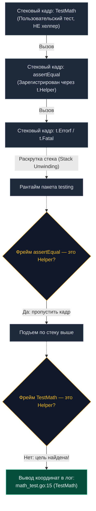

Повторное использование кода — один из краеугольных камней грамотной разработки. По мере эволюции и разрастания тестовой базы вы неизбежно начнете выносить однотипную инициализацию структур, генерацию тестовых пользователей или громоздкую валидацию сложных JSON-ответов в отдельные вспомогательные функции — **хелперы (Helpers)**.

Однако благородное стремление следовать принципу DRY (Don't Repeat Yourself) без понимания специфики рантайма Go моментально превращает отладку в мучение. При возникновении первой же ошибки раннер укажет вам не на упавший тестовый сценарий, а на внутреннюю строчку кода самого вспомогательного хелпера. Если этот хелпер вызывается из пятидесяти разных мест, локализация дефекта превращается в детективное расследование.

Для элегантного решения этой проблемы в Go 1.9 был внедрен метод `t.Helper()`. В этой главе мы препарируем механику его работы на уровне раскрутки стека вызовов, изучим взаимодействие с горутинами и освоим канонические паттерны проектирования тестовых утилит.

---

## Проблема навигации по ошибкам

Рассмотрим классическую ситуацию: мы написали лаконичную функцию для сравнения целых чисел, призванную сократить boilerplate:

```go
package math_test

import "testing"

// Вспомогательная функция (Helper)
func assertEqual(t *testing.T, got, want int) {
	if got != want {
		// Ошибка формируется ЗДЕСЬ (строка 9)
		t.Errorf("got %d, want %d", got, want) 
	}
}

func TestMath(t *testing.T) {
	assertEqual(t, 2+2, 5) // Место фактического вызова в тесте (строка 15)
}
```

Что отобразит терминал при провале проверки?

```text
--- FAIL: TestMath (0.00s)
    math_test.go:9: got 4, want 5
```

Тестовый раннер ссылается на **строку 9** — внутренность функции `assertEqual`. Если эта функция используется сотнями тестов по всему репозиторию, клик по строке ошибки в IDE бесполезен: вы попадете в общий хелпер, а не в падающий тестовый сценарий `TestMath`. Вам придется вручную копировать имя теста, искать его по кодовой базе и выяснять, с какими входными данными он упал.

---

## Решение: t.Helper()

Вызов метода `t.Helper()` регистрирует текущую функцию как вспомогательную. Он указывает механизму форматирования отчетов пакета `testing`, что данную функцию необходимо полностью игнорировать при вычислении координат места ошибки:

```go
func assertEqual(t *testing.T, got, want int) {
	t.Helper() // Маркируем функцию как технический хелпер
	if got != want {
		t.Errorf("got %d, want %d", got, want) 
	}
}
```

После добавления этой строки отчет преображается:

```text
--- FAIL: TestMath (0.00s)
    math_test.go:15: got 4, want 5
```

Теперь тулчейн безупречно указывает на **строку 15** — реальное место вызова в сценарии `TestMath`. Навигация в IDE и горячие клавиши перехода к ошибке снова работают мгновенно.

---

> [!info] Под капотом
> Какова физическая механика работы `t.Helper()` в памяти?  
> При вызове `t.Helper()` среда тестирования выполняет системный вызов `runtime.Callers(1, pc)` (или базовый `runtime.Callers`), извлекая Program Counter (PC — адрес инструкции в сегменте кода) вызывающей функции. Этот адрес регистрируется во внутренней хэш-таблице `map` объекта структуры `testing.T`.  
> 
> Когда вызывается метод фиксации ошибки `t.Errorf`, рантайм Go запускает процедуру **раскрутки стека (Stack Unwinding)**, последовательно исследуя цепочку стековых кадров (Call Frames). Для каждого кадра проверяется: входит ли его Program Counter в таблицу зарегистрированных хелперов?  
> Если адрес найден в списке, рантайм пропускает этот стековый кадр и поднимается на уровень выше, пока не встретит первый кадр пользовательского теста. Именно его имя файла и номер строки отправляются в отчет.



---

## Паттерны проектирования хелперов

### 1. Передача `*testing.T` первым аргументом

Непреложное правило консистенции в Go: любой вспомогательный хелпер, участвующий в тестировании, обязан принимать указатель `t *testing.T` в качестве своего первого аргумента. Это открывает хелперу доступ к логированию через `t.Log`, фатальным ошибкам `t.Fatal`, мягким проверкам `t.Error` и хукам очистки `t.Cleanup`.

---

### 2. Setup-хелперы с t.Cleanup()

Типичный антипаттерн, пришедший из других языков — возвращать функцию финализации (Teardown) из фабрики подготовки ресурсов:

```go
// АНТИПАТТЕРН: Перекладывание очистки на плечи вызывающего кода
func setupDatabase() (*sql.DB, func()) {
	db := connect()
	cleanup := func() { db.Close() }
	return db, cleanup
}

func TestBad(t *testing.T) {
	db, cleanup := setupDatabase()
	defer cleanup() // Программист обязательно забудет это написать!
	// ...
}
```

**Канонический подход Go:**
Внедряйте регистрацию очистки `t.Cleanup` непосредственно внутрь самого хелпера!

```go
// ИДИОМАТИЧНЫЙ ПОДХОД: Хелпер полностью автономен
func setupDatabase(t *testing.T) *sql.DB {
	t.Helper()
	
	db, err := sql.Open("postgres", "conn_string")
	if err != nil {
		t.Fatalf("Не удалось открыть подключение к БД: %v", err)
	}
	
	// Регистрация очистки прямо внутри вспомогательной функции:
	t.Cleanup(func() {
		_ = db.Close()
	})
	
	return db
}

func TestGood(t *testing.T) {
	// Предельная чистота: никаких defer, гарантированное освобождение ресурсов
	db := setupDatabase(t)
	// ...
}
```

Этот паттерн снимает когнитивную нагрузку и надежно защищает ресурсы при использовании конкурентных тестов `t.Parallel`.

---

### 3. Вложенные хелперы

Нередко в архитектуре проверок возникает композиция: один высокоуровневый хелпер вызывает несколько низкоуровневых.

> [!warning] Ловушка / Gotcha
> Вызов `t.Helper()` **не обладает свойством транзитивности**!  
> Если функция `createAdminUser` вызывает внутри себя `createBaseUser`, инструкция `t.Helper()` обязана присутствовать **в обеих функциях**.  
> Если вы забудете вызвать `t.Helper()` во внешней функции, алгоритм раскрутки стека остановится именно на ней, и строка ошибки в логах укажет на тело промежуточного хелпера, а не на сам сценарий `TestXxx`.

```go
func createBaseUser(t *testing.T) *User {
	t.Helper() // Обязательно на каждом уровне иерархии!
	return &User{Role: "user"}
}

func createAdminUser(t *testing.T) *User {
	t.Helper() // Обязательно, иначе стек остановится здесь!
	u := createBaseUser(t)
	u.Role = "admin"
	return u
}
```

---

## Хелперы и Горутины

Коварная архитектурная ловушка возникает при попытке использовать хелперы в многопоточном асинхронном коде:

```go
func startBackgroundWorker(t *testing.T) {
	t.Helper()
	
	go func() {
		// АРХИТЕКТУРНАЯ ОШИБКА: t.Helper здесь бессилен!
		if err := doWork(); err != nil {
			t.Errorf("фоновый воркер завершился ошибкой: %v", err)
		}
	}()
}
```

### Почему `t.Helper()` здесь не работает?
Вспомним модель памяти Go: каждая горутина (`go func`) аллоцирует собственный независимый сегмент стека (инициализируемый с 2 КБ).  
В стеке дочерней горутины **физически отсутствует** стековый фрейм функции `TestXxx`. Когда `t.Errorf` запускает раскрутку стека, он доходит до корня горутины и останавливается на анонимной функции `func()`. Он не способен перепрыгнуть в стек другой горутины операционной системы.  
Для обработки асинхронных сбоев хелперы обязаны возвращать ошибки в основной поток теста через каналы, где они будут обработаны детерминированно.

---

> [!tip] Собеседование
> **Вопрос:** Как устроена популярная библиотека `testify/assert` и почему вызов `assert.Equal(t, a, b)` выводит в терминал строчку из вашего теста, а не исходный код самого пакета `testify`?  
> **Ответ:** Каждая проверочная функция в пакете `testify/assert` первым делом вызывает метод `t.Helper()` у переданного объекта (соответствующего интерфейсу `TestingT`).  
> Благодаря этому при несовпадении значений стек раскручивается мимо исходников библиотеки в каталоге `GOPATH/pkg/mod/...`, точно указывая на строчку вашего сценария. Этот элегантный механизм рантайма Go сделал возможным расцвет сторонних библиотек ассертов.

---

## Итог

1. Метод `t.Helper()` маскирует служебные стековые кадры, возвращая разработчику точную навигацию по ошибкам.
2. Внутренний механизм опирается на `runtime.Callers`, сверяя Program Counter функций при генерации отчетов.
3. Канонические Setup-хелперы принимают `*testing.T` и регистрируют завершение через `t.Cleanup()`, избавляя тест от ненадежных `defer`.
4. Во вложенных цепочках хелперов вызов `t.Helper()` обязателен на каждом звене.
5. Из-за изоляции стеков горутин `t.Helper()` неприменим внутри асинхронных `go func`.

Работа со вспомогательными функциями часто требует создания тестовых файлов и конфигураций на диске. Ручное создание файлов в каталоге `/tmp` ведет к конфликтам между тестами. О том, как рантайм решает проблему временных файлов со скоростью оперативной памяти, читайте в следующей статье: [[8. Работа с временными файлами и t.TempDir]].