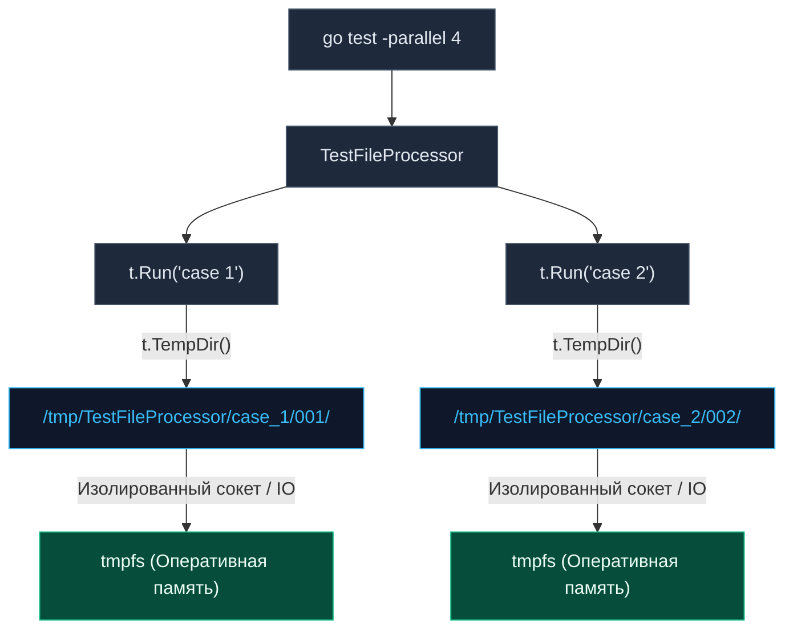

Программные компоненты бэкенда не существуют в стерильном вакууме: они считывают конфигурационные файлы, парсят CSV-таблицы, выгружают бинарные дампы и генерируют аналитические отчеты. В академических учебниках принято утверждать, что юнит-тесты ни при каких обстоятельствах не должны касаться дискового ввода-вывода (I/O). Однако в реальной инженерной практике файловая система нередко является неотъемлемой частью архитектурного контракта модуля.

До исторического релиза Go 1.15 работа с файлами в тестах напоминала хождение по минному полю. Разработчикам приходилось вручную генерировать случайные пути, перехватывать системные ошибки удаления и надеяться, что параллельные сценарии не повредят файлы друг друга. С появлением стандартного метода `t.TempDir()` управление временным дисковым пространством в Go стало эталоном надежности и простоты.

В этой главе мы препарируем устройство метода `t.TempDir()`, разберем его механическое взаимодействие с оперативной памятью ядра Linux и изучим тонкости кроссплатформенной файловой изоляции.

---

## Наследие прошлого: Как мы страдали раньше

Чтобы по-настоящему оценить изящество `t.TempDir()`, взглянем на типичный паттерн, применявшийся в легаси-кодовой базе до Go 1.15:

```go
package storage_test

import (
	"os"
	"path/filepath"
	"testing"
)

// АНТИПАТТЕРН: Ручное жонглирование временными директориями
func TestLegacyFileIO(t *testing.T) {
	// 1. Создаем временную директорию через вспомогательный вызов
	dir, err := os.MkdirTemp("", "mytest_*")
	if err != nil {
		t.Fatal(err)
	}
	
	// 2. Вручную регистрируем отложенную очистку через defer
	defer os.RemoveAll(dir) 

	// 3. Формируем путь к файлу
	filePath := filepath.Join(dir, "data.txt")
	
	// Непосредственная работа с файлом...
}
```

### Архитектурные дефекты старого подхода:
1. **Избыточный шум:** На каждый файловый тест приходится писать 5–7 строк монотонного бойлерплейта с проверками `err != nil`.
2. **Ловушка конкуренции с defer:** Как мы выяснили в главе [[7. Test isolation]], использование `defer` в тестах с иерархией `t.Run` и параллелизмом `t.Parallel()` катастрофично. Родительская функция выходит из стека и выполняет `os.RemoveAll(dir)` в тот момент, когда асинхронный дочерний подтест еще даже не начал читать файл!
3. **Утечки мусора в ОС:** Если при сложной интеграционной проверке происходит системный сбой или принудительный вызов `os.Exit`, отложенные инструкции `defer` не выполняются, и системный каталог `/tmp` стремительно забивается миллионами брошенных папок.

---

## Современный стандарт: t.TempDir()

Встроенный метод `t.TempDir()` (или `t.TempDir`) превращает всю эту рутину в лаконичный однострочник. Он создает уникальную изолированную папку для текущего теста и **автоматически** связывает ее жизненный цикл с внутренним хуком `t.Cleanup()`:

```go
func TestModernFileIO(t *testing.T) {
	// t.TempDir() возвращает абсолютный путь в виде строки без возврата error
	dir := t.TempDir() 
	
	filePath := filepath.Join(dir, "config.json")
	payload := []byte(`{"status": "ok"}`)
	
	err := os.WriteFile(filePath, payload, 0644)
	if err != nil {
		t.Fatalf("Ошибка записи тестового файла: %v", err)
	}

	// Читаем, проверяем assertion, завершаем работу.
	// Никаких defer! Каталог со всем содержимым будет гарантированно удален.
}
```

---

### Mechanical Sympathy: tmpfs и нулевой Disk I/O

Для Senior-разработчика принципиально понимать физический путь байтов при вызове `t.TempDir()`. Куда именно операционная система складывает эти файлы?

В современных дистрибутивах Linux и macOS системный каталог временных файлов (каталог `/tmp` в Linux или путь вида `/var/folders/...` в macOS) монтируется как специальная файловая система **`tmpfs`**.

> [!info] Под капотом
> Файловая система `tmpfs` физически не обращается к контроллеру накопителя (NVMe/SSD). Она целиком размещается в виртуальной памяти ядра Linux — в оперативной памяти (RAM) и системном кэше страниц (Page Cache).  
> 
> Это обеспечивает колоссальные преимущества при сборке:
> 1. **Нулевая аппаратная задержка (Zero Disk Latency):** Системный вызов записи `syscall write` сводится к быстрому копированию байтов из User Space в Page Cache ядра операционной системы на скорости шины DDR4/DDR5.
> 2. **Экономия ресурса SSD (Wear Leveling):** В крупных CI/CD раннерах ежедневно прогоняются десятки тысяч тестов, генерирующих гигабайты временных логов. Использование оперативной памяти через `tmpfs` полностью исключает износ твердотельных накопителей.
> 
> При удалении каталога ядро ОС просто мгновенно возвращает страницы памяти в пул доступных страниц без медленных операций перезаписи флеш-блоков.

---

## Архитектура: Изоляция параллельных тестов

Истинная мощь метода `t.TempDir()` проявляется в условиях многопоточного параллельного тестирования (`t.Parallel()`).

Каждый вызов `t.TempDir()` генерирует уникальное абсолютное имя каталога на диске. В это имя тулчейн автоматически внедряет **имя тестовой функции и вложенного подтеста**, очищенное от запрещенных спецсимволов, а также инкрементальный суррогатный суффикс.

Например, для подтеста `t.Run("valid data", ...)` сгенерированный путь в файловой системе будет иметь вид:  
`/tmp/TestParser/valid_data/001/`



Благодаря такой гранулярности сотни параллельных горутин могут одновременно создавать файлы со стандартным жестким именем вроде `config.yaml`, не опасаясь взаимного повреждения данных (Data Race) и коллизий на уровне диска.

---

## Ловушки и корнер-кейсы

Несмотря на кажущуюся элементарность, вокруг `t.TempDir()` существует несколько критически важных нюансов, о которых любят спрашивать на технических собеседованиях.

> [!warning] Ловушка / Gotcha: Блокировка файлов в Windows
> В POSIX-совместимых операционных системах (Linux и macOS) системный вызов `unlink` (и утилита `rm -rf`) без проблем удаляет дескриптор файла из каталога, даже если этот файл прямо сейчас открыт другим процессом на чтение или запись. Ядро удалит данные с диска, как только закроется последний файловый дескриптор.  
> В операционной системе Windows и ее файловой системе NTFS модель совершенно иная: открытый дескриптор файла накладывает обязательную эксклюзивную блокировку (Mandatory File Lock).  
> 
> Если ваш тестовый код открыл файл (`os.Open`), но забыл выполнить закрытие через `file.Close()` (или `defer file.Close()`), то на Linux тест завершится успешно. Но когда тот же самый репозиторий запустится в CI на агенте под управлением Windows, раннер в фазе финализации `Cleanup` попытается удалить временную папку, получит от ядра Windows отказ `Access is denied` и **аварийно провалит весь тест**, залогировав ошибку в фазе teardown.  
> **Инженерный закон:** всегда закрывайте файловые дескрипторы через `file.Close()`, даже если вы работаете с временными файлами.

---

> [!tip] Собеседование
> **Вопрос:** Мой тест, использующий `t.TempDir()`, упал с ошибкой assertion. Я хочу зайти в терминал и посмотреть, какие файлы там были сгенерированы. Но этой папки физически нет на диске! Куда она исчезла?  
> **Ответ:** Хуки `t.Cleanup()` в рантайме пакета `testing` вызываются **всегда и безусловно**, независимо от того, прошел тест успешно (PASS) или завершился падением (FAIL). Метод `t.TempDir()` добросовестно удаляет за собой песочницу в любой ситуации.  
> Если вам необходимо сохранить сгенерированные артефакты для последующего расследования, временно замените вызов `t.TempDir()` на ручной `os.MkdirTemp()` без регистрации удаления, либо подключите интерактивный отладчик Delve (`dlv`), установив точку останова перед завершением функции теста.

---

## Правильный DI с файловой системой

Как спроектировать архитектуру продуктового сервиса так, чтобы в бою он работал с реальными путями сервера, а в тестах — со стерильными временными папками?

Применяйте Dependency Injection на уровне базовых каталогов или используйте абстракцию `io/fs.FS`, появившуюся в Go 1.16:

```go
// Конструктор сервиса принимает базовый путь в качестве явной зависимости
func NewLogger(baseDir string) *Logger {
	return &Logger{
		filepath: filepath.Join(baseDir, "app.log"),
	}
}

func TestLogger(t *testing.T) {
	// В тестовом сценарии инжектируем изолированную временную папку:
	tmp := t.TempDir()
	logger := NewLogger(tmp)
	
	err := logger.Write("test log entry")
	if err != nil {
		t.Fatalf("Ошибка записи лога: %v", err)
	}
	// ... валидация содержимого ...
}
```

---

## Итог

1. `t.TempDir()` — современный канонический стандарт работы с файловой системой в тестах на Go.
2. Он устраняет громоздкий бойлерплейт и решает проблему преждевременного удаления директорий при работе с `t.Parallel()` и подтестами.
3. В среде Linux/macOS временные файлы размещаются в оперативной памяти (`tmpfs`), обеспечивая наносекундную скорость дискового ввода-вывода.
4. Обязательно закрывайте дескрипторы через `file.Close()`, защищая тесты от ошибок блокировок `Access is denied` на Windows-платформах.

Файловое пространство изолировано. Однако в микросервисах логика столь же часто зависит от переменных окружения операционной системы (токенов, ключей, портов). Как безопасно мутировать переменные окружения, не ломая параллельные тесты? Ответу на этот вопрос посвящена следующая глава: [[9. Environment variables в тестах]].