Любое зрелое бэкенд-приложение зависит от динамической конфигурации. Мы передаем учетные данные баз данных, токены авторизации, флаги фичей и уровни журналирования через переменные окружения операционной системы (Environment Variables). Методология двенадцати факторов (The Twelve-Factor App) возвела этот подход в абсолютный стандарт современной облачной разработки.

Однако в контексте автоматизированного тестирования переменные окружения — это волк в овечьей шкуре. С точки зрения архитектуры рантайма переменные среды представляют собой **разделяемое глобальное мутабельное состояние**, доступное абсолютно всем потокам и горутинам в рамках текущего процесса ОС. Попытка небрежно мутировать это состояние в конкурентных тестах мгновенно оборачивается плавающими багами и повреждением данных.

В этой главе мы препарируем устройство системных переменных окружения, разберем возможности метода `t.Setenv()`, поймем природу защитных паник в рантайме Go и сформулируем канонический архитектурный паттерн работы с конфигурацией.

---

## Анатомия переменных окружения

С точки зрения ядра операционной системы (Linux, macOS, Windows) окружение процесса — это массив указателей на нуль-терминированные строки формата `KEY=VALUE`. Этот массив формируется ядром при порождении процесса системным вызовом `execve` и копируется в адресное пространство процесса (User Space).

Когда в Go-коде вызываются стандартные функции `os.Getenv` или `os.Setenv`, они обращаются именно к этой общей области памяти. Системная операция записи `setenv` в стандарте C POSIX исторически не является потокобезопасной. Чтобы предотвратить аппаратные сбои (Segmentation Fault) при одновременном чтении и записи строк окружения из конкурирующих потоков, рантайм Go вынужден использовать глобальную блокировку `sync.RWMutex` внутри низкоуровневого пакета `syscall`.

---

## Наследие: Темные века до Go 1.17

До выхода Go 1.17 тестирование модулей, считывающих конфигурацию через `os.Getenv`, требовало громоздких и хрупких ручных манипуляций:

```go
package config_test

import (
	"os"
	"testing"
)

// АНТИПАТТЕРН: Ручное восстановление окружения (до Go 1.17)
func TestLegacyEnv(t *testing.T) {
	// 1. Запоминаем исходное состояние
	oldDBHost, exists := os.LookupEnv("DB_HOST")
	
	// 2. Мутируем окружение для текущего теста
	os.Setenv("DB_HOST", "localhost:5432")
	
	// 3. Пытаемся гарантировать возврат состояния через defer
	defer func() {
		if exists {
			os.Setenv("DB_HOST", oldDBHost)
		} else {
			os.Unsetenv("DB_HOST")
		}
	}()
	
	// Тестирование функции чтения конфигурации...
}
```

Этот паттерн не просто уродлив и загроможден бойлерплейтом — он опасен. Если разработчик допускал ошибку в блоке очистки, переменная `DB_HOST` оставалась равной `localhost:5432`, и все последующие независимые тесты пакета начинали ломиться в локальную базу данных, падая с таймаутами сети.

---

## Современный стандарт: t.Setenv()

Начиная с релиза Go 1.17, стандартная библиотека взяла управление окружением на себя. Метод `t.Setenv(key, value)` (или `t.Setenv`) решает задачу мутации в одну строчку с автоматической гарантией отката:

```go
func TestModernEnv(t *testing.T) {
	// t.Setenv автоматически фиксирует исходное значение
	// и регистрирует безусловный откат через t.Cleanup()
	t.Setenv("DB_HOST", "localhost:5432")
	
	host := os.Getenv("DB_HOST")
	if host != "localhost:5432" {
		t.Fatalf("Неожиданное значение хоста: %s", host)
	}
}
```

> [!info] Под капотом
> Как устроен метод `t.Setenv` изнутри?  
> При первом обращении структура `testing.T` запоминает первичное состояние целевой переменной и регистрирует функцию восстановления в стеке финализации `t.Cleanup()`.  
> 
> Более того, алгоритм учитывает цепочки перезаписи: если в рамках одного теста последовательно вызвать `t.Setenv("KEY", "A")`, а затем `t.Setenv("KEY", "B")`, в момент завершения теста рантайм восстановит то первоначальное состояние, которое существовало **до вызова "A"**, а не промежуточное "B". Это гарантирует абсолютную стерильность последующих тестов.

---

## Ловушка: t.Parallel() и t.Setenv()

А теперь исследуем границу между многопоточностью и глобальным состоянием. Что произойдет, если попытаться совместить распараллеливание тестов с подменой переменных среды?

```go
func TestConfigParallel(t *testing.T) {
	t.Parallel() // Запуск теста в конкурентной фазе
	t.Setenv("LOG_LEVEL", "DEBUG") // АРХИТЕКТУРНЫЙ КРАХ!
	// ...
}
```

> [!warning] Ловушка / Gotcha
> Попытка вызова `t.Setenv()` внутри теста, помеченного как `t.Parallel()`, немедленно прерывает выполнение фатальной паникой:  
> `panic: testing: t.Setenv called after t.Parallel`.
> 
> **Почему создатели Go пошли на такой бескомпромиссный шаг?**  
> Представьте, что рантайм разрешил бы одновременное изменение окружения. Тест A устанавливает флаг `LOG_LEVEL=DEBUG` (`DEBUG`), а параллельный Тест B на соседнем процессорном ядре выставляет `LOG_LEVEL=ERROR` (`ERROR`). Поскольку блок окружения `os.Environ` глобален для всего адресного пространства процесса ОС, Тест A считывает `ERROR` вместо ожидаемого `DEBUG` и завершается ложным сбоем.  
> Философия Go требует раннего падения (Fail Fast): лучше сразу уронить тест с однозначным диагностическим сообщением, чем обрекать инженеров на многочасовую ловлю мигающих багов в CI/CD пайплайнах.

---

## Архитектурный выход: Dependency Injection (DI)

Как же тогда тестировать сервисы конкурентно на всех доступных ядрах процессора?  
Фундаментальный ответ: **бизнес-логика вообще не должна знать о существовании вызова `os.Getenv`**!

Прямой вызов системных функций чтения окружения в глубине доменных сервисов — это антипаттерн скрытой зависимости (Hidden Dependency). Он намертво привязывает чистую бизнес-логику к состоянию операционной системы.

```mermaid
flowchart TD
    subgraph Bad["Плохой дизайн: Жесткая связность с ОС"]
        App1["Функция ProcessData()"] -->|"Прямой вызов os.Getenv('DB_HOST')"| OS["Таблица окружения ОС<br/>(Глобальное мутабельное состояние)"]
    end
    
    subgraph Good["Чистый дизайн: Внедрение зависимостей (DI)"]
        Main["main.go / пакет config"] -->|"Чтение os.Getenv 1 раз на старте"| Config["Типизированная структура Config"]
        Config -->|"Передача через конструктор"| App2["Функция ProcessData(cfg Config)"]
    end

    classDef bad fill:#7f1d1d,stroke:#f87171,stroke-width:1px,color:#fff;
    classDef good fill:#064e3b,stroke:#10b981,stroke-width:1px,color:#ecfdf5;
    classDef block fill:#1e293b,stroke:#475569,stroke-width:1px,color:#e2e8f0;

    class OS bad;
    class Config good;
    class App1,App2,Main block;
```



---

### Правильный паттерн работы с конфигурацией

1. **Единая точка сборки:** Переменные окружения парсятся ровно один раз при старте процесса в `main.go` или специализированном пакете `config`.
2. **Типизация данных:** Значения валидируются и преобразуются в типизированную структуру `Config` (с помощью проверенных библиотек вроде `envconfig` или `viper`).
3. **Внедрение через конструктор:** Созданный объект `cfg Config` передается компонентам как явная зависимость.

```go
package service

import "testing"

// 1. Строго типизированная конфигурация
type Config struct {
	DBHost   string
	LogLevel string
}

// 2. Бизнес-компонент зависит только от интерфейса или структуры данных
type Service struct {
	cfg Config
}

func NewService(cfg Config) *Service {
	return &Service{cfg: cfg}
}

func (s *Service) ConnectionString() string {
	return "postgres://" + s.cfg.DBHost
}

// 3. Тест становится предельно простым, изолированным и параллельным!
func TestService_ConnectionString(t *testing.T) {
	t.Parallel() // Полная безопасность при конкурентном прогоне!

	// Создаем тестовую конфигурацию локально на стеке горутины:
	testCfg := Config{
		DBHost:   "test-cluster:5432",
		LogLevel: "DEBUG",
	}

	svc := NewService(testCfg)
	got := svc.ConnectionString()
	want := "postgres://test-cluster:5432"

	if got != want {
		t.Fatalf("ConnectionString() = %s; want %s", got, want)
	}
}
```

---

> [!tip] Собеседование
> **Вопрос:** В чем заключается опасность паттерна с глобальной переменной `var Cfg *Config` по сравнению с явной передачей `cfg Config` в конструктор?  
> **Ответ:** Использование глобального указателя `var Cfg *Config` переносит проблему из системного блока окружения ОС в общую кучу памяти (Heap) рантайма Go.  
> Если параллельные тесты начнут одновременно модифицировать поля вроде `Cfg.DBHost`, в кодовой базе возникнет гонка данных в памяти. Инструмент `go test -race` немедленно зафиксирует Data Race.  
> Явная передача конфигурации (DI) позволяет каждому тесту формировать собственный независимый экземпляр `Config` на стеке, гарантируя 100% изоляцию и беспрепятственное масштабирование через `t.Parallel()`.

---

## Итог

1. Переменные окружения операционной системы представляют собой разделяемое глобальное состояние процесса, не предназначенное для частых конкурентных мутаций.
2. Для последовательных тестов метод `t.Setenv()` обеспечивает безопасную подмену значений с автоматическим возвратом исходного состояния через `t.Cleanup()`.
3. Комбинация `t.Setenv()` и `t.Parallel()` намеренно заблокирована рантаймом через вызов `panic`, предотвращая неуловимые гонки данных.
4. Профессиональный архитектурный стандарт: считывать окружение единожды на границе приложения и передавать параметры через Dependency Injection. Это освобождает тесты от зависимости от ОС и делает их полностью параллельными.

На этом мы завершаем фундаментальный цикл функционального тестирования в пакете `testing`. Мы изучили жизненный цикл тестов, табличный дизайн, изоляцию файлов, горутины и конфигурацию. Однако серверный Go обязан быть не просто корректным, но и молниеносно быстрым. Пришло время перейти к инструментам микрооптимизации и профилирования: [[10. Benchmark тесты]].