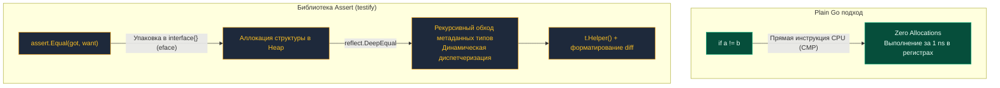

Разработчики, приходящие в Go из экосистем Java (JUnit), C# (NUnit), Python (pytest) или PHP (PHPUnit), испытывают настоящий мировоззренческий шок в первый же день знакомства с тестированием. Они инстинктивно ищут в стандартной библиотеке привычные функции вроде `assertEquals`, `assertTrue` или `assertThrows` — и с удивлением обнаруживают их полное отсутствие.

В Go «из коробки» нет никаких встроенных assertion-макросов. Вместо них язык предлагает писать тесты на том же самом чистом Go, используя обычные управляющие конструкции — условный оператор `if`, циклы `for`, бинарные операторы сравнения и явные вызовы `t.Errorf` или `t.Fatalf()`. Этот стиль в сообществе принято называть **Plain Go**.

В этой главе мы разберем философские мотивы создателей Go, препарируем устройство assertion-библиотек под капотом, оценим накладные расходы рантайм-рефлексии на уровне микроархитектуры и определим границы применимости обоих подходов.

---

## Философия Plain Go: Почему в стандартной библиотеке нет assert?

Создатели языка (Роб Пайк, Кен Томпсон) осознанно отвергли концепцию встроенных assertion-библиотек. Их аргументация базируется на строгих инженерных принципах Bell Labs:

1. **Отказ от специализированных псевдоязыков (DSL):** Сторонние assertion-фреймворки со временем неизбежно мутируют в громоздкие предметно-ориентированные диалекты вроде `assert.That(x).IsEqualTo(y).And().IsNotNull()`. Программисту приходится тратить умственные ресурсы на изучение синтаксического сахара вместо сути теста. В Go действует закон: *если вы умеете программировать на Go, вы уже умеете писать тесты на Go*.
2. **Ошибки как обычные значения (Errors are values):** Этот принцип пронизывает всю архитектуру Go. Если функция возвращает ошибку, она проверяется явным условием `if err != nil`. Тестовый код не должен становиться исключением из правил языка.
3. **Осознанный диагностический контекст:** Автоматический `assert.Equal` при сбое обычно выводит бездушную сухую констатацию факта: `Expected 4, got 5`. При использовании `t.Errorf` разработчик формулирует осмысленное инженерное сообщение, объясняющее бизнесовый контекст ошибки и причины расхождения.

---

### Как выглядит Plain Go подход

Взглянем на эталонный тест, написанный в строгом стиле Plain Go:

```go
package discount_test

import (
	"testing"
)

func TestCalculateDiscount_PlainGo(t *testing.T) {
	got, err := CalculateDiscount(100, "PROMO20")
	
	// Явная и прозрачная обработка ошибки
	if err != nil {
		t.Fatalf("непредвиденная ошибка при расчете скидки: %v", err)
	}
	
	want := 80.0
	// Прямое сравнение значений через стандартный оператор
	if got != want {
		t.Errorf("CalculateDiscount(100, PROMO20) = %f; want %f", got, want)
	}
}
```

Код кристально прозрачен, типизирован на этапе компиляции и выполняется со скоростью света. На уровне ассемблера процессор выполняет прямые аппаратные инструкции сравнения регистров (например, машинную инструкцию `CMP` на архитектуре x86-64 или ARM64).

---

## Появление Assert-подхода

Несмотря на чистоту философии Plain Go, коммерческая бэкенд-разработка диктует свои условия. Когда требуется протестировать комплексную структуру или сложный JSON-ответ из 25 полей, написание проверок в стиле Plain Go превращается в изнурительную рутину:

```go
if got.Field != want.Field { ... }
```

Десятки строк однотипного кода рассеивают внимание инженера. Ответом сообщества стало создание сторонних библиотек ассертов, безоговорочным лидером среди которых стала библиотека `testify` (пакеты `assert` и `require`).

---

### Как выглядит Assert подход

```go
package discount_test

import (
	"testing"

	"github.com/stretchr/testify/assert"
	"github.com/stretchr/testify/require"
)

func TestCalculateDiscount_Assert(t *testing.T) {
	got, err := CalculateDiscount(100, "PROMO20")
	
	// require немедленно останавливает тест при ошибке (эквивалент t.Fatalf)
	require.NoError(t, err, "расчет скидки не должен возвращать ошибку")
	
	// assert фиксирует расхождение и продолжает тест (эквивалент t.Errorf)
	assert.Equal(t, 80.0, got, "размер скидки должен быть рассчитан корректно")
}
```

Тест становится вдвое компактнее, читаясь как декларативное предложение на английском языке. Однако за эту визуальную краткость приходится платить вычислительными абстракциями.

---

> [!tip] Собеседование
> **Вопрос:** В чем заключается фундаментальная разница между пакетами `assert` и `require` в библиотеке `testify`?  
> **Ответ:** При несовпадении условий функции пакета `assert` вызывают `t.Errorf()`: тест помечается как проваленный, но выполнение текущей горутины продолжается.  
> Функции пакета `require` вызывают метод `t.Fatalf()`, который через системную функцию `runtime.Goexit()` немедленно прерывает выполнение текущего сценария.  
> **Правило безопасности:** Если вы проверяете указатель на валидность или результат подключения к базе данных, **всегда** используйте `require` (например, `require.NoError`). Если пропустить ошибку и продолжить тест с `assert`, последующее обращение к полям приведет к панике: `panic: nil pointer dereference`.

---

## Mechanical Sympathy: Цена рефлексии

Чтобы универсальная функция `assert.Equal` могла сравнивать аргументы любых типов — от примитивного `int` до вложенных срезов, ассоциативных массивов `map` и сложных структур — создатели библиотек опираются на механизм **рефлексии (Reflection)** через пакет `reflect` и вызов `reflect.DeepEqual`.

> [!info] Под капотом
> Что в действительности происходит в рантайме при вызове `assert.Equal(t, a, b)`?
> 1. Аргументы `got` и `want` упаковываются в пустые интерфейсы `interface{}`.
> 2. Компилятор не может доказать ограниченность времени жизни этих параметров через Escape Analysis, в результате чего они **неизбежно аллоцируются в динамической памяти (Heap)**.
> 3. Рантайм распаковывает 16-байтную структуру интерфейса (`eface`), считывая дескриптор типа и указатель на данные.
> 4. Функция `reflect.DeepEqual` рекурсивно обходит поля, выполняя динамические проверки типов (Type Assertions) для каждого элемента.

Сравним вычислительную стоимость:
* **Plain Go `a == b`:** Исполняется за **~1 наносекунду**. Ноль аллокаций. Данные остаются в регистрах CPU или кэше L1.
* **`assert.Equal(t, a, b)`:** Исполняется за **сотни наносекунд или микросекунды**, порождает множественные аллокации в куче и нагружает Garbage Collector.



---

### Важно ли это для тестов?

Для 99% интеграционных и функциональных тестов эта разница **абсолютно несущественна**. Если тест обращается к СУБД или делает сетевой запрос, операция занимает миллисекунды (тысячи микросекунд). Несколько микросекунд, потраченных на рефлексию `assert.Equal`, теряются в статистической погрешности сети. Экономия времени разработчика и читаемость кода многократно перевешивают затраты CPU.

> [!warning] Ловушка / Gotcha
> Единственное место, где применение assertion-библиотек **категорически недопустимо** — это адаптивный цикл `b.N` внутри **Benchmark-тестов** (см. главу [[10. Benchmark тесты]]).  
> Если вы вызовете `assert.Equal` внутри цикла бенчмарка, вы будете измерять не скорость вашего сервиса, а накладные расходы пакета `reflect` и аллокации интерфейсов `eface`. В бенчмарках применяйте исключительно чистый Plain Go.

---

## Анатомия правильного Assert-хелпера

Если вам требуется написать собственный специализированный хелпер валидации для предметной области, объединяющий типобезопасность Plain Go с компактностью ассертов, используйте дженерики Go 1.18+ и метод `t.Helper()` (см. [[7. Helper функции и t.Helper]]):

```go
// Идиоматичный доменный валидатор на дженериках
func AssertValidEntity[T any](t *testing.T, entity T, isValid bool) {
	t.Helper() // Обязательно исключаем хелпер из трассировки стека ошибок!
	
	if !isValid {
		t.Errorf("сущность типа %T не прошла валидацию инвариантов", entity)
	}
}
```

Параметризация через `[T any]` предотвращает избыточное боксирование в `interface{}`, сохраняя строгую типизацию на этапе компиляции.

---

## Итог

1. **Plain Go** — эталонный идиоматичный стиль Go. Он отвергает тяжеловесные DSL, трактует проверки как обычный код и работает с максимальной наносекундной скоростью без аллокаций памяти.
2. **Assert-библиотеки (`testify`)** — признанный промышленный стандарт для сокращения бойлерплейта при валидации сложных доменных моделей.
3. В промышленном бэкенде принят сбалансированный гибридный подход: критические предусловия (проверки ошибок) отсекаются через `require.NoError`, а сопоставление полей сущностей производится через `assert.Equal`.
4. В нагрузочных микро-бенчмарках использование сторонних ассертов строго запрещено из-за искажения замеров рефлексией.

Поскольку библиотека `testify` де-факто стала вторым стандартным тестовым пакетом в Go, мы обязаны детально разобрать ее архитектуру и тонкости практического применения. Переходим к следующей главе: [[2. Testify. assert и require]].