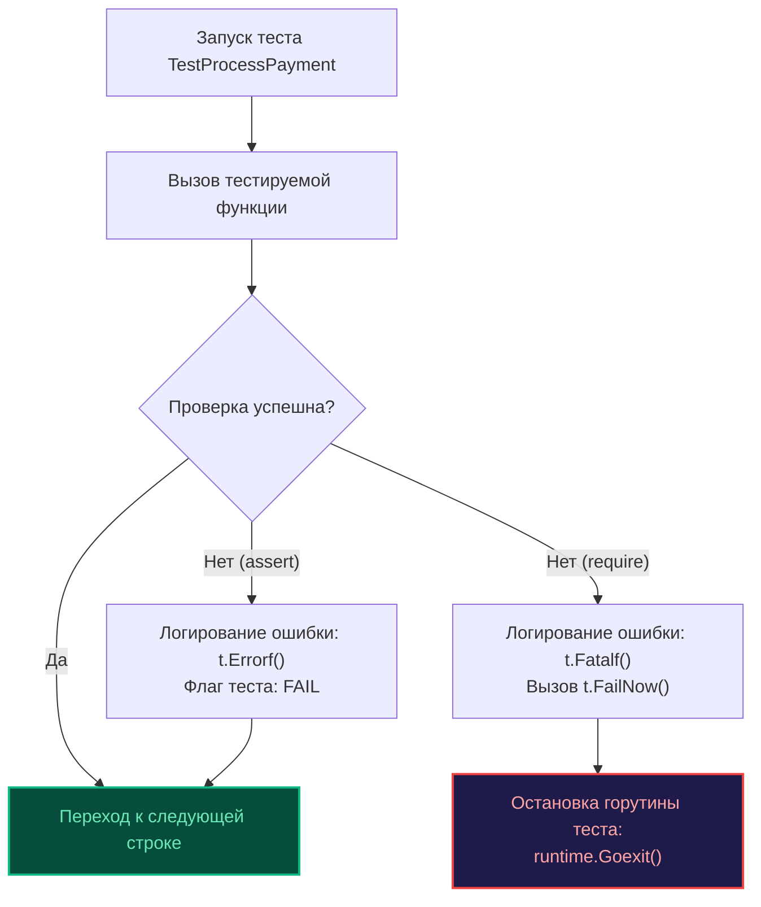
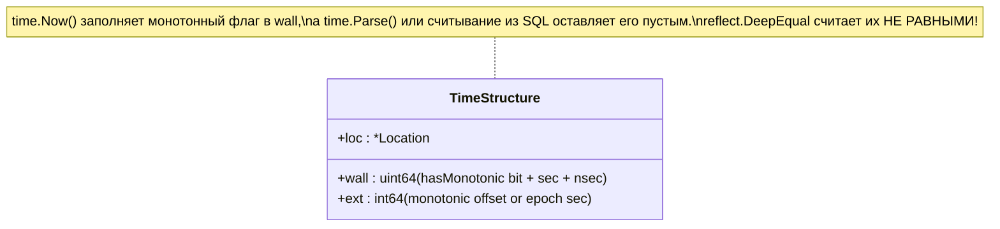

В предыдущей главе [[1. Assert подход vs plain Go]] мы наблюдали за классическим спором отцов-основателей языка и практиков коммерческой разработки. Создатели Go стремились к кристальной ясности обычного императивного кода, но суровая реальность микросервисов и сотен сущностей продиктовала свои условия: де-факто стандартом индустрии стала библиотека `github.com/stretchr/testify`. Сегодня вы встретите `testify` почти в 95% промышленных репозиториев на Go.

Библиотека разделена на два фундаментальных пакета: `assert` и `require`. На первый взгляд они кажутся близнецами, предоставляющими идентичные сигнатуры проверок. Однако непонимание различий в их поведении на уровне рантайма и планировщика горутин — одна из главных причин «мигающих» (flaky) тестов, скрытых багов и падений CI-пайплайнов с загадочными паниками.

В этой главе мы разберем, как гармонично сочетать `assert` и `require`, заглянем под капот рефлексии `reflect.DeepEqual`, выясним цену пустых интерфейсов `interface{}` и научимся обходить коварные ловушки монотонных таймеров.

---

## Фундаментальная разница: assert vs require

Оба пакета предлагают зеркальный интерфейс: функции `Equal`, `NotNil`, `NoError`, `Contains` и десятки других. Принципиальная разница заключается лишь в одном: **что именно происходит с горутиной теста в тот момент, когда условие не выполняется**.

### Пакет assert (Мягкая проверка)

Функции из пакета `assert` вызывают под капотом `t.Errorf()`. 

Когда условие ложно, `assert` форматирует диагностическое сообщение, записывает его во внутренний буфер тестовой структуры `t` и выставляет внутренний флаг `failed = true`. Тест гарантированно помечается статусом `FAIL`, но **выполнение текущей горутины продолжается без остановки**.

**Когда использовать:** Для валидации группы независимых атрибутов одной сущности. Если вы тестируете сериализацию DTO или ответ HTTP-обработчика, вам выгодно увидеть *все* несовпадения за один прогон теста (неправильный статус, опечатка в заголовке, неверный ID), а не исправлять их по одному, перезапуская медленный CI-пайплайн двадцать раз подряд.

### Пакет require (Жесткая проверка)

Функции из пакета `require` вызывают под капотом `t.Fatalf()`, которая внутри делегирует управление `runtime.Goexit()`.

Если проверка не проходит, `require` логирует ошибку и вызывает аварийный останов текущей горутины. Тест **немедленно прерывается**. Ни одна последующая инструкция в этом тесте выполнена не будет (хотя выполнится стек отложенных вызовов `defer`).

**Когда использовать:** Для проверки *предусловий* (preconditions). Если конструктор сервиса вернул ошибку или сетевой клиент не смог подключиться к базе данных, нет ни малейшего смысла проверять поля полученного объекта: там гарантированно лежит `nil`, и дальнейшее выполнение неминуемо приведет к `panic: nil pointer dereference`.



---

## Золотой стандарт: Паттерн "Require -> Assert"

Опытные инженеры никогда не выбирают между `assert` и `require` по принципу «что первым подвернулось под руку». Они выстраивают строгий двухфазный конвейер верификации.

```go
package payment_test

import (
	"testing"

	"github.com/stretchr/testify/assert"
	"github.com/stretchr/testify/require"
)

func TestProcessPayment(t *testing.T) {
	result, err := ProcessPayment(100.0)

	// 1. ПРЕДУСЛОВИЕ (Require)
	// Если err != nil, тест обязан остановиться немедленно.
	// Мы защищаем последующий код от обращения по нулевому указателю.
	require.NoError(t, err, "payment processing must not fail")
	require.NotNil(t, result, "result must not be nil")

	// 2. БИЗНЕС-ПРОВЕРКИ (Assert)
	// Если Status не совпал, мы всё равно хотим проверить Amount.
	// В консоли отобразится исчерпывающий отчет по всем несовпавшим полям.
	assert.Equal(t, "SUCCESS", result.Status)
	assert.Equal(t, 100.0, result.Amount)
}
```

> [!warning] Ловушка / Gotcha
> Самая распространенная ошибка новичков — беспечный вызов `assert.NoError(t, err)`.
> ```go
> user, err := GetUser(id)
> assert.NoError(t, err)              // Ошибка залогирована, но тест идет дальше!
> assert.Equal(t, "admin", user.Role) // Бабах! Разъыменование nil: user == nil
> ```
> При сбое базы данных CI выбросит не вразумительный дифф ошибки, а страшный `panic: nil pointer dereference` (или `panic: runtime error: invalid memory address or nil pointer dereference`) с портянкой системного трейса рантайма. Диагностика превращается в детектив. 
> 
> **Железное правило:** Всё, что возвращает интерфейс `error` или потенциально нулевой указатель, в обязательном порядке проверяется через `require.NoError` и `require.NotNil`.

---

## Мощный арсенал Testify

Библиотека `testify` приобрела колоссальную популярность не только благодаря сокращению многословных проверок, но и за счет богатого инструментария, закрывающего типичные боли бэкенд-разработки.

### 1. ErrorIs и ErrorAs

Начиная с Go 1.13, ошибки объединяются в цепочки (error wrapping). Обычный `assert.Equal` бессилен, если ошибка обернута через `fmt.Errorf("wrap: %w", err)`. Сравнение указателей или строковых представлений завершится провалом.

Используйте специализированный хелпер `require.ErrorIs(t, err, targetErr)` — под капотом он разворачивает всю цепочку через стандартный `errors.Is`.

### 2. ElementsMatch (Слайсы без учета порядка)

Если хранилище данных или многопоточный воркер возвращает срез элементов, порядок которых недетерминирован (например, выборка ключей из конкурентной `sync.Map` или запрос `SELECT` в PostgreSQL без явного `ORDER BY`), обычный `assert.Equal` превратит ваш CI в генератор ложноположительных срабатываний.

Функция `assert.ElementsMatch(t, wantSlice, gotSlice)` проверяет, что оба слайса содержат строго одинаковый мультимножественный состав элементов с равной частотой встречаемости, полностью игнорируя их взаимный порядок.

### 3. Eventually (Асинхронные тесты)

Тестирование моделей согласованности в конечном счете (eventual consistency) — суровое испытание для нервной системы разработчика. Если после публикации события в Kafka база данных реплицирует запись «где-то в течение 50–200 мс», наивный вызов `time.Sleep` приведет либо к медленным тестам, либо к их периодическим падениям на нагруженном CI-раннере.

Метод `require.Eventually` непрерывно опрашивает предикат с заданным интервалом до истечения общего таймаута:

```go
// require.Eventually опрашивает условие каждые 10 мс на протяжении 1 секунды
require.Eventually(t, func() bool {
	user := db.GetUser(id)
	return user != nil && user.Status == "ACTIVE"
}, 1*time.Second, 10*time.Millisecond, "user should become active asynchronously")
```

Как только предикат возвращает `true`, тест мгновенно продолжает исполнение, не сжигая лишние миллисекунды процессорного времени.

---

## Mechanical Sympathy: Что под капотом Equal?

Чтобы осознанно применять `assert.Equal`, инженер обязан понимать, какую цену платит процессор и сборщик мусора за универсальность ее сигнатуры:

```go
func Equal(t TestingT, expected, actual interface{}, msgAndArgs ...interface{}) bool
```

> [!info] Под капотом
> 1. **Escape Analysis и аллокации:** Поскольку параметры `expected` и `actual` принимают `interface{}` (в современном Go — псевдоним `any`), компилятор выполняет операцию упаковки (boxing). Любые примитивные типы или структуры вынужденно утекают на кучу (Heap allocation). По этой причине `testify` категорически неприменим внутри высоконагруженных микробенчмарков (`testing.B`).
> 2. **Динамическая типизация вместо статической:** Компилятор не остановит вас, если вы напишете `assert.Equal(t, int64(5), int32(5))`. Код успешно соберется, однако тест **упадет в рантайме**. Рефлексивный механизм `testify` требует строгого совпадения типов.
> 3. **Тяжеловесный обход структур:** Внутри пакета `testify/assert` вызывается модифицированный алгоритм `reflect.DeepEqual`. Механизм рефлексии рекурсивно инспектирует каждое поле структуры, включая приватные (неэкспортируемые).

### Проблемы с unexported полями и time.Time

Рефлексивное сканирование оперативной памяти таит в себе две классические ловушки, на которых спотыкаются целые команды.

**Ловушка 1: Функциональные типы внутри структур.**  
Если ваша структура содержит поле первого класса вроде `Callback func()`, рефлексивный вызов `assert.Equal` завершится фатальной паникой. В Go функции являются непрозрачными указателями на код, и рантайм запрещает их прямое сравнение на равенство (допустимо лишь сравнение с `nil`).

**Ловушка 2: Монотонные часы в `time.Time`.**  
Структура `time.Time` спроектирована изощренно: она содержит внутренние приватные поля `wall` (uint64) и `ext` (int64). Поле `wall` хранит не только показания настенных часов, но и показания монотонного таймера операционной системы.  
Если одна переменная времени была получена через `time.Now()`, а вторая — десериализована из JSON или считана из базы данных, их человекочитаемые даты будут абсолютно идентичны, однако побайтовое сравнение в `reflect.DeepEqual` провалится из-за несовпадения битов монотонного флага в полях `wall` и `ext`.



**Инженерные решения для времени:**
1. Обнулить показания монотонного таймера перед валидацией: `t = t.Truncate(0)`.
2. Использовать специализированную функцию testify: `assert.WithinDuration(t, expectedTime, actualTime, 0)`.

> [!tip] Собеседование
> **Вопрос:** Библиотека `testify/assert` удобна, но какой инструмент рекомендуют создатели Go для глубокого и строгого сравнения сложных вложенных структур, когда `testify` генерирует нечитаемые простыни текста?  
> **Ответ:** Золотым стандартом для комплексного сравнения является библиотека от авторов языка `github.com/google/go-cmp/cmp`. В отличие от всеядного `testify`, функция `cmp.Equal` по умолчанию паникует, если встречает структуры с неэкспортируемыми полями, принуждая разработчика явно декларировать правила сравнения (через опции `cmp.AllowUnexported` или кастомные компараторы `cmp.Comparer`). Кроме того, `cmp.Diff` выводит эталонный ANSI-дифф в стиле утилиты `git diff`, локализуя различие вплоть до конкретного байта.

---

## Объекты Assert и Require (Оптимизация бойлерплейта)

Когда сценарий тестирования насчитывает десятки последовательных проверок, постоянная передача дескриптора `t` в каждый вызов начинает визуально засорять код. `testify` позволяет элегантно инкапсулировать тестовый контекст:

```go
func TestWithObjects(t *testing.T) {
	// Инициализируем объекты assertions, привязанные к текущему t
	as := assert.New(t)
	req := require.New(t)

	result, err := Process()

	// Код становится лаконичным и выразительным
	req.NoError(err)
	as.Equal("OK", result.Status)
	as.Len(result.Items, 5)
}
```

Этот прием особенно эффективен при написании переиспользуемых функций-хелперов (в комбинации с `t.Helper()`), делая сигнатуры тестов компактными и сосредоточенными на предметной области.

---

## Итог

1. **`assert`** регистрирует сбой через `t.Errorf()` и сохраняет поток исполнения — идеален для сбора полной картины несоответствий в бизнес-полях.
2. **`require`** моментально обрывает горутину теста вызовом `t.Fatalf()` и `Goexit()` — незаменим для инвариантов, валидации ошибок и проверки указателей на `nil`.
3. Золотой стандарт построения тестов — паттерн «Сначала строгий `require.NoError`, затем серия мягких `assert.Equal`».
4. Помните об архитектурной цене рефлексии: параметры упаковываются в `interface{}`, вызывая аллокации на куче и перенося валидацию типов данных со стадии компиляции в рантайм.
5. При сравнении временных меток и неупорядоченных срезов используйте специализированные методы `WithinDuration` и `ElementsMatch`, нейтрализующие скрытые эффекты полей `wall`/`ext` в `time.Time`.

Когда проверка не проходит, `assert` выводит диагностическое сообщение в терминал. Но если разработчик не позаботился об информативности, поиск первопричины аварии в CI превращается в изнурительную охоту на ведьм. О том, как формулировать сообщения об ошибках с инженерным изяществом, мы поговорим в следующей главе: [[3. Грамотные сообщения об ошибках]].