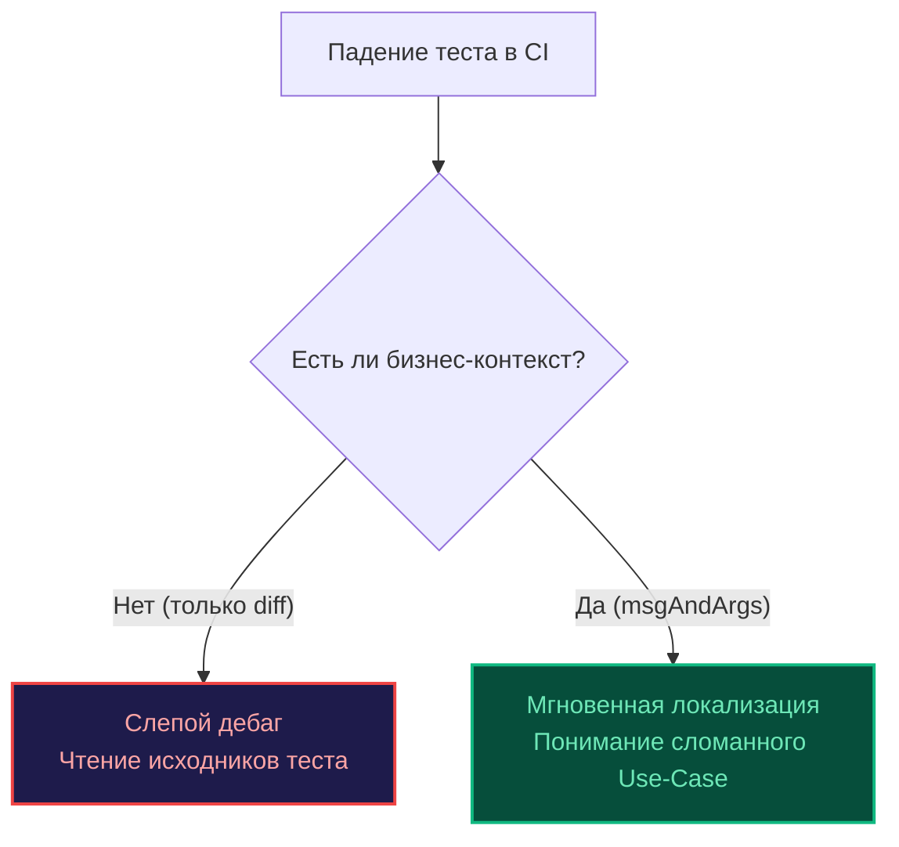

Представьте типичную драму из жизни бэкенд-инженера: вечер пятницы, 23:00. Вы находитесь вдали от рабочего ноутбука, и дежурный инженер сообщает, что критический хотфикс блокирован в CI-пайплайне из-за одного упавшего теста из пяти тысяч. Вы открываете интерфейс GitLab или GitHub Actions со смартфона и обнаруживаете лаконичный лог:

```text
--- FAIL: TestProcessPayment (0.01s)
    payment_test.go:42: Expected true, but got false
```

Что именно ожидалось `true`? Что оказалось `false`? Какой идентификатор платежа спровоцировал отказ? В каком состоянии находился баланс счета? 

Чтобы восстановить картину, вам придется судорожно искать Wi-Fi, клонировать ветку, открывать IDE, вычитывать строку 42 и запускать локальный отладчик. Вы потеряли полчаса там, где могли исправить конфигурацию за тридцать секунд.

В предыдущих главах ([[1. Assert подход vs plain Go]] и [[2. Testify. assert и require]]) мы подробно изучали синтаксис и механику проверок. В этой главе мы сосредоточимся на их семантике и культуре. Грамотное диагностическое сообщение — это единственный пользовательский интерфейс вашего теста, когда он исполняется в изолированном контейнере CI-раннера без графического интерфейса и отладчика.

---

## Золотой стандарт Go: "got / want"

В стандартной библиотеке Go десятилетиями полировался негласный, но фундаментальный стандарт формулирования тестовых сообщений. Он называется парадигмой **got / want** (что получилось фактически / что ожидалось по контракту).

**Классические антипаттерны (как писать нельзя):**
* `t.Errorf("User name is wrong")` — ни ожидаемого эталона, ни полученного значения; читателю логов придется лезть в базу данных или код.
* `t.Errorf("Mismatch. Expected %d, actual %d", a, b)` — инвертированный порядок аргументов, лишний визуальный шум.

**Идиоматичный подход сообщества:**

```go
if got != want {
	// Канонический шаблон:
	// [Вызов функции с аргументами] = [got], want [want]
	t.Errorf("CalculateDiscount(%f) = %f; want %f", input, got, want)
}
```

Этот шаблон мгновенно распознается человеческим зрением. Когда дежурный инженер пролистывает мегабайты логов сборки, его зрительная кора функционирует подобно лексическому анализатору: она ищет устойчивый паттерн `got X, want Y`. Не заставляйте мозг коллег спотыкаться о причудливые авторские конструкции.

---

## Искусство форматирования: Глаголы пакета fmt

Основным инструментом визуализации расхождений служит стандартный пакет `fmt`. Подавляющее большинство программистов по инерции используют спецификатор `%v` (значение по умолчанию) для вывода любых переменных. На практике это порождает опасные «слепые пятна».

### Проблема пробелов и невидимых символов

Рассмотрим простую функцию очистки пользовательского ввода:

```go
got := strings.TrimSpace(" admin ")
want := "admin"
if got != want { // Допустим, функция содержит ошибку и вернула "admin "
	t.Errorf("TrimSpace() = %v, want %v", got, want)
}
```

В консоли CI вы увидите практически неотличимые фрагменты:
`TrimSpace() = admin , want admin`

Заметить хвостовой пробел или неразрывный символ (`\u00a0`) на экране смартфона или терминала практически невозможно.

> [!tip] Собеседование
> **Вопрос:** Какой глагол пакета `fmt` является обязательным стандартом при сравнении строковых значений в тестах Go?  
> **Ответ:** Необходимо использовать спецификатор `%q` (quoted string). Он обрамляет строку в двойные кавычки и автоматически экранирует непечатаемые спецсимволы (`\t`, `\n`, `\r`, `\x00`). Вывод превращается в абсолютно очевидную улику:
> `TrimSpace() = "admin ", want "admin"`
> 
> А для структур, числовых интерфейсов и сложных типов наилучшим выбором является спецификатор **`%#v`** (Go-syntax representation). Он выводит не только значения полей, но и точные имена типов, мгновенно выявляя тонкие баги несоответствия разрядности вроде `got int64(42), want int32(42)`.

### Вывод структур: `%+v` vs `%#v`

Если вы передадите структуру в `%v`, функция выведет лишь безымянную последовательность значений: `{42 admin@mail.com true}`. Какое поле означает `true` — `IsActive`, `IsVerified` или `IsBlocked`? Разобрать невозможно.

* Спецификатор `%+v` выводит имена полей структуры: `{ID:42 Email:admin@mail.com IsActive:true}`.
* Спецификатор `%#v` выводит полное имя пакета и типа вместе с синтаксисом создания Go: `user.Profile{ID:42, Email:"admin@mail.com", IsActive:true}`.

---

## Контекст в табличных тестах

Как мы подробно разбирали в материале [[4. Table driven tests]], единое тело тестовой логики многократно прогоняется по массиву тестовых случаев. Если одна из итераций дает сбой, лог обязан однозначно идентифицировать входные параметры конкретного тест-кейса.

```go
for _, tt := range tests {
	t.Run(tt.name, func(t *testing.T) {
		got, err := Process(tt.input)
		if err != nil {
			// Имя тест-кейса tt.name выводится благодаря t.Run,
			// однако вывод входного параметра tt.input делает диагностику мгновенной.
			t.Fatalf("Process(%#v) unexpected error: %v", tt.input, err)
		}
		if got != tt.want {
			t.Errorf("Process(%#v) = %#v, want %#v", tt.input, got, tt.want)
		}
	})
}
```

Благодаря связке `t.Run(tt.name, ...)` и детальным спецификаторам, в логах CI появится безупречная иерархическая запись:
```text
--- FAIL: TestProcess/admin_user (0.00s)
    process_test.go:45: Process(User{ID:1}) = "denied", want "allowed"
```

---

## Сообщения в Testify

Популярная библиотека `testify` (пакеты `assert` и `require`) умеет автоматически генерировать визуальный дифф для несовпадающих значений. Однако когда проверка терпит крушение внутри цикла или вспомогательной функции, одного сухого диффа недостаточно: необходим доменный бизнес-контекст.

Каждая assertion-функция принимает опциональный вариативный аргумент `msgAndArgs ...interface{}` в конце своей сигнатуры.

**Плохо (сухой diff без понимания цели):**
```go
// При сбое отобразится разница значений, но сценарий останется загадкой
assert.Equal(t, tt.want, got) 
```

**Отлично (инженерный промышленный стандарт):**
```go
// В лог передается бизнес-сценарий и ключевые параметры
assert.Equal(t, tt.want, got, "failed to apply discount logic for user role %q and cart total %d", tt.role, tt.total)
```



---

## Борьба с гигантскими структурами: cmp.Diff

При тестировании сложных доменных сущностей, деревьев графов или объемных ответов внешних API стандартный вывод `t.Errorf` (и даже базовый отчет `testify`) превращается в нечитаемую простыню на сотни строк, в которой невозможно визуально зацепиться за изменившееся поле.

> [!info] Под капотом
> Для прецизионного анализа глубоких структур эталоном в Go является библиотека `github.com/google/go-cmp/cmp`. 
> В отличие от грубой рефлексии, пакет `cmp` выстраивает структурный дифференциал объектов, поддерживает строгую фильтрацию неэкспортируемых полей, позволяет задавать пользовательские преобразования (например, допуск для `float64` или игнорирование динамических меток времени `time.Time`).

```go
import "github.com/google/go-cmp/cmp"

func TestComplexGraph(t *testing.T) {
	got := GetComplexGraph()
	want := ExpectedGraph()

	// cmp.Diff возвращает пустую строку, если объекты семантически эквивалентны
	if diff := cmp.Diff(want, got); diff != "" {
		// Канонический заголовок (-want +got) сообщает, как читать дифф
		t.Errorf("GetComplexGraph() mismatch (-want +got):\n%s", diff)
	}
}
```

Вывод функции `cmp.Diff` оформлен в каноническом формате объединенного diff в стиле Git:
- Символ `-` маркирует поля, которые присутствовали в эталоне `want`, но отсутствуют либо изменились в `got`.
- Символ `+` наглядно подсвечивает то, что фактически вернул тестируемый код в `got`.

Инженер за полторы секунды видит конкретную строку структуры, давшую сбой, экономя колоссальное количество времени и душевных сил.

---

## Ловушка многострочных строк (Multiline strings)

Когда ваш код генерирует сложные текстовые документы — SQL-миграции, конфигурации YAML, HTML-шаблоны или форматированные Markdown-отчеты, наивная попытка сравнить их через `if got != want` или `assert.Equal` превращает отладку в пытку.

> [!warning] Ловушка / Gotcha
> Никогда не вшивайте гигантские многострочные строковые литералы (через обратные кавычки ` ` `) непосредственно в тело тестовых файлов.
> 1. **Засорение исходников:** Тестовый файл мгновенно раздувается на тысячи строк, скрывая логику сценария.
> 2. **Проблема переводов строк между ОС:** Разные операционные системы и текстовые редакторы по-разному работают с разделителями строк. Windows использует пару символов возврата каретки и перевода строки `\r\n` (CRLF), тогда как Linux и macOS применяют одиночный символ `\n` (LF). В результате тест будет идеально проходить на рабочей станции разработчика, но стабильно падать в CI-контейнере из-за невидимых байтов `\r`.

Для верификации массивных текстовых документов, сгенерированных бинарных файлов (PDF, PNG-графики) или объемных JSON-ответов ручное форматирование сообщений об ошибках исчерпывает себя. Хранить ожидаемый эталон прямо в исходном Go-коде становится архитектурной ошибкой.

Для решения этой задачи в инженерной практике применяется специализированная методология выноса эталонных данных в отдельные изолированные файлы. О том, как устроен этот подход, мы поговорим в следующей главе: [[4. Golden tests]].