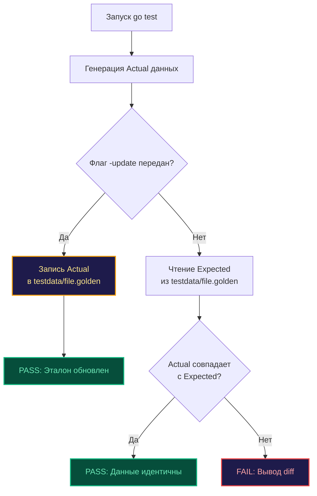

В предыдущей главе [[3. Грамотные сообщения об ошибках]] мы столкнулись с дилеммой: как сохранять тесты чистыми и выразительными, когда объем проверяемых данных измеряется сотнями строк или килобайтами бинарного кода?

Представьте, что разрабатываемый вами микросервис генерирует детализированный финансовый отчет в формате JSON на 500 строк, формирует сложный SVG-график, компилирует Go-код или рендерит HTML-шаблон для почтовой рассылки.

Если следовать наивному подходу и зашить ожидаемый результат в виде многострочного строкового литерала прямо внутрь `report_test.go`, тестовый файл мгновенно превратится в нечитаемую братскую могилу кода и данных. Но настоящая беда наступит при первой же смене бизнес-требований: когда продакт-менеджер добавит в отчет новое поле, вам придется вручную открывать исходник теста, отыскивать нужный фрагмент в пяти сотнях строк и кропотливо вбивать изменения. Это не просто утомительно — это провоцирует человеческие ошибки.

В профессиональной инженерной культуре для таких задач применяется элегантный архитектурный паттерн **Golden Tests (Золотые тесты)**, восходящий к классической методологии Golden Master.

---

## Что такое Golden Test?

Идея паттерна подкупает своей лаконичностью и инженерной простотой:

1. **Изоляция артефакта:** Вы выносите эталонный результат работы функции в отдельный статический файл, размещаемый в специальном каталоге `testdata/` (структуру которого мы подробно разбирали в [[2. Структура тестов в Go]]). Этот эталон и называется «золотым» файлом (`.golden`).
2. **Исполнение бизнес-логики:** Тест выполняет целевую операцию и получает фактический срез байтов (`actualBytes`).
3. **Прецизионное сопоставление:** Тест считывает байты золотого файла с диска и сравнивает их с полученным результатом.

**Фундаментальное преимущество паттерна:** Инженер никогда не правит эталонные файлы вручную в текстовом редакторе! Тестовый набор проектируется с поддержкой режима самообновления: при передаче флага командной строки (например, `go test -update`) тестовый раннер просто перезаписывает золотой файл на диске новыми фактическими данными.



---

## Идиоматичная реализация на Go

Создатели Go не стали включать в стандартную библиотеку тяжеловесный пакет «golden», поскольку базовые средства языка позволяют развернуть этот механизм буквально в пятнадцать строк кристально чистого кода.

```go
package report_test

import (
	"bytes"
	"flag"
	"os"
	"path/filepath"
	"testing"
)

// 1. Декларируем пользовательский флаг командной строки
// Запуск: go test ./... -update
var update = flag.Bool("update", false, "update golden files")

func TestGenerateReport(t *testing.T) {
	// Генерируем фактический результат
	actualBytes, err := GenerateFinancialReport(42)
	if err != nil {
		t.Fatalf("unexpected error: %v", err)
	}

	// Формируем путь к изолированному эталону в каталоге testdata/
	goldenPath := filepath.Join("testdata", "report_42.golden.json")

	// 2. Механизм автоматической фиксации эталона
	if *update {
		// При наличии флага -update сохраняем фактические данные как новый золотой стандарт
		err := os.WriteFile(goldenPath, actualBytes, 0644)
		if err != nil {
			t.Fatalf("failed to update golden file: %v", err)
		}
		// Завершаем тест: цель прогона заключалась в обновлении артефакта
		return
	}

	// 3. Стандартная фаза валидации
	expectedBytes, err := os.ReadFile(goldenPath)
	if err != nil {
		t.Fatalf("failed to read golden file: %v", err)
	}

	// Быстрое побайтовое сравнение
	if !bytes.Equal(actualBytes, expectedBytes) {
		t.Errorf("report mismatch! run 'go test -update' to accept new format")
	}
}
```

> [!info] Под капотом
> Как именно рантайм Go подхватывает наш кастомный флаг `update`?  
> Утилита `go test` компилирует исходные тексты тестов вместе с синтетическим файлом точки входа `_testmain.go`. Внутри этого сгенерированного файла стандартный тестовый фреймворк регистрирует системные флаги вроде `-v`, `-run`, `-bench` и вызывает стандартный `flag.Parse()`.  
> Поскольку все пакетные переменные верхнего уровня, созданные через `flag.Bool`, регистрируются в дефолтном `flag.CommandLine`, вызов `go test -update` автоматически инициализирует нашу переменную `update` без каких-либо дополнительных усилий.

---

## Ловушки и проблемы (Gotchas)

Паттерн Golden Tests предельно мощный, но при отсутствии дисциплины он может превратить тестовый набор в источник постоянных ложных тревог.

### Ловушка 1: Недетерминированные данные

Если сериализуемый JSON-отчет содержит динамическое поле времени вроде `"created_at": "2026-04-27T10:00:00Z"` или случайно сгенерированный идентификатор транзакции UUID, прямое сравнение через `bytes.Equal` будет с треском проваливаться при каждом запуске.

**Инженерные рецепты:**
* **Инъекция детерминизма на уровне моделей:** Замените генератор UUID на детерминированную заглушку, генерирующую предсказуемую последовательность вроде `0000-0000...`, а системное время зафиксируйте через интерфейс виртуальных часов (подробнее об этом мы поговорим в материале [[5. Determinism и воспроизводимость]]).
* **Санитизация на уровне сырых байтов:** Если подменить источник данных невозможно, прогоните `actualBytes` через регулярное выражение, заменяя динамические временные метки на статическую сигнатуру `[TIMESTAMP_MOCKED]`.

### Ловушка 2: Линии переноса каретки (CRLF vs LF)

Классический кошмар команд, работающих в гетерогенной среде (разработчики на macOS и Linux, часть коллег на Windows, а CI-раннеры на Alpine Linux).

Вы сгенерировали и зафиксировали эталон на Linux с символами перевода строки `\n` (LF). Ваш коллега на Windows выполняет команду `git pull`. Если в его конфигурации Git активирована директива `core.autocrlf`, клиент прозрачно заменит все символы `\n` на пару возврата каретки и перевода строки `\r\n` (CRLF).  
Коллега запускает тесты: тестируемая Go-функция выдает `\n`, а файл на диске содержит `\r\n`. Побайтовое сравнение падает, хотя семантически данные идентичны до последнего символа!

> [!warning] Ловушка / Gotcha
> Никогда не сопоставляйте текстовые данные через «сырой» `bytes.Equal` без предварительной нормализации разделителей строк.
> В обязательном порядке очищайте буферы от возврата каретки перед сравнением:
> ```go
> actualNormal := bytes.ReplaceAll(actualBytes, []byte("\r\n"), []byte("\n"))
> expectedNormal := bytes.ReplaceAll(expectedBytes, []byte("\r\n"), []byte("\n"))
> if !bytes.Equal(actualNormal, expectedNormal) { ... }
> ```

> [!tip] Собеседование
> **Вопрос:** При тестировании REST API почему бы нам просто не использовать метод `assert.JSONEq(t, string(expected), string(actual))` вместо возни с чтением файлов с диска?  
> **Ответ:** Метод `assert.JSONEq` десериализует обе строки в абстрактную структуру `map[string]interface{}` и выполняет рекурсивное сопоставление. Это нивелирует различия в пробелах и порядке ключей. Однако у него есть существенные ограничения:
> 1. **Аллокации и производительность:** Разбор гигантских JSON в промежуточные структуры вызывает колоссальное число аллокаций и работу GC, что неприемлемо на больших объемах данных.
> 2. **Узость формата:** Метод `JSONEq` бессилен перед Protobuf-дампами, YAML, XML, сгенерированным Go-кодом или бинарными файлами. Золотые тесты универсальны.
> 3. **Отсутствие автообновления:** Сам по себе `JSONEq` не решает проблему синхронизации эталона в коде. Опытные инженеры объединяют подходы: сохраняют эталоны в `testdata/`, обновляют их через флаг `-update`, а сравнивают через специализированные компараторы.

---

## Улучшение Developer Experience (DX)

В промышленных кодовых базах чтение файлов и нормализацию строк выносят в лаконичный переиспользуемый хелпер, интегрируя мощь диффов из пакета `cmp`:

```go
// Пакет testutils: эталонный хелпер золотых тестов
func AssertGolden(t *testing.T, update bool, name string, actual []byte) {
	t.Helper() // Корректная локализация стека вызовов
	goldenPath := filepath.Join("testdata", name+".golden")

	if update {
		if err := os.WriteFile(goldenPath, actual, 0644); err != nil {
			t.Fatalf("failed to update golden file: %v", err)
		}
		return
	}

	expected, err := os.ReadFile(goldenPath)
	if err != nil {
		t.Fatalf("failed to read golden file: %v", err)
	}

	// Защита от коллизий Windows CRLF
	actual = bytes.ReplaceAll(actual, []byte("\r\n"), []byte("\n"))
	expected = bytes.ReplaceAll(expected, []byte("\r\n"), []byte("\n"))

	if !bytes.Equal(actual, expected) {
		// Используем cmp.Diff для наглядной подсветки расхождений
		diff := cmp.Diff(string(expected), string(actual))
		t.Errorf("Golden mismatch for %s (-want +got):\n%s\nRun 'go test -update' to accept changes.", name, diff)
	}
}
```

---

## Итог

1. **Golden Tests** — золотой стандарт индустрии для верификации объемных структурированных или бинарных данных (JSON, HTML, компилируемый код, отчеты).
2. Эталонные артефакты изолируются в каталоге `testdata/`, предотвращая замусоривание исходных текстов Go-тестов.
3. Ключевая механика паттерна — самообновление по флагу командной строки `go test -update`, снимающее рутину ручного обновления ожидаемых значений при эволюции бизнес-контракта.
4. Контроль детерминизма (изоляция времени и генераторов ID) и обязательная нормализация разделителей строк `\r\n` — два обязательных условия стабильности тестов в мультиплатформенных командах.

Успех паттерна золотых файлов вдохновил разработчиков на создание еще более автоматизированных абстракций, зародившихся в веб-экосистеме (Jest) и перекочевавших в мир Go. О том, как устроена концепция моментальных снимков и где пролегает граница ее применимости, мы поговорим в следующей главе: [[5. Snapshot testing]].