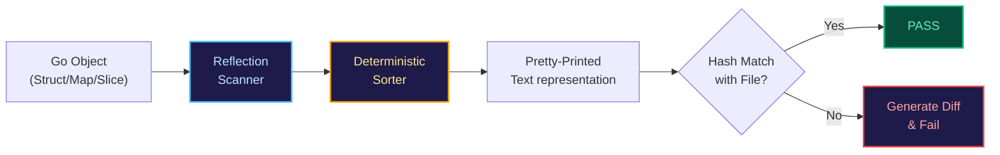

Логическим продолжением и автоматизацией концепции [[4. Golden tests]] стал паттерн **Snapshot Testing (Тестирование моментальными снимками)**. Получив колоссальную популярность в экосистеме фронтенд-разработки (прежде всего благодаря фреймворку Jest), этот подход органично прижился и на серверной стороне в Go через специализированные библиотеки.

Если в классических «Золотых тестах» разработчик самостоятельно управляет структурой директорий, путями к файлам в `testdata/` и флагами командной строки, то snapshot-инструменты берут всю рутину ввода-вывода на себя. Они превращают сравнение сложнейших многоуровневых сущностей буквально в одну выразительную строчку. В мире Go-бэкенда это оказывается невероятным подспорьем при валидации ответов внешних API, сложных деревьев агрегатов и даже SQL-запросов, синтезируемых тяжеловесными ORM или генераторами запросов.

---

## Что такое Snapshot Testing?

Snapshot-тестирование — это специализированный метод проверки инвариантов, при котором эталонное состояние объекта «замораживается» в виде текстового снимка при первом запуске тестового сценария. При всех последующих прогонах фактически полученный результат форматируется и сопоставляется с сохраненным снимком. Если обнаруживается хоть малейшее расхождение, раннер помечает тест упавшим, генерирует наглядный дифф и предлагает либо устранить дефект в коде, либо актуализировать снимок.

Главное отличие от ручных Golden-тестов заключается в **полной автоматизации именования и файлового хранилища**. Вам больше не нужно придумывать имена файлов для каталога `testdata/`: библиотека автоматически анализирует стек вызовов, связывает снимок с именем текущей тестовой функции, именем подтеста и порядковым номером проверки в файле.

### Популярные инструменты в Go

В отличие от стандартной библиотеки, здесь сообщество полагается на проверенные open-source решения:
1. `github.com/bradleyjkemp/cupaloy` — де-факто стандарт и наиболее минималистичная, идиоматичная библиотека для создания снимков в Go.
2. `github.com/alecthomas/repr` — специализированный инструмент для прецизионного форматирования структур данных в удобочитаемый Go-синтаксис.
3. `github.com/tidwall/gjson` — часто используется в тандеме со снимками для извлечения и нормализации целевых фрагментов сырых JSON-ответов.

---

## Практическая реализация (cupaloy)

Посмотрим, как элегантно решается задача валидации комплексного агрегата пользователя, сформированного запросами к разным микросервисам:

```go
package user_test

import (
	"testing"

	"github.com/bradleyjkemp/cupaloy/v2"
)

type UserProfile struct {
	ID    int
	Name  string
	Roles []string
}

func TestUserProfile_Snapshot(t *testing.T) {
	// Имитируем получение сложного составного агрегата
	profile := UserProfile{
		ID:    1,
		Name:  "Principal Go Engineer",
		Roles: []string{"admin", "developer", "mentor"},
	}

	// Всего одна инструкция проверяет состояние всей структуры целиком!
	// Библиотека автоматически создаст файл: .snapshots/TestUserProfile_Snapshot.snap
	err := cupaloy.Snapshot(profile)
	if err != nil {
		t.Fatalf("snapshot mismatch: %v", err)
	}
}
```

Если вы осознанно изменили контракт (например, добавили новую системную роль), вам не нужно редактировать файл снимка руками. Достаточно запустить тесты с переменной окружения `UPDATE_SNAPSHOTS=true`:

```bash
UPDATE_SNAPSHOTS=true go test ./...
```

Библиотека перезапишет файлы снимков новыми актуальными данными, зафиксировав новый эталон.

---

## Mechanical Sympathy: Сериализация и Рефлексия

Каким образом Snapshot-библиотеки превращают произвольный Go-объект в устойчивое текстовое представление на диске?

> [!info] Под капотом
> Подавляющее большинство библиотек (включая `cupaloy`) активно используют пакет стандартной библиотеки `reflect` в комбинации с форматированием `fmt.Sprintf("%#v")` или кастомными сериализаторами вроде `repr`.
> 
> Внутренний пайплайн включает три обязательных этапа:
> 1. **Рекурсивное инспектирование графа объектов:** Механизм `reflect` последовательно обходит указатели, слайсы и поля структур.
> 2. **Принудительная сортировка словарей (map):** Как мы знаем из материала [[5. Determinism и воспроизводимость]], рантайм Go намеренно рандомизирует порядок итерации по `map` для предотвращения атак на сложность. Библиотека обязана собрать ключи и отсортировать их в детерминированном лексикографическом порядке.
> 3. **Быстрое хеширование артефакта:** Полученный текст хешируется. Если хеш совпадает с хешем локального файла на диске, библиотека мгновенно завершает проверку с успехом, избегая медленных операций посимвольного диффа.



---

## Преимущества перед классическим Assert.Equal

1. **Идеальная читаемость диффа:** Когда падает классический `assert.Equal` на структуре из полусотни атрибутов, в терминал вываливается монолитная каша. Snapshot-фреймворки рисуют прецизионный многострочный дифф, наглядно подсвечивая точную строку и символ расхождения.
2. **Радикальное ускорение разработки:** Отпадает необходимость монотонно прописывать десятки проверок вида `assert.Equal(t, want.Name, got.Name)`. Вы верифицируете целостность системы одним вызовом.
3. **Детекция нежданных мутаций:** Если сериализатор API внезапно начал отдавать лишнее поле, на которое никто не написал явный ассерт, Snapshot-тест немедленно поднимет тревогу. Обычные точечные проверки такую утечку пропустят.

---

## Риски и Ловушки (Gotchas)

За колоссальное удобство приходится платить инженерной бдительностью.

### 1. Тесты-"ленивцы"

Главный порок методологии снимков — психологический фактор. Инженер видит, что тест упал, не хочет тратить время на чтение диффа и автоматически запускает команду `UPDATE_SNAPSHOTS=true go test ./...`. В репозиторий просачивается сломанная бизнес-логика. В командах, использующих снимки, код-ревью файлов `.snap` обязано быть столь же скрупулезным, как и ревью рабочего кода.

### 2. Приватные поля (Unexported fields)

Поскольку большинство сериализаторов работают либо через публичную рефлексию, либо через стандартный маршалинг, неэкспортируемые поля структур попросту игнорируются и не попадают в снимок. Вы можете сломать внутреннее состояние сущности, но снимок продолжит рапортовать об абсолютном успехе.

> [!warning] Ловушка / Gotcha
> Проявляйте предельную осторожность со структурами, содержащими типы `time.Time`, `json.RawMessage` и взаимные циклические указатели.  
> Если две структуры ссылаются друг на друга, наивный рекурсивный обходчик рефлексии уйдет в бесконечный цикл и обрушит тест с фатальной паникой `stack overflow` (переполнение стека горутины). Перед подключением snapshot-библиотеки убедитесь, что она умеет корректно детектировать циклы в графах памяти.

### 3. Хрупкость при рефакторинге

Любое косметическое переименование поля или изменение порядка параметров в ответе приводит к падению всех снимков, даже если функциональные инварианты системы не пострадали. Это порождает паразитный шум в pull request'ах при масштабных архитектурных трансформациях.

---

## Когда использовать Snapshot-тесты?

* **Тестирование CLI-утилит:** Проверка сгенерированного вывода в стандартный поток `stdout`.
* **Тестирование SQL-генераторов:** Верификация сложных динамических запросов, генерируемых query-билдерами.
* **Интеграция с внешними API:** Фиксация комплексных полезных нагрузок JSON, XML или SOAP.
* **Конфигурационные файлы:** Проверка компиляции развесистых YAML/TOML манифестов Kubernetes или инфраструктурного кода.

> [!tip] Собеседование
> **Вопрос:** В чем принципиальная разница между Snapshot-тестированием и общим понятием регрессионного тестирования?  
> **Ответ:** Snapshot-тестирование — это не отдельный тип тестирования, а высокоэффективный *технический инструмент* для реализации регрессионных проверок. Он фиксирует текущее фактическое поведение системы в качестве эталонного слепка и в автоматическом режиме гарантирует, что будущие коммиты не нарушат существующий контракт. Это идеальный способ зафиксировать стабильность системы перед масштабным рефакторингом легаси-кода.

---

## Итог

1. **Snapshot testing** представляет собой логическую эволюцию концепции Golden-файлов, автоматизируя хранение, сопоставление и визуализацию диффов.
2. Под капотом активно задействуются механизмы `reflect`, детерминированная сортировка словарей `map` и промежуточное хеширование.
3. Инструмент идеален для сложных объемных структур данных, избавляя код от сотен однотипных `assert.Equal`.
4. Главная опасность снимков носит человеческий характер: привычка бездумно обновлять снимки флагом `UPDATE_SNAPSHOTS=true` способна свести полезность тестов к нулю.

Какими бы соблазнительными ни казались современные библиотеки утверждений и снимков, профессионализм инженера заключается в понимании границ их применимости. В некоторых подсистемах подключение сторонних тестовых библиотек становится антипаттерном. О том, когда и почему от стороннего тулинга стоит решительно отказаться, мы поговорим в заключительной главе раздела: [[6. Когда не нужны assertion библиотеки]].