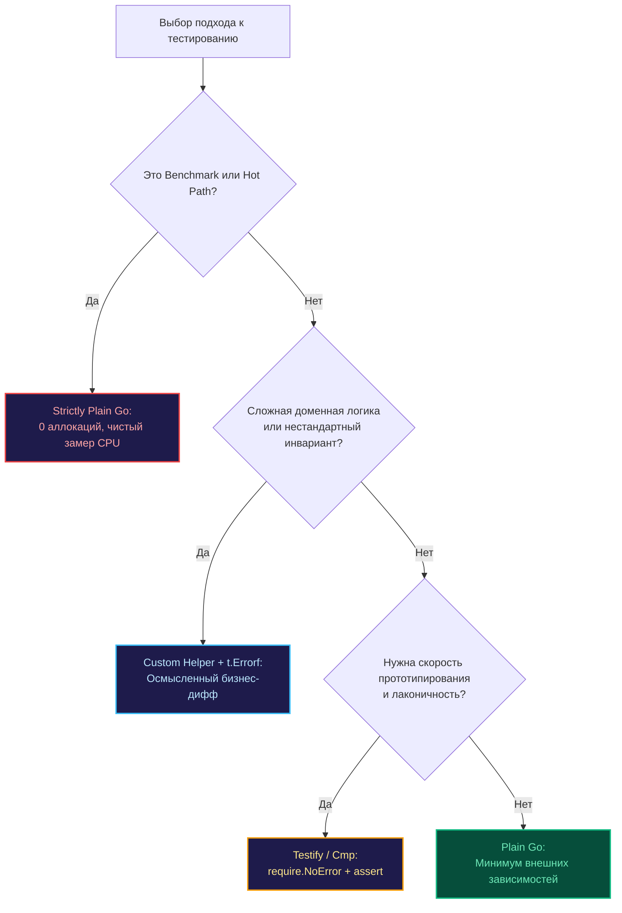

Подводя черту под инструментарием для проверок, мы обязаны сделать шаг назад и взглянуть на архитектуру критическим взглядом. Мы детально изучили выразительность `testify` в [[2. Testify. assert и require]] и практичность моментальных снимков в [[5. Snapshot testing]]. Однако зрелый системный инженер всегда помнит непреложное правило программной инженерии: **любая внешняя зависимость — это архитектурный пассив**.

Каждая строчка в файле `go.mod` требует сопровождения, несет потенциальные риски безопасности цепочки поставок (supply chain vulnerabilities) и накладывает когнитивную нагрузку на команду. В культуре Go исторически сформировалась мощная традиция конструктивного минимализма: если задачу можно элегантно и надежно решить средствами стандартной библиотеки `testing`, добавление стороннего фреймворка становится избыточным.

В этой главе мы разберем четыре фундаментальных сценария, когда применение сторонних библиотек проверок не просто неоправданно, а прямо вредит качеству и надежности кодовой базы.

---

## 1. Бенчмарки и Hot Path

Использование универсальных методов вроде `assert.Equal` или `cmp.Diff` внутри итерационного цикла `b.N` в нагрузочных тестах — это грубейшая архитектурная ошибка.

> [!info] Под капотом
> Пакет `reflect`, составляющий фундамент большинства библиотек утверждений, выполняет колоссальный объем невидимой работы: он динамически упаковывает аргументы в пустые интерфейсы (`interface{}` / `any`), провоцируя аллокации на куче (heap allocations), инспектирует таблицы метаданных типов, осуществляет рекурсивный обход полей и нагружает процессорный конвейер.
> 
> В микротестах производительности (подробнее в главе [[10. Benchmark тесты]]) вы стремитесь измерить прецизионную длительность операции — например, 15 наносекунд на обработку сетевого пакета. Вызов тяжеловесного `assert.Equal` добавит к этой цифре 200–300 наносекунд постороннего оверхеда. Ваши графики и PGO-профили будут отражать производительность рефлексии тестового фреймворка, а не реальную скорость вашего алгоритма.

**Инженерный закон:** В бенчмарках применяется исключительно легковесный Plain Go — каноническая проверка `if got != want { b.Fail() }`:
```go
if got != want {
    b.Fail()
}
```
Такой подход гарантирует нулевые посторонние аллокации и сохраняет абсолютную чистоту замеров машинных тактов CPU.

---

## 2. Глубокая доменная логика и кастомные Diff-ы

Сторонние assertion-библиотеки универсальны, и именно в этой универсальности кроется их слабость. Их диагностический предел — стандартный шаблон `Expected A, got B`. Однако в сложных бизнес-доменах инженеру необходимо знать не просто факт расхождения битов, а физический смысл произошедшей коллизии.

Представьте верификацию финансового баланса транзакционного процессинга. Безликий diff заставит дежурного инженера вручную высчитывать разницу между балансами, теряя драгоценные минуты при аварии.

```go
// Вместо безликого вызова assert.Equal
if got.Balance != want.Balance {
    t.Errorf("Transaction %s: integrity breach! Currency %s has balance %d, but ledger expects %d. Diff: %d",
        got.ID, got.Currency, got.Balance, want.Balance, got.Balance-want.Balance)
}
```

Такое осмысленное сообщение, зафиксированное с помощью `t.Errorf`, моментально локализует разрыв бухгалтерского баланса прямо в консоли CI-раннера, избавляя команду от мучительных раскопок в исходном коде.

---

## 3. Динамические проверки и "Мягкие" условия

Библиотеки проверок превосходно оперируют строгими бинарными равенствами. Но реальный бэкенд высоконагруженных систем построен на диапазонах, перцентилях и предикатах:
* Сетевая задержка (Latency) лежит в допустимом коридоре SLA (от 5 до 25 мс).
* Срез элементов содержит хотя бы одну запись с определенным статусом.
* Ответ сторонней службы удовлетворяет сложному регулярному выражению с захватом групп.

Попытка свести нетривиальное условие к булевому ассерту вида `assert.True(t, val > 10 && val < 20)` является классическим антипаттерном. При падении раннер выведет абсолютно беспомощную строку `Expected true, got false`, скрыв само значение переменной `val`.

В подобных сценариях классическая конструкция на Plain Go со специализированным форматированием аргументов предоставляет на порядок больше диагностической информации при нулевых зависимостях.

---

## 4. Обучение и чистота кодовой базы

Если вы разрабатываете открытую библиотеку (Open Source), инфраструктурный SDK или базовый пакет, предназначенный для использования сотнями внешних проектов, добавление `testify` в манифест `go.mod` (даже в тестовую секцию `test`) считается признаком дурного тона.

1. **Засорение графа зависимостей:** Увеличивается время выполнения команды `go mod download` и сборки контейнеров в CI.
2. **Риски версионирования:** Сторонние пакеты эволюционируют, выпускают мажорные ветки (`v2`, `v3`) или могут внезапно прекратить поддержку.
3. **Барьер для контрибьюторов:** Сторонний разработчик вынужден тратить время на изучение диалекта конкретной библиотеки проверок вместо чистого Go.

**Стандартный пакет `testing` неизменен десятилетиями.** Он защищен официальной гарантией обратной совместимости Go 1 Compatibility Promise. Код, написанный на стандартной библиотеке сегодня, гарантированно скомпилируется и запустится через десять лет.

---

## Когда библиотеки ПРАВДА мешают: Портируемость и Tooling

Инструменты глубокого статического анализа кода (официальный `go vet`, линтер `staticcheck`) превосходно парсят и анализируют стандартные ветвления `if`. Когда проверки заворачиваются в многослойные абстракции сторонних пакетов, линтеры нередко теряют контекст и пропускают очевидные дефекты.

Кроме того, детектор состояний гонки (`go test -race`) функционирует значительно эффективнее при анализе прямолинейного кода: отсутствие промежуточных вызовов служебных оберток библиотеки тестирования делает трассировку обращений к памяти прозрачной и легко читаемой.



---

## Резюме: Здоровый прагматизм

Опытный инженер не впадает в крайности и чужд религиозного догматизма:
* Мы охотно используем `testify/require` для проверки критических предусловий и ошибок (`require.NoError`). Это де-факто промышленный стандарт.
* Мы применяем библиотеку от создателей языка `google/go-cmp` (пакет `go-cmp`) для структурного сопоставления сложных DTO и глубоких ответов API.
* **Мы решительно отказываемся от сторонних библиотек**, когда тестируем код на «горячем пути», пишем бенчмарки или когда стандартный вывод универсального ассерта не передает доменной сути ошибки.

> [!tip] Собеседование
> **Вопрос:** Вы пришли на проект и обнаружили, что в разных микросервисах и пакетах используется 5 различных библиотек для ассертов. Какова будет ваша стратегия как системного архитектора?  
> **Ответ:** Единственно верный шаг — провести планомерную унификацию инструментария. Зоопарк тестовых фреймворков кратно увеличивает ментальную нагрузку на команду, раздувает граф сборки и порождает хаос в форматировании логов. Эталонная стратегия: закрепить единый корпоративный стандарт (например, `testify` для стандартных проверок и `go-cmp` для структурных различий), а во всех критических и высоконагруженных модулях строго придерживаться Plain Go.

---

Мы завершили детальный разбор инструментов и подходов к валидации данных. Теперь в нашем арсенале есть полный спектр средств — от прямолинейного `t.Errorf` до автоматизированных снимков и структурных диффов. Но что делать, когда тестируемый код взаимодействует с непредсказуемой внешней средой — сетевыми сокетами, базами данных или сторонними платежными шлюзами?

Мы переходим к одной из самых глубоких и архитектурно насыщенных тем надежного бэкенда — изолированному тестированию зависимостей. 

Следующая остановка: [[1. Mocking. Основы]].