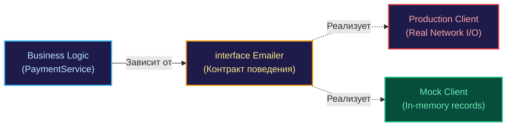

В реальном промышленном бэкенде программный код практически никогда не функционирует в стерильном вакууме. На каждый полезный вычислительный такт процессора приходятся десятки обращений к внешнему миру: сетевые запросы к базе данных, отправка полезной нагрузки по HTTP в сторонние платежные шлюзы, синхронизация токенов в Redis или публикация событий в брокер сообщений Kafka.

Если в модульных (Unit) тестах задействовать реальные сетевые сокеты и внешние сервисы, тестовый набор неизбежно деградирует:
1. Тесты станут мучительно медленными (миллисекунды сетевого I/O вместо наносекунд тактов CPU).
2. Появится жесткая зависимость от окружения (требуется живой PostgreSQL и сетевой доступ).
3. Тесты начнут «мигать» (flaky tests) из-за сетевых таймаутов, сторонних rate limits или исчерпания кредитов в API.

**Мокирование (Mocking)** — это инженерная практика изоляции тестируемого модуля путем подмены реальной внешней зависимости предсказуемым программным дублером (Test Double). В языке Go эта техника неразрывно переплетена с архитектурой интерфейсов и фундаментальным принципом инверсии зависимостей (Dependency Injection).

В этой главе мы разберем философию и механику создания дублеров, заглянем в устройство таблицы виртуальных методов `itab`, классифицируем виды тестовых двойников по классической таксономии и научимся избегать опасной болезни гипермокирования (Overmocking).

---

## Зачем нужны моки в бэкенде?

Представьте классический сценарий регистрации нового пользователя: сервис обязан проверить уникальность адреса электронной почты в базе данных, сгенерировать токен активации и отправить приветственное письмо через внешний провайдер (например, SendGrid).

Без изолированных дублеров ваш тест превращается в интеграционную драму:
1. Он требует предварительно поднятого инстанса `PostgreSQL` с накаченными миграциями.
2. Он тратит реальные деньги за каждый вызов платного почтового API.
3. Он падает с ошибкой в CI в тот момент, когда у провайдера почты происходят плановые технические работы.

Подменяя внешние системы моками, инженер конструирует изолированную «лабораторную среду». В ней хранилище данных мгновенно отвечает «Email свободен», а почтовый шлюз лишь подтверждает прием команды в памяти процесса, не выпуская ни одного сетевого пакета через сетевую карту.

---

## Интерфейс — фундамент мокирования

В Go отсутствует традиционное для классических ООП-языков наследование классов, и рантайм языка принципиально не позволяет переопределять методы конкретной структуры в рантайме без низкоуровневых хаков памяти. Чтобы модуль поддавался чистому тестированию, он обязан опираться не на конкретный тип (например, `*sql.DB`), а на контракт поведения — интерфейс.

> [!info] Под капотом: Duck Typing
> В Go реализована неявная структурная типизация (Duck Typing). Если структура реализует сигнатуру `Send(msg string) error`, компилятор автоматически признает ее удовлетворяющей интерфейсу:
> ```go
> type Emailer interface {
>     Send(string) error
> }
> ```
> Разработчику не нужно явно декларировать директивы вроде `implements`. В рантайме связывание конкретного типа и интерфейса обеспечивается через структуру `itab` (interface table), содержащую метаданные типов и прямые указатели на скомпилированные функции. Это позволяет безболезненно подставлять легковесные тестовые заглушки вместо тяжелых клиентов.



---

## Основные типы дублеров (Test Doubles)

В повседневной разговорной речи разработчики привыкли называть «моком» любой тестовый заменитель. Однако в инженерной литературе (в частности, в классификации Мартина Фаулера и Джерарда Месароша) дублеры строго разделяются на категории. Понимание этой терминологии — обязательный признак инженерной зрелости:

1. **Dummy (Пустышка):** Объект, который передается в метод исключительно для заполнения параметров вызова, но фактически никогда не используется внутри тестируемой ветки бизнес-логики.
2. **Stub (Заглушка):** Простейший дублер, возвращающий жестко зашитый предопределенный ответ. Заглушка не валидирует входные параметры и не считает количество обращений к себе.
3. **Mock (Мок):** Интеллектуальный дублер с запрограммированными ожиданиями (Expectations). Мок верифицирует протокол взаимодействия: он завершится ошибкой, если вы вызвали метод не дважды, а один раз, или передали некорректный идентификатор пользователя.
4. **Fake (Фейк):** Полноценно функционирующая, но упрощенная реализация компонента, непригодная для продакшна. Яркий пример — легковесная `In-memory SQLite` вместо кластера PostgreSQL или ассоциативный массив в памяти вместо распределенного кэша Redis.
5. **Spy (Шпион):** Проксирующий дублер, протоколирующий все факты обращений к себе (число вызовов, переданные аргументы, временные метки), позволяя тесту верифицировать поведение постфактум.

---

## Механика мокирования в Go: Ручной подход

Прежде чем прибегать к генераторам кода, каждый инженер обязан понимать устройство ручного дублера. В Go ручные моки пишутся предельно прямолинейно и прозрачно, не требуя ни строчки сторонних зависимостей.

```go
// 1. Контракт доменного слоя
type Store interface {
    GetBalance(ctx context.Context, userID int) (int, error)
}

// 2. Тестируемый бизнес-сервис
type PaymentService struct {
    storage Store
}

// 3. Ручной тестовый дублер (Spy/Stub) в файле payment_test.go
type storeMock struct {
    balance int
    err     error
    calls   int // Счетчик вызовов для шпионажа
}

func (m *storeMock) GetBalance(ctx context.Context, userID int) (int, error) {
    m.calls++
    return m.balance, m.err
}

func TestPayment(t *testing.T) {
    // Конфигурируем состояние дублера
    mock := &storeMock{balance: 100, err: nil}
    svc := PaymentService{storage: mock}

    // Исполняем бизнес-логику сценария
    // ...

    // Проверяем инвариант взаимодействия
    if mock.calls != 1 {
        t.Errorf("expected 1 call to Store, got %d", mock.calls)
    }
}
```

---

## Mechanical Sympathy: Почему моки могут замедлять тесты?

Хотя моки исключают дорогостоящие сетевые и дисковые задержки ядра ОС, их использование сопряжено с микроархитектурной платой на уровне процессора.

> [!warning] Ловушка / Gotcha: Динамическая диспетчеризация
> Обращение к методу через интерфейс транслируется компилятором в косвенный вызов через указатель в структуре `itab`. Такой вызов полностью блокирует возможность **инлайнинга (Inlining)** машинного кода: компилятор не может встроить тело метода по месту вызова.  
> Кроме того, параметры вызова зачастую упаковываются в кучу (Heap allocation) из-за escape-анализа интерфейсных типов. Если мок опрашивается в цикле с миллионами итераций в секунду, накладные расходы на виртуальные вызовы и сборщик мусора могут исказить замеры. Впрочем, для классических бизнес-тестов эта задержка пренебрежимо мала.

---

## Когда моки — это зло? (Overmocking)

Самый коварный антипаттерн в архитектуре тестирования — попытка замокать абсолютно всё (Overmocking). Если 80% объема тестового файла занимает декларация ожиданий дублеров через `On("Method").Return(...)`, а содержательная проверка сводится к паре строк, вы тестируете не поведение системы, а детали ее сиюминутной реализации.

**Симптомы «отравления» моками:**
* **Хрупкость к рефакторингу:** Вы переименовали приватную переменную или оптимизировали внутренний алгоритм, не меняя публичного контракта, а в проекте упало 50 тестов, потому что моки ожидали конкретную последовательность шагов.
* **Нечитаемые простыни инициализации:** Сценарий теста тонет в десятках строк вызовов `gomock` или сторонних конфигураторов.
* **Мокирование собственных приватных пакетов:** Разработчик начинает мокать соседние структуры внутри одного и того же пакета вместо тестирования их совместной работы.

> [!tip] Собеседование
> **Вопрос:** Стоит ли напрямую объявлять интерфейсы для стандартной библиотеки Go — например, полностью мокать типы `os.File` или `http.Client`?  
> **Ответ:** Прямое мокирование громоздких структур стандартной библиотеки — антипаттерн, приводящий к раздуванию интерфейсов до десятков неиспользуемых методов. Зрелый подход заключается в создании узкой предметной абстракции (Wrapper/Adapter), отражающей конкретную потребность вашего домена. Например, вместо абстрагирования всей файловой системы `os.File` достаточно создать лаконичный интерфейс `ConfigReader` с единственным методом `Read()`. Это упрощает дублеры и защищает доменную логику от деталей инфраструктуры.

---

## Итог

1. **Мокирование** изолирует бизнес-логику от недетерминизма операционной системы, сетевых сокетов и внешних распределенных сервисов.
2. Архитектурный фундамент мокирования в Go — это неявная реализация интерфейсов и таблица методов `itab`.
3. Четко дифференцируйте дублеры: Stubs поставляют фиксированные данные, Mocks контролируют протокол взаимодействий, а Fakes моделируют функциональное поведение в оперативной памяти.
4. Избегайте ловушки Overmocking: тестируйте доменные инварианты и бизнес-результат, а не внутренние вызовы приватных методов.

Ручное кодирование моков идеально прозрачно, но становится утомительным, когда интерфейс разрастается. О том, как проектировать интерфейсы специально для тестирования и соблюдать принцип разделения контрактов, мы поговорим в следующей главе: [[2. Интерфейсы как инструмент тестирования]].