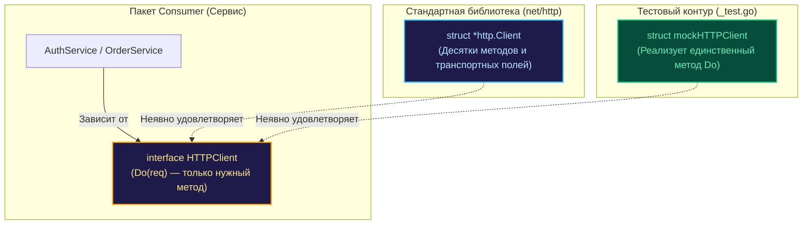

В языках программирования с классической объектно-ориентированной моделью интерфейсы нередко воспринимаются исключительно как инструмент полиморфизма подтипов и построения иерархий классов. Однако для опытного системного разработчика на Go интерфейс — это прежде всего **архитектурный шов (boundary)**, инструмент изоляции доменных подсистем и главный рычаг управления тестируемостью кода.

В предыдущей вводной главе [[1. Mocking. Основы]] мы познакомились с общими концепциями тестовых дублеров. Теперь мы погрузимся в то, как уникальная специфика интерфейсной модели Go — неявная реализация и структурная типизация — позволяет выстраивать исключительно гибкие, надежные и быстро компилируемые тесты.

Мы разберем, как изолировать «строптивые» структуры стандартной библиотеки, почему принцип разделения интерфейсов (ISP) спасает тесты от раздувания и в каких случаях даже одиночный интерфейс оказывается избыточным по сравнению с функциональным адаптером.

---

## Неявная реализация как ключ к Mock-friendly дизайну

В традиционных языках (Java, C#, Kotlin) класс обязан явным образом декларировать свою принадлежность к контракту через ключевое слово `implements`. Если сторонняя библиотека или SDK не позаботились о предоставлении интерфейса для своего тяжеловесного сетевого клиента, разработчик оказывается в тупике: подменить такой класс в тестах без громоздких адаптеров-оберток или байткод-манипуляций невозможно.

В Go правила игры принципиально иные. Интерфейс — это чисто структурный контракт. Любой тип из внешнего пакета или стандартной библиотеки, методы которого по сигнатурам совпадают с вашим интерфейсом, **автоматически и неявно его реализует**.



> [!tip] Собеседование
> **Вопрос:** Где в идиоматичном Go-проекте следует объявлять интерфейс для мокирования: на стороне производителя (в пакете, где определена конкретная структура) или на стороне потребителя (в пакете, где эта структура используется)?  
> **Ответ:** Золотое правило Go («Go Proverbs») гласит: **интерфейсы декларируются на стороне потребителя**. Если каждый пакет объявляет интерфейс под свои специфические нужды, он включает в него исключительно те методы, которые реально использует. Это предотвращает возникновение паразитных циклических зависимостей между пакетами и радикально упрощает написание моков в тестах.

---

## Изоляция "неудобных" зависимостей

Классический пример из практики — стандартный сетевой клиент `http.Client`. В пакете `net/http` тип `http.Client` представляет собой конкретную структуру со множеством полей (таймауты, CookieJar, транспортные настройки), а не интерфейс.

Попытка передавать указатель `*http.Client` напрямую в бизнес-логику намертво связывает сервис с реальным сетевым вводом-выводом операционной системы. Чтобы разорвать эту связь, мы объявляем на стороне нашего доменного сервиса узкий интерфейс-прослойку, содержащий ровно один метод:

```go
package auth

import "net/http"

// Минимальный интерфейс-прослойка на стороне потребителя
type HTTPClient interface {
    Do(req *http.Request) (*http.Response, error)
}

type AuthService struct {
    client HTTPClient
}

func NewAuthService(client HTTPClient) *AuthService {
    return &AuthService{client: client}
}

func (s *AuthService) Verify(token string) bool {
    // Внутри используется метод s.client.Do(...)
    return true
}
```

Теперь в рабочем коде фабрика передает стандартный указатель `*http.Client` (он автоматически удовлетворяет методу `Do`), а в файле `auth_test.go` мы без малейшего трения передаем компактную структуру-заглушку, которая не производит системных вызовов к сокетам ядра Linux.

---

## Принцип интерфейсной сегрегации (ISP) в тестах

В программной инженерии принцип Interface Segregation Principle (буква I в аббревиатуре SOLID) утверждает: программные сущности не должны зависеть от методов, которыми они не пользуются. В контексте написания моков нарушение этого принципа превращается в катастрофу.

Представьте раздутый монолитный интерфейс базы данных `Storage`, насчитывающий двадцать методов: от создания учетных записей до выгрузки сложной финансовой отчетности. Если функция бизнес-логики `UpdateName` выполняет лишь чтение пользователя по первичному ключу, привязка к такому интерфейсу вынуждает разработчика реализовывать или «глушить» все двадцать методов в тестовом дублере!

**Инженерное решение: Декомпозиция на микроинтерфейсы.**

```go
// Четко сфокусированные интерфейсы
type UserReader interface {
    GetUser(id int) (*User, error)
}

type UserWriter interface {
    SaveUser(u *User) error
}

// Функция объявляет зависимость ровно от того, что ей нужно
func UpdateName(repo UserReader, id int, name string) error {
    user, err := repo.GetUser(id)
    if err != nil {
        return err
    }
    // ... дальнейшая доменная обработка ...
    _ = user
    return nil
}
```

В тесте функции `UpdateName` требуется замокать ровно один метод: `GetUser`. Тестовый код сокращается с десятков строк до пяти, оставаясь устойчивым к любым будущим изменениям в `UserWriter` или глобальном хранилище `Storage`.

---

## Mechanical Sympathy: Интерфейсы и аллокации

В погоне за тестируемостью архитекторы нередко впадают в крайность, заворачивая в интерфейсы абсолютно каждую структуру проекта. Подобное увлечение абстракциями имеет осязаемую цену на уровне машинного кода.

> [!info] Под капотом: Использование интерфейсов в тестах
> Замена прямой структуры интерфейсом создает косвенную адресацию (indirection) в памяти. Интерфейс в рантайме Go (`iface`) состоит из двух машинных слов: указателя на таблицу виртуальных методов `itab` и указателя на блок памяти с данными.
> 
> Это влечет за собой два аппаратных последствия:
> 1. **Срыв конвейера CPU:** Косвенный вызов функции через указатель в `itab` затрудняет предсказание переходов (branch prediction) процессора и полностью исключает возможность инлайнинга (встраивания) тела функции в вызывающий код.
> 2. **Escape Analysis и утечка в кучу:** Передача значений в интерфейсный параметр заставляет компилятор предполагать возможность утечки указателя, аллоцируя структуры на куче (Heap) вместо быстрого стека.
> 
> **Инженерное правило:** Не создавайте интерфейсы там, где код выполняет детерминированные математические вычисления, форматирование текста или парсинг байтов. Тестируйте чистые алгоритмы напрямую. Интерфейсы жизненно необходимы на **границах сетевого ввода-вывода, дисковых операций и внешних систем**.

---

## Паттерн "Обертка над функцией" (Function Adapters)

Иногда даже объявление структуры с одним методом интерфейса оказывается избыточной бюрократией. Если зависимость представляет собой одиночный атомарный запрос (например, получение текущего системного времени, генерация случайного числа или чтение переменной среды), наилучшим решением выступает функциональный тип:

```go
package order

import "time"

// Функциональный тип вместо интерфейса
type TimeProvider func() time.Time

func ProcessOrder(now TimeProvider) {
    currentTime := now()
    // ... валидация времени заказа ...
    _ = currentTime
}
```

В тестах такой подход дает непревзойденную лаконичность:

```go
func TestProcessOrder(t *testing.T) {
    // Детерминированная фиксация времени буквально в одну строку
    mockNow := func() time.Time {
        return time.Date(2026, 1, 1, 0, 0, 0, 0, time.UTC)
    }

    ProcessOrder(mockNow)
}
```

Никаких вспомогательных структур, никаких mock-генераторов — чистая композиция функций первого класса языка Go.

---

## Итог

1. Интерфейсы в Go — это естественные разделительные линии в архитектуре, через которые в код бесшовно внедряются тестовые дублеры.
2. Неявная реализация интерфейсов позволяет описывать контракты на стороне потребителя, не изменяя ни единой строчки во внешних пакетах.
3. Соблюдение принципа разделения интерфейсов (ISP) гарантирует, что тестовые дублеры реализуют лишь один-два целевых метода (например, `GetUser`), защищая тесты от разрастания.
4. Помните о цене абстракций: интерфейсы предназначены для изоляции I/O и внешних систем, а не для чистых вычислительных алгоритмов.
5. Для одиночных зависимостей используйте функциональные типы (`Function Adapters`), минимизируя бойлерплейт.

Когда интерфейсы спроектированы компактно и грамотно, написание моков вручную превращается в легкую механическую задачу. О том, как профессионально реализовывать ручные моки, управлять счетчиками вызовов и эмулировать ошибки, мы поговорим в следующей главе: [[3. Ручные моки]].